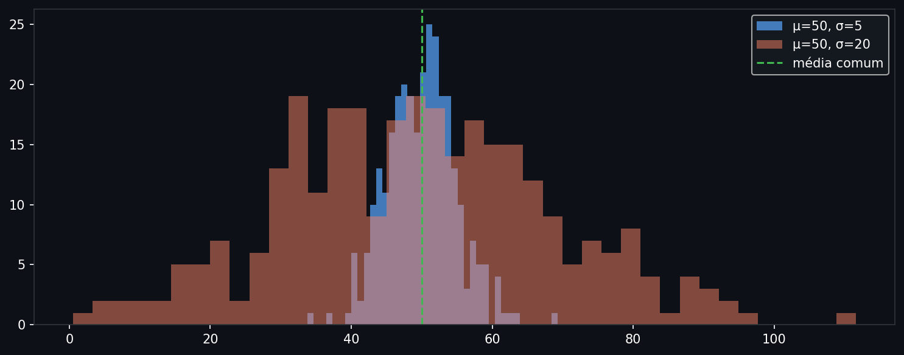
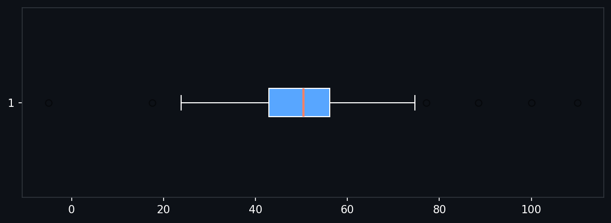

# Medidas de Posição e Dispersão

Dados raramente vêm com um único valor: preços de ativos, altura de pacientes, latência de requisições — são sempre conjuntos. A primeira pergunta ao olhar para qualquer conjunto é dupla: *onde os valores tendem a se concentrar?* e *quão espalhados estão em torno desse centro?* Posição e dispersão são, respectivamente, as respostas a essas duas perguntas.

> **Análise:** [02 — Medidas de posição (fundos CVM)](../analises/02_medidas_posicao.ipynb)

---

## Intuição

Imagine os dados como pessoas em um corredor. A medida de posição diz onde a "maioria" está parada. A medida de dispersão diz se estão agrupadas num canto ou espalhadas de ponta a ponta.

Um único número nunca conta a história completa. Dois conjuntos com média idêntica podem ter dispersões radicalmente diferentes — um concentrado, outro com valores extremos. A dupla posição + dispersão é o mínimo para resumir um conjunto de forma útil.

```python
import numpy as np
import matplotlib.pyplot as plt

np.random.seed(42)
a = np.random.normal(50, 5, 300)   # concentrado
b = np.random.normal(50, 20, 300)  # espalhado

fig, ax = plt.subplots(figsize=(10, 4), facecolor="#0d1117")
ax.set_facecolor("#0d1117")
ax.hist(a, bins=40, alpha=0.7, color="#58a6ff", label="μ=50, σ=5")
ax.hist(b, bins=40, alpha=0.5, color="#f78166", label="μ=50, σ=20")
ax.axvline(50, color="#3fb950", lw=1.5, linestyle="--", label="média comum")
ax.tick_params(colors="white"); ax.spines[:].set_color("#30363d")
ax.legend(facecolor="#161b22", labelcolor="white")
plt.tight_layout(); plt.show()
```



*Os dois histogramas compartilham a mesma média (linha verde), mas o conjunto laranja se espalha muito mais. Ignorar a dispersão os tornaria indistinguíveis.*

---

## Definição formal

### Medidas de posição (tendência central)

Seja $x_1, x_2, \ldots, x_n$ uma amostra de tamanho $n$.

**Média aritmética**

$$\bar{x} = \frac{1}{n} \sum_{i=1}^{n} x_i$$

A média é o centro de massa dos dados: se cada ponto tivesse peso igual, o conjunto estaria em equilíbrio em $\bar{x}$.

**Mediana**

$$M = \begin{cases} x_{(m+1)} & \text{se } n = 2m+1 \\ \frac{x_{(m)} + x_{(m+1)}}{2} & \text{se } n = 2m \end{cases}$$

onde $x_{(i)}$ é o $i$-ésimo valor em ordem crescente. A mediana é o valor que divide a amostra ao meio: 50% dos pontos abaixo, 50% acima.

**Moda** — o valor (ou valores) mais frequente(s). Pode não ser única; não tem fórmula fechada.

### Medidas de dispersão

**Variância amostral**

$$s^2 = \frac{1}{n-1} \sum_{i=1}^{n} (x_i - \bar{x})^2$$

O divisor $n-1$ (correção de Bessel) compensa o fato de que $\bar{x}$ foi estimado da mesma amostra, o que subestima a variabilidade real. A variância está em unidades ao quadrado.

**Desvio padrão**

$$s = \sqrt{s^2}$$

Recupera as unidades originais dos dados. É a raiz da variância, não o "desvio médio absoluto" — essa confusão é comum.

**Amplitude interquartil (IQR)**

$$\text{IQR} = Q_3 - Q_1$$

onde $Q_1$ e $Q_3$ são o 25º e 75º percentis. Mede o spread do meio 50% dos dados, ignorando as caudas.

**Coeficiente de variação (CV)**

$$\text{CV} = \frac{s}{\bar{x}} \times 100\%$$

Dispersão relativa à média. Permite comparar espalhamento entre variáveis com escalas diferentes — por exemplo, a volatilidade de dois ativos com preços distintos.

---

## Os quatro momentos

Posição e dispersão são os dois primeiros de quatro *momentos* que descrevem a forma completa de uma distribuição.

O $k$-ésimo momento central padronizado é:

$$\mu_k' = \frac{1}{n} \sum_{i=1}^{n} \left(\frac{x_i - \bar{x}}{s}\right)^k$$

| Momento | $k$ | Nome | Mede |
|---------|-----|------|------|
| 1º | 1 | Média | Posição |
| 2º | 2 | Variância | Dispersão |
| 3º | 3 | Assimetria (*skewness*) | Inclinação da cauda |
| 4º | 4 | Curtose (*kurtosis*) | "Pesadez" das caudas |

**Assimetria** — se a cauda direita é mais longa, a distribuição é assimétrica positiva (*skewed right*); média > mediana. Em retornos financeiros, assimetria negativa é comum: quedas são bruscas, altas são graduais.

**Curtose** — a normal tem curtose = 3 (ou excesso de curtose = 0). Distribuições com curtose > 3 têm caudas mais pesadas (*leptocúrticas*) e são mais comuns em dados financeiros — eventos raros acontecem com frequência maior do que a normal prevê.

```python
import numpy as np
from scipy import stats

np.random.seed(42)
dados = np.random.normal(50, 10, 300)

print(f"skewness: {stats.skew(dados):.3f}")
print(f"kurtosis (excess): {stats.kurtosis(dados):.3f}")  # 0 = normal
```

```
skewness: 0.174
kurtosis (excess): 0.567  # 0 = normal
```

---

## Interpretação

A média e o desvio padrão são suficientes apenas quando os dados são aproximadamente simétricos e sem outliers extremos. Em outros casos, leituras ingênuas enganam:

- **Renda per capita** de um país: um bilionário numa favela eleva a média sem representar ninguém. A mediana é o resumo correto.
- **Retornos de ativos**: a presença de um crash faz a média anual parecer pessimista para anos normais. O desvio padrão sozinho não captura a direcionalidade do risco — use assimetria e curtose.
- **Latência de servidores**: o percentil 99 importa mais do que a média. Sistemas lentos para 1% dos usuários causam rejeição mesmo com mediana boa.

A mediana e o IQR formam um par robusto: ambos ignoram valores extremos. A média e o desvio padrão formam um par eficiente: usam toda a informação disponível, mas ao custo de sensibilidade a outliers.

---

## Quando cada medida falha

**A média falha quando** a distribuição é assimétrica ou tem caudas pesadas. Nesse caso, ela é "puxada" pelas caudas e deixa de representar onde os dados se concentram.

**O desvio padrão falha quando** há outliers: um único ponto extremo pode inflar $s$ dramaticamente, fazendo dados concentrados parecerem dispersos.

**A mediana perde informação quando** a distribuição é simétrica e sem outliers: nesse caso, a média é mais eficiente estatisticamente (tem menor variância amostral).

Uma boa prática é sempre reportar os dois pares — mediana + IQR e média + dp — e usar o boxplot como inspeção visual antes de decidir qual resumo usar.

```python
import numpy as np
import pandas as pd
import matplotlib.pyplot as plt

np.random.seed(42)
dados = np.concatenate([np.random.normal(50, 10, 280), [100, 110, -5]])

s = pd.Series(dados)
print(s.describe())
# count, mean, std, min, 25%, 50%, 75%, max

fig, ax = plt.subplots(figsize=(8, 3), facecolor="#0d1117")
ax.set_facecolor("#0d1117")
ax.boxplot(dados, vert=False, patch_artist=True,
           boxprops=dict(facecolor="#58a6ff", color="white"),
           medianprops=dict(color="#f78166", lw=2),
           whiskerprops=dict(color="white"),
           capprops=dict(color="white"),
           flierprops=dict(marker="o", color="#3fb950", alpha=0.5))
ax.tick_params(colors="white"); ax.spines[:].set_color("#30363d")
plt.tight_layout(); plt.show()
```

```
count    283.00
mean      50.02
std       11.35
min       -5.00
25%       42.89
50%       50.46
75%       56.19
max      110.00
```



*O boxplot mostra em uma figura: Q1, mediana (linha laranja), Q3 (caixa azul), whiskers até 1.5·IQR, e outliers como pontos verdes. Se a mediana estiver deslocada para um lado da caixa, a distribuição é assimétrica.*

---

## Na prática

```python
import numpy as np
import pandas as pd
from scipy import stats

np.random.seed(42)
x = pd.Series(np.random.normal(50, 10, 100))  # exemplo: 100 valores N(50, 10)

# Posição
x.mean()          # média
x.median()        # mediana
x.mode()[0]       # moda (primeira)
x.quantile(0.25)  # Q1

# Dispersão
x.std()           # desvio padrão (n-1)
x.var()           # variância (n-1)
x.std() / x.mean()           # CV
x.quantile(0.75) - x.quantile(0.25)  # IQR

# Resumo completo
x.describe()      # count, mean, std, min, quartis, max

# Momentos de forma
stats.skew(x)
stats.kurtosis(x)  # excesso de curtose (0 = normal)
```

```
x.mean()          # 48.9615
x.median()        # 48.7304
x.mode()[0]       # 23.8025
x.quantile(0.25)  # 43.9909
x.std()           # 9.0817
x.var()           # 82.4770
x.std()/x.mean()  # 0.1855  (CV)
IQR               # 10.0686

x.describe():
count    100.0000
mean      48.9615
std        9.0817
min       23.8025
25%       43.9909
50%       48.7304
75%       54.0595
max       68.5228

stats.skew(x)      # -0.1753
stats.kurtosis(x)  # -0.1554
```

**Armadilhas comuns**

- `np.std()` usa $n$ por padrão; `pd.Series.std()` usa $n-1$. Para estatística inferencial, sempre use $n-1$.
- O CV é indefinido quando a média é zero ou negativa — não o use para retornos que podem ser negativos.
- `describe()` não reporta assimetria nem curtose; calcule separadamente.

---

## Leitura recomendada

**BUSSAB, W. O.; MORETTIN, P. A.** *Estatística Básica*. 9ª ed. São Paulo: Saraiva. [→ Internet Archive](https://archive.org/details/estatistica-basica-9ed-bussab-e-morettin)
Referência padrão nos cursos brasileiros. Cobre medidas de posição, dispersão e os quatro momentos com exemplos aplicados e exercícios graduados. Caps. 2–4.

**ROUSSEEUW, P. J.; CROUX, C.** Alternatives to the Median Absolute Deviation. *Journal of the American Statistical Association*, v. 88, n. 424, p. 1273-1283, 1993. [→ PDF (KU Leuven)](https://wis.kuleuven.be/stat/robust/papers/publications-1993/rousseeuwcroux-alternativestomedianad-jasa-1993.pdf)
Artigo que funda a teoria das medidas de dispersão robustas (Sn, Qn). Justifica formalmente por que o desvio padrão é inadequado sob caudas pesadas e propõe alternativas com eficiência assintótica comparável.
