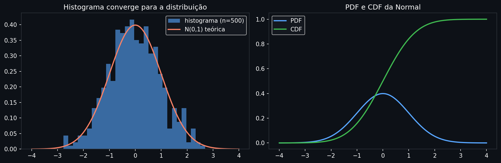
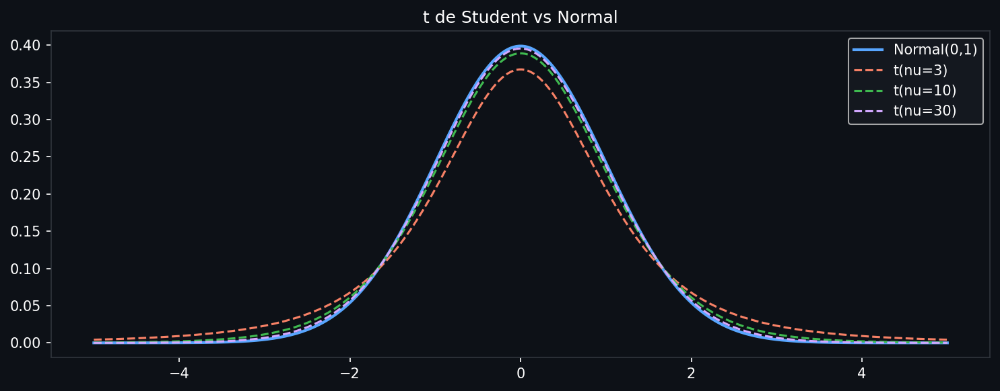
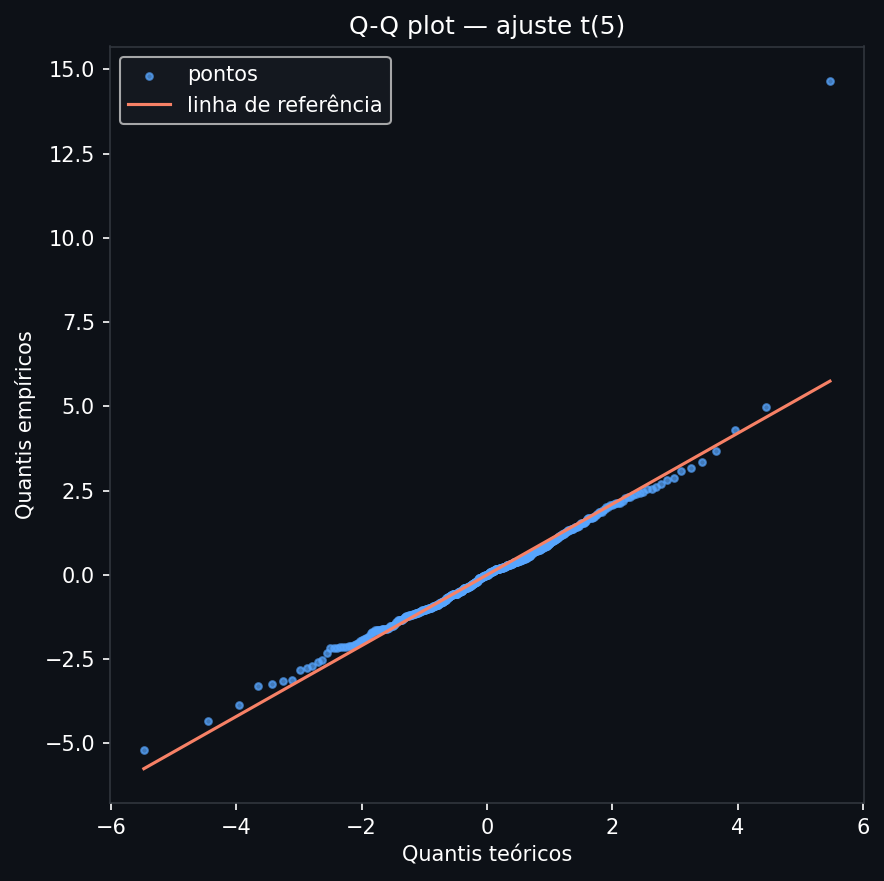

# Distribuições de Probabilidade

Medidas de posição e dispersão resumem um conjunto de dados em dois números — mas dois números não capturam a forma. Distribuições de probabilidade são o modelo completo: elas descrevem como a probabilidade se distribui sobre todos os valores possíveis. Em IA, todo modelo é, no fundo, uma afirmação sobre qual distribuição os dados seguem.

> **Análise:** [03 — Médias e distribuições de probabilidade](../analises/03_medias_distribuicoes_probabilidade.ipynb) · [04 — Probabilidade, distribuições e testes em modelos](../analises/04_probabilidade_distribuicoes_testes_modelos.ipynb)

---

## Intuição

Imagine jogar uma moeda 1000 vezes e construir um histograma das frequências. À medida que o número de lançamentos cresce e as caixinhas ficam mais finas, o histograma converge para uma curva suave. Essa curva é a distribuição de probabilidade.

Uma distribuição responde: *se eu sortear um valor aleatoriamente desse processo, onde ele provavelmente cai?*

```python
import numpy as np
import matplotlib.pyplot as plt
from scipy import stats

x = np.linspace(-4, 4, 300)
fig, axes = plt.subplots(1, 2, figsize=(12, 4), facecolor="#0d1117")

for ax in axes:
    ax.set_facecolor("#0d1117")
    ax.tick_params(colors="white")
    ax.spines[:].set_color("#30363d")

# Histograma → distribuição
np.random.seed(0)
dados = np.random.normal(0, 1, 500)
axes[0].hist(dados, bins=30, density=True, color="#58a6ff", alpha=0.6, label="histograma (n=500)")
axes[0].plot(x, stats.norm.pdf(x), color="#f78166", lw=2, label="N(0,1) teórica")
axes[0].set_title("Histograma converge para a distribuição", color="white")
axes[0].legend(facecolor="#161b22", labelcolor="white")

# PDF vs CDF
axes[1].plot(x, stats.norm.pdf(x), color="#58a6ff", lw=2, label="PDF")
axes[1].plot(x, stats.norm.cdf(x), color="#3fb950", lw=2, label="CDF")
axes[1].set_title("PDF e CDF da Normal", color="white")
axes[1].legend(facecolor="#161b22", labelcolor="white")

plt.tight_layout(); plt.show()
```



*À esquerda: o histograma empírico (barras azuis) converge para a curva teórica (linha laranja) conforme n cresce. À direita: a PDF (azul) mostra onde a probabilidade se concentra; a CDF (verde) mostra a probabilidade acumulada até cada ponto — parte de 0 e termina em 1.*

---

## Definição formal

Uma **variável aleatória** $X$ é uma função que associa resultados de um experimento aleatório a valores numéricos.

### Caso discreto

A **função de massa de probabilidade (PMF)** $p(x) = P(X = x)$ satisfaz:

$$p(x) \geq 0 \quad \text{e} \quad \sum_{x} p(x) = 1$$

Cada ponto tem probabilidade positiva e elas somam 1.

### Caso contínuo

A **função densidade de probabilidade (PDF)** $f(x)$ satisfaz:

$$f(x) \geq 0 \quad \text{e} \quad \int_{-\infty}^{\infty} f(x)\,dx = 1$$

**Atenção**: $f(x)$ *não é* uma probabilidade — é uma densidade. O valor $f(x) = 2$ é perfeitamente válido. Probabilidade é sempre a integral sobre um intervalo:

$$P(a \leq X \leq b) = \int_a^b f(x)\,dx$$

### Função de distribuição acumulada (CDF)

$$F(x) = P(X \leq x) = \int_{-\infty}^{x} f(t)\,dt$$

A CDF é definida tanto para variáveis discretas quanto contínuas, é não-decrescente, $F(-\infty) = 0$ e $F(+\infty) = 1$. É a ponte entre a densidade e probabilidades concretas.

---

## Famílias de distribuições e seus parâmetros

### Normal — $X \sim \mathcal{N}(\mu, \sigma^2)$

$$f(x) = \frac{1}{\sigma\sqrt{2\pi}} \exp\!\left(-\frac{(x-\mu)^2}{2\sigma^2}\right)$$

$\mu$ desloca a curva horizontalmente; $\sigma$ a estica ou comprime. A **regra 68-95-99.7** diz que 68% dos valores caem em $\mu \pm \sigma$, 95% em $\mu \pm 2\sigma$ e 99.7% em $\mu \pm 3\sigma$.

A normal é central em estatística porque o **Teorema Central do Limite** garante que a média de $n$ variáveis independentes (com variância finita) converge para normal quando $n \to \infty$, independentemente da distribuição original.

### Bernoulli — $X \sim \text{Bern}(p)$

$$P(X=1) = p \quad P(X=0) = 1-p$$

O evento mais simples: sucesso ou fracasso. $\mathbb{E}[X] = p$, $\text{Var}(X) = p(1-p)$. É o átomo de todas as distribuições discretas binárias.

### Binomial — $X \sim \text{Bin}(n, p)$

$$P(X=k) = \binom{n}{k} p^k (1-p)^{n-k}, \quad k \in \{0, 1, \ldots, n\}$$

Número de sucessos em $n$ tentativas Bernoulli independentes. $\mathbb{E}[X] = np$, $\text{Var}(X) = np(1-p)$.

### Poisson — $X \sim \text{Pois}(\lambda)$

$$P(X=k) = \frac{e^{-\lambda}\lambda^k}{k!}, \quad k \in \{0, 1, 2, \ldots\}$$

Número de eventos em um intervalo fixo quando eventos são independentes e ocorrem a taxa constante $\lambda$. $\mathbb{E}[X] = \text{Var}(X) = \lambda$. Modela chegadas de clientes, transações, defaults.

### Exponencial — $X \sim \text{Exp}(\lambda)$

$$f(x) = \lambda e^{-\lambda x}, \quad x \geq 0$$

Tempo entre eventos Poisson. Tem a propriedade de **falta de memória**: $P(X > s+t \mid X > s) = P(X > t)$ — o sistema não "envelhece". $\mathbb{E}[X] = 1/\lambda$, $\text{Var}(X) = 1/\lambda^2$.

### t de Student — $X \sim t(\nu)$

$$f(x) = \frac{\Gamma((\nu+1)/2)}{\sqrt{\nu\pi}\,\Gamma(\nu/2)} \left(1 + \frac{x^2}{\nu}\right)^{-(\nu+1)/2}$$

$\nu$ são os graus de liberdade. Para $\nu$ pequeno, as caudas são muito mais pesadas do que a normal. Quando $\nu \to \infty$, converge para $\mathcal{N}(0,1)$. É usada quando a variância populacional é desconhecida e a amostra é pequena.

```python
x = np.linspace(-5, 5, 300)
fig, ax = plt.subplots(figsize=(10, 4), facecolor="#0d1117")
ax.set_facecolor("#0d1117")

ax.plot(x, stats.norm.pdf(x), color="#58a6ff", lw=2, label="Normal(0,1)")
for nu, color in [(3, "#f78166"), (10, "#3fb950"), (30, "#d2a8ff")]:
    ax.plot(x, stats.t.pdf(x, nu), lw=1.5, linestyle="--", color=color, label=f"t(ν={nu})")

ax.tick_params(colors="white"); ax.spines[:].set_color("#30363d")
ax.legend(facecolor="#161b22", labelcolor="white")
ax.set_title("t de Student vs Normal — caudas mais pesadas para ν pequeno", color="white")
plt.tight_layout(); plt.show()
```



*A normal (azul sólido) tem caudas que caem exponencialmente. A t com poucos graus de liberdade (laranja tracejado) tem caudas que caem em lei de potência — eventos extremos são muito mais prováveis. À medida que ν cresce, a t converge para a normal.*

---

## Interpretação dos parâmetros

Toda distribuição tem parâmetros que controlam sua geometria em três dimensões:

| Tipo | Parâmetro | Efeito |
|------|-----------|--------|
| **Localização** | $\mu$, $\theta$ | Desloca a curva — muda onde ela está no eixo x |
| **Escala** | $\sigma$, $\lambda$ | Estica ou comprime — muda a largura |
| **Forma** | $\nu$, $\alpha$, $\beta$ | Muda a geometria — assimetria, peso das caudas |

Parâmetros de localização e escala podem ser "fatorados": se $X \sim \mathcal{N}(0,1)$, então $\mu + \sigma X \sim \mathcal{N}(\mu, \sigma^2)$. Isso é a base da padronização: $Z = (X - \mu)/\sigma \sim \mathcal{N}(0,1)$.

---

## Generalização: família exponencial

A normal, Bernoulli, Poisson, exponencial e beta (entre outras) são membros da **família exponencial**:

$$f(x;\eta) = h(x)\exp\!\bigl(\eta^\top T(x) - A(\eta)\bigr)$$

onde $\eta$ são os **parâmetros naturais**, $T(x)$ são as **estatísticas suficientes** e $A(\eta)$ é a função log-partição (normalizador). Essa estrutura unificada explica por que o MLE dessas distribuições tem solução fechada, e é a base dos **modelos lineares generalizados (GLMs)** — a camada 3 constrói sobre isso.

---

## Avaliação do ajuste

A pergunta "meus dados seguem uma distribuição X?" não tem resposta binária — tem graus.

**Q-Q plot** — plota os quantis empíricos dos dados contra os quantis teóricos da distribuição candidata. Se os pontos ficam na diagonal, o ajuste é bom. Desvios nas extremidades indicam caudas diferentes do modelo.

```python
import numpy as np
import matplotlib.pyplot as plt
from scipy import stats

np.random.seed(42)
fig, ax = plt.subplots(figsize=(6, 6), facecolor="#0d1117")
ax.set_facecolor("#0d1117")

dados = np.random.standard_t(5, 500)
(quantis_teoricos, quantis_emp), (slope, intercept, _) = stats.probplot(dados, dist="t", sparams=(5,))
ax.scatter(quantis_teoricos, quantis_emp, color="#58a6ff", s=10, alpha=0.7, label="pontos")
ax.plot(quantis_teoricos, slope * quantis_teoricos + intercept,
        color="#f78166", lw=1.5, label="linha de referência")
ax.tick_params(colors="white"); ax.spines[:].set_color("#30363d")
ax.set_xlabel("Quantis teóricos", color="white"); ax.set_ylabel("Quantis empíricos", color="white")
ax.set_title("Q-Q plot — ajuste t(5)", color="white")
ax.legend(facecolor="#161b22", labelcolor="white")
plt.tight_layout(); plt.show()
```



*Se os pontos seguem a linha laranja, a distribuição t(5) é um bom modelo. Desvios na cauda superior significariam que os dados têm eventos extremos ainda mais frequentes do que a t prevê.*

**Teste de Kolmogorov-Smirnov** — mede a máxima distância entre a CDF empírica e a CDF teórica. O p-valor baixo rejeita o ajuste.

```python
import numpy as np
from scipy import stats

np.random.seed(42)
dados = np.random.standard_t(5, 500)

stat, p = stats.kstest(dados, "t", args=(5,))
print(f"KS stat={stat:.4f}, p={p:.4f}")
```

```
KS stat=0.0394, p=0.4087
```

---

## Premissas e limitações

Cada família distribucional existe porque descreve um *mecanismo gerador* específico. Usar a família errada é uma afirmação incorreta sobre o processo:

| Distribuição | Mecanismo | Quando viola |
|---|---|---|
| Normal | Soma de muitos efeitos aditivos independentes | Dados em leis de potência, caudas pesadas |
| Poisson | Eventos raros, independentes, taxa constante | Taxa variável no tempo (processos de Cox) |
| Exponencial | Tempo entre eventos Poisson (sem memória) | Quando o sistema "envelhece" (ex: desgaste mecânico) |
| Binomial | Tentativas i.i.d., $p$ fixo | Probabilidade de sucesso varia entre tentativas |

Em finanças, retornos de ativos têm assimetria negativa e curtose > 3 — a normal os subestima sistematicamente. A distribuição t com poucos graus de liberdade é o modelo mais comum na prática.

---

## Na prática

```python
from scipy import stats
import numpy as np

np.random.seed(42)

# Instanciar e usar distribuições
normal = stats.norm(loc=0, scale=1)
normal.pdf(0)          # densidade em x=0: 0.3989
normal.cdf(1.96)       # P(X ≤ 1.96): 0.9750
normal.ppf(0.975)      # quantil 97.5%: 1.9600
normal.rvs(size=1000)  # gerar amostras

# Ajuste paramétrico
dados = np.random.normal(5, 2, 500)
mu_hat, sigma_hat = stats.norm.fit(dados)

# Famílias úteis
stats.t(df=5)              # t de Student
stats.binom(n=10, p=0.3)   # Binomial
stats.poisson(mu=3)        # Poisson
stats.expon(scale=1/0.5)   # Exponencial (scale = 1/λ)
stats.beta(a=2, b=5)       # Beta (probabilidades)

# Q-Q plot
stats.probplot(dados, dist="norm", plot=plt)
```

```
normal.pdf(0)          # 0.3989
normal.cdf(1.96)       # 0.9750
normal.ppf(0.975)      # 1.9600

# Ajuste em amostra N(5, 2):
mu_hat    = 5.0137
sigma_hat = 1.9605
```

**Armadilhas comuns**

- `stats.expon` usa `scale = 1/λ` (a média), não $\lambda$ diretamente.
- `stats.norm.fit()` retorna `(loc, scale)` — lembre que `scale` é $\sigma$, não $\sigma^2$.
- Nunca ajuste uma distribuição pelo olho; use sempre um Q-Q plot ou teste KS para confirmar.
- A distribuição que melhor "parece" num histograma nem sempre é a melhor nos extremos — e são os extremos que importam em risco.

---

## Leitura recomendada

**MAGALHÃES, M. N.; LIMA, A. C. P.** *Noções de Probabilidade e Estatística*. 8ª ed. São Paulo: EDUSP, 2025. [→ Site oficial (IME-USP)](https://www.ime.usp.br/~noproest/) · [→ PDF 7ª ed.](https://www.ime.usp.br/~noproest/pdf/noproest7reimp1_7reimp2rev.pdf)
Texto brasileiro com rigor matemático acessível. Cobre variáveis aleatórias, PMF, PDF, CDF e as principais famílias de distribuições com demonstrações completas. Caps. 3–5.

**CONT, R.** Empirical Properties of Asset Returns: Stylized Facts and Statistical Issues. *Quantitative Finance*, v. 1, n. 2, p. 223-236, 2001. [→ IOPscience](https://iopscience.iop.org/article/10.1088/1469-7688/1/2/304)
Artigo seminal que documenta empiricamente por que retornos financeiros não seguem a normal — assimetria negativa, curtose > 3, caudas em lei de potência. Leitura essencial para contextualizar a escolha de distribuições em finanças.
