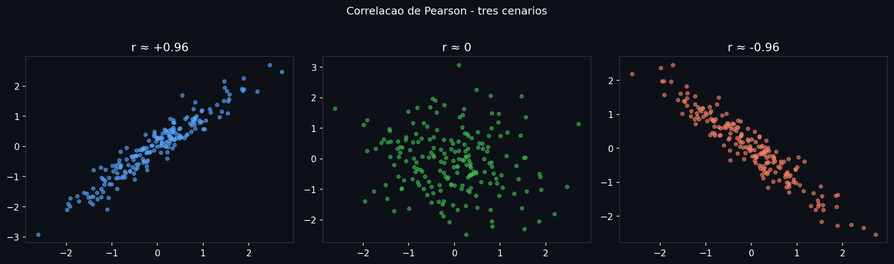
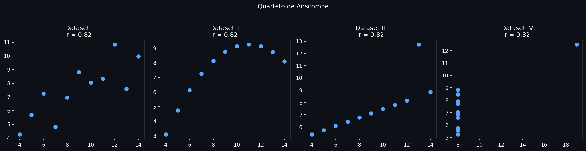
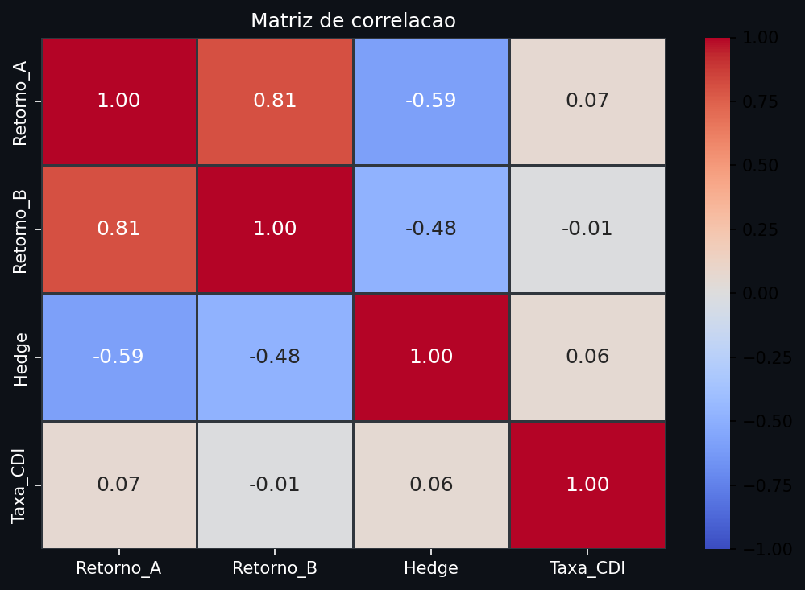

# Correlação e Dependência

Distribuições descrevem uma variável de cada vez. Mas dados reais vivem em múltiplas dimensões e as variáveis interagem: preços de ativos se movem juntos, features de um modelo se redundam, erros de medição se propagam. Correlação é a linguagem para quantificar esse movimento conjunto — e entender seus limites é tão importante quanto calculá-la.

> **Análise:** [05 — Outliers, correlação, causalidade e hipóteses](../analises/05_outliers_correlacao_causalidade_hipoteses.ipynb)

---

## Intuição

Se quando $X$ sobe $Y$ também sobe sistematicamente, elas são positivamente correlacionadas. Se sobem em direções opostas, negativamente. Se não há padrão, a correlação é zero.

A correlação normaliza essa tendência para uma escala de $-1$ a $1$, removendo o efeito das unidades. Isso permite comparar o grau de associação entre pares de variáveis completamente diferentes.

```python
import numpy as np
import matplotlib.pyplot as plt

np.random.seed(42)
n = 200
x = np.random.normal(0, 1, n)

fig, axes = plt.subplots(1, 3, figsize=(14, 4), facecolor="#0d1117")

casos = [
    (x + np.random.normal(0, 0.3, n),  "r ≈ +0.96", "#58a6ff"),
    (np.random.normal(0, 1, n),         "r ≈ 0",     "#3fb950"),
    (-x + np.random.normal(0, 0.3, n), "r ≈ -0.96", "#f78166"),
]

for ax, (y, label, cor) in zip(axes, casos):
    ax.set_facecolor("#0d1117")
    ax.scatter(x, y, color=cor, s=15, alpha=0.6)
    ax.set_title(label, color="white", fontsize=13)
    ax.tick_params(colors="white"); ax.spines[:].set_color("#30363d")

plt.suptitle("Correlação de Pearson — três cenários", color="white", y=1.02)
plt.tight_layout(); plt.show()
```



*À esquerda: pontos alinhados na diagonal ascendente — correlação forte positiva. No centro: nuvem circular — sem correlação linear. À direita: diagonal descendente — correlação forte negativa. A inclinação e compressão da nuvem traduzem o valor de r.*

---

## Definição formal

### Covariância

A covariância mede como $X$ e $Y$ variam juntos:

$$\text{Cov}(X, Y) = \frac{1}{n-1} \sum_{i=1}^{n} (x_i - \bar{x})(y_i - \bar{y})$$

Quando $X$ e $Y$ se afastam da média no mesmo sentido, o produto $(x_i - \bar{x})(y_i - \bar{y})$ é positivo e contribui para uma covariância positiva. O problema: a covariância está em unidades de $X \times Y$ — dois pares de variáveis com covariâncias diferentes podem ser igualmente "associados" se tiverem escalas diferentes.

### Correlação de Pearson

A correlação normaliza a covariância pelos desvios padrão:

$$r = \frac{\text{Cov}(X, Y)}{s_X \cdot s_Y} = \frac{\sum_{i=1}^{n}(x_i - \bar{x})(y_i - \bar{y})}{\sqrt{\sum_{i=1}^{n}(x_i - \bar{x})^2 \cdot \sum_{i=1}^{n}(y_i - \bar{y})^2}}$$

$r \in [-1, 1]$. Esta normalização remove as unidades e garante que $|r| = 1$ se e somente se existe relação linear perfeita.

### Correlação de Spearman

Pearson mede correlação *linear*. Quando a relação é monotônica mas não-linear (ex: $Y = X^3$), Pearson subestima a associação. A correlação de Spearman resolve isso: aplica Pearson nos *ranks* das variáveis.

$$r_s = r_{\text{Pearson}}(\text{rank}(X),\, \text{rank}(Y))$$

$r_s = 1$ quando $Y$ cresce sempre que $X$ cresce, independentemente de ser linear. É mais robusta a outliers porque os ranks compriment valores extremos.

### Correlação de Kendall

Mede a proporção de pares **concordantes** menos a de pares **discordantes**:

$$\tau = \frac{C - D}{\binom{n}{2}}$$

onde um par $(i,j)$ é concordante se $(x_i - x_j)$ e $(y_i - y_j)$ têm o mesmo sinal. Mais robusto que Spearman para amostras pequenas ou com muitos empates.

---

## Interpretação

Convenções práticas para $|r|$ de Pearson:

| $|r|$ | Intensidade |
|-------|-------------|
| < 0.3 | fraca |
| 0.3 – 0.5 | moderada |
| 0.5 – 0.7 | forte |
| > 0.7 | muito forte |

Essas faixas são orientações, não regras universais: em ciências sociais, $r = 0.3$ pode ser relevante; em física experimental, $r = 0.9$ pode ser insatisfatório.

**r = 0 não significa independência.** Pearson detecta apenas dependência linear. Variáveis podem ter $r = 0$ e ainda assim serem fortemente dependentes de formas não-lineares — o Quarteto de Anscombe demonstra isso: quatro datasets com $\bar{x}$, $\bar{y}$, $s_x$, $s_y$ e $r$ idênticos, mas padrões completamente distintos.

```python
import matplotlib.pyplot as plt
import numpy as np

# Quarteto de Anscombe
anscombe = {
    "I":   ([10,8,13,9,11,14,6,4,12,7,5], [8.04,6.95,7.58,8.81,8.33,9.96,7.24,4.26,10.84,4.82,5.68]),
    "II":  ([10,8,13,9,11,14,6,4,12,7,5], [9.14,8.14,8.74,8.77,9.26,8.1,6.13,3.1,9.13,7.26,4.74]),
    "III": ([10,8,13,9,11,14,6,4,12,7,5], [7.46,6.77,12.74,7.11,7.81,8.84,6.08,5.39,8.15,6.42,5.73]),
    "IV":  ([8,8,8,8,8,8,8,19,8,8,8],     [6.58,5.76,7.71,8.84,8.47,7.04,5.25,12.5,5.56,7.91,6.89]),
}

fig, axes = plt.subplots(1, 4, figsize=(16, 4), facecolor="#0d1117")
for ax, (nome, (x, y)) in zip(axes, anscombe.items()):
    ax.set_facecolor("#0d1117")
    ax.scatter(x, y, color="#58a6ff", s=50)
    r = np.corrcoef(x, y)[0, 1]
    ax.set_title(f"Dataset {nome}\nr = {r:.2f}", color="white")
    ax.tick_params(colors="white"); ax.spines[:].set_color("#30363d")
plt.suptitle("Quarteto de Anscombe — mesma correlação, padrões completamente diferentes", color="white", y=1.02)
plt.tight_layout(); plt.show()
```



*Os quatro datasets têm $r \approx 0.82$, mas os padrões são: I) relação linear com ruído; II) relação quadrática; III) linear perfeita com um outlier; IV) sem variação em X exceto por um ponto extremo. Sempre visualize antes de interpretar r.*

---

## Generalização

### Matriz de correlação

Para $p$ variáveis, a matriz $\mathbf{R}$ de correlações é $p \times p$, simétrica, com 1 na diagonal:

$$R_{ij} = r(X_i, X_j)$$

É a base de análise de componentes principais (PCA), modelos de fator e seleção de features. Uma matriz de correlação bem condicionada é pré-requisito para algoritmos que envolvem inversão de matriz (regressão, Gaussian Processes).

```python
import numpy as np
import pandas as pd
import matplotlib.pyplot as plt
import seaborn as sns

np.random.seed(42)
n = 200
x1 = np.random.normal(0, 1, n)
df = pd.DataFrame({
    "Retorno_A": x1,
    "Retorno_B":  0.8*x1 + np.random.normal(0, 0.6, n),
    "Hedge":     -0.5*x1 + np.random.normal(0, 0.8, n),
    "Taxa_CDI":   np.random.normal(0, 1, n),
})

corr = df.corr()

fig, ax = plt.subplots(figsize=(7, 5), facecolor="#0d1117")
ax.set_facecolor("#0d1117")
sns.heatmap(corr, annot=True, fmt=".2f", cmap="coolwarm",
            center=0, vmin=-1, vmax=1, ax=ax,
            linewidths=0.5, linecolor="#30363d",
            annot_kws={"size": 12})
ax.tick_params(colors="white")
plt.title("Matriz de correlação", color="white")
plt.tight_layout(); plt.show()
```



### Correlação parcial

$r(X, Y \mid Z)$ mede a correlação entre $X$ e $Y$ *após remover o efeito linear de $Z$*. Útil para separar correlação direta de correlação mediada por uma terceira variável.

```python
from pingouin import partial_corr
partial_corr(data=df, x="X", y="Y", covar=["Z"])
```

---

## Avaliação: significância estatística

Uma correlação observada pode ser acidental em amostras pequenas. Para testar se $\rho = 0$:

$$t = \frac{r\sqrt{n-2}}{\sqrt{1-r^2}} \sim t(n-2) \text{ sob } H_0: \rho = 0$$

```python
import numpy as np
from scipy import stats

np.random.seed(42)
x = np.random.normal(0, 1, 100)
y = 0.6*x + np.random.normal(0, 0.8, 100)

r, p_valor = stats.pearsonr(x, y)
print(f"r = {r:.4f}, p-valor = {p_valor:.4f}")
```

```
r = 0.5038, p-valor = 0.0000
```

Com $n = 10$ e $r = 0.5$, o p-valor é ~0.14 — não significativo. Com $n = 100$ e o mesmo $r = 0.5$, o p-valor é $< 0.0001$. Tamanho amostral importa tanto quanto o valor de $r$.

---

## Premissas e armadilhas

**Correlação de Pearson assume linearidade.** Se a relação é $Y = e^X$, Pearson pode retornar $r < 1$ mesmo com dependência perfeita. Use Spearman ou visualize antes.

**Outliers deflam ou inflam r dramaticamente.** Um único ponto pode criar correlação espúria onde não existe, ou destruir uma correlação real.

**Correlação não é causalidade.** Variáveis podem estar correlacionadas porque:
1. $X$ causa $Y$
2. $Y$ causa $X$
3. Uma terceira variável $Z$ causa ambas (*confounding*)
4. É coincidência espúria

Correlação descobre associação; causalidade exige desenho experimental ou instrumentos causais.

**Correlações instáveis no tempo** — em séries temporais financeiras, a correlação entre ativos muda de regime: cai em bull markets e sobe abruptamente em crises. Uma correlação calculada sobre toda a janela histórica mascara essa dinâmica. Use janelas deslizantes ou modelos DCC-GARCH para correlação dinâmica.

---

## Na prática

```python
import numpy as np
import pandas as pd
from scipy import stats
from itertools import combinations

np.random.seed(42)
x = np.random.normal(0, 1, 50)
y = 0.6*x + np.random.normal(0, 0.8, 50)
df = pd.DataFrame({"A": x, "B": y, "C": np.random.normal(0, 1, 50)})

# Correlação de Pearson
r, p = stats.pearsonr(x, y)

# Correlação de Spearman (robusta a não-linearidade)
rho, p = stats.spearmanr(x, y)

# Correlação de Kendall (amostras pequenas / muitos empates)
tau, p = stats.kendalltau(x, y)

# Matriz de correlação via pandas
df.corr(method="pearson")   # padrão
df.corr(method="spearman")
df.corr(method="kendall")

# Correlação com p-valores para cada par
for col_a, col_b in combinations(df.columns, 2):
    r, p = stats.pearsonr(df[col_a], df[col_b])
    print(f"{col_a} × {col_b}: r={r:.3f}, p={p:.4f}")
```

```
# Pearson:  r=0.6757,   p=0.0000
# Spearman: rho=0.6934, p=0.0000
# Kendall:  tau=0.4971, p=0.0000

# df.corr(method='pearson'):
        A       B       C
A  1.0000  0.6757 -0.1256
B  0.6757  1.0000 -0.2460
C -0.1256 -0.2460  1.0000

A × B: r=0.676, p=0.0000
A × C: r=-0.126, p=0.3824
B × C: r=-0.246, p=0.0850
```

**Armadilhas comuns**

- `df.corr()` ignora silenciosamente pares com NaN — cheque missings antes.
- Nunca interprete uma correlação sem ver o scatterplot. O Quarteto de Anscombe é um aviso permanente.
- Em séries temporais, correlações entre variáveis não-estacionárias são espúrias por definição — stationarize primeiro.
- Correlação entre variáveis com distribuição muito diferente (ex: binária vs contínua) não é bem capturada por Pearson; use correlação ponto-bisserial ou tetracórica.

---

## Leitura recomendada

**FIGUEIREDO FILHO, D. B.; SILVA JÚNIOR, J. A.** Desvendando os Mistérios do Coeficiente de Correlação de Pearson. *Revista Política Hoje*, v. 18, n. 1, p. 115-146, 2009. [→ PDF (UFPE)](https://periodicos.ufpe.br/revistas/politicahoje/article/download/3852/3156/0)
Artigo em português que discute com profundidade a interpretação, as limitações e as armadilhas do coeficiente de Pearson — incluindo correlações espúrias e a distinção entre correlação e causalidade, com exemplos de dados políticos e sociais.

**ANSCOMBE, F. J.** Graphs in Statistical Analysis. *The American Statistician*, v. 27, n. 1, p. 17-21, 1973. [→ PDF (SJSU)](https://www.sjsu.edu/faculty/gerstman/StatPrimer/anscombe1973.pdf)
Artigo original que introduz o Quarteto de Anscombe. Seis páginas que demonstram definitivamente por que a correlação sozinha é insuficiente para descrever uma relação entre variáveis.
