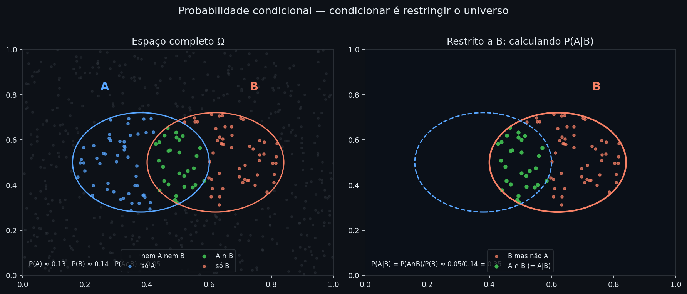
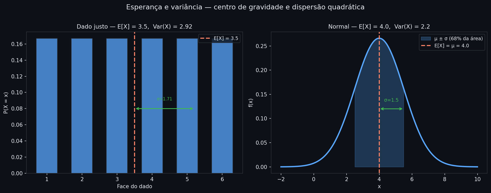
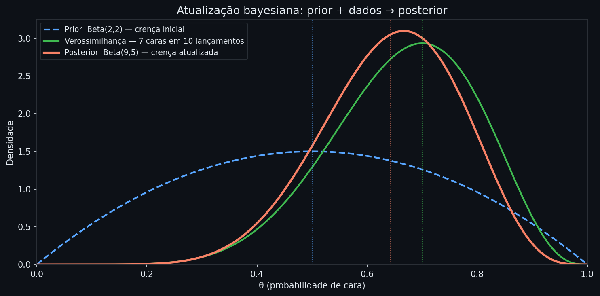

# Probabilidade e Bayes

Distribuições e correlação descrevem o que acontece com dados já observados. Mas dados raramente chegam completos: um e-mail está chegando e ainda não sabemos se é spam; um paciente está sendo examinado e ainda não sabemos o diagnóstico; um modelo está sendo treinado e não sabemos quais parâmetros descrevem os dados. Probabilidade é a linguagem para quantificar essa incerteza — e probabilidade condicional é a ferramenta para atualizá-la conforme novas informações chegam.

Em IA, quase toda saída de modelo é uma afirmação probabilística. Um classificador não retorna "spam" — retorna $P(\text{spam} \mid \text{e-mail})$, a probabilidade de ser spam dado o conteúdo. Durante o treino, a função de perda vem de uma suposição sobre como os dados se distribuem: minimizar a cross-entropy equivale a maximizar a probabilidade dos dados sob o modelo. O Teorema de Bayes fundamenta classificadores como o Naive Bayes e filtros de spam, e está no centro de modelos generativos que aprendem a criar imagens e texto. Variáveis aleatórias, esperança e variância definem o que um modelo está tentando estimar e quão incerto ele está sobre essa estimativa.

> **Análise:** [04 — Probabilidade, distribuições e testes em modelos](../analises/04_probabilidade_distribuicoes_testes_modelos.ipynb)

---

## Intuição

Imagine que você sorteia um e-mail aleatório da caixa de entrada. A chance de ele ser spam é a probabilidade: um número entre 0 e 1 que mede qual fração de todos os e-mails possíveis caem nessa categoria.

Agora imagine que você já sabe que o e-mail tem a palavra "promoção". Isso muda sua estimativa — e muito. Probabilidade condicional é exatamente isso: a chance de algo acontecer *dado que já sabemos outra coisa*. Condicionar é trocar o universo de referência — em vez de considerar todos os e-mails, consideramos só os que têm "promoção", e medimos qual fração desses é spam.

```python
import matplotlib
matplotlib.use("Agg")
import numpy as np
import matplotlib.pyplot as plt

BG, BLUE, RED, GREEN, GRAY = "#0d1117", "#58a6ff", "#f78166", "#3fb950", "#30363d"
np.random.seed(42)
n = 600
x = np.random.uniform(0, 1, n)
y = np.random.uniform(0, 1, n)

def in_A(x, y): return (x - 0.38)**2 + (y - 0.5)**2 < 0.22**2
def in_B(x, y): return (x - 0.62)**2 + (y - 0.5)**2 < 0.22**2

mask_a = in_A(x, y); mask_b = in_B(x, y); mask_ab = mask_a & mask_b

fig, axes = plt.subplots(1, 2, figsize=(12, 5), facecolor=BG)
for ax in axes:
    ax.set_facecolor(BG); ax.set_xlim(0, 1); ax.set_ylim(0, 1)
    ax.tick_params(colors="#e6edf3", labelsize=9)
    ax.spines[:].set_color(GRAY)

ax = axes[0]
ax.scatter(x[~mask_a & ~mask_b], y[~mask_a & ~mask_b], color=GRAY, s=6, alpha=0.4)
ax.scatter(x[mask_a & ~mask_b],  y[mask_a & ~mask_b],  color=BLUE, s=10, alpha=0.7, label="só A")
ax.scatter(x[mask_ab],           y[mask_ab],            color=GREEN, s=14, alpha=0.9, label="A ∩ B")
ax.scatter(x[mask_b & ~mask_a],  y[mask_b & ~mask_a],  color=RED, s=10, alpha=0.7, label="só B")
for circ, cor in [((0.38, 0.5), BLUE), ((0.62, 0.5), RED)]:
    ax.add_patch(plt.Circle(circ, 0.22, fill=False, color=cor, lw=1.5))
ax.text(0.24, 0.82, "A", color=BLUE, fontsize=14, fontweight="bold")
ax.text(0.73, 0.82, "B", color=RED,  fontsize=14, fontweight="bold")
ax.set_title("Espaço completo Ω", color="#e6edf3", fontsize=12)
ax.legend(loc="lower center", fontsize=8, facecolor=BG, edgecolor=GRAY, labelcolor="#e6edf3", ncol=2)
p_a = mask_a.sum()/n; p_b = mask_b.sum()/n; p_ab = mask_ab.sum()/n
ax.text(0.02, 0.04, f"P(A)≈{p_a:.2f}  P(B)≈{p_b:.2f}  P(A∩B)≈{p_ab:.2f}",
        color="#e6edf3", fontsize=8, transform=ax.transAxes)

ax2 = axes[1]
ax2.scatter(x[mask_b & ~mask_a], y[mask_b & ~mask_a], color=RED,   s=10, alpha=0.7, label="B mas não A")
ax2.scatter(x[mask_ab],          y[mask_ab],           color=GREEN, s=16, alpha=0.95, label="A ∩ B")
ax2.add_patch(plt.Circle((0.62, 0.5), 0.22, fill=False, color=RED,  lw=2))
ax2.add_patch(plt.Circle((0.38, 0.5), 0.22, fill=False, color=BLUE, lw=1.5, linestyle="--"))
ax2.text(0.73, 0.82, "B", color=RED, fontsize=14, fontweight="bold")
ax2.set_title("Restrito a B: calculando P(A|B)", color="#e6edf3", fontsize=12)
ax2.legend(loc="lower center", fontsize=8, facecolor=BG, edgecolor=GRAY, labelcolor="#e6edf3")
p_a_b = p_ab / p_b
ax2.text(0.02, 0.04, f"P(A|B) = P(A∩B)/P(B) ≈ {p_ab:.2f}/{p_b:.2f} = {p_a_b:.2f}",
         color="#e6edf3", fontsize=8, transform=ax2.transAxes)

plt.suptitle("Probabilidade condicional — condicionar é restringir o universo", color="#e6edf3", y=1.01, fontsize=13)
plt.tight_layout()
plt.savefig("../analises/assets/prob_01_prob_condicional.png", dpi=150, bbox_inches="tight", facecolor=BG)
plt.close()
```


*À esquerda: o espaço Ω completo — azul é só A, vermelho é só B, verde é A∩B. À direita: restrito aos pontos de B; a proporção verde dentro do vermelho é exatamente P(A|B) = P(A∩B)/P(B). Condicionar troca o denominador: de |Ω| para |B|.*

Variáveis aleatórias levam esse raciocínio a quantidades numéricas. Em vez de perguntar "este e-mail é spam?", perguntamos "qual é o retorno do ativo amanhã?", "quantas horas até a próxima falha de sistema?", "quantos cliques em um anúncio?". Uma variável aleatória associa um número real a cada resultado possível do experimento, carregando consigo a distribuição de probabilidade desses resultados — e é sobre essas distribuições que modelos de IA fazem afirmações.

---

## Definição formal

### Probabilidade condicional

$$P(A \mid B) = \frac{P(A \cap B)}{P(B)}, \quad P(B) > 0$$

$P(A \cap B)$ é a probabilidade de A e B ocorrerem juntos; $P(B)$ é a probabilidade de B; $P(A \mid B)$ é a probabilidade de A dado que B já ocorreu. Reescrevendo: $P(A \cap B) = P(A \mid B) \cdot P(B)$ — chamada de **regra do produto**, ela permite calcular probabilidades conjuntas a partir de condicionais.

Dois eventos são **independentes** se $P(A \mid B) = P(A)$: saber que B ocorreu não muda a probabilidade de A. Isso equivale a $P(A \cap B) = P(A) \cdot P(B)$.

### Variável aleatória

Uma variável aleatória $X$ é uma função que mapeia cada resultado do experimento a um número real. O que distingue os dois casos é o conjunto de valores que $X$ pode assumir:

- **Discreta**: assume valores enumeráveis $x_1, x_2, \ldots$ com probabilidades $P(X = x_k) \geq 0$ e $\sum_k P(X = x_k) = 1$.
- **Contínua**: assume valores em um intervalo, descrita por uma função de densidade $f(x) \geq 0$, onde $P(a \leq X \leq b) = \int_a^b f(x)\,dx$ e $\int_{-\infty}^{\infty} f(x)\,dx = 1$.

A **função de distribuição acumulada** (CDF) unifica os dois casos: $F(x) = P(X \leq x)$, crescente de 0 a 1. Para variáveis contínuas, $f(x) = F'(x)$; para discretas, $F$ é uma escada. CDF é a base para calcular quantis — como o Value at Risk em risco financeiro — e para gerar amostras de qualquer distribuição por inversão: se $U \sim \text{Uniforme}(0,1)$, então $F^{-1}(U)$ segue a distribuição de $X$.

### Esperança e variância

A **esperança** $E[X]$ é o valor médio de $X$ ponderado pelas probabilidades — o centro de gravidade da distribuição:

$$E[X] = \sum_k x_k \, P(X = x_k) \qquad \text{(discreta)}$$

$$E[X] = \int_{-\infty}^{\infty} x\, f(x)\,dx \qquad \text{(contínua)}$$

A **variância** mede a dispersão quadrática média em torno da esperança:

$$\text{Var}(X) = E\!\left[(X - E[X])^2\right] = E[X^2] - (E[X])^2$$

As propriedades que tornam esperança e variância utilizáveis em modelos:

**Linearidade da esperança** — válida sempre, independentemente de $X$ e $Y$ serem dependentes:

$$E[aX + b] = aE[X] + b \qquad E[X + Y] = E[X] + E[Y]$$

$a$ e $b$ são constantes reais; $Y$ é outra variável aleatória. A segunda igualdade vale sempre — mesmo que $X$ e $Y$ sejam dependentes.

**Variância sob transformações lineares e somas**:

$$\text{Var}(aX + b) = a^2\,\text{Var}(X)$$

$$\text{Var}(X + Y) = \text{Var}(X) + \text{Var}(Y) \quad \text{se } X, Y \text{ independentes}$$

Quando $X$ e $Y$ são dependentes, $\text{Var}(X + Y) = \text{Var}(X) + \text{Var}(Y) + 2\,\text{Cov}(X, Y)$.

**Lei dos grandes números**: para $n$ amostras independentes e identicamente distribuídas com $E[X] = \mu$, a média amostral

$$\bar{X}_n = \frac{1}{n}\sum_{i=1}^n X_i$$

$X_i$ é a $i$-ésima observação da amostra; $\bar{X}_n$ é a média das $n$ observações.

converge para $\mu$ quando $n \to \infty$. É o que justifica o SGD: a média do gradiente em um mini-batch é um estimador não-viesado do gradiente esperado sobre o conjunto completo.

$E[X]$ e $\text{Var}(X)$ sintetizam uma distribuição em dois números — mas sozinhos não descrevem sua forma completa.

```python
import matplotlib
matplotlib.use("Agg")
import numpy as np
import matplotlib.pyplot as plt
from scipy import stats

BG, BLUE, RED, GREEN, GRAY = "#0d1117", "#58a6ff", "#f78166", "#3fb950", "#30363d"
WHITE = "#e6edf3"

fig, axes = plt.subplots(1, 2, figsize=(13, 5), facecolor=BG)

ax = axes[0]
ax.set_facecolor(BG); ax.spines[:].set_color(GRAY); ax.tick_params(colors=WHITE)
faces = np.arange(1, 7); probs = np.ones(6) / 6
e_x = (faces * probs).sum(); var_x = ((faces - e_x)**2 * probs).sum()
ax.bar(faces, probs, color=BLUE, alpha=0.75, width=0.6, edgecolor=GRAY)
ax.axvline(e_x, color=RED, lw=2, linestyle="--", label=f"E[X] = {e_x:.1f}")
std_x = var_x**0.5
ax.annotate("", xy=(e_x + std_x, 0.08), xytext=(e_x, 0.08),
            arrowprops=dict(arrowstyle="<->", color=GREEN, lw=1.5))
ax.text(e_x + std_x/2, 0.09, f"σ={std_x:.2f}", color=GREEN, ha="center", fontsize=8)
ax.set_xlabel("Face do dado", color=WHITE)
ax.set_ylabel("P(X = x)", color=WHITE)
ax.set_title(f"Dado justo — E[X]={e_x:.1f}, Var(X)={var_x:.4f}", color=WHITE, fontsize=11)
ax.legend(fontsize=9, facecolor=BG, edgecolor=GRAY, labelcolor=WHITE)

ax2 = axes[1]
ax2.set_facecolor(BG); ax2.spines[:].set_color(GRAY); ax2.tick_params(colors=WHITE)
mu, sigma = 4.0, 1.5
xc = np.linspace(mu - 4*sigma, mu + 4*sigma, 400)
pdf = stats.norm.pdf(xc, mu, sigma)
ax2.plot(xc, pdf, color=BLUE, lw=2.5)
area_68 = stats.norm.cdf(1) - stats.norm.cdf(-1)
ax2.fill_between(xc, pdf, where=(xc >= mu - sigma) & (xc <= mu + sigma),
                 color=BLUE, alpha=0.25, label=f"μ±σ ({area_68:.0%} da área)")
ax2.axvline(mu, color=RED, lw=2, linestyle="--", label=f"E[X] = μ = {mu}")
ax2.annotate("", xy=(mu + sigma, 0.12), xytext=(mu, 0.12),
             arrowprops=dict(arrowstyle="<->", color=GREEN, lw=1.5))
ax2.text(mu + sigma/2, 0.135, f"σ={sigma}", color=GREEN, ha="center", fontsize=9)
ax2.set_xlabel("x", color=WHITE)
ax2.set_ylabel("f(x)", color=WHITE)
ax2.set_title(f"Normal — E[X]={mu}, Var(X)={sigma**2:.2f}", color=WHITE, fontsize=11)
ax2.legend(fontsize=9, facecolor=BG, edgecolor=GRAY, labelcolor=WHITE)

plt.suptitle("Esperança e variância — centro de gravidade e dispersão quadrática", color=WHITE, fontsize=13, y=1.01)
plt.tight_layout()
plt.savefig("../analises/assets/prob_03_esperanca_variancia.png", dpi=150, bbox_inches="tight", facecolor=BG)
plt.close()
```


*Esquerda: dado de 6 faces. E[X] = 3.5 (linha vermelha) é o centro de gravidade das barras; σ (seta verde) mede o espalhamento típico. Direita: distribuição normal com μ = 4 e σ = 1.5. A área sombreada (μ ± σ) cobre 68% da probabilidade — a variância quantifica exatamente quão concentrada é essa área em torno da média.*

Esperança e variância descrevem uma distribuição em dois números. Mas para raciocinar sobre como crenças se atualizam — o passo que transforma probabilidade em aprendizado — precisamos de uma ferramenta que conecte distribuições antes e depois de observar dados.

---

## O Teorema de Bayes

Probabilidade condicional esconde uma identidade que muda completamente como raciocinamos sob incerteza. De $P(A \mid B) = P(A \cap B)/P(B)$ e $P(B \mid A) = P(A \cap B)/P(A)$, isolamos $P(A \cap B)$ em ambas e igualamos:

$$P(A \mid B) = \frac{P(B \mid A)\, P(A)}{P(B)}$$

Essa é a regra de Bayes. Ela permite *inverter a condição*: se sei $P(B \mid A)$ e quero $P(A \mid B)$, basta aplicá-la. O denominador se calcula pela **lei da probabilidade total**:

$$P(B) = \sum_i P(B \mid A_i)\, P(A_i)$$

quando $A_1, A_2, \ldots$ cobrem todos os casos possíveis sem se sobrepor — como "doente" e "saudável" num diagnóstico.

Cada termo tem um papel distinto no mecanismo de atualização:

| Termo | Nome | Significa |
|---|---|---|
| $P(A)$ | **prior** | crença sobre A antes de observar B |
| $P(A \mid B)$ | **posterior** | crença sobre A após observar B |
| $P(B \mid A)$ | **verossimilhança** | quão compatível é B com a hipótese A |
| $P(B)$ | **evidência** | normalização que garante posterior somando 1 |

O teorema é um mecanismo de atualização de crenças: começamos com um prior, observamos dados (verossimilhança) e produzimos um posterior. Quão dramática é essa atualização depende de quanto a verossimilhança difere do prior — e é essa tensão que o exemplo a seguir torna concreta.

---

## Interpretação

O exemplo mais revelador de Bayes não é abstrato — é clínico.

Um teste para uma doença rara tem **sensibilidade** de 99% ($P(\text{positivo} \mid \text{doente}) = 0{,}99$) e **especificidade** de 99% ($P(\text{negativo} \mid \text{saudável}) = 0{,}99$). A doença afeta 1 em cada 1000 pessoas. O teste deu positivo: qual é a probabilidade de estar doente?

```python
p_doenca            = 0.001   # prevalência: 1 em 1000
p_pos_dado_doente   = 0.99    # sensibilidade
p_pos_dado_saudavel = 0.01    # 1 - especificidade (falso positivo)

p_pos = (p_pos_dado_doente * p_doenca
         + p_pos_dado_saudavel * (1 - p_doenca))

p_doente_dado_pos = (p_pos_dado_doente * p_doenca) / p_pos

print(f"P(doenca | teste +) = {p_doente_dado_pos:.1%}")
```

```text
P(doenca | teste +) = 9.0%
```

Apenas 9%, mesmo com um teste de 99% de precisão. A razão: a doença é rara, então a maioria das pessoas testadas são saudáveis — e 1% de falsos positivos numa base grande supera os verdadeiros positivos de uma base pequena. O prior (prevalência baixíssima) domina.

Esse é o **erro de inversão das probabilidades**: confundir $P(\text{positivo} \mid \text{doente}) = 0{,}99$ com $P(\text{doente} \mid \text{positivo}) = 0{,}09$. Em IA, a versão equivalente é confundir a acurácia do modelo em exemplos de uma classe com a probabilidade de o modelo estar certo quando prevê essa classe — o que depende da prevalência das classes nos dados de entrada.

---

## Generalização

### Atualização sequencial e estimação de parâmetros

Uma das propriedades mais poderosas do Teorema de Bayes é que observações podem ser incorporadas uma a uma: o posterior de hoje é o prior de amanhã. Para estimar um parâmetro $\theta$ a partir de $n$ dados independentes $x_1, \ldots, x_n$:

$$P(\theta \mid x_1, \ldots, x_n) \propto P(\theta) \prod_{i=1}^n P(x_i \mid \theta)$$

$P(\theta)$ é o prior — a crença sobre $\theta$ antes dos dados; $P(x_i \mid \theta)$ é a verossimilhança de cada observação; $\prod_{i=1}^n$ indica o produto dos $n$ termos. $\propto$ significa "proporcional a" — o denominador é um número fixo que garante que o posterior some 1, e pode ser ignorado na comparação entre hipóteses. O produto acumula evidências: cada observação empurra o posterior em direção aos valores de $\theta$ compatíveis com os dados.

```python
import matplotlib
matplotlib.use("Agg")
import numpy as np
import matplotlib.pyplot as plt
from scipy import stats

BG, BLUE, RED, GREEN, GRAY = "#0d1117", "#58a6ff", "#f78166", "#3fb950", "#30363d"
WHITE = "#e6edf3"

theta = np.linspace(0, 1, 500)
alpha_prior, beta_prior = 2, 2
k, n_obs = 7, 10
alpha_post = alpha_prior + k
beta_post  = beta_prior + (n_obs - k)

prior      = stats.beta.pdf(theta, alpha_prior, beta_prior)
likelihood = stats.binom.pmf(k, n_obs, theta)
likelihood_norm = likelihood / np.trapz(likelihood, theta)
posterior  = stats.beta.pdf(theta, alpha_post, beta_post)

fig, ax = plt.subplots(figsize=(10, 5), facecolor=BG)
ax.set_facecolor(BG); ax.spines[:].set_color(GRAY); ax.tick_params(colors=WHITE)
ax.plot(theta, prior,           color=BLUE,  lw=2,   label=f"Prior Beta({alpha_prior},{beta_prior}) — crença inicial", linestyle="--")
ax.plot(theta, likelihood_norm, color=GREEN, lw=2,   label=f"Verossimilhanca — {k} caras em {n_obs} lancamentos")
ax.plot(theta, posterior,       color=RED,   lw=2.5, label=f"Posterior Beta({alpha_post},{beta_post}) — crenca atualizada")
ax.axvline(alpha_prior/(alpha_prior+beta_prior), color=BLUE,  lw=1, linestyle=":", alpha=0.6)
ax.axvline(k/n_obs,                              color=GREEN, lw=1, linestyle=":", alpha=0.6)
ax.axvline(alpha_post/(alpha_post+beta_post),    color=RED,   lw=1, linestyle=":", alpha=0.6)
ax.set_xlabel("theta (probabilidade de cara)", color=WHITE)
ax.set_ylabel("Densidade", color=WHITE)
ax.set_title("Atualizacao bayesiana: prior + dados -> posterior", color=WHITE, fontsize=13)
ax.legend(fontsize=9, facecolor=BG, edgecolor=GRAY, labelcolor=WHITE)
ax.set_xlim(0, 1); ax.set_ylim(bottom=0)
plt.tight_layout()
plt.savefig("../analises/assets/prob_02_atualizacao_bayes.png", dpi=150, bbox_inches="tight", facecolor=BG)
plt.close()
```


*Prior Beta(2,2) (azul tracejado): crença inicial de que a moeda é equilibrada, centrada em 0.5. Verossimilhança (verde): compatibilidade de cada valor de θ com 7 caras em 10 lançamentos, com pico em 0.7. Posterior Beta(9,5) (vermelho): crença atualizada, deslocada do prior em direção aos dados. Com mais lançamentos, o posterior ficaria mais estreito e mais próximo da frequência observada.*

### Esperança condicional e regressão

A esperança pode ser calculada dado o valor de outra variável: $E[Y \mid X = x]$ é a média de $Y$ entre todos os casos em que $X$ vale $x$. A **lei da esperança total** garante que a esperança incondicional se recupera marginalizando:

$$E[Y] = E\!\left[E[Y \mid X]\right]$$

$E[Y \mid X]$ é a esperança de $Y$ calculada para cada valor fixo de $X$; o $E[\,\cdot\,]$ externo é a média disso sobre todos os valores possíveis de $X$.

Um modelo de regressão estima exatamente $E[Y \mid X]$ — a esperança condicional de $Y$ dado o vetor de features $X$. Regressão linear, árvores de decisão e redes neurais de regressão são formas diferentes de aproximar essa função.

### Independência condicional e Naive Bayes

$X$ e $Y$ são **condicionalmente independentes** dado $Z$ se $P(X, Y \mid Z) = P(X \mid Z)\, P(Y \mid Z)$. Saber $Z$ torna $X$ e $Y$ irrelevantes um para o outro. O classificador Naive Bayes assume exatamente isso — features independentes dada a classe:

$$P(\text{classe} \mid x_1, \ldots, x_p) \propto P(\text{classe}) \prod_{j=1}^p P(x_j \mid \text{classe})$$

$p$ é o número de features; $x_j$ é o valor da $j$-ésima feature; $\prod_{j=1}^p$ é o produto das verossimilhanças de cada feature individualmente.

A suposição raramente vale nos dados, mas o modelo funciona porque o sinal principal vem da verossimilhança conjunta, não das dependências residuais entre features.

---

## Avaliação

Como saber se um modelo probabilístico está descrevendo bem a incerteza?

**Calibração**: um modelo bem calibrado retorna $P = 0{,}7$ quando o evento ocorre em aproximadamente 70% dos casos com essa predição. Modelos confiantes demais — que retornam probabilidades próximas de 0 ou 1 quando erram sistematicamente — são mal calibrados.

**Log-verossimilhança**: para dados $x_1, \ldots, x_n$ com densidade assumida $f(x;\theta)$:

$$\ell(\theta) = \sum_{i=1}^n \log f(x_i; \theta)$$

$\ell$ é a log-verossimilhança; $f(x_i; \theta)$ é a densidade (ou probabilidade, no caso discreto) do ponto $x_i$ segundo o modelo parametrizado por $\theta$. Maximizar $\ell(\theta)$ é a base da Estimação de Máxima Verossimilhança (MLE), coberta na próxima nota. Em redes neurais, minimizar a cross-entropy equivale a maximizar $\ell$ sob uma distribuição Bernoulli (classificação binária) ou Categorical (multiclasse).

**Brier score**: para eventos binários,

$$\text{BS} = \frac{1}{n}\sum_i (p_i - y_i)^2$$

onde $p_i$ é a probabilidade predita e $y_i \in \{0, 1\}$ é o resultado observado. Quanto menor, mais calibrado o modelo.

---

## Premissas e armadilhas

**O prior importa quando os dados são escassos.** Com poucos exemplos, o posterior é dominado pelo prior. Com muitos dados, o posterior converge independentemente da escolha do prior — mas essa convergência não é garantida se o prior atribui probabilidade zero a regiões onde o verdadeiro parâmetro está.

**Probabilidade zero bloqueia atualização permanentemente.** Se $P(A) = 0$, então $P(A \mid B) = 0$ para qualquer evidência B. Priors que excluem hipóteses possíveis nunca são corrigidos por dados — razão pela qual modelos bayesianos usam priors suaves.

**Independência condicional raramente vale literalmente.** Naive Bayes assume features independentes dada a classe. Na prática, palavras co-ocorrem, retornos de ativos correlacionam, features médicas se sobrepõem. O modelo funciona porque a monotonia da verossimilhança preserva a ordenação de probabilidades mesmo com a suposição violada.

**Inverter a condição é o erro mais comum.** $P(A \mid B) \neq P(B \mid A)$ em geral. Essa confusão — chamada de *falácia da transposição* ou *inversão das probabilidades* — aparece em diagnósticos clínicos, em avaliação de modelos e em interpretação de testes estatísticos. O p-valor ($P(\text{dados extremos} \mid H_0)$) não é $P(H_0 \mid \text{dados})$ — distinção central explorada na nota de Testes de Hipótese.

---

## Na prática

```python
import numpy as np
from scipy import stats

# Probabilidade condicional — verificacao via simulacao
np.random.seed(42)
n = 200_000
# Definicao: P(A)=0.4, P(B)=0.3, P(A inter B)=0.15
a    = np.random.random(n) < 0.4
b_a  = np.random.random(n) < (0.15 / 0.4)            # P(B|A) = 0.375
b_na = np.random.random(n) < ((0.3 - 0.15) / 0.6)    # P(B|nao A) = 0.25
b    = np.where(a, b_a, b_na)

print(f"P(A inter B) simulado = {(a & b).mean():.3f}  (esperado 0.150)")
print(f"P(A|B)       simulado = {(a & b).mean() / b.mean():.3f}  (esperado 0.500)")
```

```text
P(A inter B) simulado = 0.150  (esperado 0.150)
P(A|B)       simulado = 0.500  (esperado 0.500)
```

```python
# Esperanca e variancia
faces = np.arange(1, 7)
prob  = np.ones(6) / 6
e_x   = (faces * prob).sum()
var_x = ((faces - e_x)**2 * prob).sum()
print(f"Dado: E[X]={e_x:.2f}, Var(X)={var_x:.4f}, Std={var_x**0.5:.4f}")

dist = stats.norm(loc=4.0, scale=1.5)
print(f"Normal: E[X]={dist.mean():.1f}, Var(X)={dist.var():.2f}, Std={dist.std():.2f}")
```

```text
Dado: E[X]=3.50, Var(X)=2.9167, Std=1.7078
Normal: E[X]=4.0, Var(X)=2.25, Std=1.50
```

```python
# Teorema de Bayes — diagnostico e atualizacao
p_doenca, p_pos_d, p_pos_s = 0.001, 0.99, 0.01
p_pos = p_pos_d * p_doenca + p_pos_s * (1 - p_doenca)
print(f"P(doenca | +) = {p_pos_d * p_doenca / p_pos:.1%}")

# Estimacao bayesiana: moeda com prior Beta(2,2), 7 caras em 10
alpha_pr, beta_pr = 2, 2
k, n_obs = 7, 10
alpha_po = alpha_pr + k          # posterior Beta(9, 5)
beta_po  = beta_pr + n_obs - k
print(f"Prior: media={alpha_pr/(alpha_pr+beta_pr):.2f} | "
      f"Posterior: media={alpha_po/(alpha_po+beta_po):.3f}")
```

```text
P(doenca | +) = 9.0%
Prior: media=0.50 | Posterior: media=0.643
```

```python
# Naive Bayes com sklearn
from sklearn.naive_bayes import GaussianNB, MultinomialNB
from sklearn.datasets import load_iris
from sklearn.model_selection import train_test_split

X, y = load_iris(return_X_y=True)
X_train, X_test, y_train, y_test = train_test_split(X, y, test_size=0.3, random_state=42)

gnb = GaussianNB()
gnb.fit(X_train, y_train)
print(f"Acuracia: {gnb.score(X_test, y_test):.3f}")
# Probabilidades para as tres classes (soma 1 por linha)
print(gnb.predict_proba(X_test[:3]).round(3))
```

```text
Acuracia: 0.978
[[1.    0.    0.   ]
 [1.    0.    0.   ]
 [0.    0.003 0.997]]
```

**Armadilhas comuns**

- Em Naive Bayes com `MultinomialNB`, use `alpha=1.0` (Laplace smoothing) para evitar probabilidade zero em features não vistas no treino — zero bloqueia o produto de verossimilhanças e zerará todo o posterior.
- `GaussianNB` assume distribuição normal por feature e por classe. Se features são muito assimétricas ou multimodais, considere `HistGradientBoostingClassifier` ou transforme os dados antes.
- Cheque independência antes de usar $P(A \cap B) = P(A)P(B)$. Se houver dependência forte e você a ignorar, o modelo erra sistematicamente — especialmente em problemas onde features são construídas umas a partir das outras.

---

## Leitura recomendada

**MORETTIN, P. A.** *Probabilidade: Tópicos para um Curso Avançado*. IME-USP. [→ PDF (IME-USP)](https://www.ime.usp.br/~pam/macro_probv5.pdf)
Notas de curso abertas do professor Pedro Morettin (IME-USP, co-autor do Bussab & Morettin), cobrindo espaços de probabilidade, variáveis aleatórias, esperança e convergência com rigor matemático e notação acessível a quem tem cálculo.

**KUNIN, D. et al.** *Seeing Theory*. Brown University, 2017. [→ seeing-theory.brown.edu](https://seeing-theory.brown.edu/bayesian-inference/index.html)
Recurso interativo que anima probabilidade condicional, verossimilhança e atualização bayesiana — ideal para construir a intuição geométrica do Teorema de Bayes antes de formalizá-lo. Cada conceito tem um painel manipulável com exemplos práticos.
