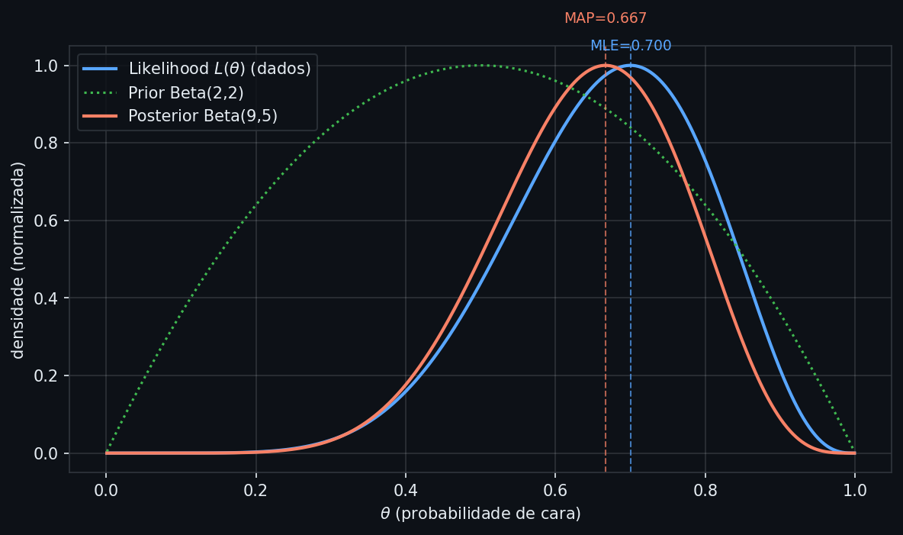
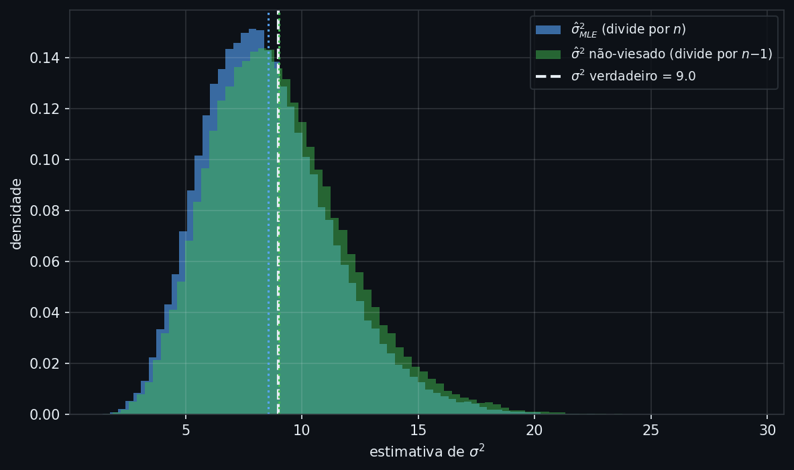
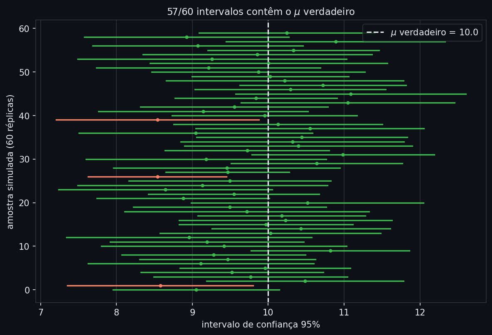

# MLE e MAP

A nota anterior mostrou como o Teorema de Bayes atualiza uma crença sobre um parâmetro à medida que dados chegam: no exemplo da moeda, um prior Beta(2,2) combinado com 7 caras em 10 lançamentos produziu um posterior Beta(9,5). Mas o posterior é uma distribuição inteira sobre os valores possíveis de $\theta$ — descreve toda a incerteza remanescente, não um veredito único. Na prática, quase sempre é preciso reportar um número: qual é, afinal, o "melhor palpite" para $\theta$?

Todo modelo treinado é a resposta a essa mesma pergunta. Quando uma regressão logística "aprende" seus coeficientes, ou uma rede neural "converge", um algoritmo de otimização encontrou os parâmetros que tornam os dados observados mais prováveis — isso é MLE (Maximum Likelihood Estimation), disfarçado de função de perda: a entropia cruzada usada para treinar classificadores é, matematicamente, o log-likelihood negativo de uma distribuição Bernoulli. Regularização (Ridge, Lasso) é MAP (Maximum a Posteriori) disfarçado: adicionar uma penalidade L2 aos coeficientes equivale exatamente a assumir, antes de ver os dados, que os pesos seguem uma distribuição Normal centrada em zero. Sem entender essa equivalência, o $\lambda$ do Ridge vira um botão arbitrário para ajustar por tentativa e erro, em vez de uma crença prévia explícita sobre a magnitude dos parâmetros.

---

## Intuição

Volte ao exemplo da moeda: 10 lançamentos, 7 caras. Qual é o melhor palpite para $\theta$, a probabilidade de dar cara? A resposta mais natural é 0,7 — a frequência observada. Esse valor "explica" os dados melhor que qualquer outro: se $\theta$ fosse 0,1, ver 7 caras em 10 lançamentos seria muito improvável; se $\theta$ fosse 0,9, também seria estranho ver só 7. O valor 0,7 é o que torna os dados observados mais prováveis — essa é, informalmente, a lógica da **estimação por máxima verossimilhança (MLE)**: escolher o parâmetro que maximiza a probabilidade de ter observado exatamente os dados que você observou.

Mas e se, antes de jogar a moeda, você já soubesse que ela vem de uma fábrica que produz moedas quase sempre honestas? Essa crença prévia deveria pesar na estimativa final — um pouco menos que 0,7, puxado de volta em direção a 0,5. Essa é a lógica do **MAP**: em vez de olhar só para os dados, combina os dados com uma crença prévia (o prior) e escolhe o valor de $\theta$ mais provável depois de considerar os dois — o pico do posterior que a nota anterior calculou via Bayes.

A pergunta que guia o resto desta nota: como formalizar "o valor que mais bem explica os dados" e "o valor mais provável depois de combinar dados e crença prévia" — e o que garante que essas estimativas sejam confiáveis?

## Definição formal

Dado um conjunto de observações $x_1, \ldots, x_n$ independentes e identicamente distribuídas (iid), com uma distribuição que depende de um parâmetro desconhecido $\theta$, a **função de verossimilhança** (likelihood) mede quão provável é ter observado exatamente esses dados, para cada valor candidato de $\theta$:

$$L(\theta) = \prod_{i=1}^{n} P(x_i \mid \theta)$$

Cada $P(x_i \mid \theta)$ é a probabilidade (variável discreta) ou densidade (variável contínua) de observar $x_i$ sob o parâmetro $\theta$; o produto reflete a independência entre as observações. Como produtos de muitos termos pequenos ficam numericamente instáveis, trabalha-se quase sempre com o **log-likelihood**:

$$\ell(\theta) = \log L(\theta) = \sum_{i=1}^{n} \log P(x_i \mid \theta)$$

O logaritmo é uma transformação monótona crescente: não muda *onde* está o máximo, só troca produto por soma — mais estável computacionalmente e mais fácil de derivar. O **MLE** é o valor de $\theta$ que maximiza essa função:

$$\hat\theta_{MLE} = \arg\max_{\theta} \; \ell(\theta)$$

$\hat\theta_{MLE}$ é um **estimador**: uma função dos dados observados que produz um palpite para $\theta$. Como amostras diferentes produzem estimativas diferentes, um estimador tem sua própria distribuição de probabilidade — a **distribuição amostral** do estimador, a mesma ideia de distribuição da Camada 1 aplicada agora ao resultado de um cálculo sobre a amostra, não ao dado bruto. Duas propriedades resumem o comportamento dessa distribuição:

$$\text{Viés}(\hat\theta) = E[\hat\theta] - \theta \qquad \text{Var}(\hat\theta) = E\left[(\hat\theta - E[\hat\theta])^2\right]$$

Viés mede se o estimador acerta o alvo *em média*, ao longo de muitas amostras hipotéticas; variância mede o quanto a estimativa oscila entre uma amostra e outra. As duas se combinam no erro quadrático médio do estimador:

$$\text{MSE}(\hat\theta) = E\left[(\hat\theta - \theta)^2\right] = \text{Viés}(\hat\theta)^2 + \text{Var}(\hat\theta)$$

Essa decomposição é o mesmo trade-off viés-variância que reaparece, sob outra forma, na avaliação de modelos supervisionados — só que aqui se aplica a um único parâmetro estimado, não a previsões de um modelo inteiro. Sob condições de regularidade (a família de distribuições está corretamente especificada, o suporte de $\theta$ não depende dos dados), o MLE é **consistente**: $\hat\theta_{MLE} \to \theta$ em probabilidade quando $n \to \infty$ — mais dados sempre aproximam a estimativa do valor verdadeiro, não importa quão distante o ponto de partida.

O **MAP** usa o Teorema de Bayes da nota anterior para incorporar uma crença prévia $P(\theta)$ além dos dados:

$$\hat\theta_{MAP} = \arg\max_{\theta} \; P(\theta \mid \text{dados}) = \arg\max_{\theta} \; \big[\ell(\theta) + \log P(\theta)\big]$$

O termo $\log P(\theta)$ soma-se ao log-likelihood porque o denominador do Teorema de Bayes (a evidência) não depende de $\theta$ e não afeta onde está o máximo. Quando o prior é uniforme — nenhuma crença prévia distingue um valor de $\theta$ de outro —, $\log P(\theta)$ é constante e o MAP coincide exatamente com o MLE. O mesmo acontece quando $n \to \infty$: a verossimilhança cresce com os dados e passa a dominar qualquer prior fixo, então $\hat\theta_{MAP} \to \hat\theta_{MLE}$ — com dados suficientes, a crença prévia deixa de importar.

## Estimação: derivando o MLE e o MAP

Para o exemplo da moeda, a verossimilhança de observar $k$ caras em $n$ lançamentos é $L(\theta) = \theta^k(1-\theta)^{n-k}$. Derivando o log-likelihood $\ell(\theta) = k\log\theta + (n-k)\log(1-\theta)$ em relação a $\theta$ e igualando a zero:

$$\frac{k}{\theta} - \frac{n-k}{1-\theta} = 0 \quad\Longrightarrow\quad k(1-\theta) = (n-k)\theta \quad\Longrightarrow\quad \hat\theta_{MLE} = \frac{k}{n}$$

O MLE da probabilidade de cara é, exatamente, a frequência observada — confirmando a intuição inicial. Para o MAP com um prior Beta$(a,b)$ (conjugado da Bernoulli, como visto na nota anterior), o posterior é Beta$(k+a,\, n-k+b)$, e a moda dessa distribuição — o valor de $\theta$ no pico — tem fórmula fechada quando $a, b > 1$:

$$\hat\theta_{MAP} = \frac{k+a-1}{n+a+b-2}$$

```python
k, n = 7, 10          # 7 caras em 10 lançamentos
a, b = 2, 2            # prior Beta(2,2), o mesmo da nota anterior

mle = k / n
map_est = (k + a - 1) / (n + a + b - 2)

print(f"MLE:  {mle:.4f}")
print(f"MAP:  {map_est:.4f}")
```
```text
MLE:  0.7000
MAP:  0.6667
```
*O MLE reproduz a frequência observada (0,70). O MAP (0,667) fica entre o MLE e o centro do prior (0,5) — mais próximo do MLE porque 10 observações já pesam mais que um prior fracamente informativo (Beta(2,2) equivale, em informação, a 2 observações fictícias).*


*A curva azul é a verossimilhança $L(\theta)$ normalizada, com pico exatamente em 0,70 (o MLE). A curva verde pontilhada é o prior Beta(2,2), centrado em 0,5. A curva laranja é o posterior Beta(9,5) — resultado de multiplicar likelihood por prior — com pico em 0,667 (o MAP), visivelmente puxado do MLE em direção ao prior.*

Esse exemplo tem solução fechada porque a Bernoulli e a Beta são bem-comportadas. Isso levanta a pergunta natural: o MLE se comporta tão bem — sem viés, direto ao alvo — em qualquer distribuição?

## Interpretação

Para uma distribuição Normal com média $\mu$ e variância $\sigma^2$ desconhecidas, o MLE de $\mu$ é a média amostral $\hat\mu = \bar{x}$ — sem viés, como a Camada 2 já mostrou para a esperança de uma amostra. Mas o MLE de $\sigma^2$ reserva uma surpresa: derivando o log-likelihood da Normal, o resultado é

$$\hat\sigma^2_{MLE} = \frac{1}{n}\sum_{i=1}^{n}(x_i - \bar{x})^2$$

que **subestima** sistematicamente a variância verdadeira:

$$E\left[\hat\sigma^2_{MLE}\right] = \frac{n-1}{n}\sigma^2$$

O motivo é sutil — $\bar{x}$ é calculado a partir da própria amostra, então os desvios $(x_i - \bar{x})$ são, em média, um pouco menores do que os desvios em relação à verdadeira média $\mu$ (desconhecida). O estimador que corrige esse viés divide por $n-1$ em vez de $n$ — é exatamente por isso que `numpy.var(ddof=1)` e a variância amostral usada desde a Camada 1 dividem por $n-1$, não por $n$.

```python
import numpy as np
from scipy import stats

rng = np.random.default_rng(42)
mu_true, sigma_true = 10.0, 3.0
n_obs, n_sims = 20, 100_000

var_mle = np.empty(n_sims)
var_unbiased = np.empty(n_sims)

for i in range(n_sims):
    x = rng.normal(mu_true, sigma_true, size=n_obs)
    xbar = x.mean()
    var_mle[i] = ((x - xbar) ** 2).mean()               # divide por n (MLE)
    var_unbiased[i] = ((x - xbar) ** 2).sum() / (n_obs - 1)  # divide por n-1

print(f"Media de Var_MLE (divide por n):        {var_mle.mean():.4f}")
print(f"Media de Var_unbiased (divide por n-1): {var_unbiased.mean():.4f}")
print(f"sigma^2 verdadeiro:                      {sigma_true**2:.4f}")
print(f"(n-1)/n * sigma^2 (previsao teorica):    {(n_obs-1)/n_obs * sigma_true**2:.4f}")
```
```text
Media de Var_MLE (divide por n):        8.5517
Media de Var_unbiased (divide por n-1): 9.0018
sigma^2 verdadeiro:                      9.0000
(n-1)/n * sigma^2 (previsao teorica):    8.5500
```
*Repetindo o experimento 100 mil vezes com amostras de tamanho 20, a média do estimador MLE (8,55) confirma exatamente a fórmula do viés derivada acima, enquanto o estimador que divide por $n-1$ fica praticamente em cima do valor verdadeiro (9,00). O viés é pequeno com $n=20$, mas sistemático — não desaparece ao repetir o experimento, só ao aumentar $n$.*


*As duas distribuições têm formatos quase idênticos — a mesma variância do estimador —, mas estão deslocadas uma em relação à outra: a média do estimador MLE (linha pontilhada azul) fica visivelmente à esquerda do valor verdadeiro (linha branca tracejada), enquanto a média do estimador não-viesado (linha pontilhada verde) coincide com ele. Viés é um deslocamento sistemático da distribuição inteira, não um erro aleatório de uma amostra específica.*

O MLE, portanto, não garante ausência de viés — garante consistência assintótica. Em amostras pequenas, ele pode errar sistematicamente para um lado, como acabou de acontecer com $\sigma^2$. Isso é exatamente o tipo de situação em que incorporar uma crença prévia bem escolhida — o que o MAP faz — pode ajudar, generalizando a lógica de "combinar dados com prior" para além da moeda binária.

## Generalização

A equivalência entre MAP e regularização, adiantada na introdução, agora tem base matemática. Para um coeficiente $w$ de um modelo linear com prior Normal centrado em zero, $w \sim N(0, \tau^2)$, o log do prior é:

$$\log P(w) = -\frac{w^2}{2\tau^2} + \text{constante}$$

Maximizar o log-posterior $\ell(w) + \log P(w)$ equivale a minimizar:

$$-\ell(w) + \frac{w^2}{2\tau^2}$$

a perda usual (log-likelihood negativo) mais uma penalidade proporcional a $w^2$. Essa é exatamente a função objetivo do **Ridge**: o hiperparâmetro $\lambda$ da penalidade L2 é a razão entre a variância dos erros e a variância do prior, $\lambda = \sigma^2/\tau^2$. Um prior mais estreito (menor $\tau^2$, crença mais forte de que $w$ deve ficar perto de zero) corresponde a um $\lambda$ maior — mais regularização. Trocar o prior Normal por um prior Laplace (mais concentrado em torno de zero, com caudas mais pesadas) produz, pelo mesmo raciocínio, a penalidade L1 do **Lasso**.

Essa generalização também explica por que MAP e MLE convergem quando $n$ cresce: mais dados tornam a verossimilhança mais "pontiaguda" em torno do valor verdadeiro, e qualquer prior fixo — por mais informativo que pareça no início — perde influência relativa. É o mesmo argumento assintótico já visto na Definição formal, agora aplicado ao caso de regularização: com dados suficientes, o coeficiente estimado por Ridge se aproxima do coeficiente estimado por regressão linear comum, e a escolha de $\lambda$ importa cada vez menos.

## Avaliação

Uma estimativa pontual — MLE ou MAP — não comunica o quão confiável ela é. Um **intervalo de confiança (IC)** de 95% para a média de uma Normal, construído a partir de uma amostra de tamanho $n$, é:

$$\bar{x} \pm t_{n-1,\,0.975} \cdot \frac{s}{\sqrt{n}}$$

onde $s$ é o desvio padrão amostral (com $n-1$ no denominador, o estimador não-viesado da seção anterior) e $t_{n-1,0.975}$ é o quantil 97,5% da distribuição t de Student com $n-1$ graus de liberdade. A interpretação correta é sutil: **não** significa "95% de chance de $\mu$ estar nesse intervalo" — $\mu$ é um número fixo, não uma variável aleatória. Significa que, se o procedimento fosse repetido em 100 amostras diferentes da mesma população, aproximadamente 95 dos 100 intervalos construídos conteriam o verdadeiro $\mu$.

```python
contains_count = 0
n_show = 60
rng2 = np.random.default_rng(7)

for _ in range(n_show):
    x = rng2.normal(mu_true, sigma_true, size=n_obs)
    xbar, s = x.mean(), x.std(ddof=1)
    se = s / np.sqrt(n_obs)
    tcrit = stats.t.ppf(0.975, df=n_obs - 1)
    lo, hi = xbar - tcrit * se, xbar + tcrit * se
    contains_count += (lo <= mu_true <= hi)

print(f"Intervalos que contêm mu verdadeiro: {contains_count}/{n_show}")
```
```text
Intervalos que contêm mu verdadeiro: 57/60
```
*57 de 60 réplicas (95,0%) contêm o valor verdadeiro de $\mu$ — exatamente o que a cobertura nominal de 95% promete, dentro da variação esperada por acaso em uma amostra de 60 repetições.*


*Cada linha horizontal é um intervalo de confiança construído a partir de uma amostra diferente de tamanho 20; o ponto marca a média amostral. A linha vertical tracejada é o $\mu$ verdadeiro. Intervalos em verde contêm o valor verdadeiro; os 3 em laranja não — a proporção observada (57/60) é consistente com a garantia teórica de 95%, não com 100%: alguns intervalos erram por acaso, mesmo quando o procedimento está correto.*

## Premissas

**Independência e distribuição idêntica (iid).** Toda a formalização de likelihood pressupõe que as observações são independentes entre si e vêm da mesma distribuição. Em dados de crédito e risco, essa suposição é frequentemente violada: observações do mesmo cliente ao longo do tempo são correlacionadas, e ciclos macroeconômicos afetam todas as observações de um período simultaneamente. Ignorar isso infla artificialmente a confiança nas estimativas — os erros-padrão calculados assumindo iid ficam menores do que deveriam.

**Modelo corretamente especificado.** MLE e MAP assumem que a família de distribuições escolhida (Bernoulli, Normal, etc.) é a família correta. Ajustar uma Normal a dados fortemente assimétricos produz um MLE que converge para um valor bem definido — mas esse valor não estima nada com significado real na população, porque a premissa de partida já estava errada.

**Sensibilidade do prior em amostras pequenas.** A vantagem do MAP sobre o MLE — incorporar conhecimento prévio — vira desvantagem quando o prior é mal escolhido e a amostra é pequena: o resultado fica dominado pelo prior, não pelos dados. É essencial checar a sensibilidade do MAP a diferentes escolhas de prior antes de confiar na estimativa, especialmente com poucas observações.

**Condições de regularidade para os resultados assintóticos.** Consistência do MLE e a convergência MAP→MLE exigem $n$ suficientemente grande e algumas condições técnicas (a verdadeira distribuição está dentro da família assumida, o espaço de parâmetros não degenera). Em amostras pequenas — como o $n=20$ do exemplo de variância acima —, o viés pode ser substancial mesmo que a teoria assintótica garanta que ele desaparece eventualmente.

**Intervalos de confiança dependem de normalidade ou do Teorema Central do Limite.** A fórmula com a distribuição $t$ é exata quando os dados são Normais, e aproximadamente válida para $n$ grande graças ao Teorema Central do Limite, mesmo que os dados não sejam Normais. Para amostras pequenas de distribuições muito assimétricas, essa aproximação falha, e a cobertura real do IC pode ficar bem abaixo do nível nominal — nesses casos, reamostrar repetidamente os próprios dados observados para estimar a distribuição amostral diretamente (bootstrap) é uma alternativa mais robusta.

## Na prática

```python
from scipy import stats

# MLE de uma Normal ajustada aos dados: scipy já implementa a derivação acima
mu_hat, sigma_hat = stats.norm.fit(x)  # x: última amostra simulada, n=20
print(f"MLE de mu:    {mu_hat:.3f}")
print(f"MLE de sigma: {sigma_hat:.3f}")

# Intervalo de confiança de 95% para a média
se = x.std(ddof=1) / np.sqrt(len(x))
ci = stats.t.interval(0.95, df=len(x)-1, loc=x.mean(), scale=se)
print(f"IC 95% para mu: ({ci[0]:.3f}, {ci[1]:.3f})")
```
```text
MLE de mu:    9.194
MLE de sigma: 2.776
IC 95% para mu: (7.861, 10.527)
```
*`scipy.stats.norm.fit` retorna diretamente o MLE de $\mu$ e $\sigma$ (nota: o `sigma_hat` do scipy usa o divisor $n$, o MLE viesado discutido acima — para o estimador não-viesado, use `x.std(ddof=1)` separadamente). O IC de 95% construído com `stats.t.interval` aplica a mesma fórmula vista na seção de Avaliação — e contém o $\mu$ verdadeiro (10,0) neste caso.*

Um guia rápido de quando usar cada abordagem:

| Situação | Abordagem recomendada |
|---|---|
| Amostra grande, sem conhecimento prévio forte sobre o parâmetro | MLE — mais simples, consistente, converge para o valor verdadeiro |
| Amostra pequena, com conhecimento prévio confiável (ex.: literatura, dados históricos) | MAP com prior informativo — reduz variância à custa de um viés controlado |
| Necessário reportar toda a incerteza sobre o parâmetro, não só um ponto | Posterior completo (Bayes), não apenas seu pico (MAP) |
| Preditores correlacionados, risco de overfitting em regressão | Ridge/Lasso — MAP com prior Gaussiano ou Laplace, já embutido no framework de regularização |

---

## Leitura recomendada

**PEREZ, N. M.** *Métodos de estimação baseados na função de verossimilhança*. Dissertação (Mestrado) — IME-USP, 2019. [→ PDF aberto (USP)](https://www.teses.usp.br/teses/disponiveis/45/45133/tde-11032019-160302/publico/TeseNMPerez.pdf)
Dissertação em português que desenvolve os métodos de estimação por máxima verossimilhança com rigor, incluindo propriedades assintóticas dos estimadores — aprofundamento direto do MLE apresentado nesta nota.

**BARROSO, L. P.** *Distribuições Amostrais e Intervalos de Confiança*. IME-USP, MAE0261. [→ PDF aberto (IME-USP)](https://www.ime.usp.br/~lane/home/MAE0261/aula_DistAmostrais_ICsimples.pdf)
Notas de aula abertas cobrindo distribuição amostral de médias e proporções, Teorema Central do Limite e construção de intervalos de confiança — base direta da seção de Avaliação desta nota.
