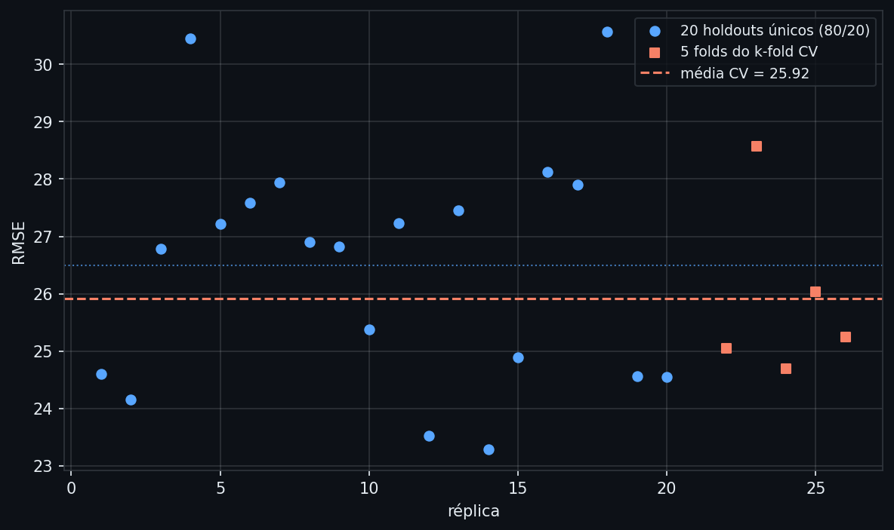
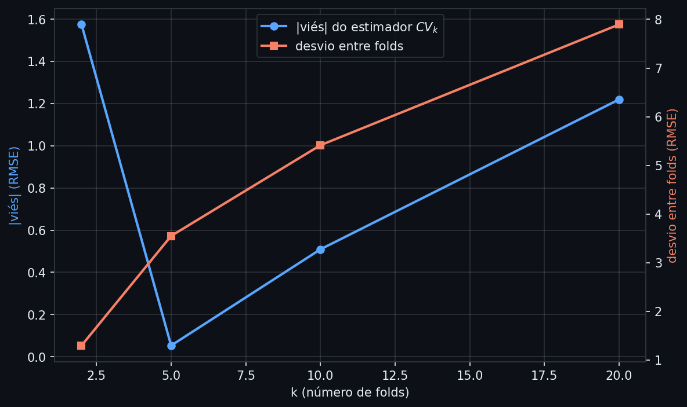
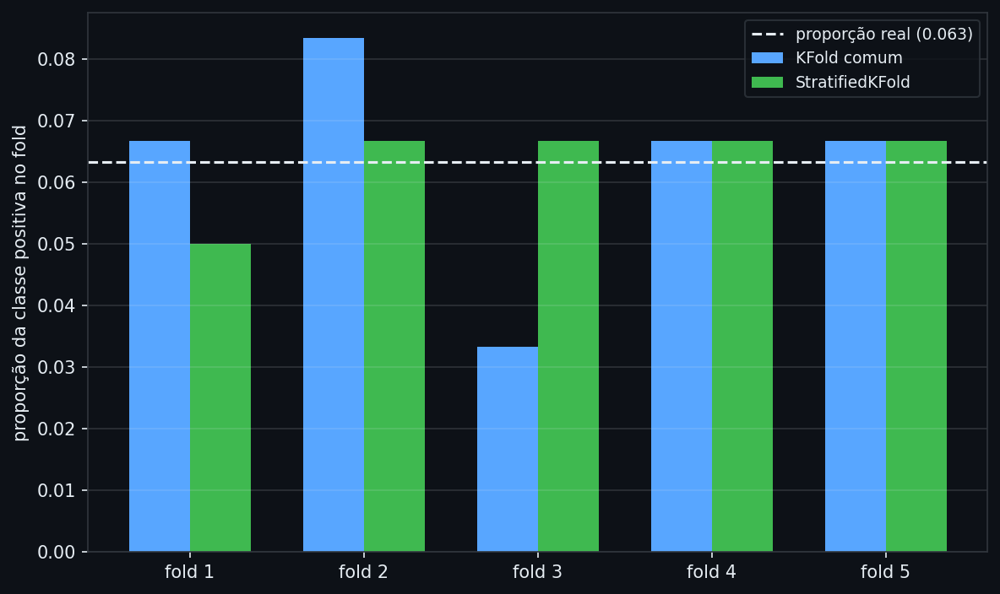

# Validação Cruzada

A nota anterior mostrou como estimar um parâmetro de uma distribuição conhecida (a probabilidade de uma moeda, a média e a variância de uma Normal) e quantificar a incerteza dessa estimativa com um intervalo de confiança. Mas um modelo de machine learning não estima um parâmetro isolado de uma distribuição simples — ele ajusta dezenas ou milhares de parâmetros simultaneamente para minimizar erro num conjunto de dados específico. Isso levanta uma pergunta diferente: como saber se o desempenho desse modelo é real, ou se é só memorização dos dados que ele já viu?

Toda técnica deste repositório que envolve escolher algo — o $\lambda$ do Ridge, a profundidade de uma árvore, o $k$ do KNN, o número de rounds de um boosting — depende de uma resposta para essa pergunta. Sem ela, o procedimento natural seria treinar o modelo e medir o erro nos mesmos dados de treino — e esse erro é sistematicamente otimista, porque o modelo teve a chance de se ajustar ao ruído específico daquela amostra. Um modelo de crédito avaliado dessa forma pode parecer excelente em teste interno e falhar silenciosamente no primeiro mês em produção, quando enfrenta clientes que nunca fizeram parte do treino.

---

## Intuição

Imagine avaliar um novo modelo de crédito medindo o erro dele nos mesmos dados usados para treiná-lo. É como um aluno corrigindo sua própria prova com o gabarito que ele mesmo escreveu depois de ver as perguntas — mesmo um aluno que decorou respostas específicas, sem entender nada, tira nota alta. A correção só é informativa quando aplicada a perguntas que o aluno nunca viu. Para um modelo, a solução equivalente é separar uma fatia dos dados, nunca mostrá-la durante o treino, e medir o erro só nela.

Mas uma única fatia separada (um único *holdout*) tem seu próprio problema: e se essa fatia específica, por acaso, tiver um perfil atípico de clientes — todos de uma região, ou uma sequência de sorte? A nota de desempenho estimada dependeria de qual fatia calhou de ser separada, e uma fatia diferente daria um número diferente. A **validação cruzada** resolve isso revezando qual fatia fica de fora: divide-se os dados em $k$ partes, treina-se em $k-1$ delas e testa-se na parte restante, repetindo até que cada parte tenha sido a parte de teste exatamente uma vez — depois, calcula-se a média dos $k$ resultados.

A pergunta que guia o resto desta nota: como formalizar exatamente esse procedimento, quantas partes usar, e o que pode dar errado na forma "óbvia" de dividir os dados.

## Definição formal

Dado um conjunto de dados $D = \{(x_i, y_i)\}_{i=1}^n$, o **k-fold cross-validation** segue três passos:

1. Particione $D$ em $k$ subconjuntos disjuntos e aproximadamente do mesmo tamanho — os *folds* $D_1, \ldots, D_k$
2. Para $j = 1, \ldots, k$: treine o modelo em $D \setminus D_j$ (todos os folds exceto o $j$-ésimo) e avalie no fold $D_j$, obtendo um score $s_j$ (AUC, RMSE, F1 — a métrica do problema em questão)
3. Reporte a média dos $k$ scores como estimativa de desempenho:

$$\text{CV}_k = \frac{1}{k}\sum_{j=1}^{k} s_j$$

$\text{CV}_k$ é, ele mesmo, um **estimador** — no mesmo sentido formal da nota anterior: uma função dos dados observados que produz um palpite, aqui para o erro de generalização do modelo, não para um parâmetro de distribuição. E como todo estimador, tem viés e variância próprios:

**Viés de $\text{CV}_k$.** Cada um dos $k$ modelos treinados nos passos acima usa apenas uma fração $(k-1)/k$ dos dados — menos do que o modelo final, que será treinado com 100% dos dados disponíveis. Um modelo treinado com menos dados tende a ter erro um pouco maior; por isso $\text{CV}_k$ tende a **superestimar** o erro do modelo final. Esse viés pessimista diminui conforme $k$ cresce, porque $(k-1)/k \to 1$.

**Variância de $\text{CV}_k$.** Os $k$ scores $s_1, \ldots, s_k$ não são independentes entre si — os conjuntos de treino de folds diferentes compartilham a maior parte das observações. Esse mesmo fenômeno já apareceu na fórmula de variância do bagging: a variância de uma média de termos correlacionados não cai proporcionalmente a $1/k$ como cairia se os termos fossem independentes. Quanto mais os folds se sobrepõem — o que acontece quando $k$ é grande —, mais correlacionados ficam os $k$ modelos treinados, e menos a média ganha em estabilidade ao aumentar $k$.

Esses dois efeitos empurram em direções opostas: $k$ pequeno reduz a sobreposição entre folds (menos correlação, potencialmente menos variância no score agregado) mas aumenta o viés pessimista (cada modelo treina com bem menos dados); $k$ grande reduz o viés mas aumenta a correlação entre os folds. O caso extremo $k=n$ — cada fold contém uma única observação — tem nome próprio: **Leave-One-Out CV (LOOCV)**.

## Estimação: k-fold em código, e o problema do holdout único

```python
import numpy as np
from sklearn.datasets import make_regression
from sklearn.linear_model import LinearRegression
from sklearn.model_selection import train_test_split
from sklearn.metrics import mean_squared_error

X, y = make_regression(n_samples=200, n_features=10, noise=25, random_state=42)

rmses_holdout = []
for seed in range(20):
    X_tr, X_te, y_tr, y_te = train_test_split(X, y, test_size=0.2, random_state=seed)
    model = LinearRegression().fit(X_tr, y_tr)
    rmses_holdout.append(mean_squared_error(y_te, model.predict(X_te)) ** 0.5)

rmses_holdout = np.array(rmses_holdout)
print(f"20 holdouts únicos (80/20): min={rmses_holdout.min():.2f}  max={rmses_holdout.max():.2f}  "
      f"média={rmses_holdout.mean():.2f}  desvio={rmses_holdout.std():.2f}")
```
```text
20 holdouts únicos (80/20): min=23.29  max=30.57  média=26.49  desvio=2.03
```
*Vinte holdouts diferentes do mesmo modelo, nos mesmos dados, produzem RMSEs entre 23,29 e 30,57 — uma diferença de 7 pontos dependendo unicamente de qual 20% dos dados calhou de virar teste. Reportar qualquer um desses números isoladamente como "o desempenho do modelo" é arbitrário.*

```python
from sklearn.model_selection import KFold

kf = KFold(n_splits=5, shuffle=True, random_state=42)
cv_scores = []
for tr_idx, te_idx in kf.split(X):
    m = LinearRegression().fit(X[tr_idx], y[tr_idx])
    cv_scores.append(mean_squared_error(y[te_idx], m.predict(X[te_idx])) ** 0.5)

cv_scores = np.array(cv_scores)
print(f"5-fold CV: média={cv_scores.mean():.2f}  desvio entre folds={cv_scores.std():.2f}")
```
```text
5-fold CV: média=25.92  desvio entre folds=1.40
```
*A média do 5-fold CV (25,92) usa os mesmos dados uma única vez cada — todo ponto aparece exatamente uma vez em algum conjunto de teste — e o desvio entre os 5 scores (1,40) já é menor que o desvio entre os 20 holdouts independentes (2,03): a estimativa agregada é mais estável que qualquer holdout isolado.*


*Os pontos azuis são 20 holdouts únicos do mesmo modelo — a dispersão vertical mostra o quanto o RMSE reportado depende de qual fatia virou teste. Os quadrados laranjas são os 5 scores do k-fold CV; a linha tracejada é a média deles (25,92), a estimativa que de fato se reporta.*

`shuffle=True` embaralha as observações antes de dividir em folds — essencial quando os dados vêm ordenados (por data, por categoria), pois sem embaralhar um fold poderia conter só um tipo de observação. `cross_val_score` do scikit-learn encapsula exatamente esse loop, sem alterar a lógica.

O experimento acima usou $k=5$ sem justificar a escolha. Isso levanta a pergunta natural: por que 5, e não 2, 10 ou $n$?

## Interpretação

Repetindo o experimento anterior centenas de vezes — com amostras de treino novas a cada repetição e um conjunto de teste gigante e fixo para medir o "erro real" de generalização — é possível observar o viés e a variância de $\text{CV}_k$ separadamente, para diferentes valores de $k$:

```python
X_pop, y_pop = make_regression(n_samples=200_000, n_features=10, noise=25, random_state=0)
X_huge_test, y_huge_test = X_pop[100_000:], y_pop[100_000:]

rng = np.random.default_rng(123)
ks = [2, 5, 10, 20]
cv_estimates = {k: [] for k in ks}
fold_stds = {k: [] for k in ks}
erros_reais = []

for _ in range(300):
    idx = rng.choice(100_000, size=100, replace=False)
    X_train, y_train = X_pop[idx], y_pop[idx]
    modelo_final = LinearRegression().fit(X_train, y_train)
    erros_reais.append(mean_squared_error(y_huge_test, modelo_final.predict(X_huge_test)) ** 0.5)

    for k in ks:
        fold_scores = []
        for tr_idx, te_idx in KFold(n_splits=k, shuffle=True, random_state=42).split(X_train):
            m = LinearRegression().fit(X_train[tr_idx], y_train[tr_idx])
            fold_scores.append(mean_squared_error(y_train[te_idx], m.predict(X_train[te_idx])) ** 0.5)
        cv_estimates[k].append(np.mean(fold_scores))
        fold_stds[k].append(np.std(fold_scores))

erro_real_medio = np.mean(erros_reais)
for k in ks:
    vies = np.mean(cv_estimates[k]) - erro_real_medio
    print(f"k={k:<4} viés={vies:+.3f}  desvio entre folds={np.mean(fold_stds[k]):.2f}")
```
```text
k=2   viés=+1.575  desvio entre folds=1.30
k=5   viés=+0.053  desvio entre folds=3.55
k=10  viés=-0.509  desvio entre folds=5.42
k=20  viés=-1.220  desvio entre folds=7.90
```
*Com $k=2$, o viés pessimista é o maior (+1,58) — cada modelo treina com só metade dos dados, bem menos que os 100% do modelo final. O viés praticamente desaparece perto de $k=5$ e, nesta simulação específica, chega a inverter de sinal para $k$ maior — um lembrete de que a intuição de "viés sempre decrescente com $k$" é uma tendência média, não uma garantia em cada caso concreto. O padrão robusto e monotônico está na outra coluna: o desvio entre folds cresce continuamente com $k$, de 1,30 em $k=2$ até 7,90 em $k=20$ — cada fold de teste fica menor e os modelos treinados ficam mais parecidos entre si (mais correlacionados), então a média de scores ganha cada vez menos estabilidade.*


*A curva azul (viés absoluto) cai rapidamente e depois volta a subir — o ponto de viés mínimo nesta simulação está perto de $k=5$. A curva laranja (variabilidade entre folds) sobe de forma monótona e acentuada — o preço de aumentar $k$ é pago principalmente em variância, não em viés. É por isso que $k=5$ ou $k=10$, não LOOCV, é a escolha padrão na prática: LOOCV tem o menor viés possível, mas ao custo de uma variância bem maior entre os "folds" (cada um com uma única observação de teste).*

Escolher $k$ é, portanto, outro trade-off viés-variância — o mesmo tipo de compromisso que já apareceu na definição formal de um estimador e na arquitetura de ensembles. Mas viés e variância do estimador $\text{CV}_k$ não são o único jeito de a validação cruzada dar um número enganoso: a forma como os dados são divididos em folds também importa.

## Generalização

Quando a variável-alvo é uma classe rara — inadimplência de 5%, fraude de 1% —, dividir os dados em $k$ folds aleatoriamente pode, por acaso, concentrar quase todos os casos raros em um fold e deixar outro quase sem nenhum:

```python
from sklearn.datasets import make_classification
from sklearn.model_selection import StratifiedKFold

Xc, yc = make_classification(n_samples=300, n_features=10, weights=[0.95, 0.05], random_state=42)
print(f"Proporção real da classe positiva: {yc.mean():.3f}")

kf = KFold(n_splits=5, shuffle=True, random_state=42)
print("KFold comum:", [f"{yc[te].mean():.3f}" for _, te in kf.split(Xc, yc)])

skf = StratifiedKFold(n_splits=5, shuffle=True, random_state=42)
print("StratifiedKFold:", [f"{yc[te].mean():.3f}" for _, te in skf.split(Xc, yc)])
```
```text
Proporção real da classe positiva: 0.063
KFold comum: ['0.067', '0.083', '0.033', '0.067', '0.067']
StratifiedKFold: ['0.050', '0.067', '0.067', '0.067', '0.067']
```
*O KFold comum varia de 0,033 a 0,083 entre folds — mais que o dobro de diferença relativa — só por causa de como o sorteio caiu. Um fold com poucos casos positivos produz uma métrica de desempenho instável, calculada sobre uma amostra minúscula da classe que mais importa. `StratifiedKFold` preserva a proporção original em cada fold, mantendo-se muito mais próximo dos 0,063 reais.*


*As barras azuis (KFold comum) oscilam bem mais em torno da linha tracejada (proporção real) do que as barras verdes (StratifiedKFold). Em problemas de classe rara — típicos de crédito e fraude — usar `StratifiedKFold` em vez de `KFold` deveria ser o padrão, não uma opção.*

Estratificar generaliza a ideia central da validação cruzada — "cada fold deve ser representativo do problema todo" — para além do balanceamento de classes: em dados de série temporal, a mesma lógica proíbe embaralhar aleatoriamente, porque um fold de treino não pode conter observações futuras em relação ao fold de teste (validação out-of-time, já mencionada nas notas de árvores e ensembles). Em dados agrupados — várias observações do mesmo cliente ao longo do tempo —, o agrupamento (`GroupKFold`) garante que todas as observações de um mesmo cliente fiquem no mesmo fold, evitando que o modelo "veja" o cliente no treino e o reconheça no teste por vazamento de identidade, não por padrão real.

## Avaliação

Há um erro sutil e comum: usar a mesma validação cruzada para **escolher** um hiperparâmetro (o $k$ do KNN, a profundidade de uma árvore) e para **reportar** o desempenho final do modelo escolhido. O score da melhor combinação, dentre várias testadas, tende a estar inflado — não porque aquele hiperparâmetro seja realmente o melhor, mas porque, entre muitas tentativas, alguma vai parecer boa por acaso, um efeito do mesmo tipo de seleção mencionado na nota anterior sobre escolher o modelo de maior $R^2$ ajustado entre vários candidatos.

```python
from sklearn.model_selection import GridSearchCV
from sklearn.neighbors import KNeighborsClassifier
from sklearn.metrics import roc_auc_score

Xk, yk = make_classification(n_samples=300, n_features=20, n_informative=5,
                              n_redundant=10, flip_y=0.1, random_state=42)
param_grid = {"n_neighbors": [1, 3, 5, 7, 9, 11, 15, 21, 31, 51]}

# Ingênua: a mesma CV escolhe o k e reporta o próprio score da busca
grid_naive = GridSearchCV(KNeighborsClassifier(), param_grid, cv=5, scoring="roc_auc")
grid_naive.fit(Xk, yk)

# Aninhada: um loop externo nunca participa da escolha do k
outer_scores = []
for tr_idx, te_idx in KFold(n_splits=5, shuffle=True, random_state=1).split(Xk, yk):
    inner_grid = GridSearchCV(KNeighborsClassifier(), param_grid, cv=5, scoring="roc_auc")
    inner_grid.fit(Xk[tr_idx], yk[tr_idx])
    proba = inner_grid.best_estimator_.predict_proba(Xk[te_idx])[:, 1]
    outer_scores.append(roc_auc_score(yk[te_idx], proba))

print(f"Melhor k (CV ingênua): {grid_naive.best_params_['n_neighbors']}")
print(f"AUC da CV ingênua (escolhe k e reporta no mesmo loop): {grid_naive.best_score_:.3f}")
print(f"AUC da CV aninhada (outer loop nunca viu a escolha):   {np.mean(outer_scores):.3f}")
```
```text
Melhor k (CV ingênua): 31
AUC da CV ingênua (escolhe k e reporta no mesmo loop): 0.897
AUC da CV aninhada (outer loop nunca viu a escolha):   0.892
```
*A diferença aqui é pequena (0,897 vs. 0,892) porque o grid de valores de $k$ testados é modesto, mas o mecanismo é sistemático: quanto mais hiperparâmetros e combinações forem testados no mesmo loop que reporta o score final, maior a inflação otimista. A **CV aninhada** (nested CV) separa completamente as duas tarefas: um loop externo mede o desempenho, um loop interno — usando só os dados de treino do loop externo — escolhe o hiperparâmetro. O score do loop externo nunca participou de nenhuma decisão sobre o modelo, por isso é a estimativa honesta.*

## Premissas

**Independência entre observações.** Toda a lógica de particionar em folds pressupõe que embaralhar e redistribuir as observações não introduz vazamento de informação. Quando essa suposição falha — séries temporais, múltiplas observações do mesmo cliente — usar `KFold` ou `StratifiedKFold` padrão produz uma estimativa de desempenho otimista demais, porque o modelo é testado em pontos que compartilham informação com o treino.

**Tamanho da amostra relativo a $k$.** Com poucas observações e $k$ grande, cada fold de treino fica muito próximo do modelo final (bom para reduzir viés), mas cada fold de teste fica minúsculo, tornando cada $s_j$ individual extremamente ruidoso. $k=5$ ou $k=10$ é o intervalo padrão porque equilibra as duas pressões na maioria dos problemas — não porque seja teoricamente ótimo em todos os casos.

**CV escolhe hiperparâmetro, mas não substitui um conjunto de teste final.** Mesmo com CV aninhada bem feita, um conjunto de teste separado desde o início do projeto — nunca usado em nenhuma etapa de tuning — continua sendo a validação mais honesta antes de um modelo ir para produção, porque nenhum aspecto da modelagem (nem a escolha de features, nem a arquitetura) teve chance de se adaptar a ele.

**Custo computacional.** $k$-fold CV multiplica o tempo de treino por $k$; CV aninhada multiplica por $k_{\text{externo}} \times k_{\text{interno}} \times (\text{número de combinações testadas})$. Para modelos caros de treinar (redes neurais grandes, boosting com milhares de rounds), CV completa pode ser inviável — um único holdout bem escolhido, ou um número menor de folds, é uma concessão prática necessária.

## Na prática

```python
from sklearn.model_selection import cross_val_score

model = LinearRegression()
kf = KFold(n_splits=5, shuffle=True, random_state=42)  # o mesmo split da seção de Estimação
scores = cross_val_score(model, X, y, cv=kf, scoring="neg_root_mean_squared_error")
print(f"RMSE por fold: {-scores}")
print(f"RMSE médio: {-scores.mean():.3f} ± {scores.std():.3f}")
```
```text
RMSE por fold: [25.05 28.58 24.69 26.03 25.24]
RMSE médio: 25.917 ± 1.400
```
*`cross_val_score(cv=kf)` reproduz exatamente o loop manual da seção de Estimação — passar o mesmo objeto `KFold` garante os mesmos splits e o mesmo resultado. A vantagem de usar `cross_val_score` é não ter que escrever o loop à mão, e a facilidade de trocar a métrica (`scoring=`) ou o tipo de split (`cv=StratifiedKFold(...)`, `cv=GroupKFold(...)`) sem reescrever a lógica de treino. Passar apenas um inteiro em `cv=5` (sem `KFold` explícito) usa `shuffle=False` por padrão em regressão — os splits, e portanto os números, seriam diferentes dos mostrados aqui.*

Um guia rápido de qual estratégia usar:

| Situação | Estratégia |
|---|---|
| Classificação com classes desbalanceadas | `StratifiedKFold` — nunca `KFold` puro |
| Séries temporais | `TimeSeriesSplit` — treino sempre anterior ao teste, nunca embaralhar |
| Múltiplas observações por entidade (cliente, empresa) | `GroupKFold` — todas as observações da mesma entidade no mesmo fold |
| Ajustar hiperparâmetro e reportar desempenho final | CV aninhada, ou ao menos um conjunto de teste nunca usado no tuning |
| Poucos dados (n < ~100) | $k$ maior (10) ou LOOCV — o viés pessimista de $k$ pequeno pesa mais quando há pouco dado a perder |
| Muitos dados, modelo caro de treinar | $k$ menor (3-5), ou um único holdout bem dimensionado |

---

## Leitura recomendada

**KOHAVI, R.** *A Study of Cross-Validation and Bootstrap for Accuracy Estimation and Model Selection*. Proceedings of the 14th International Joint Conference on Artificial Intelligence (IJCAI), 1995. [→ PDF aberto (IJCAI)](https://www.ijcai.org/Proceedings/95-2/Papers/016.pdf)
Estudo em larga escala (mais de meio milhão de execuções) comparando validação cruzada e bootstrap para estimar acurácia e selecionar modelos — a referência clássica por trás da recomendação padrão de $k=10$ com estratificação.
