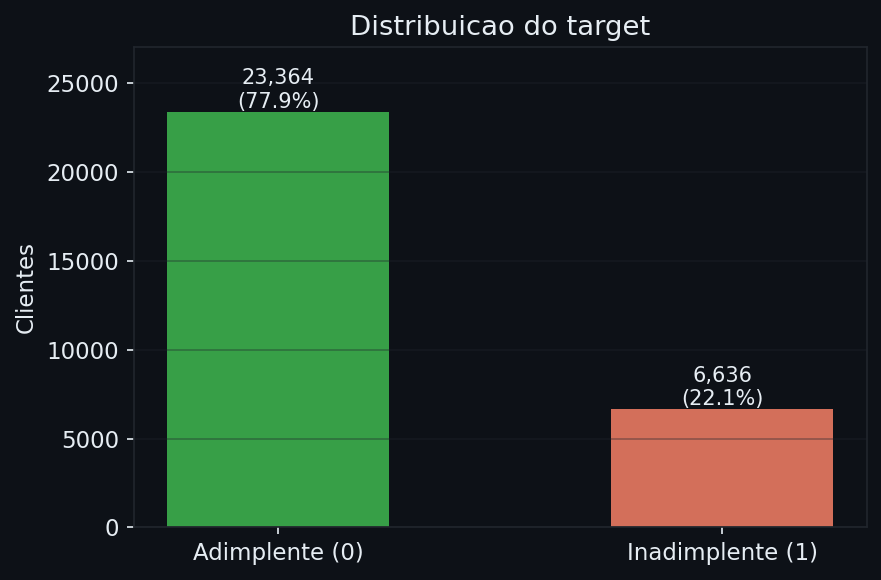
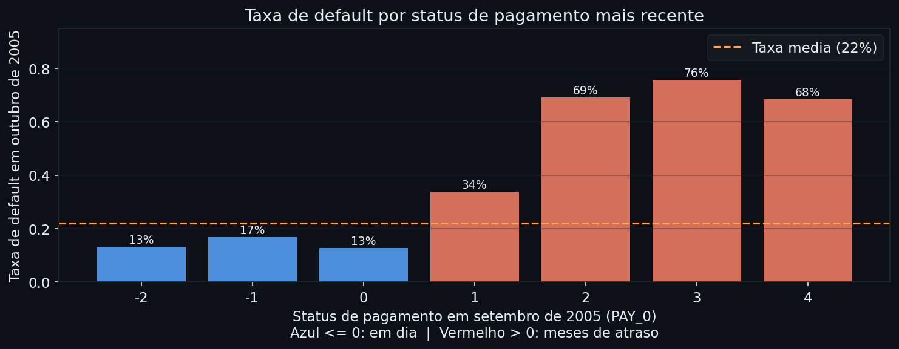
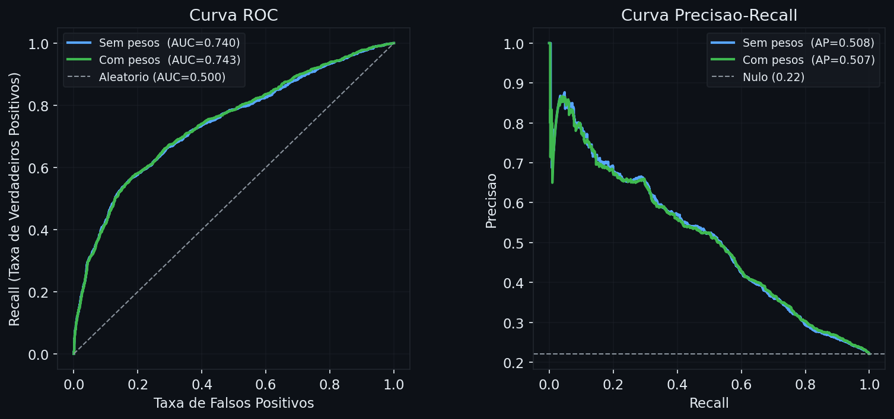
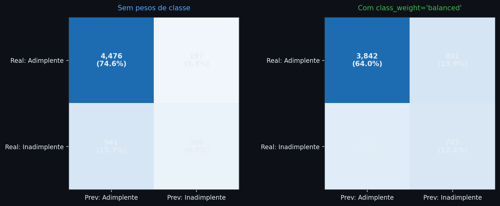
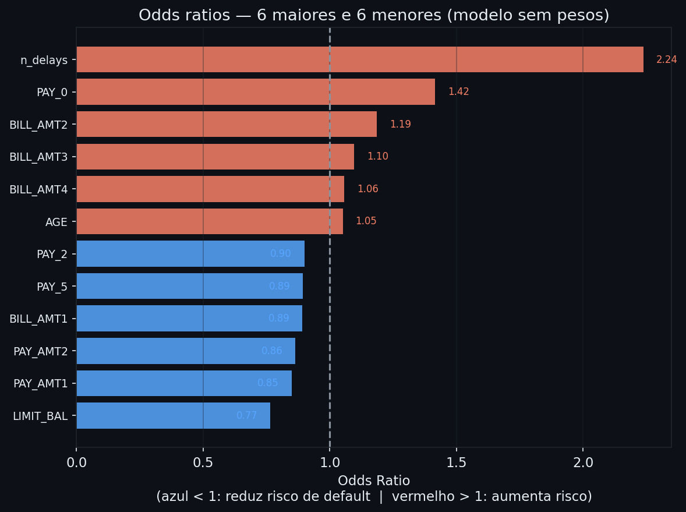

# Probabilidade de Default em Cartão de Crédito

**Módulo:** 01 — Machine Learning | **Análise:** 03 | **Data:** 2026-06-06

---

## Contexto

A [nota de regressão linear e logística](../notas/01_regressao_linear_logistica.md) cobriu o modelo logístico de ponta a ponta: estimação por MLE, interpretação por odds ratios, avaliação com AUC e matriz de confusão, efeito dos pesos de classe. Esta análise aplica esses conceitos em um problema real de risco de crédito bancário.

O dataset é o **Default of Credit Card Clients** (Yeh & Lien, 2009), disponível no [UCI Machine Learning Repository](https://archive.ics.uci.edu/dataset/350/default+of+credit+card+clients). Ele reúne dados de 30.000 clientes de cartão de crédito de Taiwan entre abril e setembro de 2005, com o objetivo de prever inadimplência em outubro do mesmo ano. É um dos benchmarks mais usados na literatura de credit scoring por reunir os desafios típicos do problema: variáveis comportamentais, desequilíbrio moderado de classes e necessidade de probabilidades calibradas.

## Pergunta de negócio

> **Quais características dos clientes predizem melhor a inadimplência no mês seguinte — e com que intensidade?**

## Estrutura da análise (CRISP-DM)

| Fase | O que fazemos |
|------|---------------|
| 1 — Entendimento do negócio | Contexto regulatório e definição da métrica de sucesso |
| 2 — Entendimento dos dados  | Carregamento, inspeção e EDA |
| 3 — Preparação dos dados    | Recodificação, engenharia de atributos, divisão e padronização |
| 4 — Modelagem               | Dois modelos logísticos com e sem pesos de classe |
| 5 — Avaliação               | AUC, curva PR, matrizes de confusão e odds ratios |
| 6 — Conclusão               | O que o modelo revela sobre risco de default |

```python
import pandas as pd
import numpy as np
import matplotlib
matplotlib.use('Agg')
import matplotlib.pyplot as plt
import ssl, urllib.request, io, zipfile
import warnings
warnings.filterwarnings('ignore')

ssl._create_default_https_context = ssl._create_unverified_context

from sklearn.linear_model import LogisticRegression
from sklearn.preprocessing import StandardScaler
from sklearn.model_selection import train_test_split
from sklearn.metrics import (roc_auc_score, roc_curve,
                              precision_recall_curve, average_precision_score,
                              confusion_matrix, classification_report)

BG    = '#0d1117'
BLUE  = '#58a6ff'
RED   = '#f78166'
GREEN = '#3fb950'
GRAY  = '#8b949e'
TEXT  = '#e6edf3'
GRID  = '#21262d'
GOLD  = '#ffa657'

plt.rcParams.update({
    'figure.facecolor': BG, 'axes.facecolor': BG,
    'axes.edgecolor': GRID, 'axes.labelcolor': TEXT,
    'xtick.color': TEXT, 'ytick.color': TEXT, 'text.color': TEXT,
    'grid.color': GRID, 'grid.alpha': 0.4,
    'legend.facecolor': '#161b22', 'legend.edgecolor': GRID,
    'legend.labelcolor': TEXT, 'font.size': 11,
})
```

## Fase 1 — Entendimento do Negócio

Em qualquer banco que opere sob Basileia II, a **Probabilidade de Default (PD)** é um insumo central: ela determina o capital regulatório mínimo exigido para cada exposição de crédito. Sob o IFRS 9, o aumento significativo da PD desde a originação é o gatilho para migração do Estágio 1 para o Estágio 2 — o que expande o horizonte de provisionamento de 12 meses para a vida inteira do ativo. Em ambos os contextos, o banco precisa de um modelo que estime probabilidades confiáveis por tomador, não apenas classifique binariamente.

O modelo que construiremos aqui é um **scorecard probabilístico**: para cada cliente, produz $\hat{p}$, a probabilidade estimada de default no mês seguinte. O objetivo principal é ranquear os clientes do mais arriscado ao menos arriscado com o máximo de separação possível — não acertar uma classificação binária.

Por isso a métrica de sucesso é a **AUC-ROC**, e não a acurácia. Acurácia é enganosa em dados desbalanceados: um modelo que prevê sempre "adimplente" acerta automaticamente 78% dos casos sem aprender nada. A AUC mede se o modelo atribui probabilidade maior ao inadimplente do que ao adimplente, para qualquer par aleatório de um e outro — isso captura exatamente o poder de ordenação por risco.

## Fase 2 — Entendimento dos Dados

### 2.1 Carregamento

```python
zip_url = 'https://archive.ics.uci.edu/static/public/350/default+of+credit+card+clients.zip'
raw_bytes = urllib.request.urlopen(zip_url).read()
with zipfile.ZipFile(io.BytesIO(raw_bytes)) as z:
    xls_name = [n for n in z.namelist() if n.endswith('.xls')][0]
    with z.open(xls_name) as f:
        df_full = pd.read_excel(io.BytesIO(f.read()), header=1)

df_full = df_full.drop(columns=['ID'], errors='ignore')
target_col = df_full.columns[-1]
X_raw = df_full.drop(columns=[target_col]).copy()
y_all = df_full[target_col].values

print(f"Observações : {len(X_raw):,}")
print(f"Atributos   : {X_raw.shape[1]}")
print(f"Valores nulos: {X_raw.isnull().sum().sum()}")
print()
print(pd.Series(y_all)
      .value_counts()
      .rename({0: 'Adimplente', 1: 'Inadimplente'})
      .to_string())
print(f"\nTaxa de default: {y_all.mean():.2%}")
```
    Observações : 30.000
    Atributos   : 23
    Valores nulos: 0

    Adimplente     23364
    Inadimplente    6636

    Taxa de default: 22.12%

*Sem valores nulos: não será necessária imputação. A taxa de default de 22% representa um desequilíbrio moderado — 3,5 adimplentes para cada inadimplente — suficiente para distorcer a acurácia e exigir atenção na avaliação e no treinamento.*

As variáveis estão organizadas em três grupos:

| Grupo | Variáveis | Descrição |
|-------|-----------|-----------|
| Demográficas | SEX, EDUCATION, MARRIAGE, AGE | Perfil do cliente |
| Financeiras | LIMIT_BAL | Limite de crédito total concedido (NT$) |
| Comportamentais | PAY\_0, PAY\_2–PAY\_6 | Status de pagamento nos últimos 6 meses (≤0 = em dia; 1–9 = meses de atraso) |
| Históricas | BILL\_AMT1–6 | Valor da fatura por mês (NT$) |
| Históricas | PAY\_AMT1–6 | Valor pago por mês (NT$) |

*Nota: não existe PAY\_1 no dataset. A sequência vai de PAY\_0 (setembro de 2005) para PAY\_2 (agosto de 2005), numeração original do dataset.*



*O gráfico confirma o desequilíbrio: 78% dos clientes são adimplentes. Esse padrão é típico em dados de cartão de crédito — a maioria honra suas dívidas. A consequência direta para a modelagem: um modelo sem ajuste tende a prever sempre a classe majoritária, especialmente para casos próximos da fronteira de decisão. Trataremos isso na Fase 4 com pesos de classe.*

### 2.2 Padrão de pagamento e default

A variável mais informativa antes de qualquer modelagem é o **status de pagamento mais recente** (PAY\_0). Calculando a taxa de default por valor de PAY\_0:

```python
df_pay0 = pd.DataFrame({'PAY_0': X_raw['PAY_0'].values, 'default': y_all})
taxa = (df_pay0
        .groupby('PAY_0')['default']
        .agg(['mean', 'count'])
        .rename(columns={'mean': 'taxa_default', 'count': 'n'})
        .query('n >= 50')
        .round(3))
print(taxa.to_string())
```
    PAY_0  taxa_default      n
       -2         0.132   2759
       -1         0.168   5686
        0         0.128  14737
        1         0.339   3688
        2         0.691   2667
        3         0.758    322
        4         0.684     76



*Clientes em dia (PAY\_0 ≤ 0) têm taxa de default entre 13% e 17% — perto da média. Com 1 mês de atraso, a taxa salta para 34%. Com 2 meses, atinge 69%. A descontinuidade é acentuada: um único mês de atraso mais que dobra o risco. Isso orienta a modelagem — o histórico de pagamento recente deve dominar o modelo.*

## Fase 3 — Preparação dos Dados

### 3.1 Recodificação e engenharia de atributos

O dicionário documenta EDUCATION com categorias 1 a 4, mas o dataset contém valores 0, 5 e 6 sem definição. O mesmo ocorre com MARRIAGE (valor 0). Ambos são agrupados em "outros":

```python
for v in [0, 5, 6]:
    X_raw.loc[X_raw['EDUCATION'] == v, 'EDUCATION'] = 4
X_raw.loc[X_raw['MARRIAGE'] == 0, 'MARRIAGE'] = 3

print(f"EDUCATION — categorias antes: {sorted(df_full['EDUCATION'].unique())}")
print(f"Após recodificação:           {sorted(X_raw['EDUCATION'].unique())}")
```
    EDUCATION — categorias antes: [0, 1, 2, 3, 4, 5, 6]
    Após recodificação:           [1, 2, 3, 4]

Em seguida, criamos um atributo que resume o histórico de atrasos dos últimos 6 meses:

```python
pay_status_cols = ['PAY_0', 'PAY_2', 'PAY_3', 'PAY_4', 'PAY_5', 'PAY_6']
X_raw['n_delays'] = (X_raw[pay_status_cols] > 0).sum(axis=1)

print(f"Atributos após engenharia: {X_raw.shape[1]}")
print(f"\nDistribuição de n_delays:")
print(X_raw['n_delays'].value_counts().sort_index().to_string())
```
    Atributos após engenharia: 24

    Distribuição de n_delays:
    0    22003
    1     4227
    2     2106
    3      895
    4      428
    5      188
    6       153

*`n_delays` conta em quantos dos últimos 6 meses o cliente teve algum atraso (PAY > 0). Um cliente com `n_delays = 0` nunca atrasou nenhum mês; com `n_delays = 6`, atrasou todos os 6 meses. Esse atributo sintetiza em uma dimensão o padrão de comportamento que as 6 variáveis PAY\_ capturam individualmente.*

### 3.2 Divisão e padronização

```python
X_train, X_test, y_train, y_test = train_test_split(
    X_raw, y_all, test_size=0.2, random_state=42, stratify=y_all)

scaler = StandardScaler()
X_tr = scaler.fit_transform(X_train)
X_te = scaler.transform(X_test)

print(f"Treino: {X_train.shape[0]:,} obs | {y_train.mean():.1%} default")
print(f"Teste : {X_test.shape[0]:,} obs  | {y_test.mean():.1%} default")
```
    Treino: 24.000 obs | 22.1% default
    Teste : 6.000 obs  | 22.1% default

*A divisão é estratificada: preserva 22.1% de inadimplentes em ambos os conjuntos. O `StandardScaler` é ajustado apenas no treino e depois aplicado ao teste — ajustá-lo no dataset inteiro introduziria data leakage, porque o modelo teria acesso à escala dos dados de avaliação durante o treino.*

## Fase 4 — Modelagem

A regressão logística com regularização L2 (Ridge logístico) é o ponto de partida natural para credit scoring: produz probabilidades calibradas pelo MLE, os coeficientes são interpretáveis via odds ratios e a penalidade L2 evita que coeficientes cresçam descontroladamente em preditores correlacionados — o que é relevante aqui, já que as 6 variáveis PAY\_ e o atributo `n_delays` derivado delas carregam informação parcialmente redundante.

Treinamos dois modelos com os mesmos hiperparâmetros ($C = 1$), diferenciados apenas pelo tratamento do desequilíbrio:

```python
m1 = LogisticRegression(C=1, max_iter=1000, random_state=42)
m1.fit(X_tr, y_train)
p1 = m1.predict_proba(X_te)[:, 1]

m2 = LogisticRegression(C=1, max_iter=1000, class_weight='balanced', random_state=42)
m2.fit(X_tr, y_train)
p2 = m2.predict_proba(X_te)[:, 1]

print(f"AUC — Modelo 1 (sem pesos): {roc_auc_score(y_test, p1):.3f}")
print(f"AUC — Modelo 2 (com pesos): {roc_auc_score(y_test, p2):.3f}")
```
    AUC — Modelo 1 (sem pesos): 0.740
    AUC — Modelo 2 (com pesos): 0.743

*Os dois modelos têm AUC praticamente idêntica. Isso faz sentido: a AUC é uma métrica de ranqueamento — ela avalia se o modelo coloca inadimplentes antes de adimplentes — e o ranqueamento relativo se preserva mesmo quando os coeficientes mudam. O `class_weight='balanced'` altera a fronteira de decisão (os $\hat{\boldsymbol{\beta}}$ estimados mudam, conforme discutido na nota), mas não altera significativamente quem o modelo considera mais ou menos arriscado em termos relativos.*

*O parâmetro $C$ controla a intensidade da regularização: $C = 1/\lambda$, então $C = 1$ é o valor padrão do scikit-learn. Ajustar $C$ via validação cruzada — o procedimento correto para produção — é o tema da [nota de regularização](../notas/02_regularizacao.md).*

## Fase 5 — Avaliação

### 5.1 Discriminação — curvas ROC e Precisão–Recall



*Na curva ROC (esquerda), as duas linhas se sobrepõem quase perfeitamente — mesma AUC, mesmo poder discriminativo. A referência é a diagonal cinza: um modelo aleatório (AUC = 0.5). AUC = 0.74 indica que, dados um inadimplente e um adimplente aleatórios, o modelo classifica o inadimplente com probabilidade maior em 74% das vezes.*

*Na curva Precisão–Recall (direita), a diferença aparece. Essa curva foca na classe minoritária e mostra o trade-off entre precisão (quantos dos alertados são de fato inadimplentes) e recall (quantos dos inadimplentes reais foram alertados). A linha tracejada é o desempenho do classificador nulo (prever sempre a taxa base, 0.22). Ambos os modelos superam o nulo, e o Modelo 2 sustenta uma precisão ligeiramente maior para altos valores de recall — exatamente onde importa para monitoramento de carteira.*

### 5.2 Decisões — matrizes de confusão

Aplicando o limiar padrão de $\tau = 0.5$, a diferença operacional entre os dois modelos se torna concreta:

```python
print("── Modelo 1 — sem pesos ──────────────────────────────────────────────")
print(classification_report(y_test, (p1 >= 0.5).astype(int),
                             target_names=['Adimplente', 'Inadimplente']))

print("── Modelo 2 — com class_weight='balanced' ────────────────────────────")
print(classification_report(y_test, (p2 >= 0.5).astype(int),
                             target_names=['Adimplente', 'Inadimplente']))
```
    ── Modelo 1 — sem pesos ──────────────────────────────────────────────
                  precision    recall  f1-score   support

      Adimplente       0.83      0.96      0.89      4673
    Inadimplente       0.66      0.29      0.40      1327

        accuracy                           0.81      6000

    ── Modelo 2 — com class_weight='balanced' ────────────────────────────
                  precision    recall  f1-score   support

      Adimplente       0.87      0.82      0.84      4673
    Inadimplente       0.47      0.56      0.51      1327

        accuracy                           0.76      6000



*As matrizes de confusão tornam os erros concretos. O Modelo 1 captura apenas 386 dos 1.327 inadimplentes reais — recall de 29%. Erra mais de 70% dos defaults. O Modelo 2 captura 747 inadimplentes — recall de 56%. Reduz os erros críticos (falsos negativos, clientes que entram em default sem serem sinalizados) em mais da metade, ao custo de aumentar os falsos positivos (adimplentes sinalizados incorretamente) de 197 para 831.*

*Em crédito, um falso negativo — não sinalizar um cliente que vai dar default — é sistematicamente mais caro do que um falso positivo — acionar uma análise extra para um bom pagador. O Modelo 2 é a escolha adequada para monitoramento de carteira. A queda de acurácia de 81% para 76% não representa piora: ela reflete que o modelo deixou de prever quase sempre a maioria e passou a errar de forma mais equilibrada.*

### 5.3 O que o modelo aprendeu — odds ratios

```python
feat_names = list(X_train.columns)
or_vals    = np.exp(m1.coef_[0])
df_or      = (pd.DataFrame({'feature': feat_names, 'or': or_vals})
              .sort_values('or', ascending=False))
```



*O atributo com maior odds ratio é `n_delays` (OR = 2.24): cada desvio padrão adicional no número de meses com atraso nos últimos 6 meses multiplica as chances de default por 2,24. O comportamento acumulado ao longo de vários meses é um sinal mais forte do que o atraso mais recente isolado — faz sentido que um cliente que atrasou sistematicamente seja mais arriscado do que aquele que atrasou apenas uma vez.*

*`PAY_0` (OR = 1.42) confirma que o status mais recente também pesa, mas com intensidade menor depois que `n_delays` absorve parte da mesma informação (os dois são correlacionados por construção).*

*`LIMIT_BAL` tem OR = 0.77: clientes com limite de crédito mais alto têm menor probabilidade de default. Isso não significa que limites altos protegem — significa que o banco historicamente concede mais crédito a clientes que demonstraram ser mais confiáveis. É um **efeito de seleção**, não de causalidade.*

*As variáveis demográficas (SEX, EDUCATION, MARRIAGE, AGE) têm OR muito próximos de 1 — efeito marginal. O risco de default está no comportamento financeiro recente, não no perfil cadastral.*

## Fase 6 — Conclusão

O modelo logístico com `class_weight='balanced'` é o mais adequado para monitoramento de carteira: captura 56% dos inadimplentes com um mês de antecedência, o que é suficiente para acionar alertas preventivos e ajustar limites antes do evento de default. Ele produz probabilidades calibradas — consequência direta do MLE — que podem ser usadas diretamente como estimativas de PD em sistemas de scoring regulatório.

O resultado central é econometricamente coerente: **comportamento de pagamento acumulado domina todo o resto**. O atributo engineerado `n_delays` supera PAY\_0 isolado, o que reforça que a consistência ao longo do tempo é mais preditiva do que um incidente pontual. O limite de crédito é inversamente relacionado ao default por seleção histórica do banco, e variáveis demográficas têm peso marginal — um resultado relevante sob óticas de equidade de crédito, dado que mostra que incluí-las acrescenta pouco e pode criar passivo regulatório.

**Limitações desta análise:**

- O dataset representa Taiwan em 2005; comportamentos de pagamento, condições econômicas e regulação diferem de outros mercados e períodos.
- Não há validação *out-of-time* — treinar em períodos anteriores e testar em posteriores, que é o padrão exigido em modelos de PD regulatórios para demonstrar estabilidade temporal.
- O hiperparâmetro $C$ não foi otimizado. A busca pelo $C$ ótimo via validação cruzada, descrita na [nota de regularização](../notas/02_regularizacao.md), tende a melhorar modestamente a AUC.
- A inclusão simultânea de `n_delays` e dos 6 atributos PAY\_ individuais gera colinearidade. Um próximo passo natural é testar o modelo apenas com `n_delays` e PAY\_0 para quantificar o quanto a informação individual acrescenta além do agregado.

---

## Leitura recomendada

**YEH, I-C.; LIEN, C.** *The comparisons of data mining techniques for the predictive accuracy of probability of default of credit card clients.* Expert Systems with Applications, v. 36, n. 2, p. 2473–2480, 2009.
Artigo original do dataset: compara regressão logística, análise discriminante, redes neurais e árvores no mesmo problema e documenta todas as variáveis.

**UCI MACHINE LEARNING REPOSITORY.** *Default of Credit Card Clients — Dataset 350.* [→ Link](https://archive.ics.uci.edu/dataset/350/default+of+credit+card+clients)
Página oficial com documentação, dicionário de variáveis e histórico de citações.
