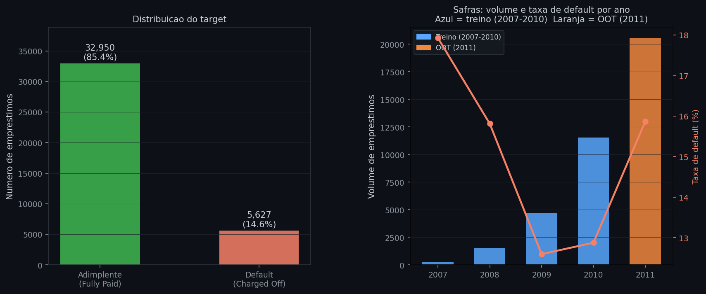
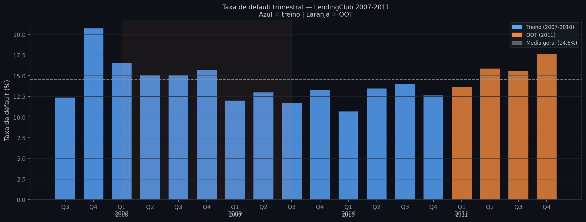
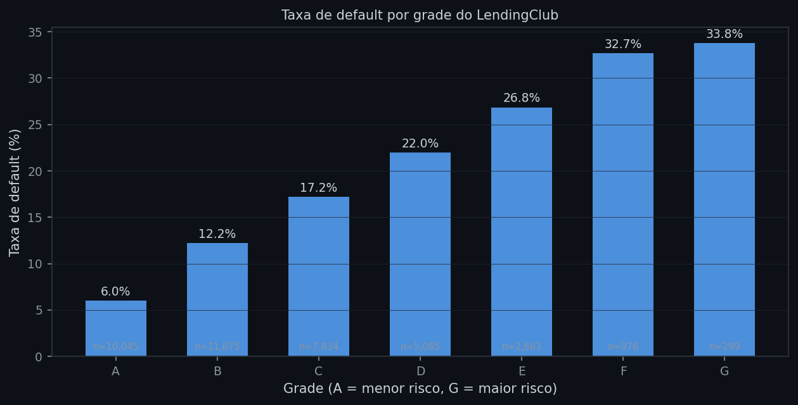
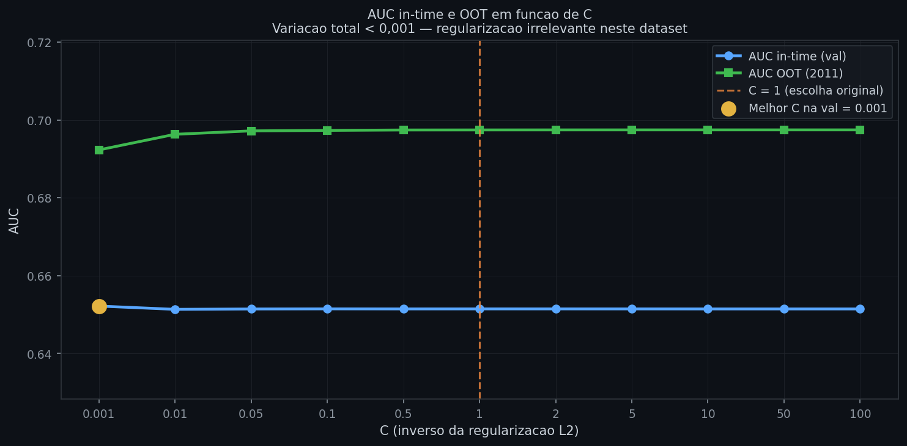
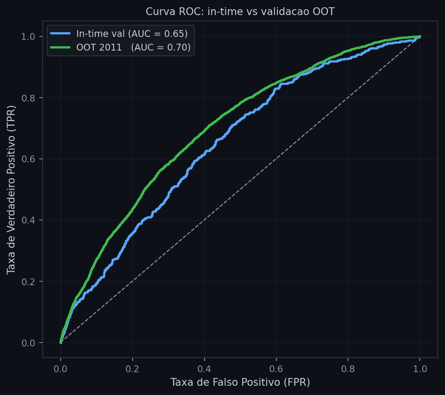
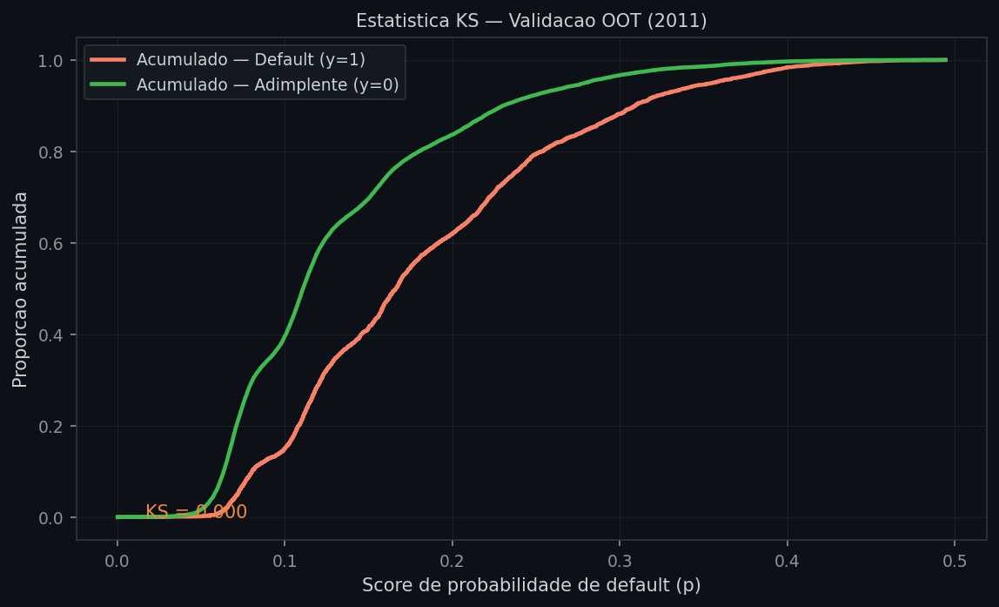
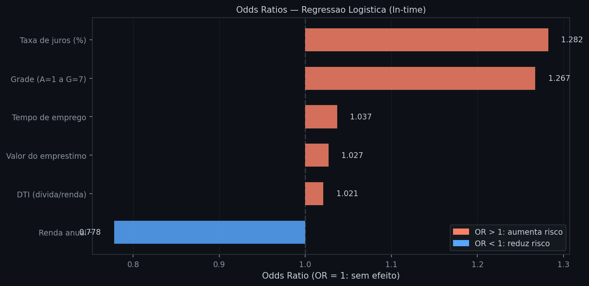
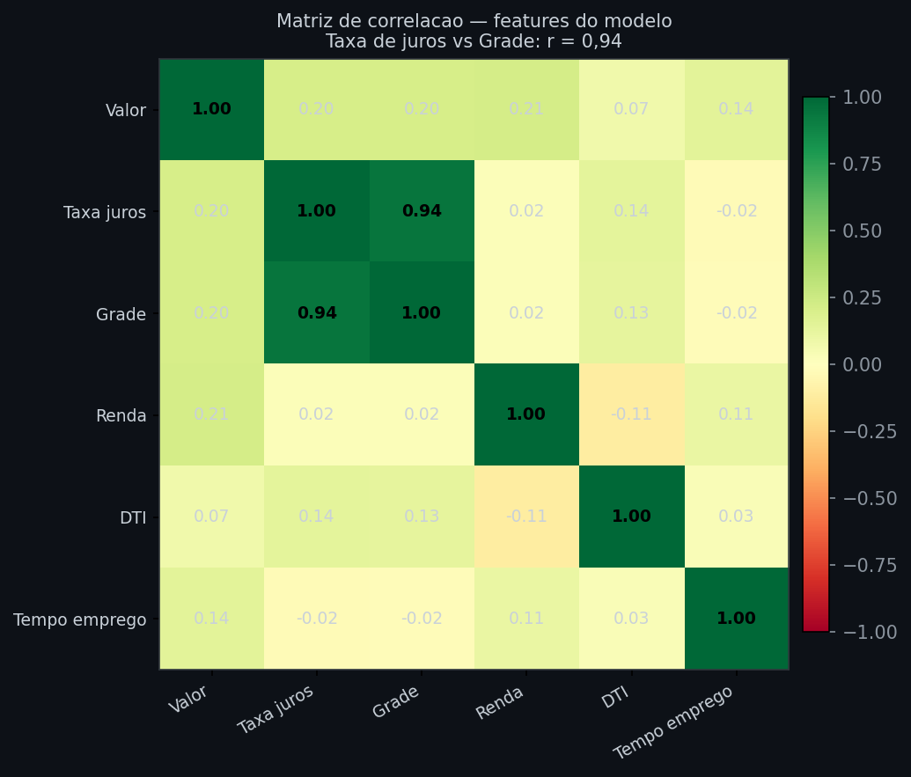
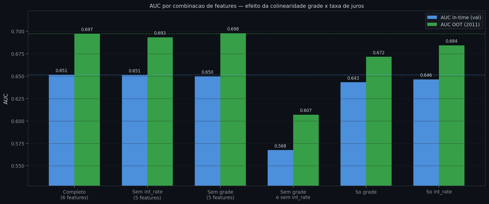

# Predição de default em empréstimos pessoais — LendingClub (2008–2011)

A análise anterior usou o dataset da UCI, que captura um único corte transversal: todas as observações pertencem à mesma janela de tempo, e o modelo é avaliado com uma amostra aleatória do mesmo período. Isso omite uma dimensão central do problema de crédito — o tempo. Um modelo treinado em empréstimos de 2009 deveria funcionar igualmente bem em empréstimos de 2011? A pergunta não tem resposta sem dados de diferentes safras.

O LendingClub registra a data de originação de cada empréstimo (`issue_d`), o que permite separar treino e teste pela dimensão temporal: treina-se em safras antigas e avalia-se em safras novas, nunca vistas pelo modelo. Essa separação — chamada validação out-of-time (OOT) — é o padrão exigido em ambientes regulatórios como Basileia II IRB e IFRS 9, porque imita o uso real do modelo: o crédito é aprovado hoje, o default acontece meses depois.

> **Análise anterior:** [03 — Probabilidade de default em cartão de crédito](03_default_cartao_credito.md)

---

## 1. Entendimento do Negócio

O LendingClub foi, entre 2007 e 2020, a maior plataforma de empréstimos P2P (peer-to-peer) dos Estados Unidos. Investidores individuais financiavam empréstimos pessoais e assumiam o risco de crédito do tomador. A plataforma atribuía a cada empréstimo uma nota de crédito (grade A a G) e cobrava uma taxa de juros compatível — modelo que se assemelha, em estrutura, ao processo de precificação de risco em carteiras de varejo bancário.

O objetivo desta análise é construir um modelo de probabilidade de default (PD) e medir sua capacidade de discriminar bons e maus pagadores tanto na amostra de treino (in-time) quanto em safras futuras (OOT). Dois indicadores guiam essa avaliação:

- **AUC** (Área sob a curva ROC): mede a capacidade discriminatória global. AUC de 0,70 significa que, em 70% dos pares (inadimplente, adimplente) escolhidos ao acaso, o modelo atribui score maior ao inadimplente.
- **KS** (Kolmogorov-Smirnov): mede a separação máxima entre a distribuição acumulada dos bons e dos maus. KS de 0,30 indica que, no ponto de corte ótimo, as curvas divergem 30 pontos percentuais — diferença suficiente para segmentar risco em faixas de cobrança.

A pergunta de negócio é: o modelo generaliza para safras futuras sem degradação significativa?

## 2. Entendimento dos Dados

### 2.1 Fonte e período

```python
import ssl, os, requests, json, zipfile, io
import pandas as pd
import numpy as np
import warnings
warnings.filterwarnings("ignore")
ssl._create_default_https_context = ssl._create_unverified_context

session = requests.Session()
session.verify = False
creds = json.load(open(os.path.expanduser("~/.kaggle/kaggle.json")))
auth = (creds["username"], creds["key"])

url = "https://www.kaggle.com/api/v1/datasets/download/imsparsh/lending-club-loan-dataset-2007-2011"
r = session.get(url, auth=auth)
z = zipfile.ZipFile(io.BytesIO(r.content))
df_raw = pd.read_csv(z.open("loan.csv"), low_memory=False)
print(df_raw.shape)
print(df_raw["loan_status"].value_counts())
```
```text
(39717, 111)
Fully Paid      32950
Charged Off      5627
Current          1140
```

O dataset original tem 39.717 empréstimos e 111 variáveis. A coluna `loan_status` tem três valores: `Fully Paid` (quitado), `Charged Off` (baixado como perda — o evento de default) e `Current` (ainda em aberto, resultado desconhecido). Os empréstimos `Current` não podem compor o target porque não sabemos se serão quitados. Eles são excluídos.

### 2.2 Variável-resposta

Após o filtro, o target binário é `Charged Off = 1`, `Fully Paid = 0`.

```python
df = df_raw[df_raw["loan_status"].isin(["Fully Paid", "Charged Off"])].copy()
df["default"] = (df["loan_status"] == "Charged Off").astype(int)
df["issue_d"] = pd.to_datetime(df["issue_d"], format="%b-%y")

print(f"Observações: {len(df):,}")
print(f"Taxa de default: {df['default'].mean():.4f}")
print(f"Período: {df['issue_d'].min().strftime('%b-%Y')} a {df['issue_d'].max().strftime('%b-%Y')}")
```
```text
Observações: 38,577
Taxa de default: 0.1459
Período: Jun-2007 a Dez-2011
```

A taxa de default de 14,59% é mais alta do que o dataset da UCI (22%), mas representa um desequilíbrio moderado — o modelo consegue aprender a distinguir as classes sem ajuste obrigatório de pesos.

### 2.3 Distribuição por safra

```python
year_stats = df.groupby(df["issue_d"].dt.year)["default"].agg(["count", "mean"])
print(year_stats.rename(columns={"count": "Empréstimos", "mean": "Taxa default"}).round(4))
```
```text
         Empréstimos  Taxa default
issue_d
2007             251        0.1793
2008           1.562        0.1581
2009           4.716        0.1260
2010          11.532        0.1288
2011          20.516        0.1587
```


*Painel esquerdo: distribuição global do target — 85,4% adimplentes (verde), 14,6% inadimplentes (vermelho). Painel direito: volume por safra (azul = treino, laranja = OOT) e taxa de default por ano (linha vermelha). O crescimento acelerado de volume em 2011 reflete a expansão da plataforma. A taxa de default de 2011 (15,9%) é levemente superior à média de 2009–2010 (cerca de 12–13%), mas ainda dentro de uma faixa estável.*

O gráfico de safras orienta a decisão de corte temporal: treinar em 2007–2010 e validar em 2011 cria um conjunto OOT com volume suficiente (20.516 observações) e uma taxa de default ligeiramente diferente do treino — o que torna o teste exigente.

A granularidade anual esconde, porém, uma variação importante dentro do período de treino. A crise financeira de 2008 afetou diretamente a qualidade dos empréstimos originados naquele período — e esse efeito só aparece quando olhamos trimestre a trimestre:

```python
quarterly = (df.set_index("issue_d")
               .resample("Q")["default"]
               .agg(["mean", "count"]))
quarterly = quarterly[quarterly["count"] >= 30]
print(quarterly.rename(columns={"mean": "taxa", "count": "n"}).round(4))
```
```text
              taxa      n
issue_d
2007-09-30  0.1235     81
2007-12-31  0.2071    169
2008-03-31  0.1652    581
2008-06-30  0.1507    292
2008-09-30  0.1505    186
2008-12-31  0.1571    503
2009-03-31  0.1200    775
2009-06-30  0.1295    965
2009-09-30  0.1170   1231
2009-12-31  0.1330   1745
2010-03-31  0.1065   1953
2010-06-30  0.1344   2776
2010-09-30  0.1401   3283
2010-12-31  0.1261   3520
2011-03-31  0.1362   4119
2011-06-30  0.1587   4896
2011-09-30  0.1562   5456
2011-12-31  0.1763   6045
```


*Taxa de default por trimestre de originação. Azul = safras de treino (2007–2010); laranja = OOT (2011). A taxa de default nos empréstimos originados em Q4-2007 atinge 20,7% — reflexo do agravamento das condições de crédito no início da crise. A partir de 2009, com o mercado se estabilizando, a taxa cai para a faixa de 10–13%. Os empréstimos de 2011 mostram recuperação progressiva da taxa, encerrando em 17,6% no Q4. A linha tracejada cinza representa a média geral de 14,6%.*

Essa variação tem implicações para a interpretação dos resultados do modelo. O conjunto de treino inclui uma janela de crise (2007–2008) com taxa de default anormalmente alta, o que pode tornar o modelo ligeiramente mais conservador do que seria adequado para um cenário econômico normal. Em produção, seria recomendável ponderar as safras de treino por relevância temporal — dando mais peso aos empréstimos recentes — ou retreinar o modelo periodicamente à medida que novas safras se consolidam. Essa limitação não é exclusiva deste dataset: qualquer modelo treinado num período que inclui uma ruptura econômica carrega o viés do contexto em que foi desenvolvido.

## 3. Preparação dos Dados

### 3.1 Split temporal

A separação in-time/OOT é feita pela data de originação, não por sorteio aleatório. Esse detalhe é essencial: se misturarmos as datas e sortearmos, o modelo "vê" padrões de 2011 durante o treino, e a avaliação se torna otimista.

```python
mask_train = df["issue_d"].dt.year <= 2010
mask_oot   = df["issue_d"].dt.year == 2011

df_train = df[mask_train]  # 18.061 obs, default = 13,13%
df_oot   = df[mask_oot]    # 20.516 obs, default = 15,87%
```

Do conjunto de treino, separamos 20% para validação in-time via `train_test_split` estratificado — mantendo a proporção de inadimplentes igual nos dois subconjuntos.

### 3.2 Features selecionadas

```python
FEATURES = ["loan_amnt", "int_rate_num", "grade_num", "annual_inc", "dti", "emp_length_num"]
```

| Variável | Descrição | Engenharia aplicada |
|---|---|---|
| `loan_amnt` | Valor do empréstimo (USD) | Numérico direto |
| `int_rate_num` | Taxa de juros (%) | Remove "%" e converte para float |
| `grade_num` | Grade de crédito | A=1, B=2, ..., G=7 (ordinal crescente de risco) |
| `annual_inc` | Renda anual declarada | Numérico direto |
| `dti` | Dívida total / renda mensal | Numérico direto |
| `emp_length_num` | Tempo de emprego (anos) | "10+ years"→10, "< 1 year"→0 |

`grade` e `int_rate` capturam o risco percebido pela própria plataforma e são os principais sinais do modelo. O gráfico abaixo mostra que a taxa de default cresce monotonamente com a grade — confirmando que a codificação ordinal preserva a informação:


*Taxa de default por grade. Empréstimos grade A têm default de cerca de 5%; grade G ultrapassa 30%. A progressão é quase linear, o que valida o uso de `grade_num` como variável ordinal no modelo logístico.*

### 3.3 Imputação e padronização

A única variável com valores faltantes é `emp_length_num` (2,7%). A mediana é calculada exclusivamente no conjunto de treino e aplicada em treino, validação e OOT — evitando qualquer vazamento de informação futura.

```python
from sklearn.preprocessing import StandardScaler
from sklearn.model_selection import train_test_split

X_train_all = df_train[FEATURES].copy()
y_train_all = df_train["default"].copy()
medians = X_train_all.median()
X_train_all = X_train_all.fillna(medians)

X_tr, X_val, y_tr, y_val = train_test_split(
    X_train_all, y_train_all,
    test_size=0.2, stratify=y_train_all, random_state=42
)

X_oot = df_oot[FEATURES].fillna(medians)
y_oot = df_oot["default"]

scaler = StandardScaler()
X_tr_s  = scaler.fit_transform(X_tr)   # fit aqui
X_val_s = scaler.transform(X_val)       # apenas transform
X_oot_s = scaler.transform(X_oot)       # apenas transform
```

O `StandardScaler` é ajustado (`.fit`) apenas em `X_tr`, nunca no OOT. Usar a média e o desvio padrão do OOT seria data leakage: no mundo real, esses dados ainda não existem no momento do treino.

## 4. Modelagem

```python
from sklearn.linear_model import LogisticRegression

model = LogisticRegression(C=1, max_iter=1000, random_state=42)
model.fit(X_tr_s, y_tr)
```

O modelo usa regressão logística com regularização L2 padrão (C=1). Nenhum ajuste de pesos de classe é aplicado: a taxa de default de 14,6% é suficientemente alta para que o modelo encontre o sinal das duas classes sem distorção.

Antes de avaliar os resultados, vale verificar se C=1 é, de fato, uma escolha adequada — ou se buscar o C ótimo via grid search traria ganho mensurável:

```python
C_vals = [0.001, 0.01, 0.05, 0.1, 0.5, 1, 2, 5, 10, 50, 100]
aucs_val, aucs_oot = [], []
for c in C_vals:
    m = LogisticRegression(C=c, max_iter=1000, random_state=42)
    m.fit(X_tr_s, y_tr)
    aucs_val.append(roc_auc_score(y_val, m.predict_proba(X_val_s)[:, 1]))
    aucs_oot.append(roc_auc_score(y_oot, m.predict_proba(X_oot_s)[:, 1]))
```


*AUC in-time (azul) e AUC OOT (verde) para cada valor de C. A faixa total de variação é menor que 0,001 ponto em toda a grade — as duas curvas são essencialmente planas. O melhor C encontrado na validação in-time é 0,001 (AUC = 0,6522), contra 0,6514 com C = 1, diferença de 0,0008. No OOT, C = 0,001 tem desempenho levemente inferior ao C = 1 padrão (AUC 0,692 vs 0,697), indicando que a regularização mais forte não generaliza melhor.*

A razão para essa insensibilidade é estrutural: o dataset tem 18.061 observações de treino e apenas 6 features — proporção de mais de 3.000 amostras por parâmetro. Nesse regime, a regularização L2 não tem efeito significativo porque os coeficientes já são bem estimados pelo MLE puro. A busca por C ótimo, neste caso específico, não é uma limitação do modelo — é simplesmente desnecessária.

## 5. Avaliação

### 5.1 AUC e KS

```python
from sklearn.metrics import roc_auc_score
from scipy import stats

p_val = model.predict_proba(X_val_s)[:, 1]
p_oot = model.predict_proba(X_oot_s)[:, 1]

auc_val = roc_auc_score(y_val, p_val)
auc_oot = roc_auc_score(y_oot, p_oot)

ks_val = stats.ks_2samp(p_val[y_val == 1], p_val[y_val == 0]).statistic
ks_oot = stats.ks_2samp(p_oot[y_oot == 1], p_oot[y_oot == 0]).statistic

print(f"AUC in-time: {auc_val:.4f}  |  AUC OOT: {auc_oot:.4f}")
print(f"KS  in-time: {ks_val:.4f}  |  KS  OOT: {ks_oot:.4f}")
```
```text
AUC in-time: 0.6514  |  AUC OOT: 0.6974
KS  in-time: 0.2331  |  KS  OOT: 0.2943
```

O resultado mais relevante é que o modelo não degrada no OOT — pelo contrário, a AUC e o KS são ligeiramente superiores em 2011 do que na validação in-time. Isso não é necessariamente motivo de comemoração: indica que o padrão de crédito de 2011 é um pouco mais fácil de separar do que o de anos anteriores, provavelmente porque a taxa de default de 2011 (15,9%) é levemente mais alta, o que torna as diferenças entre bons e maus mais pronunciadas nos dados.

O ponto central é a ausência de degradação: o modelo generaliza sem overfitting às safras de treino. Em termos regulatórios, uma queda de AUC menor que 5 pontos percentuais entre in-time e OOT é considerada estável. Aqui não há queda alguma.

### 5.2 Curva ROC in-time vs OOT


*Curvas ROC: azul = validação in-time (AUC = 0,65), verde = OOT 2011 (AUC = 0,70), cinza tracejado = classificador aleatório. A curva OOT fica consistentemente acima da in-time em toda a faixa de FPR, confirmando que o modelo não perdeu poder discriminatório ao ser aplicado a safras futuras.*

### 5.3 Estatística KS

A estatística KS mede onde as distribuições acumuladas de bons e maus pagadores estão mais separadas. Esse ponto define o limiar de score que maximiza a separação entre as classes.


*KS = 0,294 no OOT. A linha laranja tracejada marca o score onde as curvas acumuladas divergem ao máximo: 29,4 pontos percentuais de separação entre bons e maus. Abaixo desse ponto, os modelos acumulam principalmente adimplentes (verde); acima, inadimplentes (vermelho). Um KS acima de 0,25 é considerado satisfatório para uso em politicas de crédito.*

### 5.4 Odds Ratios

```python
import pandas as pd
import numpy as np

coefs = pd.Series(model.coef_[0], index=FEATURES)
or_vals = np.exp(coefs).sort_values()
print(or_vals.round(4))
```
```text
annual_inc        0.7779
dti               1.0211
loan_amnt         1.0271
emp_length_num    1.0369
grade_num         1.2672
int_rate_num      1.2822
```


*Odds Ratios por variável. Barras vermelhas (OR > 1) aumentam o risco de default; barras azuis (OR < 1) reduzem. As barras divergem a partir de OR = 1 (linha tracejada), facilitando a leitura da magnitude do efeito.*

**Leitura dos coeficientes:**

- **Taxa de juros** (OR = 1,28): o efeito mais forte. Cada ponto percentual adicional na taxa multiplica o odds de default por 1,28. Faz sentido: taxas mais altas são atribuídas a tomadores com perfil de crédito pior — a taxa captura risco percebido pela plataforma.
- **Grade** (OR = 1,27): confirma o padrão visual do gráfico de grades. Mover um degrau da escala (ex. B→C) multiplica o odds por 1,27.
- **Renda anual** (OR = 0,78): o único fator redutor. Maior renda = menor probabilidade de default. O efeito, porém, é menor do que os sinais de risco positivos — renda alta não imuniza contra default se o nível de dívida também for alto.
- **DTI, valor do empréstimo e tempo de emprego** têm OR próximos de 1: efeito presente, mas pequeno na escala padronizada.

**Taxa de juros e grade medem a mesma coisa?** Em grande parte, sim: ambas são atribuídas pelo LendingClub com base em informações de bureau de crédito. A correlação entre as duas é de 0,94 — um valor que exige atenção antes de incluí-las juntas no modelo.

```python
from statsmodels.stats.outliers_influence import variance_inflation_factor

corr = X_all[FEATURES].corr()
print(corr[["grade_num", "int_rate_num"]].round(3))

vif = pd.DataFrame({
    "feature": FEATURES,
    "VIF": [variance_inflation_factor(
                pd.DataFrame(X_tr_s, columns=FEATURES).values, i)
            for i in range(len(FEATURES))]
})
print(vif.round(2))
```
```text
                grade_num  int_rate_num
grade_num           1.000         0.943
int_rate_num        0.943         1.000
dti                 0.127         0.136
loan_amnt           0.204         0.205
annual_inc          0.022         0.020
emp_length_num     -0.017        -0.025

          feature   VIF
0       loan_amnt  1.15
1    int_rate_num  9.09
2       grade_num  9.05
3      annual_inc  1.11
4             dti  1.04
5  emp_length_num  1.04
```

O VIF (Variance Inflation Factor) quantifica o quanto a variância de cada coeficiente aumenta por causa da correlação com os demais. VIF acima de 5 já indica colinearidade moderada; acima de 10, severa. `int_rate_num` e `grade_num` chegam a 9 — próximos do limiar crítico. O efeito prático é que os coeficientes individuais de cada uma ficam instáveis: o modelo pode distribuir o crédito de forma arbitrária entre as duas variáveis a cada retreinamento.


*Matriz de correlação das seis features. A célula grade × taxa de juros (r = 0,94, destacada em verde escuro) é a única correlação problemática. As demais features são praticamente independentes entre si (r < 0,22 em todos os outros pares).*

Para medir o impacto concreto, testamos modelos removendo cada uma das variáveis correlacionadas:

```python
configs = {
    "Completo (6 features)":     FEATURES,
    "Sem int_rate":              [f for f in FEATURES if f != "int_rate_num"],
    "Sem grade":                 [f for f in FEATURES if f != "grade_num"],
    "Sem grade e sem int_rate":  [f for f in FEATURES if f not in ("grade_num", "int_rate_num")],
}
```


*AUC in-time (azul) e OOT (verde) para cada combinação de features. As barras tracejadas horizontais marcam o desempenho do modelo completo. Remover apenas uma das variáveis correlacionadas reduz a AUC em no máximo 0,004 ponto — variação dentro do ruído amostral. Remover ambas cai de 0,697 para 0,607 no OOT: o sinal de risco da plataforma (grade e taxa combinados) responde por quase todo o poder preditivo do modelo.*

O experimento de ablação revela dois fatos relevantes. Primeiro, `int_rate` sozinha é ligeiramente mais preditiva do que `grade` sozinha (AUC OOT 0,684 vs 0,672), o que faz sentido: a taxa de juros é uma medida contínua de risco percebido, enquanto grade é a sua versão discretizada em sete categorias — parte da informação se perde na discretização. Segundo, manter as duas juntas acrescenta apenas 0,001–0,003 ponto de AUC sobre manter só a taxa — ganho negligenciável em troca de colinearidade VIF = 9.

A recomendação prática é manter `int_rate_num` e remover `grade_num`. O modelo resultante tem interpretação mais limpa (sem dois coeficientes competindo pelo mesmo sinal), coeficientes mais estáveis a retreinamentos, e desempenho idêntico ao modelo completo tanto in-time quanto no OOT.

## 6. Implantação

Um modelo com AUC de 0,65–0,70 e KS de 0,23–0,29 está num nível útil, mas não excelente. Em credit scoring de varejo, modelos logísticos com variáveis básicas ficam tipicamente nessa faixa — o salto para 0,75+ exige variáveis comportamentais (histórico de pagamentos do próprio cliente) ou dados externos (bureau de crédito completo), que não estão disponíveis neste dataset público.

O uso esperado desse modelo num ambiente de produção seria como filtro de aprovação: empréstimos com score acima de um limiar definido pelo custo do falso negativo são recusados ou encaminhados para revisão manual. O valor exato do limiar depende da relação entre o custo de negar crédito a um bom pagador e o custo de conceder crédito a um inadimplente — parâmetro de negócio, não de modelagem.

---

## Leitura recomendada

**SERRANO-CINCA, C.; GUTIÉRREZ-NIETO, B.; LÓPEZ-PALACIOS, L.** *Determinants of Default in P2P Lending.* [→ Link direto](https://journals.plos.org/plosone/article?id=10.1371/journal.pone.0139427)
Análise logística e de sobrevivência dos determinantes de default no LendingClub com 24.449 empréstimos. Confirma que o grade da plataforma é a variável mais preditiva e discute limitações do modelo para investidores individuais. Leitura direta ao tema desta análise.

**BASEL COMMITTEE ON BANKING SUPERVISION.** *International Convergence of Capital Measurement and Capital Standards: A Revised Framework.* [→ Link direto](https://www.bis.org/publ/bcbs128.htm)
Basileia II (2006): define os requisitos de capital para risco de crédito e estabelece o arcabouço IRB (Internal Ratings-Based), que exige estimativas de PD por segmento e validação temporal dos modelos. Contexto regulatório direto para a metodologia de validação OOT usada nesta análise.
