# Árvore de Decisão para Default de Cartão de Crédito

**Módulo:** 01 — Machine Learning | **Análise:** 05 | **Data:** 2026-06-21

> **Análise anterior:** [03 — Probabilidade de default em cartão de crédito (regressão logística)](03_default_cartao_credito.md)

---

## Fase 1 — Entendimento do negócio

### Contexto

A análise 03 aplicou regressão logística ao **Default of Credit Card Clients** (Yeh & Lien, 2009) e respondeu quais variáveis predizem inadimplência e com que intensidade, via coeficientes e odds ratios. O modelo logístico impõe uma fronteira de decisão linear no espaço das variáveis: a probabilidade de default cresce ou cai monotonicamente com cada preditor, mantidos os demais constantes.

Esta análise aplica o mesmo dataset com **árvore de decisão** (CART — Classification and Regression Trees). O problema é de **classificação**: o target (`default.payment.next.month`) assume dois valores discretos — 0 (adimplente) e 1 (inadimplente). Uma árvore de classificação não requer que a relação entre preditor e target seja linear nem monótona: ela particiona o espaço de variáveis em regiões retangulares por meio de cortes binários sucessivos, e cada partição recebe uma previsão constante. O resultado final é um conjunto de regras do tipo `SE condição ENTÃO classe`, diretamente legíveis.

A comparação não é o objetivo desta análise. O objetivo é aplicar a árvore de decisão no mesmo problema de negócio e extrair o que o modelo revela sobre o risco de default neste dataset.

### Dataset

| Atributo | Valor |
|----------|-------|
| Fonte | UCI Machine Learning Repository |
| Referência | Yeh & Lien (2009) |
| Período de observação | Abril a setembro de 2005 (Taiwan) |
| Target | Default em outubro de 2005 (`default.payment.next.month`) |
| Observações | 30.000 clientes |
| Variáveis | 25 (ID + 23 preditores + target) |

**Grupos de variáveis disponíveis:**

| Grupo | Variáveis |
|-------|-----------|
| Limite de crédito | `LIMIT_BAL` |
| Demográficas | `SEX`, `EDUCATION`, `MARRIAGE`, `AGE` |
| Status de pagamento (abr–set/05) | `PAY_0`, `PAY_2`, `PAY_3`, `PAY_4`, `PAY_5`, `PAY_6` |
| Valor da fatura (abr–set/05) | `BILL_AMT1` a `BILL_AMT6` |
| Valor pago (abr–set/05) | `PAY_AMT1` a `PAY_AMT6` |

### Objetivo de negócio

Antecipar quais clientes de cartão de crédito irão inadimplir no mês seguinte, de modo que a instituição possa agir preventivamente — por meio de renegociação, bloqueio de limite ou revisão de concessão — antes que a perda se materialize.

### Pergunta de negócio

> **É possível identificar, com base no histórico de pagamentos e no perfil do cliente, quem vai inadimplir no próximo mês?**

### Critério de sucesso da mineração

| Métrica | Por que é adequada |
|---------|-------------------|
| AUC-ROC | Mede discriminação em todos os pontos de corte; permite comparação direta com a análise 03 |
| Matriz de confusão (threshold padrão 0,5) | Quantifica falsos negativos (inadimplentes classificados como adimplentes) e falsos positivos |
| Profundidade e estrutura da árvore | Avalia se o modelo aprendeu regras interpretáveis ou apenas memorizou o treino |

### Estrutura da análise (CRISP-DM)

| Fase | O que fazemos |
|------|---------------|
| 1 — Entendimento do negócio | Contexto, dataset, objetivo e métricas de sucesso *(esta seção)* |
| 2 — Entendimento dos dados | Carregamento, inspeção de tipos, distribuição do target e EDA das variáveis-chave |
| 3 — Preparação dos dados | Limpeza (tratar valores nulos, corrigir erros, etc), transformação e criação de novas variáveis (Feature Engineering). |
| 4 — Modelagem | Árvore CART com pré-poda (`min_samples_leaf`) e pós-poda por custo-complexidade (`ccp_alpha`); busca conjunta de hiperparâmetros e ajuste de `class_weight` para confirmar o ponto ótimo |
| 5 — Avaliação | ROC, Precision-Recall, matriz de confusão, otimização de threshold operacional, KS, Gini, calibração, feature importances, estrutura da árvore e resposta à pergunta de negócio |
| 6 — Implantação | Regras operacionais extraídas da árvore, explicabilidade para stakeholders e considerações de operacionalização |

---

## Fase 2 — Entendimento dos dados

O carregamento inicial inspeciona a estrutura bruta da base — dimensões, tipos de dado e presença de valores ausentes — antes de qualquer análise exploratória.

```python
import pandas as pd
import numpy as np

df = pd.read_csv('../../data/raw/UCI_Credit_Card.csv')
df.columns = df.columns.str.strip()

print(df.shape)
print(df.dtypes.value_counts())
print(df.isnull().sum().sum())
```

```text
(30000, 25)
float64    13
int64      12
dtype: int64
0
```

O dataset tem 30.000 linhas e 25 colunas, sem nenhum valor ausente. Todas as variáveis são numéricas — incluindo as categóricas (`SEX`, `EDUCATION`, `MARRIAGE`), que foram codificadas como inteiros no dataset original.

### Distribuição do target

O primeiro passo é verificar o equilíbrio entre as classes: desequilíbrio acentuado exige tratamento específico na modelagem.

```python
tgt = df['default.payment.next.month']
print(tgt.value_counts())
print('Taxa default:', round(tgt.mean() * 100, 2), '%')
```

```text
default.payment.next.month
0    23364
1     6636
Taxa default: 22.12 %
```

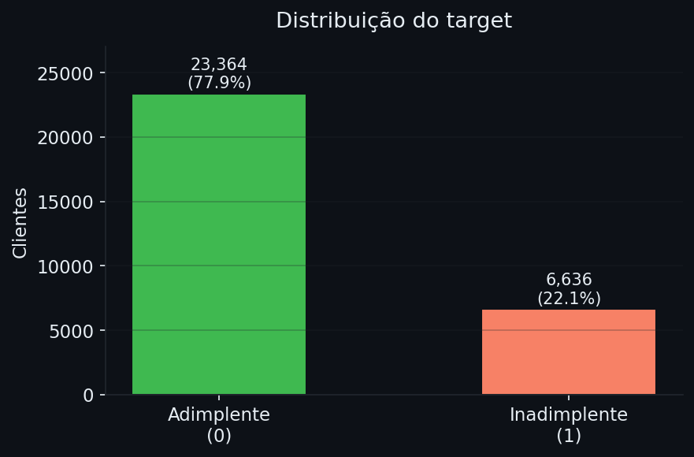

*77,9% dos clientes pagaram normalmente em outubro/05; 22,1% inadimpliram. O desequilíbrio existe mas não é extremo — a classe minoritária representa mais de 1 em cada 5 clientes.*

### Variáveis categóricas codificadas como inteiro

As variáveis `EDUCATION` e `MARRIAGE` contêm valores fora do dicionário:

```python
print(df['EDUCATION'].value_counts().sort_index())
print(df['MARRIAGE'].value_counts().sort_index())
```

```text
EDUCATION
0       14   ← não documentado
1    10585   (pós-graduação)
2    14030   (graduação)
3     4917   (ensino médio)
4      123   (outros)
5      280   (desconhecido)
6       51   (desconhecido)

MARRIAGE
0       54   ← não documentado
1    13659   (casado)
2    15964   (solteiro)
3      323   (outro)
```

Apenas `EDUCATION = 0` (14 registros) e `MARRIAGE = 0` (54 registros) estão fora do dicionário — 68 registros no total (0,2% da base). Essa decisão de tratamento será feita na fase de preparação.

### Status de pagamento — PAY_0 a PAY_6

As variáveis `PAY_0` a `PAY_6` registram o status de pagamento de setembro a abril de 2005. O dicionário define `-1` (pagou no prazo) e `1` a `9` (meses de atraso). Os dados contêm também os valores `0` e `-2`, não descritos no dicionário — presentes em todos os seis meses.

```python
pay_status = ['PAY_0','PAY_2','PAY_3','PAY_4','PAY_5','PAY_6']
for col in pay_status:
    print(df.groupby(col)[tgt].mean().round(3))
```

```text
          PAY_0   PAY_2   PAY_3   PAY_4   PAY_5   PAY_6
-2        0.132   0.183   0.185   0.193   0.197   0.200
-1        0.168   0.160   0.156   0.159   0.162   0.170
 0        0.128   0.159   0.175   0.183   0.189   0.188
 1        0.339   0.179   0.250   0.500     —       —
 2        0.691   0.556   0.516   0.523   0.542   0.507
 3        0.758   0.617   0.575   0.611   0.635   0.641
```

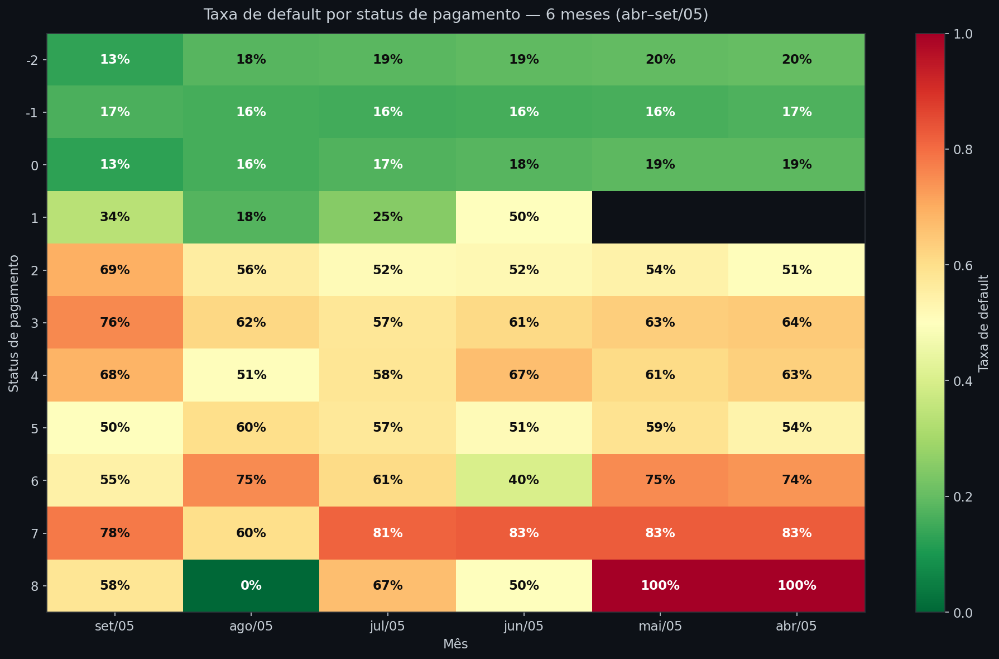

*O padrão é consistente nos 6 meses: atraso ≥ 2 meses sempre resulta em taxa de default acima de 50%. O sinal é mais forte no mês mais recente (PAY_0): o degrau entre 1 mês de atraso (33,9%) e 2 meses (69,1%) é o mais pronunciado de toda a série. Clientes sem atraso (status ≤ 0) ficam abaixo de 20% em todos os meses.*

### Trajetória temporal de pagamento

A análise por mês isolado revela o sinal individual de cada variável, mas não captura o padrão ao longo da série. Um cliente com dois meses de atraso pode ter trajetórias opostas: queda recente (de adimplente para atrasado nos últimos meses) ou recuperação (atrasado no passado, adimplente agora). A taxa de default difere substancialmente entre esses perfis.

Quatro trajetórias são definidas com base no status de setembro (PAY_0, mais recente) e abril (PAY_6, mais antigo):

```python
pay_cols = ['PAY_0','PAY_2','PAY_3','PAY_4','PAY_5','PAY_6']

def classifica_trajetoria(row):
    recente, remoto = row['PAY_0'], row['PAY_6']
    if (row[pay_cols] <= 0).all():
        return 'Sempre adimplente'
    elif recente >= 2 and remoto <= 0:
        return 'Degradacao recente'
    elif recente >= 2 and remoto >= 2:
        return 'Atraso persistente'
    elif recente <= 0 and remoto >= 2:
        return 'Recuperacao'
    else:
        return 'Padrao misto'

df['trajetoria'] = df[pay_cols].apply(classifica_trajetoria, axis=1)

def meses_consec_atraso_final(row):
    consec = 0
    for col in pay_cols:
        if row[col] >= 2: consec += 1
        else: break
    return consec

df['consec_atraso'] = df[pay_cols].apply(meses_consec_atraso_final, axis=1)

print(df.groupby('trajetoria')[tgt].agg(['mean','count','size']))
print(df.groupby('consec_atraso')[tgt].agg(['mean','count']))
```

```text
                    taxa_default      n      %base
Sempre adimplente         0.117  19.931   66,4%
Padrao misto              0.313   5.742   19,1%
Recuperacao               0.273   1.197    4,0%
Degradacao recente        0.649   1.881    6,3%
Atraso persistente        0.766   1.249    4,2%

Meses consecutivos de atraso (do mais recente):
consec_atraso  taxa_default      n
0                    0.166  26.870
1                    0.657     991
2                    0.648     403
3                    0.686     392
4                    0.654     243
5                    0.681     163
6                    0.774     938
```

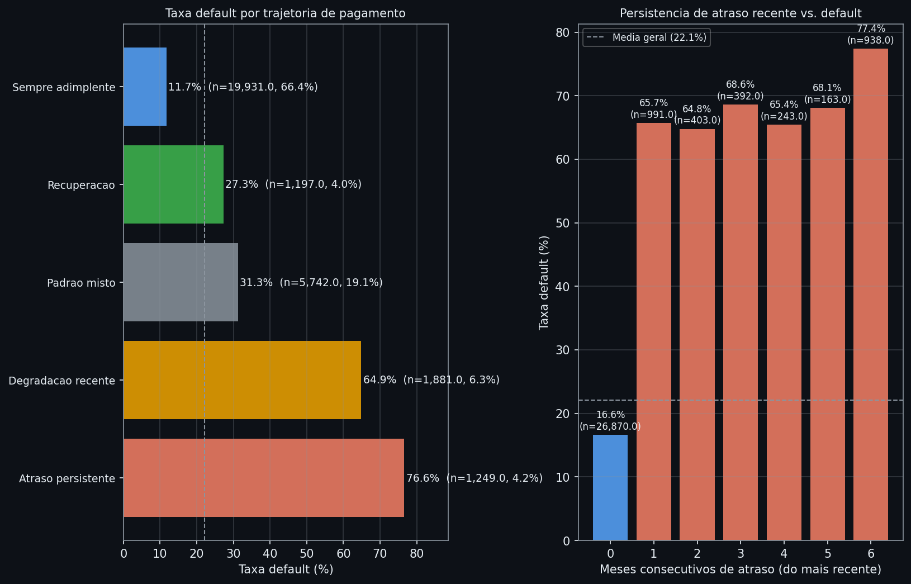

*À esquerda: 66,4% dos clientes nunca tiveram atraso — taxa de default de 11,7%. "Degradação recente" (PAY_0 ≥ 2 e PAY_6 ≤ 0, 6,3% da base) atinge 64,9%; "Atraso persistente" (ambos ≥ 2, 4,2% da base) atinge 76,6%. "Recuperação" (PAY_0 ≤ 0, PAY_6 ≥ 2) tem taxa de 27,3% — maior que o geral, mas bem abaixo dos em atraso ativo, confirmando que a reversão do comportamento reduz o risco. À direita: um único mês consecutivo de atraso recente eleva a taxa de 16,6% para 65,7% — salto de 49 p.p. Seis meses consecutivos (clientes que nunca saíram do atraso nos 6 meses) atingem 77,4%.*

### Limite de crédito — LIMIT_BAL

`LIMIT_BAL` tem 81 valores únicos — múltiplos de NT$10.000 atribuídos por faixas de política institucional.

```python
df['lim_q'] = pd.qcut(df['LIMIT_BAL'], 4, labels=['Q1','Q2','Q3','Q4'])
print(df.groupby('lim_q', observed=True)['default.payment.next.month'].mean().round(3))
```

```text
Q1    0.318   Q2    0.247   Q3    0.173   Q4    0.140
```

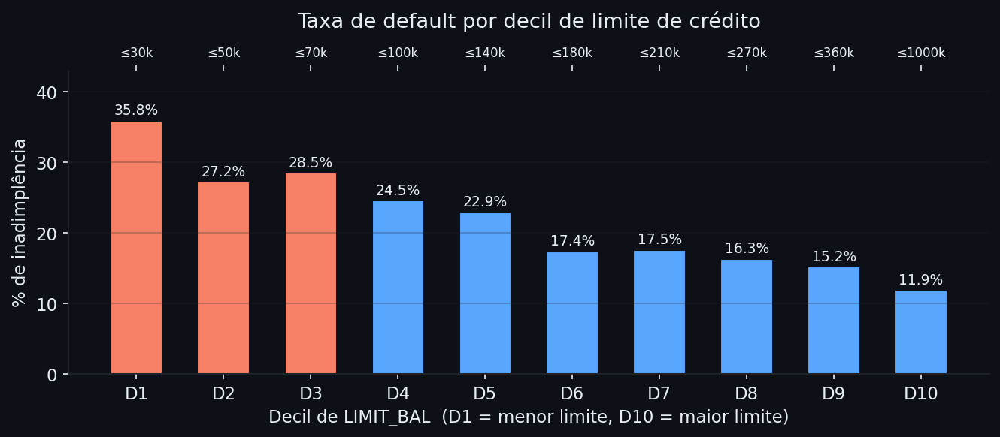

*A relação entre limite e inadimplência é monotônica: do primeiro quartil (Q1=31,8%) ao quarto (Q4=14,0%), a taxa cai de forma consistente em todos os degraus. Clientes no quartil inferior inadimplem mais do que o dobro dos do quartil superior.*

### Valor da fatura e valor pago — BILL_AMT e PAY_AMT

`BILL_AMT1–6` registram o saldo devedor mensal; `PAY_AMT1–6`, o valor efetivamente pago (abril–setembro/05). A mediana de `BILL_AMT` é similar entre classes em todos os meses (diferença máxima NT$2.935 em setembro) — discrimina pouco. O sinal relevante está na proporção de pagamentos zero:

```python
pay_cols  = [f'PAY_AMT{i}' for i in range(1,7)]
meses     = ['set/05','ago/05','jul/05','jun/05','mai/05','abr/05']

for col, mes in zip(pay_cols, meses):
    z0 = df[df[tgt]==0][col].eq(0).mean()*100
    z1 = df[df[tgt]==1][col].eq(0).mean()*100
    print(f'{mes}  adimplente zeros={z0:.1f}%  inadimplente zeros={z1:.1f}%')
```

```text
           adimplente zeros   inadimplente zeros
set/05          14,4%               28,4%
ago/05          15,4%               27,1%
jul/05          17,3%               29,1%
jun/05          18,9%               30,0%
mai/05          20,3%               29,7%
abr/05          21,8%               31,3%
```

A proporção de clientes com pagamento zero é consistentemente maior entre inadimplentes em todos os meses — diferença de ~10 pontos percentuais. Um zero em `PAY_AMT` não indica ausência de fatura: 3.495 clientes tinham `BILL_AMT1 > 0` e pagaram zero em setembro, e esse grupo inadimpliu em 39,8% dos casos.

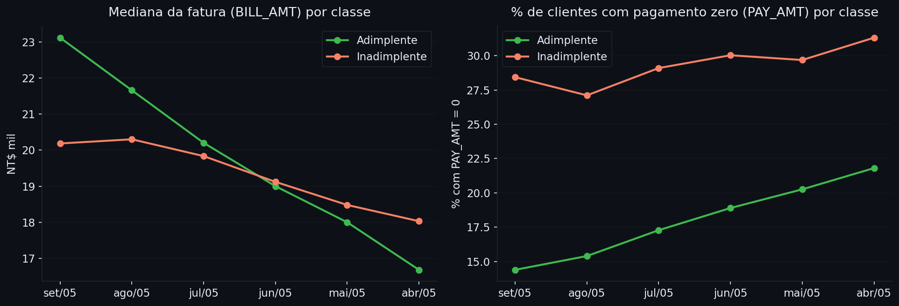

*À esquerda: a mediana da fatura é próxima entre adimplentes e inadimplentes em todos os meses — BILL_AMT sozinho discrimina pouco as classes. À direita: a proporção de zeros em PAY_AMT mantém uma diferença estável de ~10 p.p. entre as classes ao longo dos 6 meses, com inadimplentes pagando zero com mais frequência em todos os períodos.*

### Outliers em variáveis contínuas

Valores extremos podem introduzir splits espúrios em árvores de decisão — uma única observação com limite de NT$1.000.000 pode forçar um nó com n=1. O objetivo aqui é verificar se os extremos concentram risco distinto do núcleo da distribuição.

Usam-se os percentis P1 e P99 como limites: o que cai abaixo de P1 é extremo baixo; acima de P99, extremo alto. Para cada segmento calcula-se a taxa de default.

```python
for col in ['LIMIT_BAL', 'PAY_AMT1', 'PAY_AMT2', 'PAY_AMT3',
            'PAY_AMT4', 'PAY_AMT5', 'PAY_AMT6']:
    p1, p99 = df[col].quantile([0.01, 0.99])
    dr_core = df.loc[(df[col] >= p1) & (df[col] <= p99), tgt].mean()
    dr_high = df.loc[df[col] > p99, tgt].mean()
    n_high  = (df[col] > p99).sum()
    print(f'{col}: p99={p99:,.0f}  n_acima={n_high}  '
          f'dr_core={dr_core:.3f}  dr_acima_p99={dr_high:.3f}')
```

```text
LIMIT_BAL: p99=500.000  n_acima=206   dr_core=0.222  dr_acima_p99=0.112
PAY_AMT1:  p99= 66.522  n_acima=300   dr_core=0.223  dr_acima_p99=0.063
PAY_AMT2:  p99= 76.651  n_acima=300   dr_core=0.223  dr_acima_p99=0.080
PAY_AMT3:  p99= 70.000  n_acima=297   dr_core=0.222  dr_acima_p99=0.108
PAY_AMT4:  p99= 67.054  n_acima=300   dr_core=0.222  dr_acima_p99=0.113
PAY_AMT5:  p99= 65.608  n_acima=300   dr_core=0.222  dr_acima_p99=0.127
PAY_AMT6:  p99= 82.619  n_acima=300   dr_core=0.222  dr_acima_p99=0.133
Nota: P1 = 0 para todas as PAY_AMT (piso natural). Nenhum outlier no extremo baixo.
```

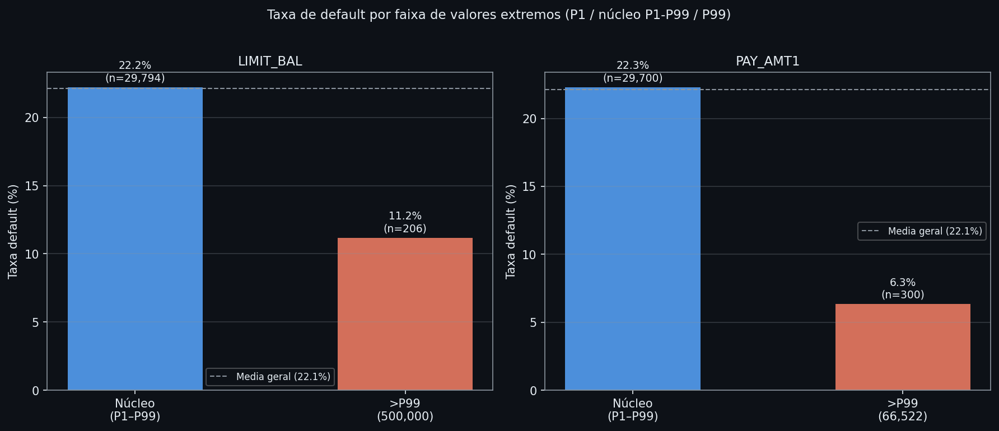

*O padrão é assimétrico: não há outliers no extremo baixo — `PAY_AMT` é naturalmente zerado para quem não paga, e `LIMIT_BAL` tem piso acima de P1. No extremo alto, os outliers são sistematicamente mais seguros: clientes com limite acima de NT$500k (0,7% da base) inadimplem 11,2% vs. 22,2% do núcleo; clientes que pagaram acima de NT$66k em setembro (1% da base) inadimplem apenas 6,3%. Esses valores extremos não representam ruído — são clientes genuinamente diferentes. A árvore aprenderá a segmentá-los por splits de alto limite ou alto pagamento, o que é comportamentalmente correto.*

### Correlação ponto-bisserial com o target

A correlação ponto-bisserial quantifica, para cada preditor, o quanto seus valores variam sistematicamente entre inadimplentes e adimplentes. É calculada aqui sobre o conjunto completo (30.000 clientes), antes da divisão treino-teste e sem engenharia de features — o objetivo é mapear o sinal bruto de cada variável original.

```python
from scipy.stats import pointbiserialr

predictors = df.drop(columns=[tgt])
corrs = {}
for col in predictors.columns:
    r, p = pointbiserialr(predictors[col], y)
    corrs[col] = (r, p)

for col in sorted(corrs, key=lambda c: abs(corrs[c][0]), reverse=True):
    r, p = corrs[col]
    sig = '' if p < 0.05 else '  [nao sig.]'
    print(f'{col:20s}  r={r:+.4f}  p={p:.2e}{sig}')
```

```text
PAY_0                 r=+0.3248  p=0.00e+00
PAY_2                 r=+0.2636  p=0.00e+00
PAY_3                 r=+0.2353  p=0.00e+00
PAY_4                 r=+0.2166  p=1.90e-315
PAY_5                 r=+0.2041  p=1.13e-279
PAY_6                 r=+0.1869  p=7.30e-234
LIMIT_BAL             r=-0.1535  p=1.30e-157
PAY_AMT1              r=-0.0729  p=1.15e-36
PAY_AMT2              r=-0.0586  p=3.17e-24
PAY_AMT4              r=-0.0568  p=6.83e-23
PAY_AMT3              r=-0.0563  p=1.84e-22
PAY_AMT5              r=-0.0551  p=1.24e-21
PAY_AMT6              r=-0.0532  p=3.03e-20
SEX                   r=-0.0400  p=4.40e-12
MARRIAGE              r=-0.0276  p=1.78e-06
EDUCATION             r=+0.0267  p=3.63e-06
BILL_AMT1             r=-0.0196  p=6.67e-04
BILL_AMT3             r=-0.0141  p=1.48e-02
BILL_AMT2             r=-0.0142  p=1.40e-02
AGE                   r=+0.0139  p=1.61e-02
BILL_AMT4             r=-0.0102  p=7.86e-02  [nao sig.]
BILL_AMT5             r=-0.0068  p=2.42e-01  [nao sig.]
BILL_AMT6             r=-0.0054  p=3.52e-01  [nao sig.]
```

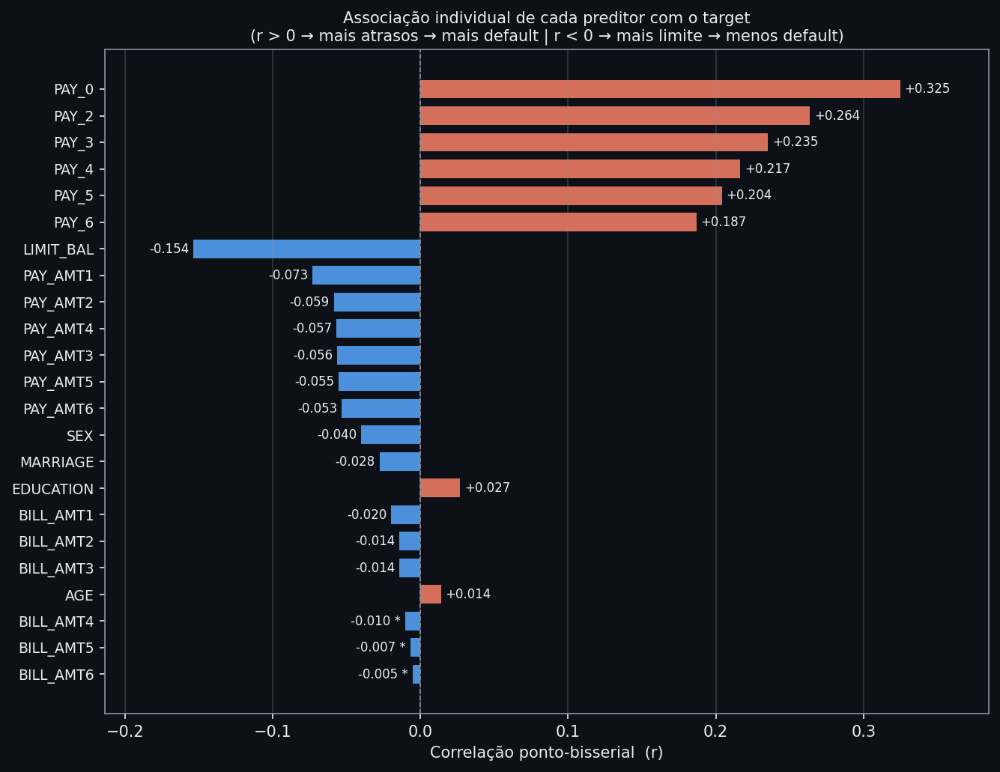

*O sinal está concentrado em comportamento recente e capacidade de crédito. As seis variáveis `PAY_0–PAY_6` lideram (r entre +0.19 e +0.32); `LIMIT_BAL` aparece em seguida (r = −0.15 — maior limite associado a menos default). O bloco `PAY_AMT` tem sinal modesto mas consistente (r ≈ −0.05 a −0.07). Todo o bloco `BILL_AMT` concentra-se na cauda: três das seis variáveis não atingem significância estatística. Demográficas (`SEX`, `MARRIAGE`, `EDUCATION`, `AGE`) têm efeitos mínimos — o maior é SEX com r = −0.04. Esse mapa de sinal orienta as decisões de feature engineering na Fase 3.*

### Variáveis demográficas

As variáveis `SEX`, `MARRIAGE` e `EDUCATION` são categóricas; `AGE` é contínua. O objetivo aqui não é descrever o perfil da base, mas verificar se essas variáveis têm associação relevante com o target — o que determinará se merecem atenção especial na modelagem.

Para variáveis categóricas, o qui-quadrado testa independência e o V de Cramér mede o tamanho do efeito (V < 0.10 = efeito negligenciável; V ≈ 0.30 = efeito moderado). Para `AGE`, é usada a correlação ponto-bisserial.

```python
from scipy.stats import chi2_contingency

for var in ['SEX', 'MARRIAGE', 'EDUCATION']:
    ct = pd.crosstab(df[var], y)
    chi2, p, dof, _ = chi2_contingency(ct)
    v = np.sqrt(chi2 / (len(df) * (min(ct.shape) - 1)))
    print(f'{var}: V={v:.4f}  p={p:.2e}')

r_age, p_age = pointbiserialr(df['AGE'], y)
print(f'AGE: r={r_age:+.4f}  p={p_age:.2e}')
```

```text
SEX:       V=0.0399  p=4.94e-12
MARRIAGE:  V=0.0306  p=7.79e-07
EDUCATION: V=0.0737  p=2.29e-33
AGE:       r=+0.0139  p=1.61e-02
```

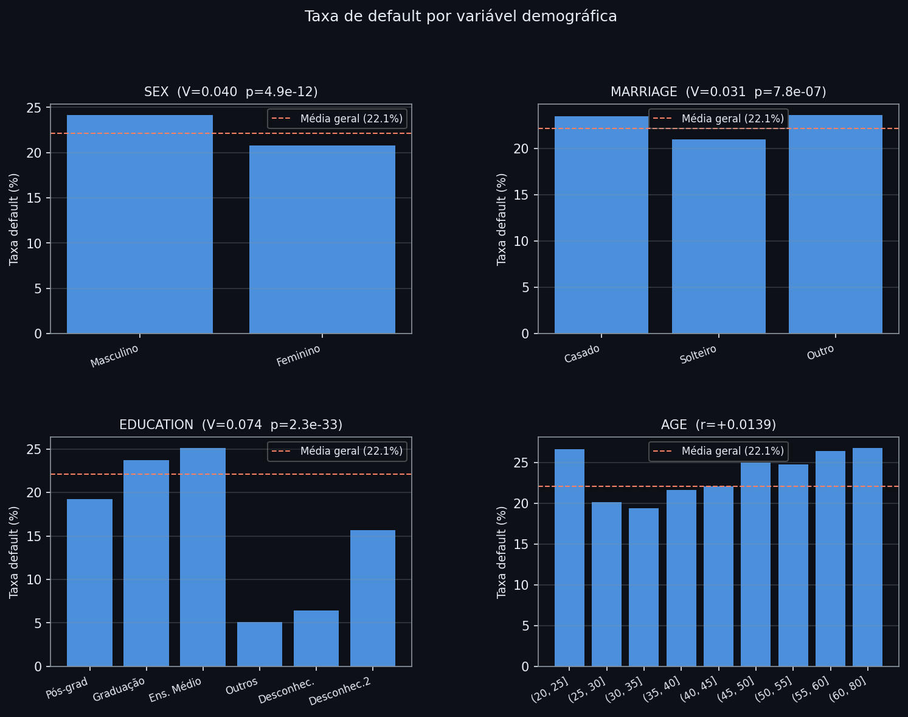

*Todos os testes atingem significância estatística — reflexo do n=30.000, não de efeito prático. O V de Cramér confirma: o maior efeito é `EDUCATION` (V=0.074), ainda negligenciável. As taxas de default variam pouco entre categorias: em `SEX`, a diferença é de 3,4 p.p.; em `MARRIAGE`, de 2,7 p.p.; em `AGE`, clientes acima de 60 anos inadimplem ~27% versus ~20% dos 30–40 anos, mas AGE não aparece entre os preditores relevantes pela correlação. Esse padrão é consistente com a literatura de credit scoring: histórico comportamental recente supera perfil demográfico como preditor de inadimplência.*

### Correlação entre preditores

Com o sinal individual mapeado, a etapa seguinte verifica redundância entre variáveis: correlação alta entre dois preditores indica que carregam informação equivalente e um deles pode ser descartado sem perda de sinal. A análise é feita nos 23 preditores originais, sobre o dataset completo, antes de qualquer engenharia de features.

```python
corr_m = df.drop(columns=[tgt]).corr().abs()
upper  = corr_m.where(np.triu(np.ones(corr_m.shape), k=1).astype(bool))
high   = upper.stack().reset_index()
high.columns = ['var1','var2','r']
print(high[high['r'] > 0.70].sort_values('r', ascending=False).to_string(index=False))
```

```text
     var1      var2      r
BILL_AMT1 BILL_AMT2  0.951
BILL_AMT5 BILL_AMT6  0.946
BILL_AMT4 BILL_AMT5  0.940
BILL_AMT2 BILL_AMT3  0.928
BILL_AMT3 BILL_AMT4  0.924
BILL_AMT4 BILL_AMT6  0.901
BILL_AMT2 BILL_AMT4  0.892
BILL_AMT1 BILL_AMT3  0.892
BILL_AMT3 BILL_AMT5  0.884
BILL_AMT1 BILL_AMT4  0.860
BILL_AMT2 BILL_AMT5  0.860
BILL_AMT3 BILL_AMT6  0.853
BILL_AMT2 BILL_AMT6  0.832
BILL_AMT1 BILL_AMT5  0.830
    PAY_4     PAY_5  0.820
    PAY_5     PAY_6  0.817
BILL_AMT1 BILL_AMT6  0.803
    PAY_3     PAY_4  0.777
    PAY_2     PAY_3  0.767
    PAY_4     PAY_6  0.716
```

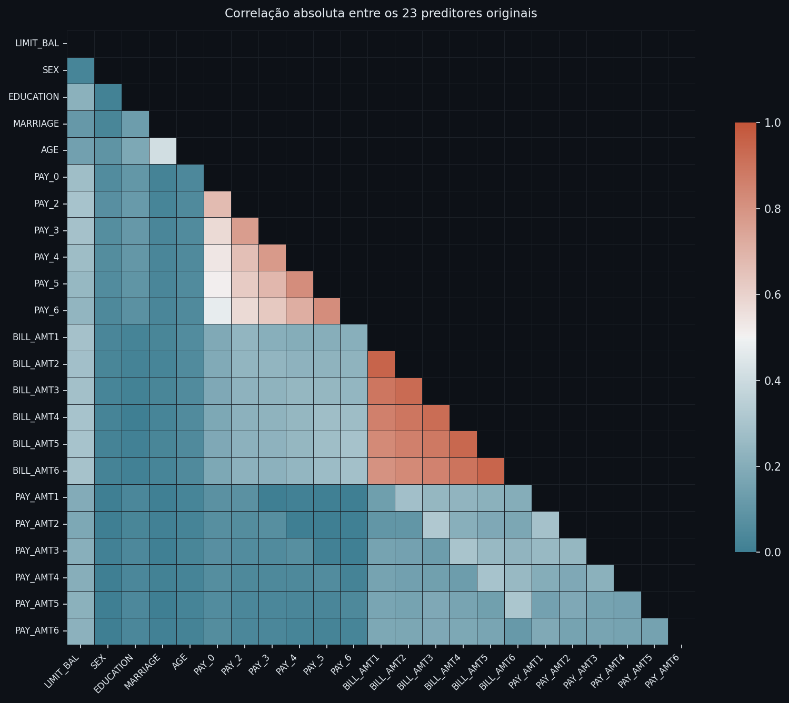

*Todos os 15 pares possíveis do bloco `BILL_AMT` têm r > 0,80. Essa colinearidade interna extrema, combinada com o sinal quase nulo com o target (r ≤ 0,023 e três variáveis não-significativas), torna o bloco inteiro candidato a remoção: há redundância máxima sem informação discriminante. Os pares `PAY_4–PAY_5` (0,82) e `PAY_5–PAY_6` (0,82) têm colinearidade elevada, mas sinal individual relevante (r ≈ 0,20), o que justifica mantê-los. `PAY_AMT` e demográficas não apresentam colinearidade relevante entre si.*

### Resumo dos pontos de atenção para a próxima fase

| Ponto | Decisão pendente |
|-------|-----------------|
| Categorias não documentadas em `EDUCATION` e `MARRIAGE` | Agrupar em "outros" ou manter como estão |
| Variável `ID` | Remover — não é preditor |
| Escalonamento | Árvores de decisão não requerem padronização; não será aplicado |
| Desequilíbrio de classes (22%) | Avaliar na fase de modelagem se `class_weight='balanced'` melhora recall |
| Bloco `BILL_AMT` | Correlação próxima de zero (três não-significativas) + colinearidade interna extrema (r > 0,80); candidatos a remoção em Fase 3 |
| Variáveis demográficas | Efeito negligenciável (V < 0.08); manter na modelagem sem expectativa de contribuição expressiva |
| Outliers em contínuas | Extremos altos (LIMIT_BAL > P99, PAY_AMT > P99) são sistematicamente mais seguros — não há ruído, representam segmentos reais |
| Trajetórias de pagamento | "Atraso persistente" (4,2% da base, 76,6% default) e "Degradação recente" (6,3%, 64,9%) são os grupos de maior risco; um mês consecutivo de atraso já eleva o default para 65,7% |

---

## Fase 3 — Preparação dos dados

Três decisões de preparação são necessárias antes da modelagem, todas fundamentadas nos achados da Fase 2.

### Remoção de ID

`ID` é um identificador de linha sem relação com o comportamento de pagamento. Sua remoção é direta.

```python
df = df.drop(columns=['ID'])
# Colunas 'trajetoria' e 'consec_atraso' criadas na Fase 2 para EDA
# são descartadas aqui — não são preditores, e 'trajetoria' é string
df = df.drop(columns=['trajetoria', 'consec_atraso'], errors='ignore')
# Shape resultante: (30000, 24)
```

### Recodificação de categorias não documentadas

A Fase 2 identificou 14 registros com `EDUCATION = 0` e 54 com `MARRIAGE = 0` — categorias ausentes do dicionário de variáveis. Ambos são agrupados na categoria "outros" já existente em cada variável (`EDUCATION = 4`, `MARRIAGE = 3`), totalizando 68 registros (0,2% da base).

Os valores `0` e `-2` nas variáveis `PAY_0–PAY_6` **não são recodificados**: a Fase 2 mostrou que apresentam taxas de default estáveis e consistentes nos 6 meses (entre 12% e 20%), indicando que representam comportamentos reais de pagamento, não erros de registro.

```python
df['EDUCATION'] = df['EDUCATION'].replace(0, 4)
df['MARRIAGE']  = df['MARRIAGE'].replace(0, 3)
```

### Divisão treino e teste

A base é dividida em 80% treino e 20% teste com estratificação pelo target, garantindo que a proporção de inadimplentes seja preservada em ambas as partições.

Escalonamento não é aplicado: árvores de decisão particionam o espaço por cortes binários e são invariantes a transformações monotônicas das variáveis.

```python
from sklearn.model_selection import train_test_split

X = df.drop(columns=['default.payment.next.month'])
y = df['default.payment.next.month']

X_train, X_test, y_train, y_test = train_test_split(
    X, y, test_size=0.2, random_state=42, stratify=y
)

print(f'Treino: {X_train.shape[0]}  |  Teste: {X_test.shape[0]}')
print(f'Taxa default treino: {y_train.mean():.4f}')
print(f'Taxa default teste:  {y_test.mean():.4f}')
```

```text
Treino: 24000  |  Teste: 6000
Taxa default treino: 0.2212
Taxa default teste:  0.2212
Features: 23  ← preditores originais, antes de feature engineering e seleção
```

### Feature engineering

Quatro features são derivadas dos preditores originais antes da análise de dimensionalidade:

```python
pay_status = ['PAY_0','PAY_2','PAY_3','PAY_4','PAY_5','PAY_6']
pay_amt    = [f'PAY_AMT{i}' for i in range(1,7)]

for X in [X_train, X_test]:
    X['util_rate']      = X['BILL_AMT1'] / X['LIMIT_BAL']  # LIMIT_BAL mín = 10.000; sem zeros
    X['n_meses_atraso'] = (X[pay_status] >= 1).sum(axis=1)
    X['total_pago']     = X[pay_amt].sum(axis=1)
    X['tendencia_pay']  = X['PAY_0'] - X['PAY_6']

print(f'Candidatos após feature engineering: {X_train.shape[1]}')   # 27
```

O limiar `>= 1` em `n_meses_atraso` — e não `>= 2` como nas análises de trajetória da Fase 2 — inclui meses com PAY=1 (taxa de default de 33,9% em PAY_0), que sinalizam risco intermediário real. A árvore pode diferenciar internamente esse grupo com splits adicionais; excluí-los do contador reduziria o sinal da feature.

Os candidatos rejeitados — `pay_ratio_1` (não significativo, p=0.31) e `max_atraso` (r=0.766 com PAY_0, redundante) — não foram incorporados.

### Análise de dimensionalidade

A análise é executada uma única vez sobre os **27 candidatos** (23 originais + 4 engenheiradas), no conjunto de treino.

#### Associação com o target — correlação ponto-bisserial

As features engineered adicionam sinal acima dos originais: `n_meses_atraso` (r=+0.401) passa a liderar, seguida por `tendencia_pay` (r=+0.131), `total_pago` (r=−0.102) e `util_rate` (r=+0.091). O ranking dos originais é preservado (ver Fase 2). `util_rate` tem sinal 4× maior que qualquer `BILL_AMT` individual (r ≤ 0.023).

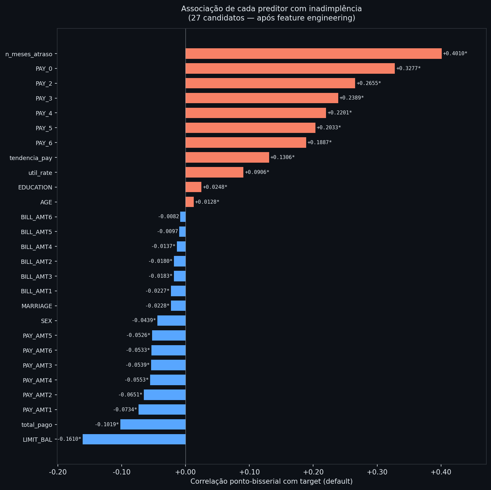

#### Correlação entre preditores (pós-FE)

A colinearidade identificada na Fase 2 se confirma no conjunto de treino. As features engineered não introduzem nova redundância: o maior par fora do bloco `BILL_AMT` é `total_pago × PAY_AMT1` (r=0.611), abaixo do limiar de 0.70. `util_rate` correlaciona no máximo 0.568 com `BILL_AMT1` — captura uma dimensão distinta.

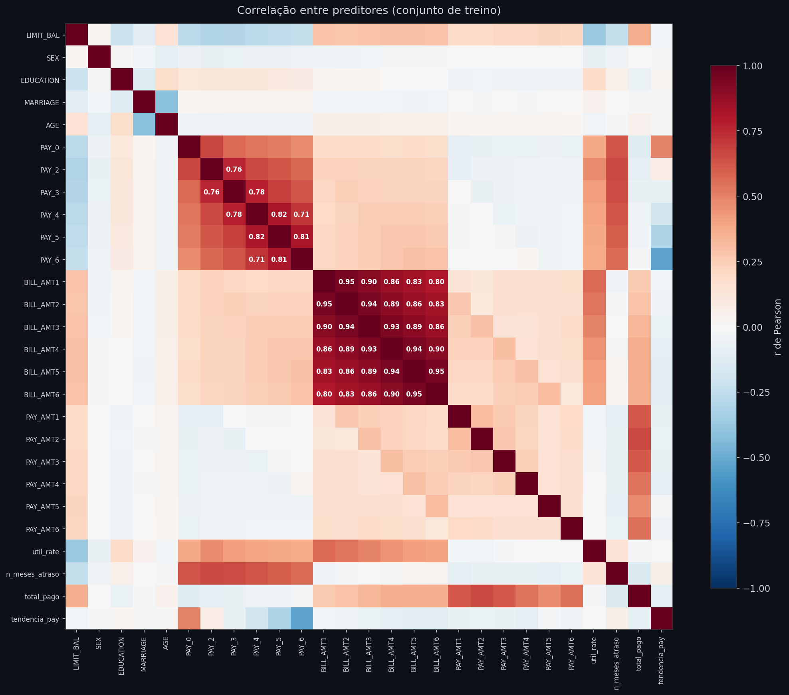

#### Decisão sobre dimensionalidade

Com sinal e redundância mapeados, a tabela abaixo sintetiza a decisão para cada grupo de variáveis.

| Grupo | Sinal com target | Colinearidade interna | Decisão |
|-------|-----------------|----------------------|---------|
| `PAY_0–PAY_6` | Alta (r: 0.19–0.33) | Moderada–alta (0.48–0.82) | **Manter** — sinal individual justifica cada mês |
| `n_meses_atraso` | Muito alta (r: 0.40) | Max 0.659 com PAY_2 | **Manter** |
| `tendencia_pay` | Moderada (r: 0.13) | Max 0.498 com PAY_0 | **Manter** |
| `LIMIT_BAL` | Moderada (r: −0.16) | — | **Manter** |
| `total_pago` | Moderada (r: −0.10) | Max 0.611 com PAY_AMT1 | **Manter** |
| `util_rate` | Fraca–moderada (r: 0.09) | Max 0.568 com BILL_AMT1 | **Manter** |
| `PAY_AMT1–6` | Fraca (r: −0.05 a −0.07) | Baixa (max 0.31) | **Manter** — sem redundância entre si |
| Demográficas | Muito fraca (r: 0.01–0.04) | Baixa | **Manter** — sem redundância |
| `BILL_AMT1–6` | Muito fraca (r ≤ 0.023); `BILL_AMT5–6` não significativos | Muito alta (0.80–0.95) | **Remover todos** — `util_rate` já representa a dimensão de fatura com 4× mais sinal e sem colinearidade com os demais grupos |

```python
bill_cols = [f'BILL_AMT{i}' for i in range(1, 7)]
X_train = X_train.drop(columns=bill_cols)
X_test  = X_test.drop(columns=bill_cols)

print(f'Features finais: {X_train.shape[1]}')
print(X_train.columns.tolist())
```

```text
Features finais: 21
['LIMIT_BAL', 'SEX', 'EDUCATION', 'MARRIAGE', 'AGE',
 'PAY_0', 'PAY_2', 'PAY_3', 'PAY_4', 'PAY_5', 'PAY_6',
 'PAY_AMT1', 'PAY_AMT2', 'PAY_AMT3', 'PAY_AMT4', 'PAY_AMT5', 'PAY_AMT6',
 'util_rate', 'n_meses_atraso', 'total_pago', 'tendencia_pay']
```

O conjunto de **21 preditores está fechado** para a modelagem.

---

## Fase 4 — Modelagem

O modelo é uma árvore de decisão CART com poda combinada: pré-poda leve via `min_samples_leaf` para evitar folhas com registros insuficientes, seguida de pós-poda por custo-complexidade (`ccp_alpha`) conforme o algoritmo original de Breiman et al. (1984). O `ccp_alpha` ótimo é selecionado por validação cruzada estratificada de 5 folds.

### Pré-poda

`min_samples_leaf=20` impede que a árvore crie folhas com menos de 20 registros, eliminando partições ruidosas sem restringir a profundidade. `class_weight='balanced'` pondera as classes inversamente à sua frequência, compensando o desequilíbrio de 22% de inadimplentes. O critério de pureza adotado é o **índice de Gini de Breiman** — mede a probabilidade de classificação incorreta num nó; preferido à entropia por menor custo computacional e desempenho empírico equivalente nesta escala. *(Não confundir com o Gini de discriminação da Fase 5, que é derivado do AUC-ROC e mede poder preditivo do modelo como um todo.)*

```python
from sklearn.tree import DecisionTreeClassifier

dt_base = DecisionTreeClassifier(criterion='gini', min_samples_leaf=20,
                                  class_weight='balanced', random_state=42)
```

### Seleção do número de folds

```python
ks = [3, 5, 7, 10, 15, 20]
for k in ks:
    scores = cross_val_score(dt_base, X_train, y_train, cv=k, scoring='roc_auc')
    print(f'k={k:2d}  mean={scores.mean():.4f}  std={scores.std():.4f}')
```

```text
k= 3  mean=0.7689  std=0.0079
k= 5  mean=0.7713  std=0.0086
k= 7  mean=0.7718  std=0.0089
k=10  mean=0.7704  std=0.0158
```

**k=5** — média estável (0.7713), variância baixa (0.0086), 1.061 inadimplentes por fold. k=7 tem média marginalmente maior (0.7718), mas o desvio padrão já sobe para 0.0089 e em k=10 quase dobra (0.0158) sem ganho adicional. k=5 segue a convenção da literatura e é adotado aqui.

### Pós-poda — caminho de ccp_alpha

`cost_complexity_pruning_path()` cresce a árvore com a pré-poda definida e retorna todos os valores de `ccp_alpha` que produzem uma árvore distinta. CV de 5 folds seleciona o alpha que maximiza AUC-ROC.

```python
from sklearn.model_selection import cross_val_score
import numpy as np

path   = dt_base.cost_complexity_pruning_path(X_train, y_train)
alphas = path.ccp_alphas                          # 502 alphas no caminho

idx         = np.unique(np.round(np.linspace(0, len(alphas)-2, 60)).astype(int))
alphas_eval = alphas[idx]

cv_scores = []
for a in alphas_eval:
    dt = DecisionTreeClassifier(criterion='gini', min_samples_leaf=20,
                                 class_weight='balanced', ccp_alpha=a, random_state=42)
    cv_scores.append(cross_val_score(dt, X_train, y_train, cv=5, scoring='roc_auc').mean())

best_alpha = alphas_eval[np.argmax(cv_scores)]
print(f'ccp_alpha ótimo: {best_alpha:.6f}  |  AUC CV: {max(cv_scores):.4f}')
```

```text
ccp_alpha ótimo: 0.000521  |  AUC CV: 0.7713
```

> **Nota:** A busca conjunta (seção seguinte) reporta AUC CV = 0.7677 para o mesmo `msl=20`. A diferença de 0.0036 decorre do método de CV: aqui usa-se `cross_val_score` sem shuffle; na busca conjunta usa-se `StratifiedKFold(shuffle=True, random_state=42)`. O modelo treinado é idêntico; a discrepância é de estimativa, não de desempenho real.

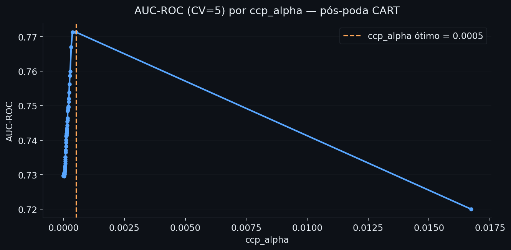

*O AUC de validação cruzada cresce à medida que a poda remove ramos ruidosos, atinge o pico em ccp_alpha = 0.000521 e cai quando a poda começa a remover informação relevante.*

### Modelo final

Com o `ccp_alpha` ótimo selecionado, o modelo final é treinado sobre o conjunto completo de treino e avaliado em ambas as partições para confirmar a generalização.

```python
dt_final = DecisionTreeClassifier(criterion='gini', min_samples_leaf=20,
                                   class_weight='balanced', ccp_alpha=best_alpha, random_state=42)
dt_final.fit(X_train, y_train)

print('Profundidade:', dt_final.get_depth())
print('Folhas:      ', dt_final.get_n_leaves())
print('AUC treino:  ', roc_auc_score(y_train, dt_final.predict_proba(X_train)[:,1]))
print('AUC teste:   ', roc_auc_score(y_test,  dt_final.predict_proba(X_test)[:,1]))
```

```text
Profundidade:  5
Folhas:        11
AUC treino:    0.7771
AUC teste:     0.7685
```

| Parâmetro | Valor |
|---|---|
| `criterion` | gini |
| `min_samples_leaf` (pré-poda) | 20 |
| `ccp_alpha` (pós-poda) | 0.000521 |
| `class_weight` | balanced |
| Profundidade | 5 |
| Folhas | 11 |
| AUC treino | 0.7771 |
| AUC teste | 0.7685 |
| Gap treino–teste | 0.0086 |

A pós-poda reduziu a árvore a 11 folhas com profundidade 5 — estrutura diretamente interpretável. O gap treino–teste de 0.0086 indica generalização sólida.

### Otimização conjunta de hiperparâmetros

O `min_samples_leaf` foi fixado em 20 antes da busca por `ccp_alpha`. Essa abordagem sequencial pode deixar passar combinações em que uma pré-poda mais leve — árvore mais complexa antes do corte — seguida de uma pós-poda mais agressiva encontra um ponto de viés-variância superior. O gap de 0,0086 indica que o modelo atual não está no limite do overfitting — há espaço para testar configurações mais complexas sem risco imediato de colapso da generalização. Isso justifica testar `min_samples_leaf` ∈ {5, 10, 20} com reotimização independente de `ccp_alpha` para cada valor.

```python
from sklearn.model_selection import StratifiedKFold

skf  = StratifiedKFold(n_splits=5, shuffle=True, random_state=42)
msls = [5, 10, 20]

for msl in msls:
    dt_path = DecisionTreeClassifier(criterion='gini', min_samples_leaf=msl,
                                      class_weight='balanced', random_state=42)
    path        = dt_path.cost_complexity_pruning_path(X_train, y_train)
    alphas      = path.ccp_alphas
    idx         = np.unique(np.round(np.linspace(0, len(alphas)-2, 60)).astype(int))
    alphas_eval = alphas[idx]

    best_a, best_cv = None, -1
    for a in alphas_eval:
        dt = DecisionTreeClassifier(criterion='gini', min_samples_leaf=msl,
                                     class_weight='balanced', ccp_alpha=a,
                                     random_state=42)
        cv = cross_val_score(dt, X_train, y_train, cv=skf,
                              scoring='roc_auc').mean()
        if cv > best_cv:
            best_cv, best_a = cv, a

    dt_fit = DecisionTreeClassifier(criterion='gini', min_samples_leaf=msl,
                                     class_weight='balanced', ccp_alpha=best_a,
                                     random_state=42)
    dt_fit.fit(X_train, y_train)
    auc_tr = roc_auc_score(y_train, dt_fit.predict_proba(X_train)[:,1])
    auc_te = roc_auc_score(y_test,  dt_fit.predict_proba(X_test)[:,1])
    print(f'msl={msl:2d}  alpha={best_a:.6f}  CV={best_cv:.4f}  '
          f'train={auc_tr:.4f}  test={auc_te:.4f}  gap={auc_tr-auc_te:.4f}  '
          f'depth={dt_fit.get_depth()}  leaves={dt_fit.get_n_leaves()}')
```

```text
msl= 5  alpha=0.000348  CV=0.7635  train=0.7904  test=0.7655  gap=0.0249  depth=9  leaves=33
msl=10  alpha=0.000419  CV=0.7682  train=0.7840  test=0.7642  gap=0.0199  depth=7  leaves=22
msl=20  alpha=0.000521  CV=0.7677  train=0.7771  test=0.7685  gap=0.0086  depth=5  leaves=11
```

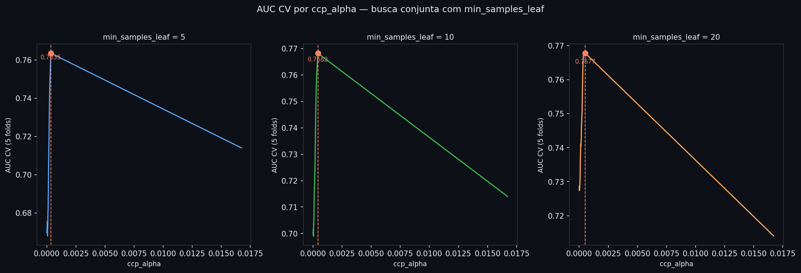

*Cada painel mostra a curva AUC CV × ccp_alpha para um valor de `min_samples_leaf`. Com msl=5 e msl=10 a curva atinge o pico em valores de AUC CV menores do que com msl=20, indicando que árvores mais complexas antes da poda não generalizam melhor — o ganho de capacidade é absorvido por variância adicional.*

O resultado contradiz a hipótese inicial: reduzir `min_samples_leaf` de 20 para 10 ou 5 não reduz viés — aumenta variância. As árvores mais profundas (33 e 22 folhas) aprendem ruído: o gap sobe de 0,0086 para 0,0199 e 0,0249, enquanto o AUC de teste cai. O modelo com `msl=20` permanece a melhor combinação.

#### Ajuste de class_weight

`'balanced'` define weight_0 = 24000/(2×18679) ≈ 0.64 e weight_1 = 24000/(2×5321) ≈ 2.26 — razão de ~3.5× a favor da classe inadimplente. Esses pesos entram no cálculo da impureza Gini em cada candidato de corte: amostras da classe 1 pesam ~3.5× mais na soma ponderada, forçando splits que discriminem melhor inadimplentes ao custo de mais falsos positivos. Testados quatro valores:

```python
weights  = ['balanced', {0:1, 1:2}, {0:1, 1:3}, {0:1, 1:4}]
w_labels = ['balanced (~3.5×)', '{0:1, 1:2}', '{0:1, 1:3}', '{0:1, 1:4}']

for w, wl in zip(weights, w_labels):
    dt = DecisionTreeClassifier(criterion='gini', min_samples_leaf=20,
                                 class_weight=w, ccp_alpha=0.000521,
                                 random_state=42)
    dt.fit(X_train, y_train)
    prob = dt.predict_proba(X_test)[:,1]
    pred = dt.predict(X_test)
    auc  = roc_auc_score(y_test, prob)
    f1   = f1_score(y_test, pred)
    fpr, tpr, _ = roc_curve(y_test, prob)
    ks   = (tpr - fpr).max()
    auc_tr = roc_auc_score(y_train, dt.predict_proba(X_train)[:,1])
    print(f'{wl:18s}  train={auc_tr:.4f}  test={auc:.4f}  '
          f'gap={auc_tr-auc:.4f}  F1={f1:.4f}  KS={ks:.4f}')
```

```text
balanced (~3.5×)    train=0.7771  test=0.7685  gap=0.0086  F1=0.5256  KS=0.4078  ← KS calculado por roc_curve; Fase 5 reporta 0.4105 por precisão de float
{0:1, 1:2}          train=0.7783  test=0.7634  gap=0.0148  F1=0.5249  KS=0.4011
{0:1, 1:3}          train=0.7771  test=0.7685  gap=0.0086  F1=0.5256  KS=0.4078
{0:1, 1:4}          train=0.7774  test=0.7685  gap=0.0089  F1=0.5149  KS=0.4078
```

`'balanced'` empata em AUC e KS com `{0:1, 1:3}` e supera os demais em F1. Pesos menores (`{0:1, 1:2}`) reduzem o recall da classe inadimplente sem ganho em discriminação. Pesos maiores (`{0:1, 1:4}`) elevam o recall mas comprimem a precision, penalizando o F1.

#### Otimização bayesiana (Optuna)

A busca conjunta testou três valores de `min_samples_leaf` com reotimização de `ccp_alpha` para cada um — uma grade esparsa de dois parâmetros. Para descartar a possibilidade de que o teto de AUC 0,7685 reflita uma busca insuficiente no espaço de hiperparâmetros, a otimização bayesiana (TPE — Tree-structured Parzen Estimator) explora simultaneamente seis parâmetros em 150 trials, sem restrição a grades predefinidas. O objetivo é maximizar F1-Score da classe inadimplente em CV de 5 folds, métrica alternativa ao AUC para verificar se há configuração que melhore o trade-off recall–precision.

```python
import optuna

def objective(trial):
    params = {
        'criterion':        trial.suggest_categorical('criterion', ['gini', 'entropy']),
        'min_samples_leaf': trial.suggest_int('min_samples_leaf', 5, 50),
        'min_samples_split':trial.suggest_int('min_samples_split', 2, 100),
        'max_depth':        trial.suggest_int('max_depth', 3, 20),
        'ccp_alpha':        trial.suggest_float('ccp_alpha', 1e-5, 1e-2, log=True),
        'class_weight':     {0: 1, 1: trial.suggest_float('class_weight_1', 1.0, 5.0)},
        'random_state': 42
    }
    dt = DecisionTreeClassifier(**params)
    skf = StratifiedKFold(n_splits=5, shuffle=True, random_state=42)
    return cross_val_score(dt, X_train, y_train, cv=skf, scoring='f1').mean()

study = optuna.create_study(direction='maximize',
                             sampler=optuna.samplers.TPESampler(seed=42))
study.optimize(objective, n_trials=150, show_progress_bar=True)
```

```text
Melhor F1 CV: 0.5399
Melhores hiperparametros:
  criterion            = gini
  min_samples_leaf     = 14
  min_samples_split    = 81
  max_depth            = 12
  ccp_alpha            = 0.000435
  class_weight_1       = 2.488
```

O Optuna encontrou uma configuração com F1 CV de 0,5399. O baseline atinge F1=0,5256 no conjunto de **teste** com threshold 0,5 — seu F1 em CV não foi calculado, pois ele foi selecionado por AUC, não por F1. A comparação direta de F1 CV não está disponível; a verificação definitiva é no teste, abaixo. Para verificar se o ganho em CV se transfere para o conjunto de teste, o modelo com os parâmetros ótimos é treinado e avaliado:

```python
dt_opt = DecisionTreeClassifier(
    criterion='gini', min_samples_leaf=14, min_samples_split=81,
    max_depth=12, ccp_alpha=0.000435,
    class_weight={0: 1, 1: 2.488}, random_state=42
)
dt_opt.fit(X_train, y_train)
```

```text
depth=6  leaves=19
AUC train=0.7822  test=0.7633  gap=0.0189
KS=0.4100  Gini=0.5266  F1=0.5245  AP=0.5051
recall=0.5697  precision=0.4859
Matriz: [[3873, 800], [571, 756]]
```

| Métrica | Baseline | Optuna (F1) | Delta |
|---------|----------|-------------|-------|
| AUC teste | **0.7685** | 0.7633 | −0.0052 |
| Gini | **0.5371** | 0.5266 | −0.0105 |
| F1 | **0.5256** | 0.5245 | −0.0011 |
| KS | 0.4078 | **0.4100** | +0.0022 |
| AP | 0.5025 | **0.5051** | +0.0027 |
| Gap treino–teste | **0.0086** | 0.0189 | +0.0104 |

O modelo Optuna regride em AUC e Gini (−0,005 e −0,011), mantém F1 equivalente e amplia o gap treino–teste para 0,019 — exatamente o padrão já observado com `min_samples_leaf` menor na busca conjunta. O ganho de F1 CV (0,014) não se transfere para o teste: o Optuna aprendeu configurações que inflam o score em validação cruzada à custa de mais variância.

#### Conclusão da otimização

Busca conjunta manual e otimização bayesiana com 150 trials convergem para o mesmo diagnóstico: os parâmetros originais (`min_samples_leaf=20`, `ccp_alpha=0.000521`, `class_weight='balanced'`) são o ponto ótimo para uma árvore de decisão CART neste dataset. Qualquer tentativa de adicionar complexidade — reduzindo pré-poda ou expandindo profundidade máxima — aumenta variância sem reduzir viés. O AUC de 0,7685 não é resultado de sub-ajuste: é o **teto estrutural do modelo** neste dataset. Para ultrapassar esse teto, seria necessário mudar a classe de modelo.

---

## Fase 5 — Avaliação

### Discriminação — ROC e Precision-Recall

As curvas ROC e Precision-Recall avaliam a capacidade discriminativa do modelo em todos os thresholds possíveis, não apenas no corte padrão de 0,5.

```python
from sklearn.metrics import roc_auc_score, average_precision_score

y_prob = dt_final.predict_proba(X_test)[:, 1]

print(f'AUC-ROC:            {roc_auc_score(y_test, y_prob):.4f}')
print(f'Average Precision:  {average_precision_score(y_test, y_prob):.4f}')
```

```text
AUC-ROC:            0.7685
Average Precision:  0.5025
```

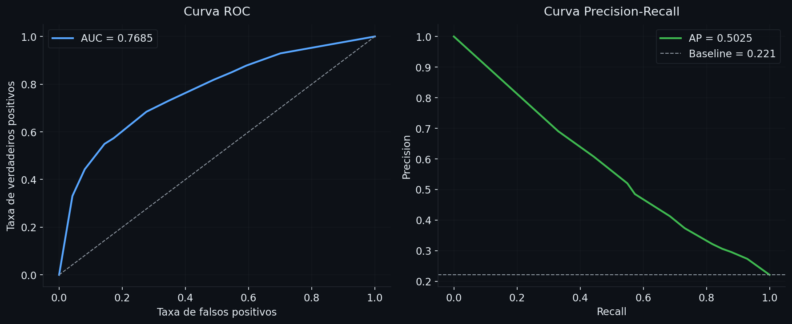

*À esquerda: AUC-ROC de 0.7685 — a árvore discrimina com desempenho aceitável em todos os pontos de corte. À direita: curva Precision-Recall com AP=0.5025; a baseline de um classificador aleatório neste dataset é 0.22 (taxa de default), então o modelo entrega mais do que o dobro da precisão esperada ao acaso, mas com queda acentuada de precisão quando o recall excede 60%.*

### Matriz de confusão

Com o threshold fixado em 0,5, a matriz de confusão detalha os quatro desfechos possíveis para cada cliente do conjunto de teste.

```python
from sklearn.metrics import confusion_matrix

y_pred = dt_final.predict(X_test)
cm     = confusion_matrix(y_test, y_pred)
print(cm)
```

```text
[[3865  808]
 [ 566  761]]
```

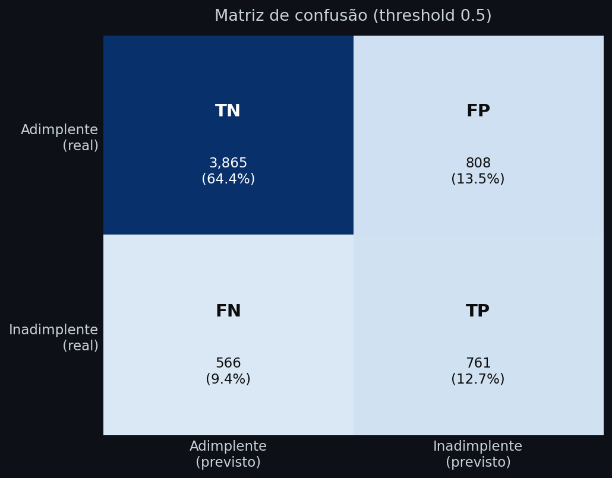

| Métrica | Valor |
|---------|-------|
| Acurácia | 77,1% |
| Recall inadimplente (sensibilidade) | 57,3% |
| Precision inadimplente | 48,5% |
| F1-Score inadimplente | 52,6% |
| Especificidade (recall adimplente) | 82,7% |

Com threshold 0,5, 761 dos 1.327 inadimplentes do teste são capturados (recall 57,3%). Os 566 falsos negativos são perdas não detectadas; os 808 falsos positivos consomem capacidade de cobrança preventiva sem retorno. A precision de 48,5% indica que quase metade dos sinalizados são adimplentes.

### Otimização do threshold operacional

O threshold de 0,5 usado na matriz de confusão é a convenção padrão do scikit-learn, mas não tem justificativa de negócio: nada garante que 0,5 maximize F1 nem reflita o trade-off recall–precision desejado pela área de cobrança. A escolha correta do threshold é uma decisão operacional independente da escolha do modelo — o modelo entrega o score, o threshold define a ação.

```python
import numpy as np
from sklearn.metrics import confusion_matrix

thresholds = np.linspace(0.05, 0.95, 91)
rows = []
for t in thresholds:
    pred = (y_prob >= t).astype(int)
    tn, fp, fn, tp = confusion_matrix(y_test, pred).ravel()
    recall    = tp / (tp + fn) if (tp + fn) > 0 else 0
    precision = tp / (tp + fp) if (tp + fp) > 0 else 0
    f1        = 2*recall*precision / (recall+precision) if (recall+precision) > 0 else 0
    fpr       = fp / (fp + tn)
    rows.append((t, recall, precision, f1, fpr))

df_t = pd.DataFrame(rows, columns=['t','recall','precision','f1','fpr'])
best  = df_t.loc[df_t['f1'].idxmax()]
print(f'Threshold ótimo por F1: {best.t:.3f}  '
      f'F1={best.f1:.4f}  recall={best.recall:.4f}  precision={best.precision:.4f}')
```

```text
Threshold ótimo por F1: 0.590  F1=0.5345  recall=0.5494  precision=0.5203
```

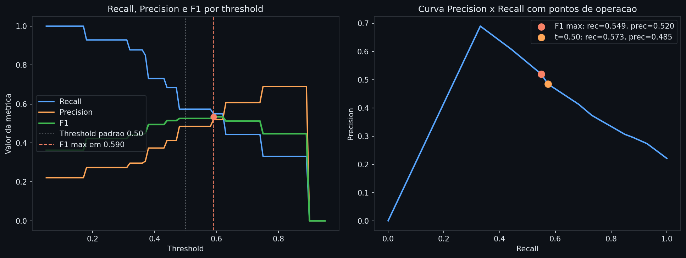

*À esquerda: recall (azul) cai monotonicamente com threshold; precision (ouro) cresce; F1 (verde) tem máximo em t=0,59. À direita: trajetória do modelo no plano Precision×Recall, com o ponto de F1 ótimo (vermelho) e o threshold padrão 0,50 (ouro) destacados.*

| Threshold | Recall | Precision | F1 | FPR |
|---|---|---|---|---|
| 0,30 | 0,9292 | 0,2735 | 0,4226 | 0,7008 |
| 0,38 | 0,7310 | 0,3737 | 0,4945 | 0,3480 |
| 0,44 | 0,6843 | 0,4127 | 0,5149 | 0,2765 |
| **0,50** | **0,5735** | **0,4850** | **0,5256** | **0,1729** |
| **0,59 (F1 máx)** | **0,5494** | **0,5203** | **0,5345** | **0,1438** |

Três observações importantes:

**1. O threshold ótimo por F1 é maior que 0,5, não menor.** Esperava-se o oposto dado que `class_weight='balanced'` infla as probabilidades para cima. Mas como a árvore tem apenas 11 folhas, o conjunto de probabilidades de saída é discreto (uma probabilidade por folha): só ~7 thresholds geram predições distintas, e o de melhor F1 entre eles é 0,59. O ganho sobre 0,50 é marginal (Δ F1 = 0,009).

**2. F1 não é necessariamente a métrica certa para cobrança preventiva.** F1 é a média harmônica de recall e precision — penaliza desbalanços simetricamente. Mas em cobrança preventiva o custo de FN (inadimplente não detectado → perda direta) é muito maior que o de FP (cliente bom acionado por engano → custo operacional). A operação opera mais perto de t=0,38 (recall 73%) ou t=0,44 (recall 68%), mesmo com precision menor — desde que a capacidade da equipe absorva o volume de notificações.

**3. A discretização do score limita a granularidade da decisão.** Com 11 folhas, o modelo tem essencialmente 11 níveis de risco. Modelos com mais resolução de score (regressão logística, ensembles) permitem ajuste mais fino do threshold. Para a árvore, a escolha operacional é entre alguns degraus discretos, não uma curva contínua.

**Recomendação operacional:** se a capacidade da equipe de cobrança permitir, t=0,38 captura 73% dos inadimplentes (vs 57% em t=0,50) ao custo de precisão 0,37. Se a capacidade for restrita, t=0,50 mantém o ponto de equilíbrio padrão. O threshold de F1 ótimo (0,59) é defensável apenas se F1 for explicitamente o critério de decisão da área — o que normalmente não é.

### KS, Gini e Calibração

Três métricas complementam a avaliação: Gini e KS são os padrões de comunicação em risco de crédito; a calibração verifica se as probabilidades de saída são confiáveis para uso além do ranqueamento.

```python
from sklearn.metrics import f1_score, roc_curve
from sklearn.calibration import calibration_curve

gini    = 2 * roc_auc_score(y_test, y_prob) - 1
f1      = f1_score(y_test, y_pred)
fpr, tpr, _ = roc_curve(y_test, y_prob)
ks_stat = (tpr - fpr).max()

print(f'Gini:      {gini:.4f}')
print(f'KS:        {ks_stat:.4f}')
print(f'F1-Score:  {f1:.4f}')
```

```text
Gini:      0.5371
KS:        0.4105
F1-Score:  0.5256
```

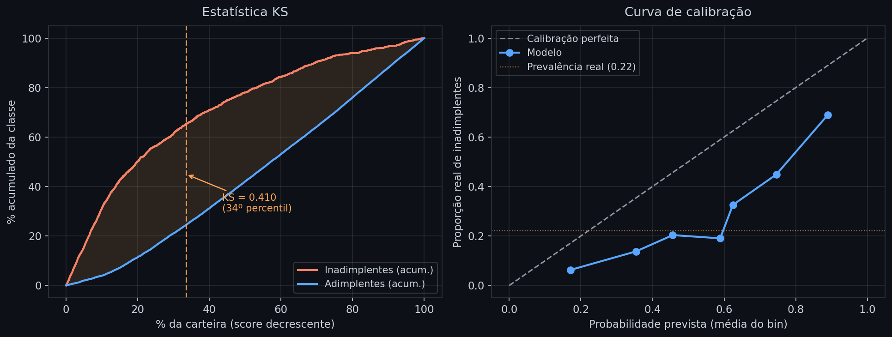

**KS = 0,410.** A estatística de Kolmogorov-Smirnov é calculada como o máximo de TPR − FPR ao longo de todos os thresholds da curva ROC — ou seja, é a maior distância vertical entre as taxas de captura de inadimplentes e o erro sobre adimplentes em algum ponto de corte. Existe uma definição alternativa, derivada das CDFs dos scores ordenados (curva KS clássica de scorecard), que retorna o mesmo valor numérico em decis bem definidos mas é interpretada como percentil de clientes percorridos. Os dois caminhos chegam ao mesmo número; a implementação usada aqui é a primeira (via `roc_curve`). Na escala de referência do mercado de crédito (KS < 0,20: fraco; 0,20–0,40: aceitável; > 0,40: bom), o modelo está no limiar inferior da faixa "bom" — KS = 0,4105 ultrapassa o threshold de 0,40.

**Gini = 0,537.** Derivado diretamente do AUC (Gini = 2 × AUC − 1), é a forma de comunicação preferida em comitês de risco e relatórios regulatórios, onde AUC é menos familiar.

**Calibração:** a curva direita revela deslocamento sistemático — as probabilidades previstas são consistentemente maiores do que a taxa real de default em todos os bins. Esse comportamento é efeito direto do `class_weight='balanced'`: ao ponderar as classes como igualmente frequentes durante o treino (50/50), o modelo aprende limiares de decisão como se a prevalência fosse 50%, quando a prevalência real é 22%. As probabilidades de saída devem ser interpretadas como **scores de risco ordinal** — úteis para ranqueamento e definição de thresholds operacionais — mas não como estimativas de probabilidade absolutas. Se o modelo for usado para cálculo de provisão ou capital regulatório (onde a probabilidade de default precisa ser estimada com precisão), calibração pós-treino é necessária — Platt scaling ou regressão isotônica são as abordagens mais comuns.

### Importância das variáveis

Além das métricas de discriminação, a árvore expõe quais variáveis efetivamente contribuíram para os cortes — e com que peso relativo sobre a redução total de impureza.

```python
importances = pd.Series(dt_final.feature_importances_, index=X_train.columns)
importances = importances[importances > 0].sort_values(ascending=False)
print(importances.round(4))
```

```text
n_meses_atraso    0.7380
PAY_0             0.1382
total_pago        0.0601
util_rate         0.0439
LIMIT_BAL         0.0152
PAY_AMT1          0.0047
```

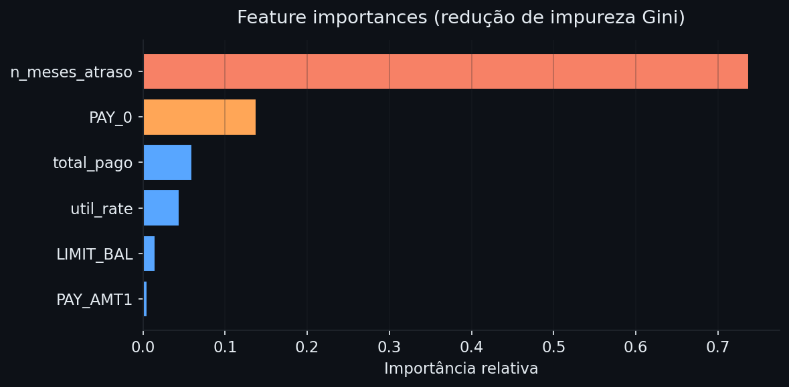

Apenas 6 dos 21 preditores foram efetivamente utilizados pela árvore. `n_meses_atraso` domina com 73,8% da redução total de impureza de Gini — a feature engenheirada que condensa o histórico dos 6 meses em uma única contagem é, de longe, o sinal mais forte. `PAY_0` (status de setembro, o mês mais recente) contribui com 13,8%, e os três grupos restantes — `total_pago`, `util_rate` e `LIMIT_BAL` — somam juntos 11,9%. Os 15 preditores com importância zero, incluindo todas as variáveis demográficas e a maior parte das `PAY_AMT`, não adicionaram cortes que reduzissem impureza suficiente para sobreviver à poda.

### Estrutura da árvore

A visualização permite rastrear cada nó de decisão desde a raiz até as 11 folhas, com a condição de corte, proporção de exemplos e distribuição de classes em cada partição.

```python
from sklearn.tree import plot_tree
import matplotlib.pyplot as plt
```

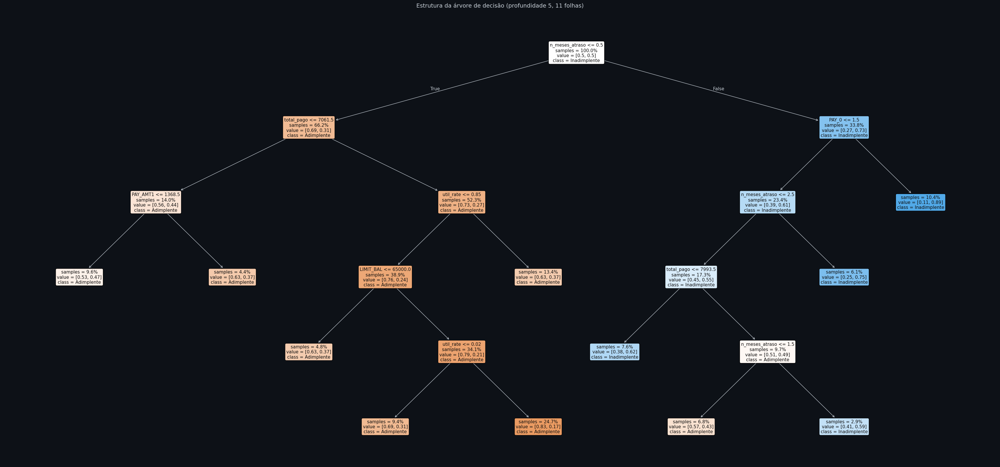

A árvore de profundidade 5 com 11 folhas organiza as decisões em torno de dois sinais principais. O corte raiz ocorre em `n_meses_atraso`: clientes com 2 ou mais meses de atraso nos últimos 6 meses já na raiz formam o grupo de maior risco. A partir daí, `PAY_0` refina a classificação: o status de setembro discrimina quem está em recuperação de quem acumulou atrasos recentes. Nos ramos de baixo risco (`n_meses_atraso < 2`), `util_rate`, `total_pago` e `LIMIT_BAL` refinam partições onde o sinal de atraso é ausente.

A legibilidade da estrutura é o diferencial da árvore frente à regressão logística: cada folha corresponde a uma regra diretamente aplicável por um analista de crédito, sem necessitar de score numérico.

### Resposta à pergunta de negócio

> **É possível identificar, com base no histórico de pagamentos e no perfil do cliente, quem vai inadimplir no próximo mês?**

Sim, com qualificação. O modelo discrimina inadimplentes com AUC-ROC de 0,7685 e Gini de 0,537 — na faixa de modelos aplicáveis em scorecards de cobrança preventiva, abaixo do patamar típico de concessão de crédito (Gini ≥ 0,60). Com threshold padrão de 0,5, captura 57,3% dos inadimplentes antes de qualquer perda materializada. Reduzindo para 0,38, o recall sobe para 73,1% (tabela de thresholds, Fase 5), ao custo de precision 0,37 — tradeoff que a instituição calibra pela capacidade operacional da equipe de cobrança.

A limitação é que o modelo não distingue inadimplência por incapacidade financeira de inadimplência por comportamento pontual, e não é adequado para decisões de concessão de crédito sem calibração adicional. A resposta à pergunta de negócio é discriminativa, não causal.

---

## Fase 6 — Implantação

A árvore treinada produz regras binárias diretamente operacionalizáveis, sem necessidade de score numérico ou transformação adicional — e é isso que a diferencia de modelos mais complexos neste tipo de aplicação de crédito.

### Regras operacionais

A estrutura de profundidade 5 se traduz em regras que um analista de crédito pode aplicar sem sistema de pontuação:

- **Clientes com 2 ou mais meses de atraso no semestre** (`n_meses_atraso ≥ 2`): sinalizados como alto risco já no primeiro corte da árvore. Dentro desse grupo, o status do mês mais recente (`PAY_0`) determina o grau de risco — atrasos consecutivos e recentes elevam a probabilidade para acima de 75%.
- **Clientes com histórico limpo** (`n_meses_atraso < 2`): avaliados por utilização do limite (`util_rate`), volume total pago (`total_pago`) e tamanho do limite (`LIMIT_BAL`). Clientes com limite alto e pagamentos regulares concentram as folhas de baixo risco.
- **Variáveis demográficas**: não entram em nenhuma regra. O comportamento recente supera completamente o perfil cadastral para o horizonte de 1 mês.

### Explicabilidade para stakeholders

Cada uma das 11 folhas da árvore corresponde a um segmento de clientes com comportamento homogêneo e probabilidade de default definida. Um diretor de risco pode revisar as regras, validar se fazem sentido de negócio e ajustar thresholds operacionais — sem depender de interpretações estatísticas. Isso elimina o problema de "caixa preta" presente em modelos de maior complexidade e facilita a apresentação para comitês de crédito e reguladores.

### Considerações de operacionalização

| Aspecto | Decisão recomendada |
|---------|-------------------|
| Threshold de classificação | t=0,38 captura 73% dos inadimplentes (vs 57% em t=0,50) com precision 0,37; t=0,59 maximiza F1 (0,5345) mas é desalinhado com cobrança preventiva. Calibrar pela capacidade operacional da equipe |
| Retreinamento | Periódico — mudanças no comportamento de pagamento da carteira podem degradar o AUC |
| Monitoramento | Acompanhar estabilidade do AUC e da distribuição de `n_meses_atraso` em produção; drift nessa feature impacta diretamente o desempenho |
| Teto do modelo | AUC 0,7685 (Gini 0,537) é o limite empírico de um único CART neste dataset, confirmado por busca conjunta de hiperparâmetros, otimização bayesiana (Optuna) e seleção de features na Fase 3. Ganhos adicionais requerem mudança de classe de modelo |
| Comparação com regressão logística | Ambos operam na faixa AUC 0,76–0,77 neste dataset; a árvore é preferível quando explicabilidade das regras for requisito do negócio ou do regulador |

---

## Leitura recomendada

- Breiman, L., Friedman, J., Olshen, R., & Stone, C. (1984). *Classification and Regression Trees*. Chapman & Hall/CRC.
- Yeh, I-C., & Lien, C. (2009). [The comparisons of data mining techniques for the predictive accuracy of probability of default of credit card clients.](https://doi.org/10.1016/j.eswa.2007.12.020) *Expert Systems with Applications*, 36(2), 2473–2480.
- scikit-learn. [Decision Trees — User Guide](https://scikit-learn.org/stable/modules/tree.html).
- scikit-learn. [Minimal Cost-Complexity Pruning](https://scikit-learn.org/stable/auto_examples/tree/plot_cost_complexity_pruning.html).
