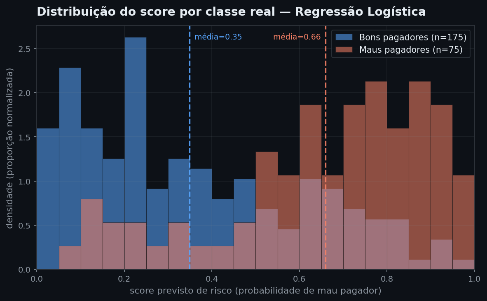
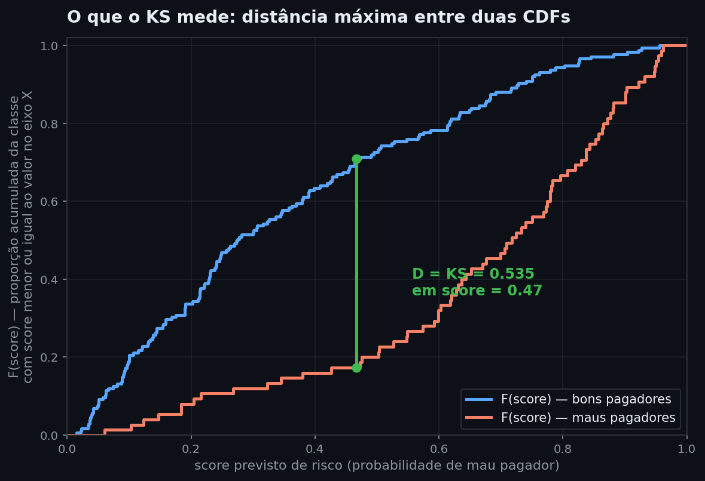
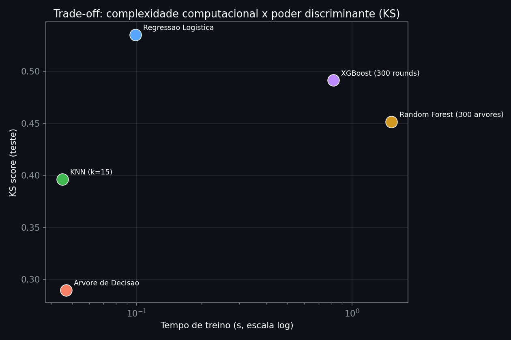
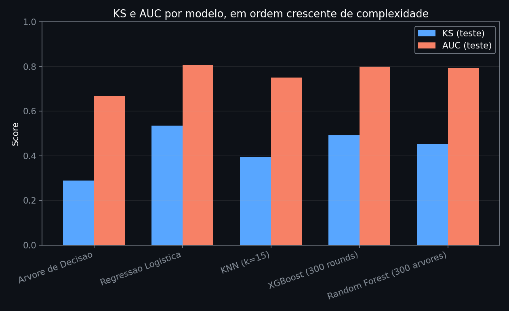
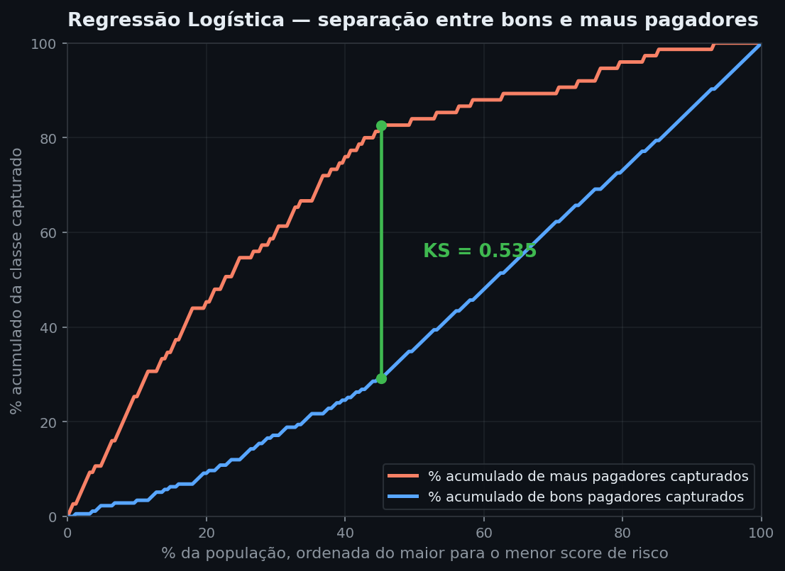
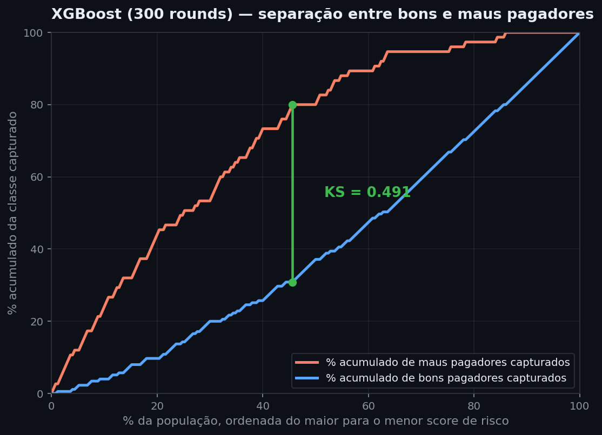
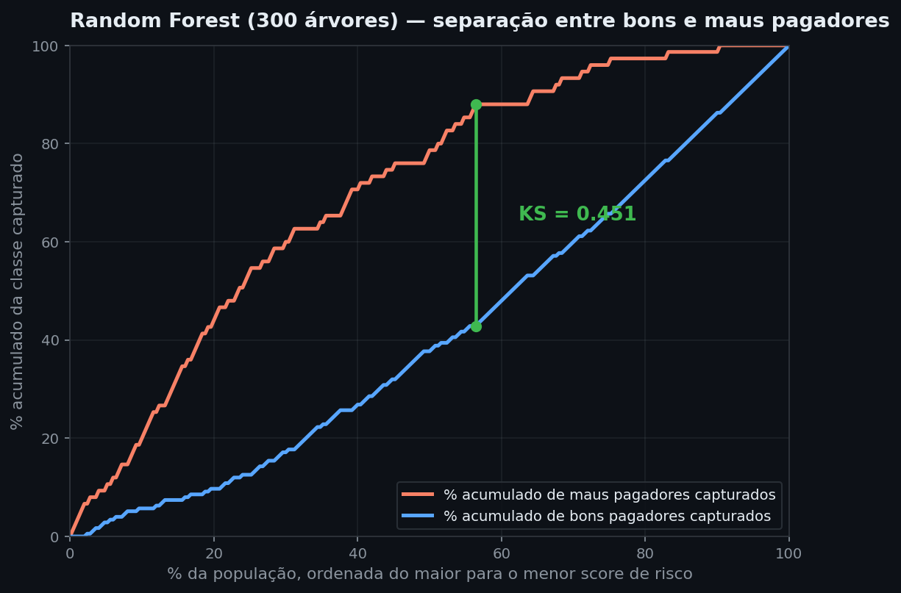
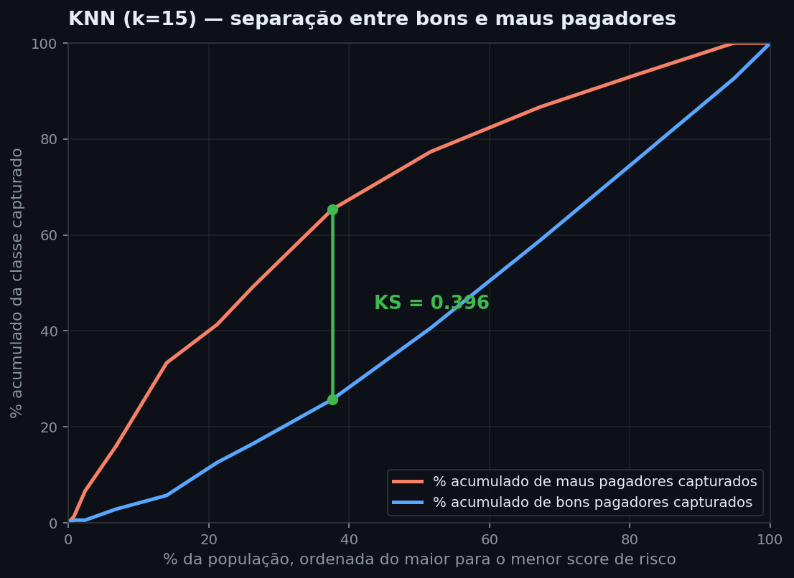
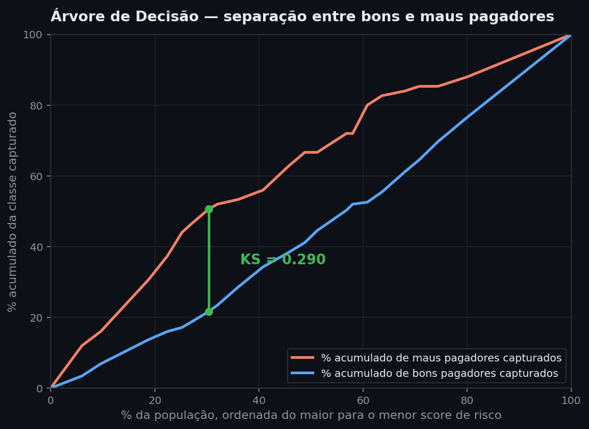

# Complexidade versus Tempo/Custo: o Trade-off Medido pelo KS Score

**Módulo:** 01 — Machine Learning | **Análise:** 06 | **Data:** 2026-08-16

> **Análises anteriores:** [03 — Probabilidade de default em cartão de crédito (regressão logística)](03_default_cartao_credito.md) · [05 — Árvore de decisão para default de cartão de crédito](05_arvore_decisao_default.md)

---

## Fase 1 — Entendimento do negócio

### Contexto

As análises anteriores aplicaram um modelo por vez a um problema de classificação de crédito. Esta análise muda a pergunta: em vez de otimizar um único modelo, ela **compara cinco modelos de complexidade crescente** no mesmo dataset e mede, para cada um, o ganho discriminativo contra o custo computacional pago para obtê-lo. O ganho discriminativo é medido pelo **KS score** — a origem estatística da métrica, sua leitura visual e sua equivalência com a curva ROC estão explicadas na seção "A métrica: o que é KS", logo abaixo.

O dataset usado é o **German Credit Data** (Hofmann, 1994, UCI Machine Learning Repository), que difere dos dois anteriores em um ponto crítico para esta análise: tem apenas **1.000 observações**, contra 30.000 do dataset de cartão de crédito. Essa escala pequena é proposital — é exatamente o regime em que a complexidade do modelo tem menos dados para se sustentar, tornando o trade-off entre complexidade e retorno mais visível.

### Dataset

| Atributo | Valor |
|---|---|
| Fonte | UCI Machine Learning Repository |
| Referência | Prof. Hans Hofmann, Universität Hamburg (1994) |
| Observações | 1.000 solicitantes de crédito |
| Variáveis | 20 preditores (7 numéricas, 13 categóricas) + target |
| Target | `classe` — bom (700, 70%) / mau (300, 30%) pagador |
| Particularidade | Dataset original acompanha uma **matriz de custo**: classificar um mau pagador como bom custa 5× mais que o erro inverso |

A matriz de custo do UCI reforça por que o KS — e não apenas a acurácia — é a métrica certa aqui: o objetivo de negócio não é acertar a classe majoritária, é separar bem as duas populações no ponto de corte que a política de crédito vai usar.

### Objetivo de negócio

Apoiar a decisão de qual classe de modelo adotar em produção quando o ganho de poder discriminante de um modelo mais complexo precisa ser justificado pelo tempo de treino, tempo de inferência e perda de interpretabilidade que ele exige.

### Pergunta de negócio

> **Cada unidade adicional de complexidade de modelo compra uma unidade proporcional de poder discriminante (KS), ou o retorno é decrescente — e a partir de que ponto deixa de compensar o custo?**

### A métrica: o que é KS

A ideia por trás do KS é simples: o modelo dá a cada cliente um score de risco; se esse score não carregasse nenhuma informação útil, a distribuição de scores dos bons pagadores seria praticamente indistinguível da distribuição de scores dos maus pagadores — olhando só para o score, não daria pra saber a qual grupo um cliente pertence. Se o score for útil, as duas distribuições se afastam: maus pagadores concentram-se em scores mais altos, bons pagadores em scores mais baixos. O KS mede **o quanto** essas duas distribuições se afastam.



*Histograma dos escores reais atribuídos pela Regressão Logística aos 250 clientes do conjunto de teste, separados pela classe verdadeira. Bons pagadores (azul) concentram-se em scores baixos, com média 0,35; maus pagadores (laranja) concentram-se em scores altos, com média 0,66. As duas distribuições se sobrepõem na faixa intermediária — nenhum modelo real separa as classes perfeitamente — mas o deslocamento entre elas é visível a olho nu. É essa separação, vista aqui na forma bruta (densidade), que o KS resume em um único número ao acumular cada distribuição e medir a distância máxima entre as duas curvas acumuladas, a seguir.*

Formalizando: seja F₁(x) a proporção de bons pagadores com score menor ou igual a x, e F₂(x) a mesma proporção para maus pagadores. Em cada valor possível de x, essas duas proporções acumuladas podem estar próximas (pouca separação) ou distantes (boa separação). O KS é a maior distância entre elas, tomada sobre todos os valores de x — literalmente a estatística **D** do teste de Kolmogorov-Smirnov de duas amostras: `D = sup|F₁(x) − F₂(x)|`.

Essa mesma distância pode ser lida direto da curva ROC de um classificador. Em cada threshold, a **TPR** (taxa de verdadeiros positivos: dos maus pagadores reais, quantos o modelo captura corretamente até aquele corte) e a **FPR** (taxa de falsos positivos: dos bons pagadores reais, quantos são classificados incorretamente como maus) são os complementos de F₂ e F₁, respectivamente.

A diferença `TPR − FPR`, maximizada sobre todos os thresholds, é a mesma estatística D escrita na linguagem de classificação binária: `KS = max(TPR − FPR)`. É essa forma — mais rápida de calcular a partir de `roc_curve` — que aparece no código da Fase 4. A Fase 5 retoma a forma estatística original (`D = sup|F₁(x) − F₂(x)|`) para verificar se as separações encontradas são estatisticamente significativas, e não apenas artefato do tamanho pequeno do conjunto de teste.

Diferente do AUC, que resume a curva ROC inteira numa média, o KS aponta o *ponto de corte* onde a separação entre as duas populações é máxima — por isso é a métrica preferida por áreas de risco para comparar modelos de aprovação de crédito: ela responde diretamente "qual o melhor corte possível", não "quão boa é a curva em média".



*Esta figura usa os escores reais da Regressão Logística (Fase 4) para ilustrar a definição formal: o eixo X é o próprio score previsto pelo modelo — não um percentil de população, como nos gráficos operacionais da Fase 5 — e as duas curvas são F(score), a proporção acumulada de cada classe com score menor ou igual ao valor do eixo. A curva azul (bons pagadores) sobe mais rápido porque a maioria dos bons recebe score baixo; a curva laranja (maus pagadores) sobe mais devagar, concentrando-se em scores mais altos. A distância vertical entre as duas, no ponto onde ela é máxima (score ≈ 0,47), é exatamente D = KS = 0,535 — o mesmo valor computado por `roc_curve` na Fase 4 e por `ks_2samp` na Fase 5. É essa distância — não a área sob nenhuma curva — que o KS mede.*

### Critério de sucesso da mineração

| Métrica | Por que é adequada |
|---|---|
| KS score (teste) | Métrica-alvo da pergunta de negócio; mede separação máxima entre as classes |
| AUC-ROC (teste e CV) | Contraponto ao KS — mede discriminação agregada, não só o ponto de corte ótimo |
| Tempo de treino (mediana de 7 execuções) | Proxy de custo de desenvolvimento/retreino |
| Tempo de inferência por registro | Proxy de custo operacional em produção (latência, throughput) |
| Complexidade estrutural (nº de parâmetros/folhas/vizinhos armazenados) | Proxy de complexidade do modelo, comparável entre classes distintas de algoritmo |

### Estrutura da análise (CRISP-DM)

| Fase | O que fazemos |
|---|---|
| 1 — Entendimento do negócio | Contexto, dataset, objetivo e métricas de sucesso *(esta seção)* |
| 2 — Entendimento dos dados | Carregamento, distribuição do target, tipos de variável |
| 3 — Preparação dos dados | Codificação de categóricas, padronização, divisão treino-teste |
| 4 — Modelagem | Cinco modelos em escada de complexidade, com medição de tempo e complexidade estrutural |
| 5 — Avaliação | Trade-off KS × tempo, decomposição por que a complexidade não converteu em KS |
| 6 — Implantação | Recomendação de modelo por cenário de negócio |

---

## Fase 2 — Entendimento dos dados

```python
import pandas as pd

df = pd.read_csv('../../../data/processed/german_credit.csv')
print(df.shape)
print(df['classe'].value_counts())
print(df.dtypes.value_counts())
```

```text
(1000, 21)
classe
bom    700
mau    300
Name: count, dtype: int64
object    14
int64      7
Name: count, dtype: int64
```

1.000 linhas, sem valores ausentes (o dataset do UCI já vem limpo). 14 colunas categóricas (armazenadas como texto, já decodificadas dos códigos originais `A11`, `A34` etc. — ver `data/processed/german_credit_dicionario.txt`) e 7 numéricas, incluindo o target. A proporção 70/30 é um desequilíbrio moderado, tratado via `class_weight='balanced'` nos modelos que suportam o parâmetro.

### Variáveis numéricas e categóricas

```python
num_cols = df.select_dtypes(include='number').columns.tolist()
cat_cols = df.select_dtypes(exclude='number').columns.drop('classe').tolist()
print('Numericas:', num_cols)
print('Categoricas:', len(cat_cols), 'variaveis')
```

```text
Numericas: ['duracao_meses', 'valor_credito', 'taxa_prestacao_pct_renda',
            'tempo_residencia_atual', 'idade', 'num_creditos_existentes_banco',
            'num_dependentes']
Categoricas: 13 variaveis
```

A maioria das variáveis é categórica (histórico de crédito, finalidade do empréstimo, situação da conta corrente, poupança etc.) — o que importa para esta análise porque o **one-hot encoding expande a dimensionalidade real** do problema: as 13 categóricas, após codificação, geram muito mais colunas do que as 7 numéricas sozinhas sugerem. Essa expansão afeta diretamente o "custo de complexidade" de modelos baseados em distância (KNN) e lineares (regressão logística), que serão sensíveis ao número de colunas pós-encoding.

---

## Fase 3 — Preparação dos dados

Duas transformações são necessárias antes da modelagem: padronização das numéricas (exigida por KNN e regressão logística; neutra para os modelos baseados em árvore) e one-hot encoding das categóricas (nenhum dos cinco modelos aceita texto diretamente). Ambas são encapsuladas em um `ColumnTransformer` dentro de um `Pipeline`, garantindo que o mesmo pré-processamento seja aplicado de forma idêntica a todos os modelos — condição necessária para que a comparação de tempo e complexidade seja justa.

```python
from sklearn.model_selection import train_test_split
from sklearn.preprocessing import StandardScaler, OneHotEncoder
from sklearn.compose import ColumnTransformer

y = (df['classe'] == 'mau').astype(int)
X = df.drop(columns=['classe'])

X_train, X_test, y_train, y_test = train_test_split(
    X, y, test_size=0.25, random_state=42, stratify=y
)

pre = ColumnTransformer([
    ('num', StandardScaler(), num_cols),
    ('cat', OneHotEncoder(handle_unknown='ignore'), cat_cols),
])

print(f'Treino: {X_train.shape[0]}  Teste: {X_test.shape[0]}')
print(f'Taxa mau treino: {y_train.mean():.2f}  teste: {y_test.mean():.2f}')
```

```text
Treino: 750  Teste: 250
Taxa mau treino: 0.30  teste: 0.30
```

Divisão 75/25 estratificada — com apenas 1.000 registros, um corte 80/20 deixaria menos de 200 casos de teste, insuficiente para estimar KS com estabilidade. Após o `OneHotEncoder`, o espaço de features passa de 20 colunas originais para **61 colunas** (7 numéricas + 54 dummies das 13 categóricas) — número usado na Fase 4 como proxy de complexidade da regressão logística.

---

## Fase 4 — Modelagem

Cinco classificadores são organizados em ordem crescente de complexidade estrutural, cobrindo três famílias de algoritmo: linear (regressão logística), baseado em instância (KNN) e baseado em árvore (árvore isolada, bagging, boosting). Todos compartilham o mesmo `Pipeline` de pré-processamento e a mesma divisão treino-teste.

| Modelo | Família | Hiperparâmetros fixos |
|---|---|---|
| Regressão Logística | Linear | `class_weight='balanced'`, `max_iter=2000` |
| KNN (k=15) | Baseado em instância | `n_neighbors=15` |
| Árvore de Decisão | Árvore única | `min_samples_leaf=20`, `class_weight='balanced'` |
| Random Forest | Bagging (300 árvores) | `n_estimators=300`, `min_samples_leaf=5`, `class_weight='balanced'` |
| XGBoost | Boosting (300 rounds) | `n_estimators=300`, `max_depth=4`, `learning_rate=0.05` |

Nenhum dos cinco passou por tuning de hiperparâmetros — a comparação usa configurações padrão/razoáveis de cada família, porque o objetivo é medir o trade-off entre **classes de modelo**, não encontrar o ótimo de cada uma. Otimizar cada modelo individualmente encareceria desproporcionalmente os mais complexos, distorcendo a comparação de custo.

```python
from sklearn.linear_model import LogisticRegression
from sklearn.neighbors import KNeighborsClassifier
from sklearn.tree import DecisionTreeClassifier
from sklearn.ensemble import RandomForestClassifier
from xgboost import XGBClassifier

modelos = {
    'Regressao Logistica': LogisticRegression(max_iter=2000, class_weight='balanced', random_state=42),
    'KNN (k=15)': KNeighborsClassifier(n_neighbors=15),
    'Arvore de Decisao': DecisionTreeClassifier(min_samples_leaf=20, class_weight='balanced', random_state=42),
    'Random Forest (300 arvores)': RandomForestClassifier(n_estimators=300, min_samples_leaf=5,
                                                            class_weight='balanced', random_state=42, n_jobs=-1),
    'XGBoost (300 rounds)': XGBClassifier(n_estimators=300, max_depth=4, learning_rate=0.05,
                                           eval_metric='logloss', random_state=42, n_jobs=-1),
}
```

### Métrica de complexidade estrutural

Como as cinco famílias não compartilham uma noção nativa de "número de parâmetros", cada uma recebe um proxy comparável ao seu mecanismo interno:

```python
def complexidade(nome, pipe, n_train):
    clf = pipe.named_steps['clf']
    n_feat = pipe.named_steps['pre'].transform(X_train.iloc[:1]).shape[1]
    if nome == 'Regressao Logistica':
        return n_feat                      # 1 coeficiente por feature pos-OHE
    if nome.startswith('KNN'):
        return n_train                      # armazena todo o treino
    if nome == 'Arvore de Decisao':
        return clf.get_n_leaves()
    if nome.startswith('Random Forest'):
        return int(np.sum([e.get_n_leaves() for e in clf.estimators_]))
    if nome.startswith('XGBoost'):
        return clf.n_estimators * clf.max_depth   # limite superior de splits
```

| Modelo | Complexidade (proxy) | Interpretação |
|---|---|---|
| Árvore de Decisão | 27 | folhas da árvore podada |
| Regressão Logística | 61 | 1 coeficiente por feature pós-encoding |
| XGBoost | 1.200 | 300 árvores rasas × profundidade 4 |
| KNN (k=15) | 750 | todo o conjunto de treino fica armazenado |
| Random Forest | 17.641 | soma de folhas de 300 árvores profundas |

A ordem de complexidade **não coincide** com a ordem intuitiva "linear < instância < árvore < ensemble": KNN memoriza 750 pontos sem nenhum parâmetro aprendido, e a Random Forest — com árvores sem limite de profundidade — acumula 650× mais folhas que a árvore única podada. Essa não-linearidade já é o primeiro indício de que "mais complexo" é multidimensional, não um único eixo.

### Medição de tempo e desempenho

Tempo de treino e de inferência são medidos como a **mediana de 7 execuções**, para reduzir ruído de variação do sistema operacional — relevante porque os tempos absolutos aqui são da ordem de dezenas a centenas de milissegundos, sensíveis a jitter.

```python
import time
from sklearn.model_selection import StratifiedKFold, cross_val_score
from sklearn.metrics import roc_auc_score, roc_curve
from sklearn.pipeline import Pipeline

def ks_score(y_true, y_prob):
    fpr, tpr, _ = roc_curve(y_true, y_prob)
    return (tpr - fpr).max()

skf = StratifiedKFold(n_splits=5, shuffle=True, random_state=42)
resultados = []
pipelines_treinados = {}  # reaproveitados na Fase 5

for nome, modelo in modelos.items():
    pipe = Pipeline([('pre', pre), ('clf', modelo)])

    tempos_treino = []
    for _ in range(7):
        t0 = time.perf_counter()
        pipe.fit(X_train, y_train)
        tempos_treino.append(time.perf_counter() - t0)
    t_train = np.median(tempos_treino)

    tempos_infer = []
    for _ in range(7):
        t0 = time.perf_counter()
        pipe.predict_proba(X_test)
        tempos_infer.append((time.perf_counter() - t0) / len(X_test) * 1000)
    t_infer = np.median(tempos_infer)

    y_prob = pipe.predict_proba(X_test)[:, 1]
    auc = roc_auc_score(y_test, y_prob)
    ks = ks_score(y_test, y_prob)
    cv_auc = cross_val_score(pipe, X_train, y_train, cv=skf, scoring='roc_auc')
    comp = complexidade(nome, pipe, len(X_train))

    resultados.append({'modelo': nome, 'complexidade': comp, 'auc_cv': cv_auc.mean(),
                        'auc_teste': auc, 'ks_teste': ks, 'tempo_treino_s': t_train,
                        'tempo_infer_ms': t_infer})
    pipelines_treinados[nome] = pipe
```

```text
                     modelo  complexidade  auc_cv   auc_teste  ks_teste  tempo_treino_s  tempo_infer_ms
        Regressao Logistica            61  0.7649      0.8070    0.5352          0.0984          0.0764
                 KNN (k=15)           750  0.7427      0.7509    0.3962          0.0450          0.1811
          Arvore de Decisao            27  0.7621      0.6689    0.2895          0.0469          0.0996
       XGBoost (300 rounds)          1200  0.7655      0.8003    0.4914          0.8193          0.1501
Random Forest (300 arvores)         17641  0.7881      0.7916    0.4514          1.5283          0.8067
```



*O eixo horizontal (tempo de treino, escala log) cobre quase duas ordens de grandeza: de 0,045s (KNN) a 1,53s (Random Forest) — a Random Forest treina 34× mais devagar que a árvore única. O eixo vertical (KS) não acompanha essa progressão: o ponto mais alto do gráfico é a Regressão Logística, o modelo mais barato de treinar entre os dois competitivos. XGBoost e Random Forest — os dois modelos mais caros — ficam abaixo dela em KS.*

---

## Fase 5 — Avaliação

Os cinco pipelines treinados na Fase 4 — armazenados em `pipelines_treinados` — são reaproveitados nas seções a seguir, tanto para a verificação de significância estatística quanto para a análise de desbalanceamento.

### O resultado central: mais complexidade comprou menos KS, não mais



*Os modelos estão ordenados da esquerda para a direita por complexidade estrutural crescente (27 → 61 → 750 → 1.200 → 17.641). Se o trade-off fosse "mais complexidade, mais KS com retorno decrescente", as barras azuis subiriam e depois achatariam. Não é isso que acontece: a árvore isolada (complexidade mínima) tem o pior KS (0,29); a regressão logística (segunda menor complexidade) tem o melhor (0,54); XGBoost e Random Forest, as duas configurações mais caras, ficam no meio (0,49 e 0,45) — abaixo da regressão logística, apesar de exigirem de 8× a 16× mais tempo de treino.*

A tabela reorganiza os mesmos números por retorno sobre o custo, usando a regressão logística como referência de "modelo barato":

| Modelo | KS | Tempo treino | KS por segundo de treino | Delta de KS vs. Regressão Logística |
|---|---|---|---|---|
| Regressão Logística | **0,5352** | 0,098s | 5,44 | — |
| XGBoost | 0,4914 | 0,819s | 0,60 | −0,044 (custando 8,3× mais tempo) |
| Random Forest | 0,4514 | 1,528s | 0,30 | −0,084 (custando 15,5× mais tempo) |
| KNN | 0,3962 | 0,045s | 8,80 | −0,139 (mais barato, mas pior) |
| Árvore de Decisão | 0,2895 | 0,047s | 6,20 | −0,246 (mais barato, mas muito pior) |

Nenhum dos quatro modelos mais complexos supera a regressão logística em KS. Dois deles (XGBoost e Random Forest) pagam um custo de treino de 8× a 15× maior para entregar um KS **pior**. Isso inverte a pergunta de negócio original: a questão não é "quanto de complexidade vale a pena pagar por um ganho de KS" — neste dataset, com este pré-processamento, **não há ganho de KS para comprar**.

### O que o KS mede, visualmente

O KS reportado na tabela acima é um único número — a distância máxima entre duas curvas de distribuição acumulada. Reduzir a comparação a esse número esconde *onde* e *quão bem* cada modelo separa as classes. O gráfico padrão de credit scoring para isso ordena a população pelo score de risco (do mais arriscado ao menos arriscado) e traça, lado a lado, o quanto de cada classe real foi capturado a cada fatia da população. Quanto mais cedo e mais longe a curva de maus pagadores se afasta da curva de bons pagadores, melhor o modelo consegue isolar quem vai inadimplir.







*Em cada gráfico, a linha laranja é o % acumulado de maus pagadores capturados e a azul o % acumulado de bons pagadores, ambas em função da fatia da população examinada (eixo X, ordenado do maior para o menor score de risco). A linha verde marca o ponto de maior distância vertical entre as duas curvas — o próprio KS. Na Regressão Logística essa distância se abre cedo (perto de 20% da população) e chega a 0,535 antes da metade da base. Na Árvore de Decisão as duas curvas ficam quase coladas o tempo todo — o modelo não consegue isolar um grupo de alto risco concentrado, e o KS de 0,290 reflete essa indiferenciação visível no gráfico, não apenas no número.*

### As separações são estatisticamente significativas, ou é ruído do teste pequeno?

O conjunto de teste tem apenas 250 registros (75 maus pagadores, 175 bons) — pequeno o suficiente para que uma diferença de KS entre modelos seja, em parte, sorte do split. Como o KS é a estatística D do teste de Kolmogorov-Smirnov (seção anterior), é possível responder a essa dúvida formalmente: `scipy.stats.ks_2samp` compara diretamente as distribuições de score de bons e maus pagadores de cada modelo e devolve o p-value da hipótese nula "as duas distribuições são iguais".

```python
from scipy.stats import ks_2samp

for nome, pipe in pipelines_treinados.items():
    score = pipe.predict_proba(X_test)[:, 1]
    s_bom = score[y_test.values == 0]
    s_mau = score[y_test.values == 1]
    resultado = ks_2samp(s_mau, s_bom)
    print(f'{nome:32s} D={resultado.statistic:.4f}  p-value={resultado.pvalue:.2e}')
```

```text
Regressao Logistica              D=0.5352  p-value=2.51e-14
XGBoost (300 rounds)             D=0.4914  p-value=4.80e-12
Random Forest (300 arvores)      D=0.4514  p-value=3.64e-10
KNN (k=15)                       D=0.3962  p-value=7.16e-08
Arvore de Decisao                D=0.2895  p-value=2.28e-04
```

O `D` retornado por `ks_2samp` bate, casa decimal por casa decimal, com o KS calculado via `roc_curve` na Fase 4 — confirmação de que as duas formas de calcular a métrica são a mesma estatística. Todos os p-values ficam muito abaixo de 0,01: mesmo a Árvore de Decisão, o modelo mais fraco, separa bons de maus pagadores de forma estatisticamente significativa (p=2,3×10⁻⁴), não por acaso do split.

Isso também pode ser verificado sem depender do p-value assintótico do `scipy`, usando a fórmula clássica do valor crítico do teste KS de duas amostras, `D_crítico = c(α) · √((n₁+n₂)/(n₁·n₂))`, com `c(0,01) = 1,63` para n₁=75 e n₂=175:

```text
D_critico (alpha=0.01) = 1.63 * sqrt((75+175)/(75*175)) = 0.2250
```

Todos os cinco modelos superam 0,2250 — inclusive a Árvore de Decisão (0,2895). **A conclusão da análise não é um artefato de ruído do teste pequeno**: a hierarquia entre os cinco modelos reflete diferença real de poder discriminante, não apenas do split específico usado. Isso não elimina a incerteza sobre a *magnitude exata* de cada KS (o intervalo de confiança de cada estimativa individual ainda é largo com n=250) — apenas confirma que nenhum dos cinco modelos "separa por acaso", inclusive o pior deles.

### O desbalanceamento de classes é tratado de forma desigual entre os modelos

O dataset tem desequilíbrio moderado — 700 bons (70%) contra 300 maus pagadores (30%), proporção preservada no teste (175 e 75). Esse desequilíbrio não afeta os cinco modelos da mesma forma, porque nem todos foram configurados para compensá-lo: `class_weight='balanced'` foi aplicado à Regressão Logística, à Árvore de Decisão e à Random Forest (Fase 4), mas o **KNN não tem esse parâmetro** no scikit-learn, e o **XGBoost foi treinado sem `scale_pos_weight`** — o equivalente do balanceamento nesse modelo. A comparação de KS entre os cinco modelos permanece válida, porque KS e AUC são métricas de ranqueamento calculadas sobre todos os thresholds e não dependem de um corte fixo — mas o desbalanceamento não tratado tem uma consequência direta em como esses dois modelos se comportariam se implantados no threshold padrão de 0,5.

```python
from sklearn.metrics import recall_score, precision_score, confusion_matrix

for nome, pipe in pipelines_treinados.items():
    pred = pipe.predict(X_test)  # threshold padrao 0.5
    rec = recall_score(y_test, pred)
    prec = precision_score(y_test, pred, zero_division=0)
    cm = confusion_matrix(y_test, pred)
    print(f'{nome:32s} recall_mau={rec:.3f}  precisao_mau={prec:.3f}  matriz={cm.tolist()}')
```

```text
Regressao Logistica              recall_mau=0.800  precisao_mau=0.556  matriz=[[127, 48], [15, 60]]
Arvore de Decisao                recall_mau=0.667  precisao_mau=0.410  matriz=[[103, 72], [25, 50]]
Random Forest (300 arvores)      recall_mau=0.627  precisao_mau=0.547  matriz=[[136, 39], [28, 47]]
XGBoost (300 rounds)             recall_mau=0.467  precisao_mau=0.614  matriz=[[153, 22], [40, 35]]
KNN (k=15)                       recall_mau=0.333  precisao_mau=0.714  matriz=[[165, 10], [50, 25]]
```

No threshold padrão, o KNN — um dos dois modelos sem tratamento de desbalanceamento — identifica apenas 33,3% dos maus pagadores reais (25 de 75; os outros 50 são classificados como bons). O XGBoost, também sem tratamento, identifica 46,7% (35 de 75). Os três modelos balanceados ficam substancialmente à frente: Regressão Logística captura 80% dos maus pagadores, Árvore 66,7%, Random Forest 62,7%.

Essa diferença de recall não aparece na comparação de KS porque o KS não usa um threshold fixo — mede a separação em todos os pontos de corte possíveis, não a decisão binária que o modelo tomaria em produção com o corte padrão. Mas é operacionalmente relevante: o dataset do UCI acompanha uma matriz de custo em que classificar um mau pagador como bom custa 5× mais que o erro inverso (Fase 1). Sob esse critério, o KNN implantado com threshold 0,5 — apesar de ter o segundo pior KS, não o pior — produziria o resultado mais caro dos cinco: 50 maus pagadores liberados como bons, contra 15 da Regressão Logística.

**Conclusão factual:** o desbalanceamento é um problema real neste caso, mas específico — afeta o comportamento de KNN e XGBoost no threshold fixo, não a validade da comparação de KS/AUC que sustenta o restante da análise. Qualquer decisão de implantação a partir dos cinco modelos avaliados aqui precisaria de calibração de threshold por modelo (ou, no caso do KNN e XGBoost, de balanceamento explícito antes do ajuste de corte) — etapa fora do escopo desta análise.

### Por que a complexidade não converteu em KS aqui

Três fatores do próprio dataset explicam o padrão, e generalizam para quando esperar o mesmo resultado em outros problemas:

**1. Tamanho amostral pequeno penaliza variância antes de recompensar capacidade.** Com 750 registros de treino, uma Random Forest com árvores de profundidade irrestrita (17.641 folhas somadas) tem mais "capacidade de memorização" do que dados para preenchê-la sem ruído. O mesmo padrão já havia aparecido na análise 05 (30.000 registros, dataset diferente): lá, aumentar a complexidade da árvore também piorava a generalização, mas o efeito era mais sutil (gap treino-teste subindo de 0,009 para 0,025). Aqui, com 40× menos dados, o efeito é dominante o suficiente para inverter o ranking entre modelo simples e complexo.

**2. A relação entre preditores e o target é predominantemente aditiva.** A regressão logística assume que cada variável contribui de forma independente e monotônica para o log-odds de inadimplência. O fato de ela vencer sugere que o sinal relevante no German Credit Data — status da conta corrente, histórico de crédito, valor do empréstimo — é majoritariamente desse tipo, sem interações fortes o bastante para justificar o particionamento não-linear que árvores oferecem. Quando esse é o caso, o modelo linear já captura quase todo o sinal disponível, e a capacidade extra dos ensembles se converte em variância, não em viés reduzido.

**3. A árvore única isolada é o pior caso porque combina alta variância com baixa capacidade de correção.** Uma única árvore, sem a agregação de bagging ou boosting, tem decisões abruptas (splits binários) que em amostra pequena capturam ruído específico do conjunto de treino. Random Forest e XGBoost corrigem parcialmente esse problema — por isso superam a árvore isolada — mas não o suficiente para superar um modelo que nunca teve esse problema de origem.

### Onde a complexidade ainda se paga: AUC agregado

O quadro muda parcialmente ao olhar para AUC-CV (validação cruzada, mais robusta a ruído de um único split de teste) em vez de KS de teste: a Random Forest lidera (0,788), seguida por XGBoost (0,766) e regressão logística (0,765) — diferença de apenas 0,002 entre os dois primeiros e o terceiro colocado, dentro da margem de ruído. Isso mostra que o **ranking depende da métrica**: em discriminação agregada (AUC), a Random Forest tem uma vantagem marginal; no ponto de corte que credit scoring usa na prática (KS), a regressão logística vence com folga. A escolha de métrica de sucesso, definida na Fase 1, não é neutra — decide qual modelo "vence" a comparação.

### Latência de inferência: um segundo eixo de custo

O tempo de treino domina a diferença de custo entre os modelos, mas a latência de inferência por registro conta uma história parcialmente distinta: a Random Forest, mesmo perdendo em KS, tem a maior latência de inferência (0,81ms/registro) — 10,6× mais lenta que a regressão logística (0,076ms/registro) — porque cada predição percorre 300 árvores. Em um cenário de aprovação de crédito em tempo real, com milhares de decisões por segundo, essa diferença de latência se soma ao custo de treino como uma segunda razão para preferir o modelo mais simples, quando ele já vence em KS.

---

## Fase 6 — Implantação

### Recomendação

Para o German Credit Data, com o pré-processamento e hiperparâmetros usados nesta análise, a **regressão logística é dominante**: melhor KS, segundo melhor AUC de teste (praticamente empatada com XGBoost), menor tempo de treino entre os modelos competitivos e menor latência de inferência. Não há cenário de negócio, entre os avaliados, em que trocar por um modelo mais complexo se justifique neste dataset.

### Quando essa conclusão não se sustenta

A recomendação é específica deste dataset, não uma regra geral contra modelos complexos. Três condições, se presentes, revertem o resultado:

| Condição | Efeito esperado |
|---|---|
| Volume de dados muito maior (dezenas de milhares de registros, como na análise 05) | Ensembles têm dados suficientes para que a capacidade extra reduza viés sem inflar variância — o padrão observado em 05 já mostrava ganho de Random Forest/XGBoost sobre árvore única, embora não testado ali contra regressão logística |
| Interações fortes e não-lineares entre preditores | Regressão logística sem termos de interação explícitos não captura esse sinal; árvores capturam nativamente |
| Custo de treino amortizado (modelo treinado uma vez, servido por meses) | O argumento de custo de treino perde peso — resta apenas a latência de inferência, onde XGBoost (0,15ms) já é competitivo com a regressão logística |

### Próximos passos sugeridos

A Fase 5 já confirmou, via teste de Kolmogorov-Smirnov de duas amostras, que nenhum dos cinco modelos separa bons e maus pagadores por acaso — todos superam o valor crítico com folga, mesmo o mais fraco. O que essa verificação **não** cobre é a incerteza sobre a *ordem* entre os modelos: com um único split de 250 registros, o intervalo de confiança de cada KS individual ainda é largo o suficiente para que a distância entre, por exemplo, XGBoost (0,4914) e Random Forest (0,4514) não seja necessariamente estável. O próximo passo natural é repetir esta comparação com validação cruzada aninhada, calculando KS em cada fold, para verificar se o ranqueamento entre os cinco modelos se mantém — não se cada um discrimina melhor que o acaso, isso já está resolvido.

---

## Leitura recomendada

- Hofmann, H. (1994). [Statlog (German Credit Data)](https://archive.ics.uci.edu/ml/datasets/Statlog+(German+Credit+Data)). UCI Machine Learning Repository.
- Siddiqi, N. (2017). *Intelligent Credit Scoring: Building and Implementing Better Credit Risk Scorecards* (2ª ed.). Wiley. — referência padrão da indústria sobre o uso do KS score em modelos de crédito.
- Massey, F. J. (1951). The Kolmogorov-Smirnov Test for Goodness of Fit. *Journal of the American Statistical Association*, 46(253), 68–78. — origem estatística do teste de duas amostras que dá nome à métrica.
- [05 — Árvore de decisão para default de cartão de crédito](05_arvore_decisao_default.md) — mesma discussão de viés-variância em escala de dados maior (30.000 registros).
