# Regressão Linear e Logística

**Módulo:** 01 — Machine Learning  
**Data:** 2026-05-24  
**Fonte:** notas conceituais

---

Regressão linear e logística são os modelos mais simples que aprendem uma relação a partir de dados — e por isso formam a base conceitual para todo o restante. Uma rede neural profunda empilha dezenas de camadas de processamento, mas cada camada faz essencialmente o que uma regressão faz: combina as entradas com pesos e produz uma saída. O modelo que classifica um e-mail como spam ou detecta uma transação fraudulenta é, em sua última camada, uma regressão logística. Entender como a regressão encontra seus parâmetros, mede seu desempenho e decide quando está generalizando bem ou memorizando os dados de treino é o que torna esses mecanismos compreensíveis em qualquer escala de complexidade.

## Regressão Linear Simples

### Intuição

A regressão linear é um modelo para problemas em que o alvo $y$ é **numérico contínuo** — preço de um imóvel, retorno de um ativo, temperatura, risco de crédito expresso em valor. Quando o alvo é categórico (sim/não, inadimplente/adimplente), a ferramenta muda: entra a regressão logística, tratada na próxima seção.

Com um alvo contínuo, a regressão linear pode servir a dois objetivos distintos. O primeiro é **predição**: dado um conjunto de preditores, estimar o valor esperado de $y$ com a maior acurácia possível — o interesse está no $\hat{y}$, não nos coeficientes em si. O segundo é **inferência**: quantificar o efeito de cada preditor sobre $y$, controlando pelos demais — o interesse está nos $\hat{\beta}$, em sua magnitude e significância estatística. Os dois objetivos às vezes entram em conflito: adicionar preditores correlacionados pode melhorar a predição mas comprometer a interpretação dos coeficientes.

Imagine um conjunto de pontos espalhados num gráfico. A regressão linear pergunta:
**qual reta resume melhor o padrão desses pontos?**

Não qualquer reta, mas a reta que minimiza a distância vertical entre ela e cada ponto. Essa distância é chamada de **resíduo**.

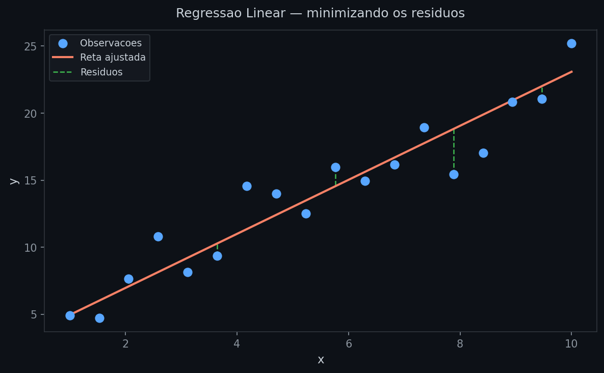

Como não existe reta que passe por todos os pontos, escolhemos a que erra menos — somando os quadrados dos resíduos. Elevar ao quadrado serve a dois propósitos: impede que erros positivos e negativos se cancelem, e penaliza mais os erros grandes. Esse critério se chama **Mínimos Quadrados Ordinários (OLS)**.

---

### Definição formal

Formalizando a intuição: dados $n$ pontos $(x_i, y_i)$, o modelo postula que existe uma relação linear entre $x$ e $y$, perturbada por um ruído aleatório $\varepsilon_i$:

$$y_i = \beta_0 + \beta_1 x_i + \varepsilon_i, \quad i = 1, \dots, n$$

| Símbolo | Nome | Papel |
|---|---|---|
| $y_i$ | variável dependente (resposta) | o que queremos prever |
| $x_i$ | variável independente (preditora) | o que usamos para prever |
| $\beta_0$ | intercepto | parâmetro desconhecido, a estimar |
| $\beta_1$ | coeficiente angular | parâmetro desconhecido, a estimar |
| $\varepsilon_i$ | termo de erro | tudo que o modelo não captura |

O modelo separa dois mundos: os **parâmetros verdadeiros** $(\beta_0, \beta_1)$ — que nunca observamos — e os **estimadores** $(\hat{\beta}_0, \hat{\beta}_1)$ que calculamos a partir dos dados.

> O modelo postula que existe uma relação verdadeira no mundo — uma reta "real" com parâmetros $\beta_0$ e $\beta_1$ fixos — mas nunca temos acesso direto a ela. Só observamos dados, que são realizações ruidosas dessa relação (por causa do $\varepsilon_i$). O que calculamos, $\hat{\beta}_0$ e $\hat{\beta}_1$, são estimativas baseadas na amostra disponível. Se coletássemos outra amostra, obteríamos estimativas ligeiramente diferentes — mas os parâmetros verdadeiros continuariam os mesmos. É a mesma lógica de medir a temperatura corporal: cada medição varia por ruído do termômetro, mas a temperatura verdadeira é uma só.

A mesma separação vale para os erros. O **erro** $\varepsilon_i$ é inobservável — ele depende dos $\beta$ verdadeiros, que nunca conhecemos. O que calculamos após o ajuste é o **resíduo** $e_i = y_i - \hat{y}_i$ — a estimativa observável de $\varepsilon_i$, obtida substituindo os parâmetros verdadeiros pelos estimados. As premissas do modelo (independência, homocedasticidade, normalidade) são enunciadas sobre $\varepsilon_i$, mas verificadas empiricamente através de $e_i$.

---

### Estimação: encontrando os β

Para estimar os parâmetros, o OLS define uma função de custo — a **soma dos quadrados dos resíduos** (SSR, do inglês *Sum of Squared Residuals*):

$$\text{SSR}(\beta_0, \beta_1) = \sum_{i=1}^n \left(y_i - \beta_0 - \beta_1 x_i\right)^2$$

O objetivo é encontrar o par $(\beta_0, \beta_1)$ que minimiza esse custo. Para entender como isso é possível de forma exata, vale observar a natureza do SSR: cada resíduo $e_i = y_i - \beta_0 - \beta_1 x_i$ é linear nos parâmetros, então $e_i^2$ é quadrático, e a soma de $n$ funções quadráticas continua quadrática. Além disso, por ser uma soma de quadrados, os coeficientes de segundo grau são sempre positivos — a função abre para cima, como uma parábola, sem mínimos locais nem platôs ambíguos. Há um único fundo.

Isso significa que basta **zerar as derivadas parciais** em relação a $\beta_0$ e $\beta_1$ para encontrar o mínimo exato. A lógica é a mesma de qualquer função quadrática: no fundo da parábola, a inclinação é zero. Aqui temos dois parâmetros, então derivamos em relação a cada um separadamente — mantendo o outro fixo — e igualamos a zero.

Aplicando a regra da cadeia a $\text{SSR} = \sum [f(\beta)]^2$, onde $f(\beta) = y_i - \beta_0 - \beta_1 x_i$:

**Em relação a $\beta_0$:** a derivada interna de $f$ em relação a $\beta_0$ é $-1$ (coeficiente de $\beta_0$ dentro do parêntese). Pela regra da cadeia: $2 \cdot (y_i - \beta_0 - \beta_1 x_i) \cdot (-1)$, somado sobre todos os pontos:

$$\frac{\partial \,\text{SSR}}{\partial \beta_0} = -2\sum_{i=1}^n(y_i - \beta_0 - \beta_1 x_i) = 0$$

**Em relação a $\beta_1$:** agora a derivada interna de $f$ em relação a $\beta_1$ é $-x_i$. Pela regra da cadeia: $2 \cdot (y_i - \beta_0 - \beta_1 x_i) \cdot (-x_i)$:

$$\frac{\partial \,\text{SSR}}{\partial \beta_1} = -2\sum_{i=1}^n x_i(y_i - \beta_0 - \beta_1 x_i) = 0$$

Isso gera um sistema de duas equações com duas incógnitas. Resolvendo:

**Da primeira equação** — expandindo a soma e dividindo por $n$:

$$\sum y_i - n\beta_0 - \beta_1 \sum x_i = 0 \implies \bar{y} - \beta_0 - \beta_1\bar{x} = 0$$

onde $\bar{x}$ e $\bar{y}$ são as médias amostrais de $x$ e $y$.

$$\boxed{\hat{\beta}_0 = \bar{y} - \hat{\beta}_1\bar{x}}$$

O intercepto depende de $\hat{\beta}_1$, então primeiro resolvemos para a inclinação.

**Da segunda equação** — substituindo $\hat{\beta}_0 = \bar{y} - \hat{\beta}_1\bar{x}$ e reorganizando:

$$\sum x_i y_i - \bar{y}\sum x_i = \hat{\beta}_1\!\left(\sum x_i^2 - \bar{x}\sum x_i\right)$$

Os dois lados simplificam para formas que reconhecemos:

$$\sum x_i y_i - \bar{y}\sum x_i = \sum(x_i - \bar{x})(y_i - \bar{y}) \quad \text{(covariância)}$$

$$\sum x_i^2 - \bar{x}\sum x_i = \sum(x_i - \bar{x})^2 \quad \text{(variância)}$$

Portanto:

$$\boxed{\hat{\beta}_1 = \frac{\sum_{i=1}^n (x_i - \bar{x})(y_i - \bar{y})}{\sum_{i=1}^n (x_i - \bar{x})^2} = \frac{\text{Cov}(x, y)}{\text{Var}(x)}}$$

**Covariância** mede se $x$ e $y$ tendem a se mover na mesma direção: positiva quando crescem juntos, negativa quando um sobe enquanto o outro desce, zero quando não há relação linear. **Variância** mede o quanto $x$ se dispersa em torno da sua própria média — quanto maior, mais espalhados estão os valores de $x$. A divisão normaliza: $\hat{\beta}_1$ expressa o movimento de $y$ *por unidade de variação de $x$*, independente da escala dos dados.

Essa é a **solução analítica** (ou forma fechada): uma fórmula que entrega a resposta exata em um número fixo de operações. O oposto seria um algoritmo iterativo — como o gradiente descendente — que parte de um chute inicial e vai ajustando até convergir. Na regressão linear simples, a iteração é desnecessária.

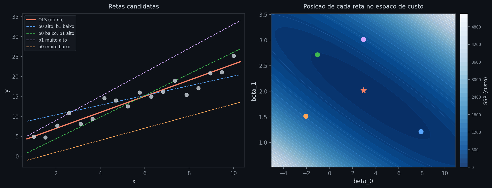

O gráfico torna isso concreto. À esquerda, cinco retas com parâmetros diferentes ajustadas sobre os mesmos dados. À direita, o mapa de custo SSR no espaço $(\beta_0, \beta_1)$: cada ponto representa uma reta, e a cor indica o custo — regiões claras têm SSR alto, regiões escuras têm SSR baixo. A mesma cor conecta cada reta ao seu ponto no mapa. A reta OLS (laranja) pousa exatamente no único fundo do vale.

---

### Interpretando os coeficientes

Com os estimadores em mãos, a reta ajustada é:

$$\hat{y} = \hat{\beta}_0 + \hat{\beta}_1 x$$

- $\hat{\beta}_0$: valor previsto de $y$ quando $x = 0$ (nem sempre tem interpretação prática)
- $\hat{\beta}_1$: quanto $\hat{y}$ muda para cada +1 unidade em $x$

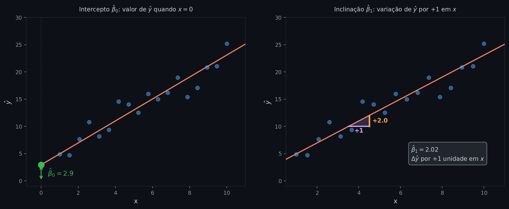

O ponto verde marca $\hat{\beta}_0$ no eixo y — onde a reta cruza quando $x = 0$. O triângulo mostra $\hat{\beta}_1$: a base é +1 unidade em $x$ (roxo), a altura é a variação correspondente em $\hat{y}$ (laranja). Quanto mais inclinada a reta, maior a altura do triângulo.

Uma limitação importante da interpretação: os coeficientes descrevem a relação dentro do intervalo de $x$ observado nos dados. Aplicar o modelo fora desse intervalo — **extrapolação** — assume que a relação linear continua indefinidamente, o que raramente é verdade na prática. Se o modelo foi ajustado com retornos de mercado entre −5% e +5%, não há garantia de que $\hat{\beta}_1$ se mantenha válido para retornos de −20%.

---

### Medindo o ajuste

Há duas formas complementares de avaliar um modelo de regressão: métricas de **erro absoluto**, que medem o quanto o modelo erra em média, e métricas de **proporção explicada**, que medem quanto da variação de $y$ o modelo captura.

As principais métricas de erro são:

$$\text{MSE} = \frac{1}{n}\sum_{i=1}^n e_i^2, \qquad \text{RMSE} = \sqrt{\text{MSE}}, \qquad \text{MAE} = \frac{1}{n}\sum_{i=1}^n |e_i|$$

onde $e_i = y_i - \hat{y}_i$ é o resíduo da observação $i$. O **MSE** (Mean Squared Error) penaliza erros grandes de forma quadrática — útil quando grandes desvios são especialmente custosos. O **RMSE** (Root Mean Squared Error) é o MSE na mesma unidade de $y$, tornando a interpretação direta: "o modelo erra, em média, X unidades". O **MAE** (Mean Absolute Error) trata todos os erros de forma proporcional, sendo mais robusto a outliers do que MSE e RMSE.

Nenhuma dessas métricas diz, porém, se o ajuste é *bom* em termos relativos — um RMSE de 5 pode ser excelente ou péssimo dependendo da escala de $y$. Para isso existe o $R^2$ (coeficiente de determinação), que mede quanto da variação de $y$ o modelo consegue explicar:

$$R^2 = 1 - \frac{\sum e_i^2}{\sum (y_i - \bar{y})^2}$$

O numerador é o erro que sobrou depois do ajuste; o denominador é a variação total de $y$. Quando o modelo explica tudo, os resíduos somam zero e $R^2 = 1$. Quando não explica nada — equivalendo a prever sempre a média — $R^2 = 0$. Valores negativos indicam um modelo pior do que usar simplesmente $\bar{y}$.

---

### Premissas

Para que o OLS seja o melhor estimador linear não-viesado possível — resultado garantido pelo **Teorema de Gauss-Markov** — quatro condições precisam valer. Quando violadas, o OLS ainda produz estimativas, mas perde essas garantias.

**1. Linearidade**

A relação entre $x$ e $y$ é de fato linear nos parâmetros. Se a relação verdadeira for curvilínea e ajustarmos uma reta, os resíduos mostrarão um padrão sistemático — não serão aleatórios.

Como detectar: no gráfico de resíduos vs valores ajustados ($\hat{y}$), resíduos aleatórios em torno de zero indicam linearidade; um padrão em U ou arco indica violação.

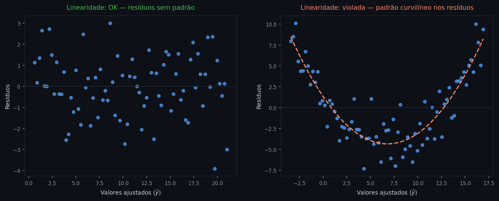

À esquerda, resíduos sem padrão: a relação é de fato linear e o modelo captura bem a estrutura dos dados. À direita, resíduos em forma de U: o modelo ajustou uma reta a uma relação curvilínea — a curva vermelha tracejada evidencia o padrão sistemático não capturado.

**2. Homocedasticidade**

A variância dos resíduos é constante — $\text{Var}(\varepsilon_i) = \sigma^2$ para todo $i$, independente do valor de $x$. Quando a variância cresce com $x$ (heterocedasticidade), o OLS ainda é não-viesado, mas deixa de ser eficiente: os erros padrão ficam incorretos, comprometendo testes de hipótese e intervalos de confiança.

Como detectar: no gráfico de resíduos vs $\hat{y}$, a dispersão deve ser constante ao longo do eixo horizontal. Um padrão em leque — dispersão crescente — indica heterocedasticidade.

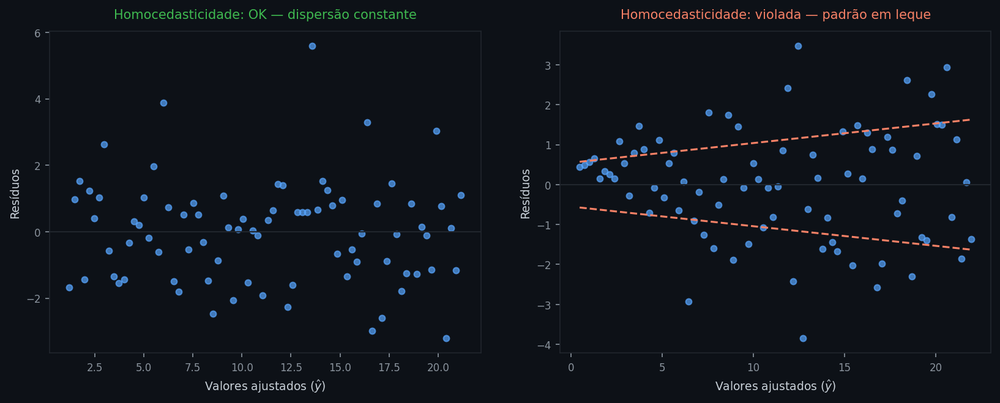

À esquerda, dispersão constante dos resíduos ao longo de todo o intervalo de $\hat{y}$: homocedasticidade satisfeita. À direita, padrão em leque — as linhas tracejadas delimitam o envelope crescente dos resíduos, revelando que a variância aumenta com os valores ajustados.

**3. Independência**

Os resíduos $\varepsilon_i$ são não correlacionados entre si. Essa premissa é tipicamente violada em dados temporais — o erro de hoje está correlacionado com o de ontem — ou em dados agrupados. A violação não vicia os coeficientes, mas subestima os erros padrão, tornando os testes de hipótese excessivamente otimistas.

Como detectar: em séries temporais, o teste de Durbin-Watson ou o gráfico de autocorrelação (ACF) dos resíduos. Em dados transversais, verificar se há estrutura de grupo não modelada.

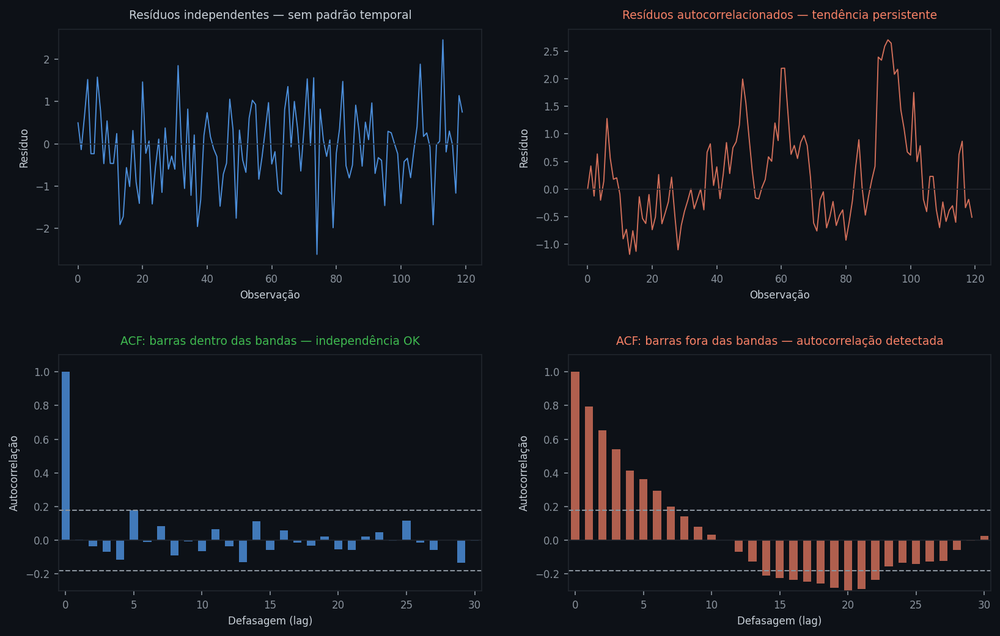

Cada coluna corresponde a um cenário. À esquerda, resíduos independentes: a série temporal não exibe tendência nem ciclo, e as barras do ACF ficam dentro das bandas tracejadas (intervalo de confiança a 95%) para todas as defasagens — nenhuma autocorrelação significativa. À direita, resíduos com autocorrelação AR(1): a série exibe persistência visível — quando o resíduo sobe, tende a continuar subindo — e o ACF mostra barras fora das bandas nas primeiras defasagens, decaindo lentamente. Esse padrão indica violação da premissa de independência.

**4. Normalidade dos resíduos**

Os resíduos seguem distribuição normal: $\varepsilon_i \sim \mathcal{N}(0, \sigma^2)$. Esta é a premissa mais flexível: não é necessária para estimar os coeficientes nem para que eles sejam não-viesados. Torna-se relevante apenas para inferência — testes $t$, testes $F$ e intervalos de confiança assumem normalidade dos resíduos. Em amostras grandes, o Teorema Central do Limite garante que a distribuição amostral dos estimadores se aproxima da normal mesmo sem essa premissa.

Como detectar: o **QQ-plot** (quantil-quantil) compara os quantis dos resíduos observados com os quantis teóricos de uma normal. Se os pontos seguem a linha diagonal, a normalidade é razoável; desvios nas extremidades indicam caudas pesadas.

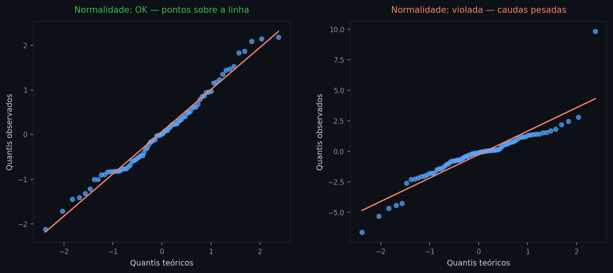

À esquerda, resíduos normais: os pontos seguem a linha vermelha ao longo de toda a amplitude. À direita, resíduos com caudas pesadas: os pontos desviam nas extremidades, indicando que valores extremos ocorrem com mais frequência do que o esperado pela normal — comum em dados financeiros.

---

## Regressão Linear Múltipla

### Intuição

Na prática, raramente uma única variável explica o que queremos prever — preços dependem de vários fatores, retornos de múltiplos ativos, risco de vários indicadores. Com $p$ variáveis preditoras, a reta deixa de existir e o modelo passa a ajustar um **hiperplano**:

$$\hat{y} = \hat{\beta}_0 + \hat{\beta}_1 x_1 + \hat{\beta}_2 x_2 + \cdots + \hat{\beta}_p x_p$$

A intuição geométrica é a mesma — minimizar os resíduos — só que agora em um espaço de dimensão maior. Com dois preditores, por exemplo, o hiperplano é um plano em 3D:

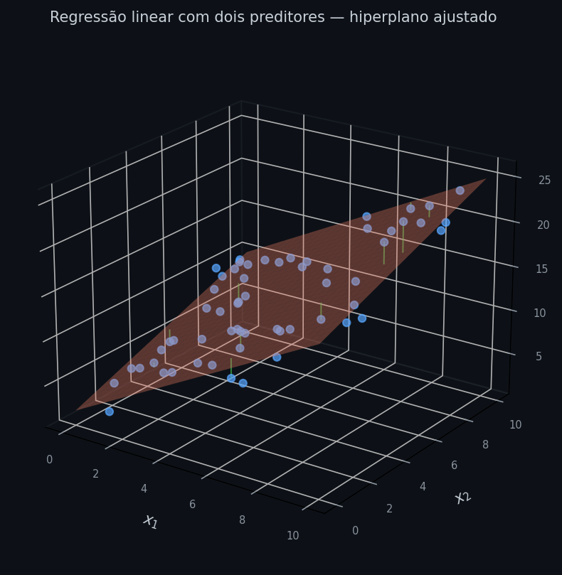

O plano vermelho é o hiperplano ajustado; os pontos azuis são as observações; as linhas verdes são os resíduos — distâncias verticais de cada ponto ao plano. O OLS continua minimizando a soma dos quadrados dessas distâncias.

---

### Definição formal

O modelo se generaliza diretamente: para cada observação $i$,

$$y_i = \beta_0 + \beta_1 x_{i1} + \beta_2 x_{i2} + \cdots + \beta_p x_{ip} + \varepsilon_i$$

onde agora há $p+1$ parâmetros a estimar. Para trabalhar com todas as $n$ observações simultaneamente, a notação matricial compacta o problema. Empilhamos as observações em uma matriz $X$ de dimensão $n \times (p+1)$ e em um vetor $y$ de dimensão $n \times 1$:

$$X = \begin{bmatrix} 1 & x_{11} & \cdots & x_{1p} \\ \vdots & \vdots & & \vdots \\ 1 & x_{n1} & \cdots & x_{np} \end{bmatrix}, \quad y = \begin{bmatrix} y_1 \\ \vdots \\ y_n \end{bmatrix}$$

A coluna de uns merece atenção: o intercepto $\hat{\beta}_0$ não multiplica nenhuma variável — ou melhor, multiplica $1$ em toda observação. A coluna de uns garante que $\hat{\beta}_0$ entre na multiplicação $X\hat{\boldsymbol{\beta}}$ da mesma forma que os demais coeficientes, de modo que o produto $X\hat{\boldsymbol{\beta}}$ reproduza o hiperplano para todas as observações de uma vez:

$$X\hat{\boldsymbol{\beta}} = \begin{bmatrix} \hat{\beta}_0 + \hat{\beta}_1 x_{11} + \cdots + \hat{\beta}_p x_{1p} \\ \vdots \\ \hat{\beta}_0 + \hat{\beta}_1 x_{n1} + \cdots + \hat{\beta}_p x_{np} \end{bmatrix} = \begin{bmatrix} \hat{y}_1 \\ \vdots \\ \hat{y}_n \end{bmatrix}$$

Para tornar isso concreto: suponha que queremos prever o retorno de um ativo ($y$) usando o retorno do mercado ($x_1$) e a variação da taxa de juros ($x_2$), com 4 observações:

| $y$ | $x_1$ | $x_2$ |
|-----|--------|--------|
| 3.1 | 2.0 | 0.5 |
| −0.8 | −1.0 | 1.0 |
| 5.4 | 3.0 | −0.5 |
| 1.2 | 0.0 | 0.0 |

A matriz $X$ e os vetores $y$ e $\hat{\boldsymbol{\beta}}$ ficam:

$$X = \begin{bmatrix} 1 & 2.0 & 0.5 \\ 1 & -1.0 & 1.0 \\ 1 & 3.0 & -0.5 \\ 1 & 0.0 & 0.0 \end{bmatrix}, \quad y = \begin{bmatrix} 3.1 \\ -0.8 \\ 5.4 \\ 1.2 \end{bmatrix}, \quad \hat{\boldsymbol{\beta}} = \begin{bmatrix} \hat{\beta}_0 \\ \hat{\beta}_1 \\ \hat{\beta}_2 \end{bmatrix}$$

Aplicando $\hat{\boldsymbol{\beta}} = (X^\top X)^{-1} X^\top y$ obteríamos os três coeficientes de uma só vez — o intercepto, a sensibilidade ao mercado e a sensibilidade à taxa de juros.

Vale notar que "linear" se refere aos **parâmetros**, não às variáveis. Um modelo como $y = \beta_0 + \beta_1 x^2$ ainda é regressão linear: basta incluir $x^2$ como uma nova coluna em $X$, e o mecanismo de estimação é idêntico.

---

### Estimação: equações normais

O SSR em notação matricial é $\|y - X\boldsymbol{\beta}\|^2$, que expandido fica:

$$\text{SSR}(\boldsymbol{\beta}) = (y - X\boldsymbol{\beta})^\top(y - X\boldsymbol{\beta}) = y^\top y - 2\boldsymbol{\beta}^\top X^\top y + \boldsymbol{\beta}^\top X^\top X\boldsymbol{\beta}$$

O gradiente de SSR em relação a $\boldsymbol{\beta}$ é o vetor das derivadas parciais — uma para cada parâmetro. Derivando e igualando a zero:

$$\frac{\partial\, \text{SSR}}{\partial \boldsymbol{\beta}} = -2X^\top y + 2X^\top X\boldsymbol{\beta} = \boldsymbol{0}$$

Reorganizando, obtemos as **equações normais**:

$$X^\top X\hat{\boldsymbol{\beta}} = X^\top y$$

> O nome vem do sentido geométrico de *normal* — perpendicular. A solução OLS tem a propriedade de que o vetor de resíduos $y - X\hat{\boldsymbol{\beta}}$ é perpendicular ao espaço gerado pelas colunas de $X$. As equações normais expressam exatamente essa condição de perpendicularidade. Não tem relação com normalidade estatística.

Essa é uma equação linear em $\hat{\boldsymbol{\beta}}$. Se $X^\top X$ for invertível, basta multiplicar ambos os lados pela sua inversa:

$$\hat{\boldsymbol{\beta}} = (X^\top X)^{-1} X^\top y$$

O resultado é o vetor com todos os $p+1$ coeficientes estimados de uma só vez — a generalização exata da fórmula escalar do caso simples.

A exigência de que $X^\top X$ seja invertível não é uma restrição adicional imposta por escolha — ela surge naturalmente do último passo da derivação. Todos os passos anteriores (expandir o SSR, calcular o gradiente, reorganizar nas equações normais) são sempre válidos, sem condições. O único passo que pode falhar é multiplicar ambos os lados por $(X^\top X)^{-1}$: se a matriz não for invertível, essa operação não existe. Matematicamente, isso significa que as equações normais ainda valem — mas têm infinitas soluções, não uma única. Intuitivamente: se dois preditores são linearmente dependentes (um é múltiplo do outro, por exemplo), o modelo não consegue distinguir o efeito de cada um — qualquer combinação dos dois que produza o mesmo $\hat{y}$ é igualmente ótima.

---

### Interpretando os coeficientes

Na regressão múltipla, cada coeficiente $\hat{\beta}_j$ mede o efeito **parcial** de $x_j$ sobre $\hat{y}$ — ou seja, quanto $\hat{y}$ muda para cada +1 unidade em $x_j$, mantendo todos os demais preditores fixos. Essa é a diferença fundamental em relação ao caso simples: no caso simples, $\hat{\beta}_1$ captura o efeito total de $x$ sobre $y$; no caso múltiplo, cada $\hat{\beta}_j$ isola o efeito de sua variável, controlando pelas demais.

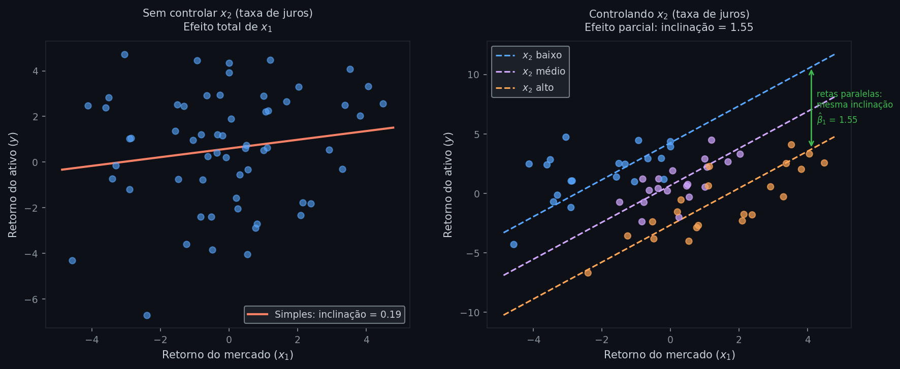

O mesmo conjunto de dados, dois modelos diferentes. **Esquerda:** regressão simples de $y$ (retorno do ativo) em $x_1$ (retorno do mercado) — a inclinação estimada é 0.19, mas $x_1$ e $x_2$ (taxa de juros) são correlacionados, então parte do efeito de $x_2$ está embutido nessa estimativa. **Direita:** regressão múltipla controlando por $x_2$ — as três retas correspondem a níveis baixo, médio e alto de $x_2$, e são todas paralelas com inclinação 1.55. A inclinação não muda com $x_2$ porque o modelo a isolou: 1.55 é o efeito de $x_1$ *dado* $x_2$ fixo. A diferença entre 0.19 e 1.55 é inteiramente explicada pelo fato de que $x_1$ e $x_2$ são correlacionados — sem controlar $x_2$, o modelo simples subestima o efeito real de $x_1$.

---

### Medindo o ajuste: R² e R² ajustado

As métricas de erro da regressão simples — MAE, MSE e RMSE — continuam válidas aqui sem alteração: os resíduos $e_i = y_i - \hat{y}_i$ são calculados da mesma forma, independente do número de preditores. O que muda é o $R^2$.

O $R^2$ definido no caso simples continua válido aqui. O problema é que ele **sempre aumenta** quando um novo preditor é adicionado ao modelo — mesmo que esse preditor seja irrelevante — porque qualquer variável adicional, por pior que seja, nunca piora o ajuste in-sample. Isso torna o $R^2$ um critério enganoso para comparar modelos com números diferentes de preditores.

O **$R^2$ ajustado** corrige esse comportamento penalizando o número de parâmetros estimados:

$$\bar{R}^2 = 1 - \frac{(1 - R^2)(n - 1)}{n - p - 1}$$

onde $n$ é o número de observações e $p$ o número de preditores. O fator $(n-1)/(n-p-1)$ cresce com $p$ — quanto mais preditores, maior a penalidade. Se um novo preditor não contribuir o suficiente para reduzir os resíduos, o $\bar{R}^2$ cai. Ao contrário do $R^2$, o $\bar{R}^2$ pode diminuir quando adicionamos variáveis pouco informativas.

Mesmo assim, o $\bar{R}^2$ tem seus próprios limites em três situações:

- **Transformações de $y$**: se um modelo prevê $\log(y)$ e outro prevê $y$ diretamente, os dois $\bar{R}^2$ medem proporções de variância em escalas diferentes — comparar os valores é como comparar preços em reais e dólares sem converter. A comparação correta exige calcular o erro dos dois modelos na mesma escala, por exemplo o RMSE de $y$.
- **Seleção entre muitos candidatos**: quando testamos dezenas de modelos e escolhemos o de maior $\bar{R}^2$, o valor selecionado tende a ser inflado por coincidência — estamos fazendo seleção, não estimação. Métricas baseadas em validação cruzada ou critérios de informação como AIC e BIC são mais honestas nesse cenário.
- **Séries temporais com tendência comum**: se $y$ e os preditores crescem juntos ao longo do tempo por razões externas (inflação, crescimento econômico), o $\bar{R}^2$ pode ser alto mesmo sem relação causal. O modelo captura a tendência compartilhada, não o sinal.

---

### Significância estatística

O $\bar{R}^2$ informa *quanto* da variância de $y$ o modelo captura — mas não responde se os coeficientes estimados são distinguíveis de zero ou poderiam ser apenas ruído amostral. Há dois testes que respondem a isso em níveis diferentes.

**t-test — significância individual de cada $\hat{\beta}_j$**

Para cada preditor $x_j$, testamos $H_0\text{: }\beta_j = 0$ — o preditor não tem efeito sobre $y$, controlando pelos demais. A estatística é:

$$t_j = \frac{\hat{\beta}_j}{\text{SE}(\hat{\beta}_j)}, \qquad \text{SE}(\hat{\beta}_j) = \sqrt{\hat{\sigma}^2\,\left[(X^\top X)^{-1}\right]_{jj}}$$

onde $\hat{\sigma}^2 = \text{SSE}/(n-p-1)$ é a variância residual estimada e $[(X^\top X)^{-1}]_{jj}$ é o $j$-ésimo elemento diagonal da matriz de covariância dos estimadores — já derivada na seção de estimação. Sob $H_0$ e com as premissas satisfeitas, $t_j$ segue uma distribuição $t$ com $n - p - 1$ graus de liberdade. O intervalo de confiança a 95% correspondente é $\hat{\beta}_j \pm t_{0.025} \cdot \text{SE}(\hat{\beta}_j)$: se esse intervalo não cruzar zero, o coeficiente é significativo a 5%.

É o análogo direto do teste de Wald da regressão logística — a diferença é que aqui a distribuição é $t$ em vez de normal padrão, porque $\sigma^2$ é estimado dos dados em vez de ser conhecido.

**F-test — significância global do modelo**

O t-test examina cada coeficiente isoladamente. O F-test responde se o conjunto dos $p$ preditores é significativamente melhor do que o modelo nulo — que prevê sempre $\bar{y}$. A hipótese nula é $H_0\text{: }\beta_1 = \cdots = \beta_p = 0$. A estatística decompõe a variância total:

$$F = \frac{R^2/p}{(1 - R^2)/(n - p - 1)} \;\sim\; F(p,\; n - p - 1)$$

Numerador é a variância explicada por preditor; denominador é a variância residual por grau de liberdade. A fórmula torna explícita a dependência de $n$: um $R^2 = 0.15$ pode ser altamente significativo com $n = 500$ e não significativo com $n = 30$ — a mesma proporção explicada tem evidência estatística muito diferente dependendo do tamanho da amostra.

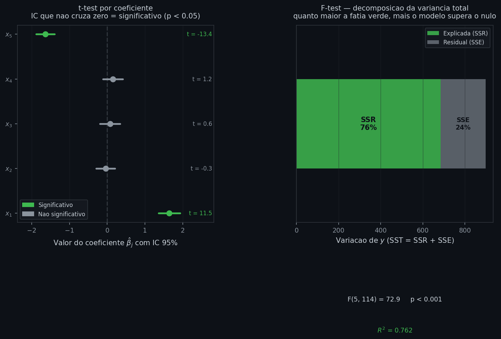

À esquerda, o gráfico de coeficientes: cada ponto é $\hat{\beta}_j$ e o segmento é o intervalo de confiança de 95%. $x_1$ e $x_5$, cujos intervalos não cruzam zero, são significativos (verde); $x_2$, $x_3$ e $x_4$ não se distinguem de zero com os dados disponíveis — os valores de $t$ confirmam isso. À direita, a decomposição da variância total: a porção verde é $SSR$ (explicada pelo modelo), a cinza é $SSE$ (residual). O F-test compara as duas parcelas; os valores de $F$ e $R^2$ na base conectam diretamente a decomposição visual à fórmula acima.

---

### Trade-off viés-variância

O $R^2$ sempre aumenta com mais preditores porque o modelo fica mais flexível — mas flexibilidade em excesso é um problema. Esse é o **trade-off viés-variância**, central em todos os modelos de ML.

**Viés** mede o erro sistemático do modelo: o quanto ele erra em média, independente dos dados. Um modelo com poucos preditores pode ser incapaz de capturar padrões reais — **underfitting** — resultando em viés alto. **Variância** mede a sensibilidade do modelo aos dados de treino: um modelo com muitos preditores pode se ajustar ao ruído específico da amostra — **overfitting** — e generalizar mal para novos dados, resultando em variância alta.

Na regressão linear, o trade-off aparece diretamente na escolha de quantos preditores incluir:

- **Poucos preditores** → modelo simples, viés alto, variância baixa. Erra sistematicamente, mas de forma estável.
- **Muitos preditores** → modelo complexo, viés baixo, variância alta. Ajusta bem os dados de treino, mas generaliza mal.

O ponto ótimo está entre os dois extremos. É exatamente por isso que o $R^2$ ajustado penaliza preditores adicionais e que a regularização (Ridge, Lasso) existe — ambos são mecanismos para controlar a variância sem deixar o viés crescer demais.

---

### Premissas

As quatro premissas da regressão simples — linearidade, homocedasticidade, independência e normalidade dos resíduos — continuam valendo aqui, com uma nuance: na regressão múltipla, a homocedasticidade e a linearidade devem valer em relação a todos os preditores simultaneamente, tornando o diagnóstico mais exigente. O gráfico de resíduos vs $\hat{y}$ continua sendo a ferramenta principal.

A regressão múltipla acrescenta uma quinta premissa, exclusiva deste caso:

**5. Ausência de multicolinearidade**

Nenhum preditor pode ser uma combinação linear exata dos demais. Multicolinearidade perfeita torna $X^\top X$ não invertível e inviabiliza a estimação. Mesmo a multicolinearidade moderada — preditores correlacionados, mas não perfeitamente dependentes — produz efeitos práticos sérios:

- **Erros padrão inflados:** a incerteza sobre cada $\hat{\beta}_j$ aumenta, tornando os intervalos de confiança mais largos e os testes de hipótese menos confiáveis — um preditor relevante pode parecer insignificante.
- **Coeficientes instáveis:** pequenas mudanças nos dados podem provocar grandes variações nos valores estimados ou até inversão de sinal. O modelo é sensível demais à amostra.
- **Interpretação comprometida:** o efeito parcial de $x_j$ não pode ser isolado com precisão quando $x_j$ e outro preditor se movem juntos — o modelo não consegue separar as contribuições.

Como detectar: o **VIF** (Variance Inflation Factor) mede, para cada preditor $x_j$, o quanto sua variância estimada aumenta devido à correlação com os demais. Ele é calculado regredindo $x_j$ sobre todos os outros preditores e usando o $R^2$ resultante:

$$\text{VIF}_j = \frac{1}{1 - R^2_j}$$

onde $R^2_j$ é o coeficiente de determinação dessa regressão auxiliar. $\text{VIF} = 1$ indica ausência de multicolinearidade; valores acima de 5 merecem atenção; acima de 10 são considerados problemáticos. Como mitigação: remover um dos preditores colineares, combiná-los em um índice, ou aplicar regularização (Ridge em particular é eficaz nesse cenário).

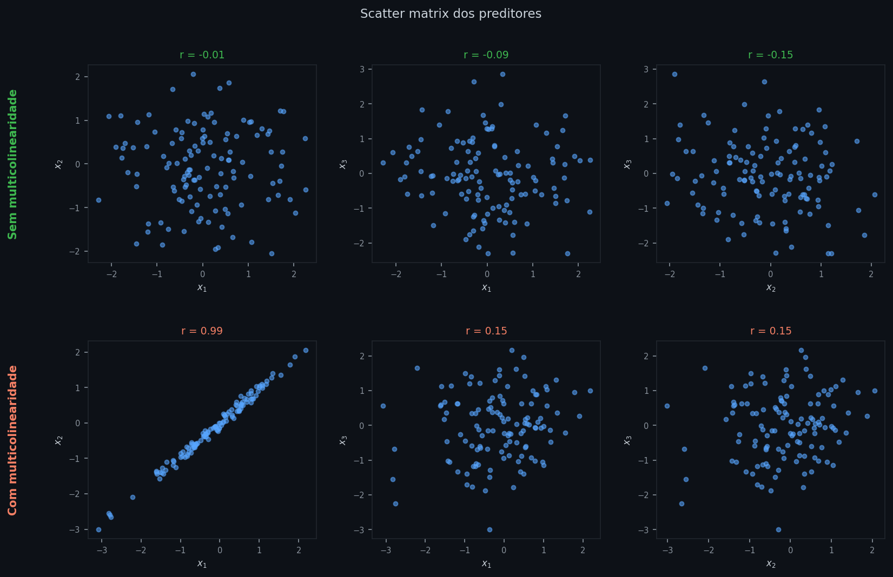

A scatter matrix exibe os scatterplots de todos os pares de preditores. Na linha superior (sem multicolinearidade), os três pares mostram correlações próximas de zero — os pontos se dispersam sem direção preferencial. Na linha inferior (com multicolinearidade), $x_1$ e $x_2$ têm correlação próxima de 1: os pontos formam uma linha quase perfeita, indicando que as duas variáveis carregam essencialmente a mesma informação. Nesse cenário, o modelo não consegue separar os efeitos de $x_1$ e $x_2$ — e o VIF de ambos seria muito alto.

---

### Parâmetros e hiperparâmetros

O OLS base não possui hiperparâmetros: os únicos valores que o algoritmo determina são os parâmetros $\hat{\boldsymbol{\beta}}$ — estimados analiticamente a partir dos dados, sem nenhuma escolha prévia do praticante. Hiperparâmetros surgem apenas nas variações abaixo, onde restrições externas são impostas ao critério de estimação.

### Variações do OLS

O OLS é o ponto de partida, mas cada limitação que ele encontra deu origem a uma variação:

- **Ridge e Lasso** — quando há muitos preditores ou multicolinearidade, adicionam uma penalidade aos coeficientes para controlar o overfitting. Aprofundado em `02_regularizacao.md`.
- **GLS** — quando os resíduos têm variância não constante ou são correlacionados, pondera as observações para restaurar as premissas do OLS.
- **Regressão Quantílica** — quando outliers distorcem a média ou o interesse é modelar outro ponto da distribuição de $y$, substitui o critério quadrático pelo valor absoluto dos resíduos.
- **Gradiente Descendente** — quando $n$ ou $p$ são grandes demais, encontra os mesmos $\hat{\beta}$ de forma iterativa, sem fórmula fechada. A comparação prática com o OLS analítico envolve três eixos: **custo computacional** (calcular $X^\top X$ custa $O(np^2)$ operações e invertê-la $O(p^3)$ — com milhares de preditores isso fica proibitivo; o GD gasta $O(np)$ por iteração); **escalabilidade** (OLS precisa que $X^\top X$ caiba inteiramente na memória, o que é inviável para dados muito grandes; o GD pode processar subconjuntos dos dados, os chamados mini-batches); **estabilidade numérica** (inverter $X^\top X$ diretamente pode ser instável quando há multicolinearidade; o GD, especialmente com regularização, lida melhor com esse cenário). Em problemas com $p$ de centenas a poucos milhares e $n$ manejável, o OLS analítico é preferível — entrega a solução exata de uma vez. Com $p$ ou $n$ muito grandes, o GD é o único caminho viável.

---

## Regressão Logística

### Intuição

A regressão linear produz valores contínuos — e isso é exatamente o que queremos quando o alvo é um número como retorno, preço ou temperatura. Mas quando o alvo é binário — inadimplente ou não, fraude ou transação legítima, default ou não — o problema muda de natureza. Queremos modelar uma **probabilidade**, e probabilidades têm uma restrição que a reta linear ignora: precisam ficar entre 0 e 1.

Aplicar a regressão linear diretamente a um target binário produz dois problemas simultâneos. Primeiro, o modelo gera previsões fora do intervalo $[0, 1]$: para valores altos do preditor, a reta ultrapassa 1; para valores baixos, cai abaixo de 0. Isso não tem interpretação como probabilidade. Segundo, o relacionamento entre um preditor contínuo e a probabilidade de um evento raramente é linear — a probabilidade muda lentamente nas extremas e acelera no meio, seguindo uma forma em S.

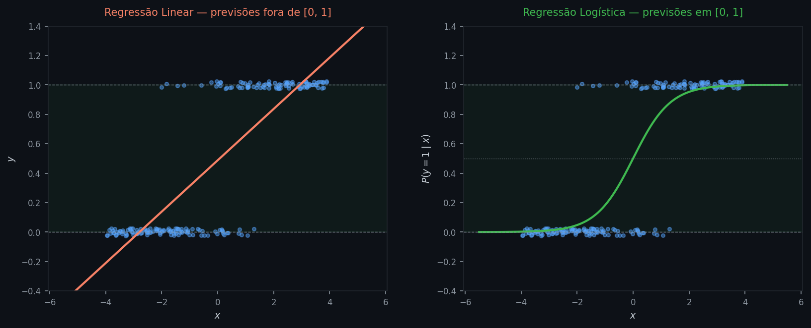

Os dois painéis mostram os mesmos dados: pontos em 0 (classe negativa) e 1 (classe positiva) distribuídos ao longo de um preditor contínuo. À esquerda, a reta linear de OLS: ultrapassa 1 nos valores altos do preditor e cai abaixo de 0 nos baixos, tornando as previsões não interpretáveis como probabilidade. À direita, a curva logística: permanece dentro de $[0, 1]$ para qualquer valor do preditor e captura a aceleração central da probabilidade — a região onde o modelo tem mais incerteza.

O que resolve os dois problemas é a **função sigmoide** (ou logística). Ela toma qualquer valor real — positivo, negativo, muito grande, muito pequeno — e o comprime suavemente para o intervalo $(0, 1)$:

$$\sigma(z) = \frac{1}{1 + e^{-z}}$$

A ideia da regressão logística é combinar a estrutura linear que já conhecemos com a sigmoide: calculamos o combinador linear $z = \beta_0 + \beta_1 x$ e passamos o resultado pela sigmoide para obter uma probabilidade. O modelo não prevê diretamente o valor 0 ou 1 — prevê a **probabilidade de pertencer à classe 1**.

---

### Definição formal

Dados $n$ pares $(x_i, y_i)$ com $y_i \in \{0, 1\}$, a regressão logística modela a probabilidade condicional de $y_i = 1$ dado $x_i$:

$$P(y_i = 1 \mid x_i) = \sigma(\beta_0 + \beta_1 x_i) = \frac{1}{1 + e^{-(\beta_0 + \beta_1 x_i)}}$$

| Símbolo | Nome | Papel |
|---|---|---|
| $y_i$ | variável dependente binária | 0 ou 1 — o que queremos prever |
| $x_i$ | variável preditora | o que usamos para prever |
| $\beta_0$ | intercepto | parâmetro a estimar — desloca a curva horizontalmente |
| $\beta_1$ | coeficiente angular | parâmetro a estimar — controla a inclinação da curva |
| $\sigma(\cdot)$ | função sigmoide | transforma qualquer real em probabilidade em $(0, 1)$ |

Para entender o que o modelo está fazendo internamente, é útil reorganizar a equação. Se $p = P(y = 1 \mid x)$, então:

$$\frac{p}{1-p} = e^{\beta_0 + \beta_1 x}$$

O termo $\frac{p}{1-p}$ é a **odds** — a razão entre a probabilidade de ocorrência e a de não-ocorrência. Aplicando logaritmo em ambos os lados:

$$\log\!\left(\frac{p}{1-p}\right) = \beta_0 + \beta_1 x$$

O lado esquerdo é o **log-odds** (também chamado de **logit**): ele transforma uma probabilidade em $(0, 1)$ em um valor no intervalo $(-\infty, +\infty)$. O lado direito é exatamente o combinador linear da regressão linear. Isso revela a estrutura do modelo: a regressão logística é uma regressão linear dos log-odds — o que é linear não é a probabilidade, mas o log-odds.

---

### Fronteira de decisão

A equação do log-odds cria um objeto geométrico direto: a **fronteira de decisão**. Classificamos com $\hat{y} = 1$ quando $\hat{p} \geq 0.5$, o que equivale a log-odds $\geq 0$, portanto:

$$\hat{y} = 1 \iff \beta_0 + \beta_1 x \geq 0$$

O conjunto de pontos onde o log-odds é exatamente zero — $\beta_0 + \beta_1 x = 0$ — é a fronteira. Em uma dimensão é um ponto $x^* = -\beta_0/\beta_1$; com dois preditores é uma reta; com $p$ preditores é um **hiperplano** em $\mathbb{R}^p$.

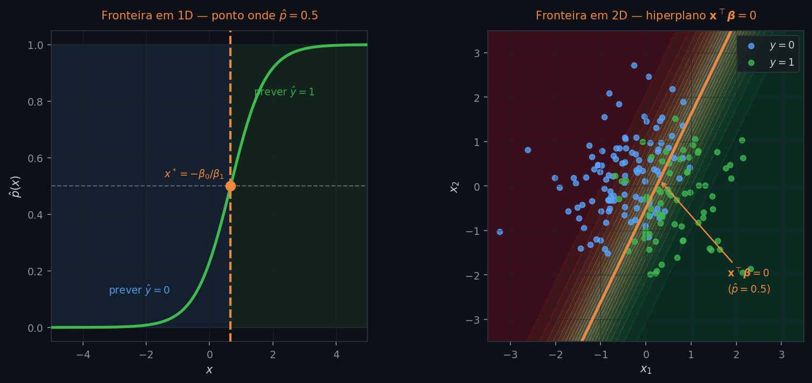

À esquerda, a curva sigmoide com a fronteira marcada em laranja: o ponto $x^* = -\beta_0/\beta_1$ divide o eixo em duas regiões de classificação. À direita, o mesmo conceito em dois preditores: a fronteira deixa de ser um ponto e passa a ser uma reta — o hiperplano $\mathbf{x}^\top\boldsymbol{\beta} = 0$ — que separa as duas classes no espaço de $x_1$ e $x_2$. O gradiente de cores é a superfície de probabilidade; a linha laranja é onde ela cruza $\hat{p} = 0.5$.

Essa estrutura reaparece em SVMs (que também encontram um hiperplano separador) e é o que cada neurônio de uma rede neural implementa individualmente. É o motivo pelo qual a regressão logística é dita um **classificador linear**: não porque a probabilidade seja linear em $x$, mas porque a fronteira de decisão é.

---

### Estimação: por que não OLS e como funciona o MLE

O OLS minimiza a soma dos quadrados dos resíduos — uma função quadrática convexa com solução fechada. Quando o target é binário, aplicar esse critério não é apenas inconveniente: é conceitualmente errado. O OLS trata os resíduos como simétricos e de variância constante, mas quando $y \in \{0, 1\}$, a variância do erro depende de $p$ — ela é máxima quando $p = 0.5$ e cai a zero quando $p \to 0$ ou $p \to 1$. Além disso, minimizar quadrados sobre um target binário não leva à solução sigmoide — a estrutura da sigmoide não emerge naturalmente do critério quadrático.

A abordagem correta é a **Estimação por Máxima Verossimilhança (MLE)**. A ideia é perguntar: quais valores de $\beta_0$ e $\beta_1$ tornam os dados observados mais prováveis?

Para cada observação $i$, a probabilidade de observar $y_i$ dado o modelo é:

$$P(y_i \mid x_i, \beta_0, \beta_1) = p_i^{y_i}(1 - p_i)^{1 - y_i}$$

onde $p_i = \sigma(\beta_0 + \beta_1 x_i)$. Quando $y_i = 1$, o fator $(1-p_i)^0 = 1$ e sobra $p_i$ — a probabilidade de acerto. Quando $y_i = 0$, o fator $p_i^0 = 1$ e sobra $(1-p_i)$ — a probabilidade de acerto no negativo. A **verossimilhança total** supõe independência entre as observações e multiplica as probabilidades individuais:

$$\mathcal{L}(\beta_0, \beta_1) = \prod_{i=1}^n p_i^{y_i}(1 - p_i)^{1 - y_i}$$

Maximizar um produto de termos fracionários é numericamente instável. Aplicando o logaritmo — uma transformação monotônica que preserva o máximo — obtemos a **log-verossimilhança**:

$$\ell(\beta_0, \beta_1) = \sum_{i=1}^n \left[ y_i \log p_i + (1 - y_i)\log(1 - p_i) \right]$$

onde $p_i = \sigma(\beta_0 + \beta_1 x_i)$. Maximizar $\ell$ é equivalente a minimizar o negativo dela — a **log-loss** (ou entropia cruzada binária), que reaparece na seção de avaliação como métrica de desempenho.

Diferentemente do OLS, essa função não tem solução fechada: a sigmoide dentro do logaritmo cria uma equação transcendental sem forma analítica. Os parâmetros são encontrados por otimização iterativa — tipicamente **gradiente descendente** ou métodos de segunda ordem como Newton-Raphson, que convergem em poucas iterações porque a log-verossimilhança é côncava (única solução global).

Para ver como a otimização funciona concretamente, vale calcular o gradiente da log-verossimilhança em relação ao vetor de parâmetros. Derivando $\ell$ em relação a $\boldsymbol{\beta}$ e usando a propriedade da sigmoide $\sigma'(z) = \sigma(z)(1 - \sigma(z))$:

$$\nabla_{\boldsymbol{\beta}}\,\ell = X^\top(y - \hat{p})$$

onde $y$ é o vetor de rótulos binários e $\hat{p}$ é o vetor de probabilidades previstas. O resultado espelha o que acontece no OLS — onde o gradiente do SSR também tem a forma $X^\top e$ — mas agora os "resíduos" são diferenças entre rótulos e probabilidades, não entre valores contínuos. Cada passo do gradiente descendente empurra os parâmetros na direção que reduz esses resíduos probabilísticos.

---

### Interpretando os coeficientes e avaliando sua significância

Com os parâmetros estimados em mãos, a curva ajustada é:

$$\hat{p}(x) = \frac{1}{1 + e^{-(\hat{\beta}_0 + \hat{\beta}_1 x)}}$$

Os coeficientes $\hat{\beta}_0$ e $\hat{\beta}_1$ não se interpretam diretamente como na regressão linear — a relação entre $x$ e $\hat{p}$ é não-linear. A interpretação natural passa pelos log-odds.

**$\hat{\beta}_1$ — o efeito do preditor:** para cada aumento de +1 unidade em $x$, o log-odds de $y = 1$ aumenta em $\hat{\beta}_1$. Em termos de odds, isso equivale a multiplicar a odds por $e^{\hat{\beta}_1}$: se $\hat{\beta}_1 = 0.5$, a odds aumenta em $e^{0.5} \approx 1.65$ — isto é, 65%. Esse fator $e^{\hat{\beta}_1}$ é o **odds ratio**, a forma mais natural de reportar o efeito em modelos logísticos.

**$\hat{\beta}_0$ — o intercepto:** controla o log-odds quando $x = 0$, ou seja, a posição da curva no eixo horizontal — onde a probabilidade de 0.5 ocorre. Mudá-lo desloca a curva para a esquerda ou direita sem alterar sua forma.

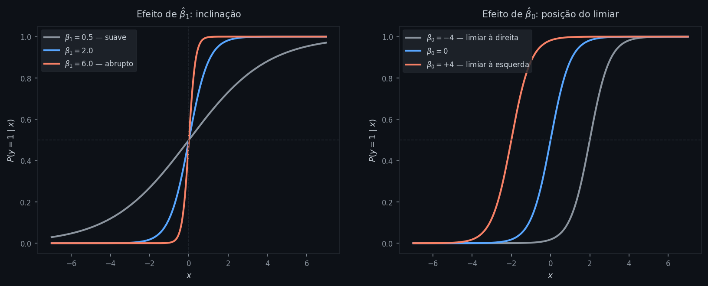

Os dois painéis isolam os efeitos dos parâmetros. À esquerda, três curvas com $\beta_0 = 0$ e $\beta_1$ variando: curvas mais inclinadas correspondem a $\beta_1$ maior em valor absoluto — o modelo passa mais abruptamente de probabilidade baixa para alta. $\beta_1 < 0$ inverte a curva (probabilidade decresce com $x$). À direita, três curvas com $\beta_1$ fixo e $\beta_0$ variando: o ponto de cruzamento em $\hat{p} = 0.5$ se desloca horizontalmente — $\beta_0$ controla o limiar de decisão sem alterar a taxa de transição.

Uma observação importante sobre a conversão de coeficientes em probabilidade: o efeito de uma variação unitária em $x$ sobre $\hat{p}$ **não é constante** — ele depende de onde estamos na curva. O impacto é máximo na região central (em torno do ponto de inflexão, onde $\hat{p} \approx 0.5$) e diminui nas extremas. Por isso, reportar odds ratios é mais informativo do que tentar descrever efeitos em probabilidade sem especificar o ponto de avaliação.

Saber o valor do odds ratio é uma coisa — saber se ele é estatisticamente diferente de 1 é outra. Dois testes respondem a essa pergunta, e os dois testam a hipótese nula $H_0\text{: }\beta_j = 0$ (equivalentemente, odds ratio = 1, nenhum efeito do preditor):

O **teste de Wald** divide o estimador pelo seu erro padrão:

$$z = \frac{\hat{\beta}_j}{\text{SE}(\hat{\beta}_j)}$$

Sob $H_0$, essa estatística segue aproximadamente uma normal padrão — a mesma lógica do teste $t$ da regressão linear, mas usando a distribuição normal porque o MLE é um estimador de grandes amostras. Valores $|z| > 1.96$ correspondem a $p < 0.05$.

O **Teste da Razão de Verossimilhança (LRT)** compara diretamente a log-verossimilhança do modelo completo com a do modelo sem o preditor em questão:

$$\text{LRT} = 2\,(\ell_{\text{completo}} - \ell_{\text{reduzido}}) \;\sim\; \chi^2(1)$$

A multiplicação por 2 garante que a estatística siga uma qui-quadrado com 1 grau de liberdade. O LRT é preferível ao Wald quando a amostra é pequena ou quando os coeficientes são grandes em magnitude — nesses casos, o Wald perde precisão porque calcula o erro padrão localmente, enquanto o LRT compara o ajuste global dos dois modelos. Em amostras razoáveis, os dois costumam concordar; a diferença aparece nos limites: separação quase perfeita, preditores com alta correlação ou poucos eventos por preditor.

---

### Generalização: múltiplos preditores e mais de duas classes

A extensão para $p$ preditores segue a mesma lógica da regressão linear múltipla. O combinador linear cresce para incluir todos os preditores:

$$\log\!\left(\frac{P(y=1 \mid \mathbf{x})}{P(y=0 \mid \mathbf{x})}\right) = \beta_0 + \beta_1 x_1 + \beta_2 x_2 + \cdots + \beta_p x_p$$

Em notação matricial: $\log\text{-odds} = \mathbf{x}^\top \boldsymbol{\beta}$, e a probabilidade é $\hat{p} = \sigma(\mathbf{x}^\top \boldsymbol{\beta})$. Cada $\hat{\beta}_j$ continua sendo um efeito parcial — a variação no log-odds associada a +1 unidade em $x_j$, mantendo os demais preditores fixos.

Quando o problema tem mais de duas classes ($k > 2$), a regressão logística binária não se aplica diretamente. A generalização natural é a **regressão logística multinomial**, que estima um vetor de coeficientes por classe e usa a função **softmax** para converter os $k$ combinadores lineares em probabilidades que somam 1:

$$P(y = c \mid \mathbf{x}) = \frac{e^{\mathbf{x}^\top \boldsymbol{\beta}_c}}{\sum_{j=1}^k e^{\mathbf{x}^\top \boldsymbol{\beta}_j}}, \quad c = 1, \dots, k$$

A sigmoide binária é um caso especial do softmax com $k = 2$.

Uma abordagem alternativa ao softmax é o **One-vs-Rest (OvR)**: em vez de um modelo conjunto, treinam-se $k$ classificadores binários independentes — cada um aprende a separar uma classe das demais. Para classificar um novo ponto, aplica-se cada classificador e atribui-se a classe com maior $\hat{p}$.

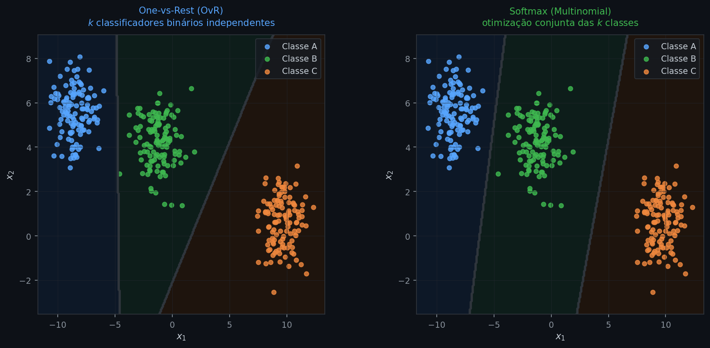

Os dois painéis mostram o mesmo conjunto de três classes. À esquerda (OvR): cada fronteira foi treinada de forma isolada; como os $k$ classificadores não se enxergam, as probabilidades das classes não somam 1 por construção — em regiões ambíguas, nenhum modelo tem confiança clara. À direita (Softmax): uma única otimização garante $\sum_c \hat{p}_c = 1$ para todo ponto, tornando as fronteiras geometricamente coerentes.

A diferença prática: OvR é o default do scikit-learn (`multi_class='ovr'`) e funciona com qualquer classificador binário, não apenas o logístico — o que o torna útil quando se quer usar SVMs ou Lasso em problemas de muitas classes. Softmax é preferível quando a calibração das probabilidades importa ou quando as classes não são mutuamente independentes, pois a normalização conjunta é garantida por construção.

---

### Medindo o ajuste

O $R^2$ da regressão linear mede a proporção da variância explicada — um conceito que não se transfere naturalmente para targets binários. Aqui o diagnóstico se faz em dois planos complementares: avaliação das **classificações** (depois de aplicar um limiar sobre $\hat{p}$) e avaliação das **probabilidades** diretamente.

**Matriz de confusão e métricas derivadas**

Para classificar, escolhemos um limiar $\tau$ (tipicamente 0.5) e definimos: $\hat{y} = 1$ se $\hat{p} \geq \tau$, e $\hat{y} = 0$ caso contrário. A **matriz de confusão** tabula as quatro combinações possíveis de predição e realidade:

|  | $\hat{y} = 1$ | $\hat{y} = 0$ |
|---|---|---|
| $y = 1$ | Verdadeiro Positivo (VP) | Falso Negativo (FN) |
| $y = 0$ | Falso Positivo (FP) | Verdadeiro Negativo (VN) |

Dela derivam as principais métricas:

$$\text{Precisão} = \frac{VP}{VP + FP}, \qquad \text{Recall} = \frac{VP}{VP + FN}, \qquad F_1 = \frac{2 \cdot \text{Precisão} \cdot \text{Recall}}{\text{Precisão} + \text{Recall}}$$

A **precisão** responde: dos casos que o modelo sinalizou como positivo, quantos eram de fato positivos? O **recall** (ou sensibilidade) responde: dos casos que são realmente positivos, quantos o modelo capturou? Os dois estão em conflito — aumentar o recall (capturar mais positivos) geralmente reduz a precisão (sinalizar mais falsos positivos). O **F₁** é a média harmônica dos dois, penalizando desbalanços extremos.

A acurácia — proporção de classificações corretas — é uma métrica intuitiva, mas enganosa quando as classes são desbalanceadas. Um dataset em que 95% dos casos são negativos permite um modelo que sempre prevê 0 atingir 95% de acurácia sem aprender nada. Nesses cenários, precisão, recall e F₁ são mais informativos.

**Curva ROC e AUC**

A escolha do limiar $\tau$ é arbitrária — e diferentes problemas têm diferentes tolerâncias a falsos positivos e falsos negativos. A **curva ROC** (Receiver Operating Characteristic) avalia o modelo em **todos os limiares possíveis** simultaneamente, traçando o par (Taxa de Falsos Positivos, Recall) para cada valor de $\tau$:

$$\text{Taxa de FP} = \frac{FP}{FP + VN}, \qquad \text{Recall} = \frac{VP}{VP + FN}$$

O ponto $(0, 0)$ corresponde a $\tau = 1$ — o modelo nunca classifica ninguém como positivo. O ponto $(1, 1)$ corresponde a $\tau = 0$ — o modelo classifica todos como positivos. Um modelo aleatório caminha pela diagonal: para cada falso positivo capturado, captura um verdadeiro positivo na mesma proporção — sem nenhum poder discriminativo. Um modelo perfeito sobe diretamente para $(0, 1)$ e fica lá.

A **AUC** (Área sob a Curva ROC) resume a curva inteira em um único número entre 0 e 1. Interpretação: AUC é a probabilidade de que, dado um par aleatório (positivo, negativo), o modelo atribua maior $\hat{p}$ ao positivo. AUC = 0.5 equivale ao modelo aleatório; AUC = 1 é perfeição; valores acima de 0.7 são geralmente considerados úteis.

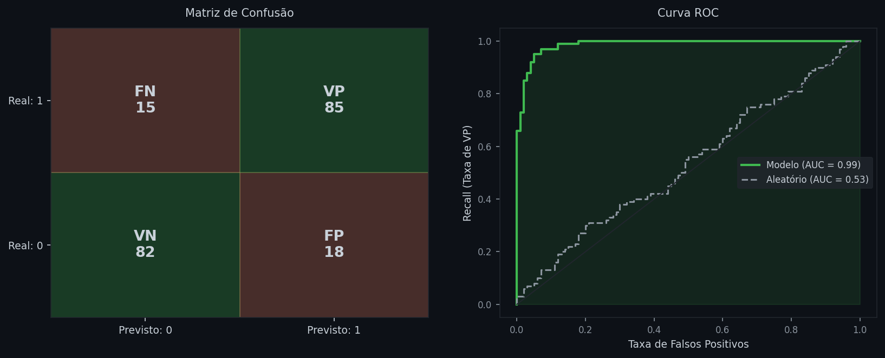

Os dois painéis mostram um mesmo modelo avaliado de formas complementares. À esquerda, a matriz de confusão com os quatro quadrantes coloridos: verde para acertos (VP e VN), vermelho para erros (FP e FN) — uma visualização imediata do tipo de erro predominante. À direita, a curva ROC azul acima da diagonal cinza (modelo aleatório): a área sombreada é a AUC. Quanto maior a área, mais o modelo discrimina positivos de negativos independentemente do limiar escolhido.

**Escolha do limiar**

O limiar padrão $\tau = 0.5$ é adequado quando as classes são equilibradas e os dois tipos de erro têm o mesmo custo. Em outros cenários, ele precisa ser ajustado.

Quando as **classes são desbalanceadas** — 5% de fraudes e 95% de transações legítimas, por exemplo — um modelo que prevê sempre 0 acerta 95% dos casos sem aprender nada, e $\tau = 0.5$ tende a reforçar esse comportamento. Nesses casos, a **curva Precisão–Recall** é mais informativa do que a ROC: ela amplifica a diferença entre modelos na região relevante (os poucos positivos) e ajuda a identificar o limiar que equilibra precisão e recall de acordo com a aplicação.

Ajustar $\tau$ modifica onde se corta a previsão, mas não muda o que o modelo aprendeu. Uma abordagem complementar — que atua durante o treino — é atribuir **pesos de classe** à log-loss, penalizando mais os erros na classe minoritária:

$$\ell_w = -\frac{1}{n}\sum_{i=1}^n \left[ w_1\, y_i \log \hat{p}_i + w_0\,(1 - y_i)\log(1 - \hat{p}_i) \right]$$

onde $w_1$ e $w_0$ são os pesos das classes positiva e negativa. Uma escolha comum é $w_c = n\,/\,(k \cdot n_c)$ — inversamente proporcional à frequência de cada classe — o `class_weight='balanced'` do scikit-learn. Ao contrário do ajuste de $\tau$, os pesos alteram os próprios $\hat{\boldsymbol{\beta}}$ estimados: o modelo aprende uma fronteira de decisão diferente, não apenas aplica um limiar diferente sobre a mesma curva.

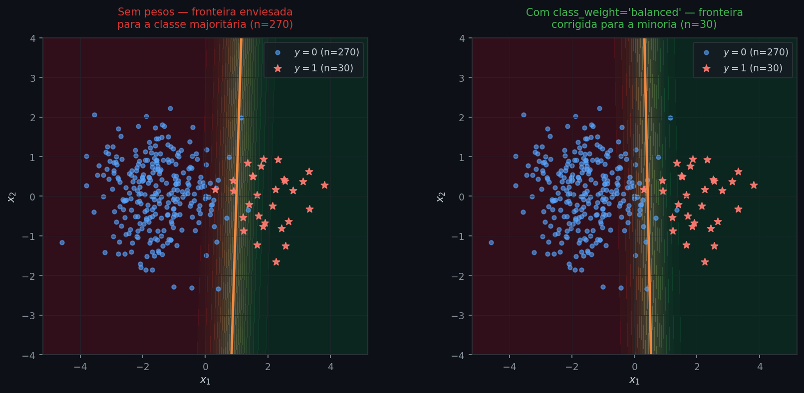

Os dois painéis mostram o mesmo conjunto desbalanceado (90% negativos, 10% positivos). À esquerda, sem pesos: a fronteira (laranja) é empurrada para dentro da região da classe minoritária — o modelo "prefere" prever negativo para minimizar a perda. À direita, com `class_weight='balanced'`: a fronteira desloca-se em direção aos positivos, capturando mais da classe minoritária ao custo de mais falsos positivos. A diferença não está só no limiar — a posição da fronteira de decisão muda porque os próprios coeficientes mudam.

As duas abordagens são complementares: pesos de classe corrigem o modelo durante o treino; o limiar $\tau$ afina a decisão final sobre o modelo já treinado. Em desbalanceamento severo, combinar os dois tende a produzir os melhores resultados.

Quando os **custos de FP e FN são assimétricos** — não detectar uma fraude é mais custoso do que alertar um cliente legítimo — o limiar ótimo minimiza o custo esperado total. Sendo $C_{FP}$ e $C_{FN}$ os custos de cada tipo de erro:

$$\tau^* = \frac{C_{FP}}{C_{FP} + C_{FN}}$$

Um $C_{FN}$ alto empurra $\tau^*$ para baixo — o modelo aceita mais falsos positivos para não perder nenhum positivo real. Um $C_{FP}$ alto faz o oposto. Quando os custos não são conhecidos com precisão, a curva ROC permite visualizar o trade-off e escolher um ponto de operação de forma informada.

**Log-loss**

As métricas anteriores avaliam classificações — decisões binárias após aplicar um limiar. Mas às vezes o que importa é a qualidade das probabilidades em si, não das classificações. A **log-loss** avalia exatamente isso: penaliza previsões de probabilidade com alta confiança que se revelam erradas. É o negativo da log-verossimilhança normalizado pelo número de observações:

$$\text{log-loss} = -\frac{1}{n}\sum_{i=1}^n \left[ y_i \log \hat{p}_i + (1 - y_i) \log(1 - \hat{p}_i) \right]$$

Quanto menor a log-loss, melhor. Um modelo que prevê $\hat{p} = 0.99$ para uma observação onde $y = 0$ é punido muito mais duramente do que um que prevê $\hat{p} = 0.6$ — a confiança equivocada é custosa. Log-loss igual a zero significa previsões perfeitas com probabilidade 1 ou 0 para cada classe.

**Calibração**

Uma propriedade que completa a avaliação probabilística é a **calibração**: um modelo bem calibrado produz $\hat{p} = 0.7$ para observações em que, empiricamente, cerca de 70% são positivas — as probabilidades numéricas correspondem às frequências reais. Log-loss e calibração são conceitos relacionados mas distintos: a log-loss penaliza a confiança equivocada de forma global; a calibração avalia especificamente se a escala de probabilidades está correta. É possível ter log-loss baixa sem calibração perfeita, e um modelo calibrado pode ter log-loss alta se suas previsões forem pouco decisivas.

A regressão logística é, em geral, bem calibrada quando suas premissas valem — consequência direta do MLE, que maximiza a log-verossimilhança e, por construção, ajusta as probabilidades às frequências observadas. Outros classificadores como SVM e árvores de decisão não têm essa propriedade e frequentemente requerem ajuste pós-treino. O *reliability diagram* verifica isso visualmente: divide as observações em faixas de $\hat{p}$ e plota a proporção observada de positivos em cada faixa — uma diagonal perfeita indica calibração ideal.

AUC, log-loss e calibração olham para facetas distintas das previsões, mas nenhuma responde à pergunta mais direta: "quão melhor o modelo é do que simplesmente prever sempre a taxa base de positivos?" Para isso existe o **pseudo-R² de McFadden**, que cria um paralelo com o $R^2$ da regressão linear:

$$R^2_{\text{McFadden}} = 1 - \frac{\ell_{\text{completo}}}{\ell_{\text{nulo}}}$$

onde $\ell_{\text{nulo}}$ é a log-verossimilhança de um modelo com apenas o intercepto — equivalente a prever sempre a proporção amostral de positivos, sem usar nenhum preditor. Quando o modelo não acrescenta nada, $\ell_{\text{completo}} = \ell_{\text{nulo}}$ e $R^2_{\text{McFadden}} = 0$. Quando o modelo é perfeito, $\ell_{\text{completo}} \to 0$ e $R^2_{\text{McFadden}} \to 1$.

Uma diferença importante em relação ao $R^2$ linear: a escala não é a mesma. Valores entre 0.2 e 0.4 já são considerados bons em modelos logísticos — não espere ver 0.9 como seria natural na regressão linear. Isso reflete a natureza do problema: prever uma probabilidade a partir de dados ruidosos é intrinsecamente mais difícil do que ajustar uma reta a dados contínuos.

**Diagnóstico de resíduos**

Na regressão linear, os resíduos $e_i = y_i - \hat{y}_i$ são a ferramenta central de diagnóstico — os gráficos de premissas giram em torno deles. Na logística, o resíduo bruto $(y_i - \hat{p}_i)$ existe, mas não tem as mesmas propriedades: sua variância não é constante (é máxima quando $\hat{p}_i = 0.5$), então comparar resíduos diretos entre observações é enganoso.

O equivalente padronizado é o **resíduo de deviance**:

$$d_i = \text{sign}(y_i - \hat{p}_i)\sqrt{-2\left[y_i \log \hat{p}_i + (1 - y_i)\log(1 - \hat{p}_i)\right]}$$

O sinal preserva a direção do erro: positivo se o modelo subestimou $y_i$, negativo se superestimou. O interior da raiz é a contribuição individual à log-loss total — somando $d_i^2$ sobre todas as observações recuperamos a **deviance** do modelo, análoga ao SSR da regressão linear. Observações com $|d_i|$ grande são potencialmente mal ajustadas ou influentes e merecem investigação.

---

### Premissas

A regressão logística é mais robusta do que a linear — não exige normalidade dos resíduos nem homocedasticidade — mas tem suas próprias condições de validade. Quando violadas, as estimativas podem ser viesadas, os erros padrão incorretos ou o modelo incapaz de convergir.

**1. Linearidade dos log-odds**

A relação entre cada preditor e o log-odds de $y = 1$ deve ser linear. Isso não significa que a relação com a probabilidade seja linear — ela nunca é — mas sim que a função $\log[p/(1-p)]$ é linear em $x$. Quando a relação verdadeira é curvilínea, o modelo sistematicamente subestima ou superestima a probabilidade em determinadas regiões do preditor.

Como detectar: gráfico do log-odds empírico (calculado em bins do preditor) contra os valores do preditor. Uma tendência curvilínea indica violação. Mitigação: adicionar termos polinomiais ou transformar o preditor.

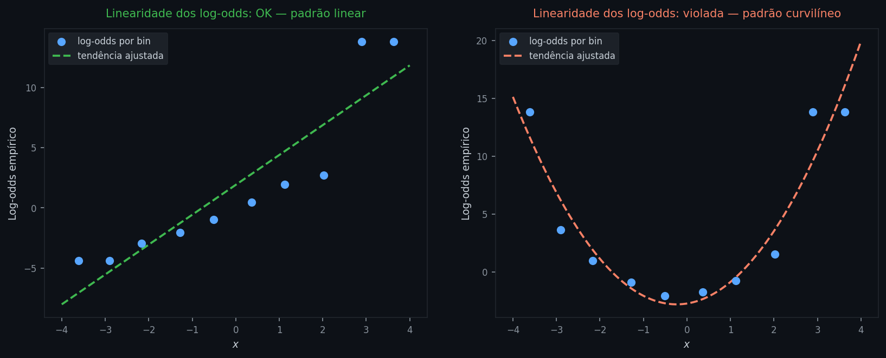

Em cada painel, os pontos azuis são os log-odds empíricos calculados em decis do preditor — a proporção de positivos em cada faixa convertida em log-odds. À esquerda, os pontos seguem a linha tracejada verde: o log-odds cresce linearmente com $x$, premissa satisfeita. À direita, os pontos descrevem uma curva em U: a linha tracejada vermelha ajusta um polinômio quadrático, evidenciando que o log-odds não é linear em $x$ — o modelo logístico simples estará mal especificado nesse cenário.

**2. Independência das observações**

Os erros devem ser não correlacionados entre observações — a mesma premissa da regressão linear. Em séries temporais ou dados agrupados (e.g., múltiplas observações por cliente), a violação infla a significância aparente dos coeficientes. Nesses casos, modelos de efeitos mistos ou erros padrão clusterizados são alternativas.

**3. Ausência de multicolinearidade**

Preditores fortemente correlacionados criam os mesmos problemas que na regressão linear múltipla: erros padrão inflados, coeficientes instáveis e interpretação comprometida. O diagnóstico é idêntico — VIF calculado com os mesmos preditores em uma regressão linear auxiliar. A mesma escala de referência se aplica: VIF acima de 5 merece atenção.

**4. Tamanho amostral suficiente**

O MLE é um estimador de grandes amostras: suas propriedades teóricas (não-viés, eficiência, normalidade assintótica) só valem assintoticamente. A regra prática mais citada é de **pelo menos 10 eventos por preditor** — sendo "evento" a classe menos frequente. Com amostras pequenas, os coeficientes tendem a ser superestimados em magnitude, e os intervalos de confiança, enganosamente estreitos.

**5. Ausência de separação perfeita**

A separação perfeita ocorre quando existe um valor de $x$ (ou combinação de preditores) que separa as duas classes sem nenhum erro — todos os positivos acima de um limiar, todos os negativos abaixo. Nesse cenário, o MLE não converge: os coeficientes tendem ao infinito porque a log-verossimilhança continua aumentando conforme $|\hat{\beta}|$ cresce, sem atingir máximo finito. O sintoma típico são coeficientes absurdamente grandes com erros padrão enormes. A mitigação mais comum é **regularização L2** (equivalente a um prior normal sobre os coeficientes), que limita o crescimento dos parâmetros e restaura a convergência.

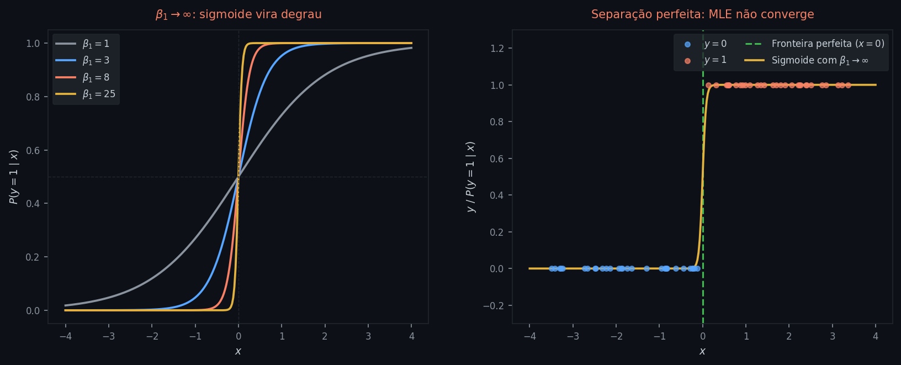

À esquerda, quatro sigmoides com $\beta_1$ crescente: conforme $\beta_1 \to \infty$, a curva se aproxima de um degrau — a transição de probabilidade 0 para 1 ocorre de forma instantânea em $x = 0$. Não há máximo finito da log-verossimilhança porque $\beta_1$ pode sempre crescer mais. À direita, um conjunto de dados com separação perfeita: todos os negativos (azul) estão à esquerda de $x = 0$ e todos os positivos (vermelho) à direita — a fronteira verde separa as classes sem nenhum erro. A sigmoide amarela mostra o modelo tentando se ajustar com $\beta_1$ muito grande: ele acerta perfeitamente os dados de treino, mas os coeficientes divergem e os erros padrão tornam-se inúteis.

---

### Parâmetros e hiperparâmetros

Os parâmetros do modelo logístico são exclusivamente os coeficientes $\hat{\boldsymbol{\beta}}$, estimados pelo MLE. Hiperparâmetros são valores que o praticante fixa antes do treino — não aprendidos dos dados. Estão distribuídos em seções anteriores desta nota:

| Hiperparâmetro | Seção | O que controla |
|---|---|---|
| $\tau$ | Escolha do limiar | ponto de corte sobre $\hat{p}$ para produzir $\hat{y} \in \{0,1\}$ |
| $w_0, w_1$ | Pesos de classe | reponderação da log-loss por classe durante o treino — altera os próprios $\hat{\boldsymbol{\beta}}$ |
| OvR vs Softmax | Generalização | estratégia de treinamento para $k > 2$ classes |
| $\lambda$ | Variações (abaixo) | intensidade da penalidade sobre $\|\boldsymbol{\beta}\|$ |

### Variações

Cada limitação do modelo base deu origem a uma extensão:

- **Regularização L2 (Ridge logístico)** — adiciona a penalidade $\lambda\|\boldsymbol{\beta}\|^2$ à função de custo, equivalente a impor um prior normal sobre os coeficientes. É a mitigação padrão para separação perfeita, mas também controla overfitting quando há muitos preditores ou amostras pequenas. Os coeficientes são contraídos em direção a zero, mas nenhum é exatamente zerado.
- **Regularização L1 (Lasso logístico)** — penaliza com $\lambda\|\boldsymbol{\beta}\|_1$ e produz coeficientes exatamente iguais a zero, fazendo seleção automática de variáveis. Útil quando a expectativa é de que poucos preditores sejam relevantes.
- **Elastic Net** — combina L1 e L2, controlando esparsidade e estabilidade ao mesmo tempo. Prático quando há grupos de preditores correlacionados.
- **Regressão logística com efeitos mistos** — quando as observações estão agrupadas (clientes dentro de agências, pacientes dentro de hospitais), adiciona termos aleatórios para capturar a estrutura hierárquica sem violar a premissa de independência.

Os detalhes de L1, L2 e Elastic Net são desenvolvidos em `02_regularizacao.md`.

---

## Conexão com outros tópicos

- **Beta do CAPM:** o $\beta$ do CAPM é o coeficiente de uma regressão linear simples — retorno do ativo em função do retorno do mercado. Notebook 06.
- **Árvores e Gradient Boosting:** modelos não-lineares que não impõem a premissa de linearidade dos log-odds. Preferir logística quando interpretabilidade e calibração são essenciais (crédito, medicina, contextos regulatórios), quando os efeitos dos preditores são aproximadamente lineares nos log-odds, ou quando a amostra é pequena e a simplicidade ajuda a controlar o overfitting. Preferir árvores ou GBM quando as relações são não-lineares, há interações importantes entre variáveis, ou o conjunto inclui muitas features categóricas com muitos níveis — nesses cenários o GBM tende a superar a logística em poder preditivo. Em problemas com exigência de explicabilidade regulatória, a regressão logística ainda é o padrão dominante no mercado.
- **Regularização (Ridge, Lasso):** adicionam penalidade aos coeficientes para controlar overfitting — aplicável tanto à regressão linear quanto à logística, onde L2 também resolve separação perfeita. Nota `02_regularizacao.md`.
- **Gradiente Descendente:** alternativa iterativa ao OLS — necessária quando a solução fechada é computacionalmente cara.
