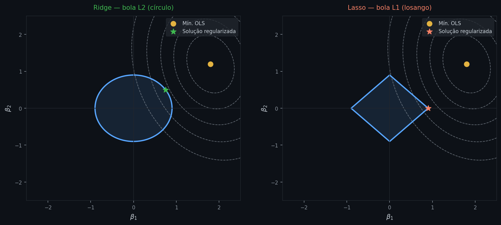
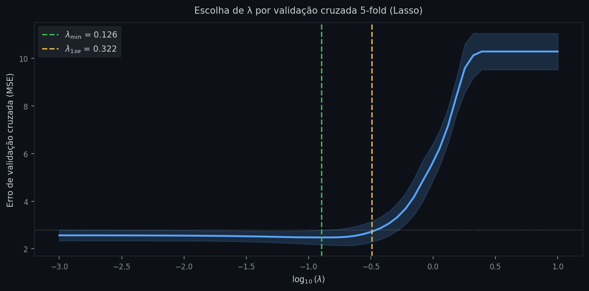
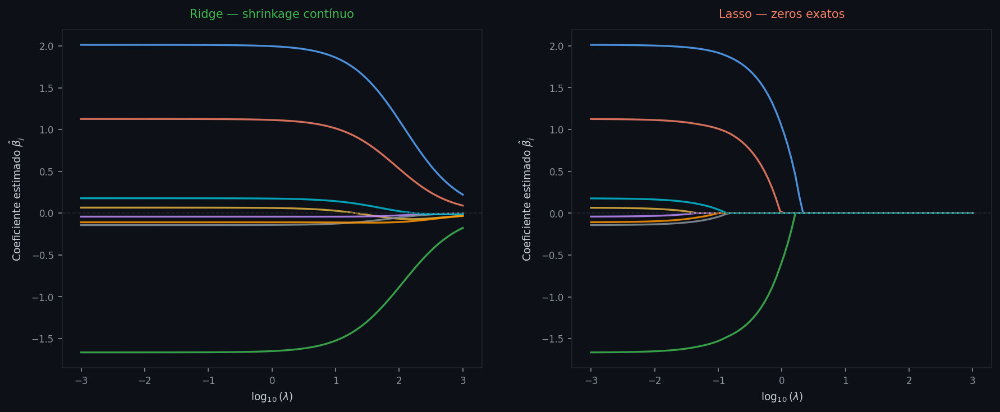

# Regularização

**Módulo:** 01 — Machine Learning  
**Data:** 2026-05-25  
**Fonte:** notas conceituais

---

## Intuição

Na nota anterior, vimos que o OLS minimiza o SSR sem nenhuma restrição sobre o tamanho dos coeficientes. Essa liberdade é o problema: num modelo com muitos preditores, os coeficientes podem crescer arbitrariamente para capturar o ruído da amostra de treino, produzindo um ajuste quase perfeito in-sample mas com péssima generalização. O modelo aprendeu o dataset, não o fenômeno.

A solução não é remover preditores arbitrariamente — é mudar o que o modelo está tentando fazer. Em vez de minimizar apenas o erro, o modelo passa a minimizar erro *e* complexidade simultaneamente. Cada coeficiente grande precisa se justificar: se a redução no SSR que ele proporciona for menor do que o custo de mantê-lo grande, o modelo prefere encolhê-lo.

Geometricamente, o OLS encontra o ponto de mínimo irrestrito da superfície do SSR — que pode estar arbitrariamente longe da origem no espaço dos coeficientes. A regularização introduz uma região permitida ao redor da origem: os coeficientes precisam ficar "suficientemente perto de zero". A solução regularizada é o ponto dessa região que mais se aproxima do mínimo irrestrito — um compromisso entre ajustar os dados e manter os coeficientes controlados.

O que define a forma dessa região — circular, em losango, ou algo entre os dois — é exatamente o que distingue os três métodos que vamos explorar.

---

## Definição formal

O critério geral da regularização é:

$$\hat{\boldsymbol{\beta}} = \arg\min_{\boldsymbol{\beta}} \left[ \text{SSR}(\boldsymbol{\beta}) + \lambda \cdot \Omega(\boldsymbol{\beta}) \right]$$

onde $\Omega(\boldsymbol{\beta})$ é a função de penalidade aplicada aos coeficientes, e $\lambda \geq 0$ é o **hiperparâmetro de regularização**, que controla o peso relativo da penalidade em relação ao erro de ajuste.

Quando $\lambda = 0$, a penalidade desaparece e o critério se reduz ao OLS puro. Quando $\lambda \to \infty$, todos os coeficientes são forçados a zero. Para valores intermediários, o modelo faz um trade-off: aceita algum aumento no SSR em troca de coeficientes menores.

A escolha de $\Omega(\boldsymbol{\beta})$ define o método:

| Penalidade | Norma | Método |
|---|---|---|
| $\displaystyle\sum_{j=1}^{p} \beta_j^2$ | L2 | Ridge |
| $\displaystyle\sum_{j=1}^{p} \|\beta_j\|$ | L1 | Lasso |
| $\displaystyle\alpha \sum_j \|\beta_j\| + (1-\alpha)\sum_j \beta_j^2$ | L1 + L2 | Elastic Net |

Em todos os casos, o intercepto $\beta_0$ é excluído da penalidade — penalizá-lo distorceria a estimação da média da resposta sem nenhum ganho de regularização.

Um detalhe necessário antes de aplicar qualquer penalidade: **as variáveis preditoras devem ser padronizadas** (média zero, desvio-padrão um). A penalidade trata todos os coeficientes na mesma escala. Se um preditor é medido em milhões e outro em frações, seus coeficientes têm magnitudes muito diferentes mesmo que a contribuição seja equivalente — e a penalidade puniria o segundo muito mais, distorcendo os resultados.

Com o critério geral estabelecido, a próxima pergunta é: o que acontece com os coeficientes quando a penalidade é L2?

---

## Ridge

A penalidade Ridge é a soma dos quadrados dos coeficientes:

$$\hat{\boldsymbol{\beta}}_{\text{ridge}} = \arg\min_{\boldsymbol{\beta}} \left[ \sum_{i=1}^{n}(y_i - \hat{y}_i)^2 + \lambda \sum_{j=1}^{p} \beta_j^2 \right]$$

Como a penalidade é diferenciável em todo ponto, o problema tem solução fechada. Igualando o gradiente a zero:

$$\hat{\boldsymbol{\beta}}_{\text{ridge}} = (X^\top X + \lambda I)^{-1} X^\top y$$

onde $I$ é a matriz identidade de dimensão $p \times p$. O termo $\lambda I$ adiciona $\lambda$ à diagonal de $X^\top X$ antes de invertê-la. Isso tem duas consequências imediatas.

A primeira é **numérica**: mesmo quando $X^\top X$ é singular — o que ocorre exatamente sob multicolinearidade perfeita — a soma $X^\top X + \lambda I$ é sempre invertível para qualquer $\lambda > 0$. Ridge resolve o problema de multicolinearidade de forma direta, não como efeito colateral.

A segunda é o **shrinkage**: comparado ao OLS, os coeficientes Ridge são encolhidos em direção a zero de forma proporcional à sua magnitude. Mas nenhum coeficiente chega a zero exatamente. Por quê? A derivada da penalidade L2 em relação a $\beta_j$ é $2\lambda\beta_j$ — vai a zero conforme $\beta_j \to 0$. O custo marginal de manter um coeficiente pequeno também é pequeno, e como removê-lo sempre eleva o SSR em alguma quantidade, o modelo prefere mantê-lo com valor pequeno mas não nulo. Ridge encolhe, mas não elimina.

Do ponto de vista bayesiano, Ridge equivale a estimar os coeficientes por máxima a posteriori (MAP) com um prior gaussiano centrado em zero, $\beta_j \sim \mathcal{N}(0, \sigma^2/\lambda)$. Quanto maior $\lambda$, mais concentrado é o prior e mais forte o encolhimento.

O shrinkage do Ridge é estável e preciso, mas tem um custo: quando há muitos preditores irrelevantes, Ridge os mantém no modelo com coeficientes pequenos — o modelo resultante pode ter dezenas de preditores com efeitos mínimos. Se a esparsidade importa, precisamos de um mecanismo diferente.

---

## Lasso

A penalidade Lasso substitui o quadrado pelo valor absoluto:

$$\hat{\boldsymbol{\beta}}_{\text{lasso}} = \arg\min_{\boldsymbol{\beta}} \left[ \sum_{i=1}^{n}(y_i - \hat{y}_i)^2 + \lambda \sum_{j=1}^{p} |\beta_j| \right]$$

Essa troca muda tudo. A norma L1 não é diferenciável em $\beta_j = 0$, o que elimina a possibilidade de solução fechada. O problema é resolvido numericamente via *coordinate descent* — otimizando um coeficiente de cada vez, mantendo os demais fixos.

O efeito central é **seleção de variáveis**: coeficientes pequenos são zerados exatamente, produzindo um modelo esparso. Por quê? A derivada da penalidade L1 em relação a $\beta_j$ é $\lambda \cdot \text{sgn}(\beta_j)$ — constante em $\pm\lambda$, independente da magnitude de $\beta_j$. O custo marginal de manter um coeficiente pequeno é sempre $\lambda$, mesmo perto de zero. Se a redução no SSR que aquele coeficiente proporciona for menor que $\lambda$, o modelo racionalmente prefere zerá-lo. O limiar é rígido — ao contrário do Ridge, onde o custo marginal diminui suavemente até zero.

A geometria torna isso concreto:

Os contornos elípticos são as curvas de nível do SSR no espaço dos coeficientes $(\beta_1, \beta_2)$ — cada elipse conecta pontos com o mesmo valor de SSR. A solução regularizada é o ponto onde o menor contorno de SSR toca a bola de restrição. Para Ridge (esquerda), a bola é um círculo: o ponto de contato pode ocorrer em qualquer posição da fronteira, e tipicamente nenhum coeficiente é exatamente zero. Para Lasso (direita), a bola é um losango com cantos nos eixos coordenados: a geometria das elipses faz com que, na maioria dos casos, o ponto de contato ocorra num canto — onde um coeficiente vale zero. Com mais preditores, o losango tem mais cantos, e a solução esparsa torna-se ainda mais provável.

A limitação do Lasso aparece quando preditores são altamente correlacionados: o algoritmo tende a selecionar arbitrariamente um entre dois colineares e zerar o outro, mesmo que ambos sejam igualmente relevantes. A seleção resultante é instável — pequenas perturbações nos dados podem inverter a escolha. Quando há grupos de preditores correlacionados, precisamos de algo mais robusto.

---

## Elastic Net

O Elastic Net combina as penalidades L1 e L2 numa mistura convexa:

$$\hat{\boldsymbol{\beta}}_{\text{enet}} = \arg\min_{\boldsymbol{\beta}} \left[ \sum_{i=1}^{n}(y_i - \hat{y}_i)^2 + \lambda \left( \alpha \sum_{j=1}^{p} |\beta_j| + (1-\alpha) \sum_{j=1}^{p} \beta_j^2 \right) \right]$$

onde $\alpha \in [0, 1]$ controla o mix entre as duas penalidades. Quando $\alpha = 1$, recuperamos o Lasso puro. Quando $\alpha = 0$, recuperamos o Ridge puro.

A vantagem é direta: a componente L1 mantém a capacidade de zerar coeficientes irrelevantes. A componente L2 estabiliza os coeficientes dentro de grupos de preditores correlacionados — em vez de selecionar arbitrariamente um, distribui o peso entre eles. O resultado é um modelo esparso mas estável.

O preço é a adição de um segundo hiperparâmetro: agora é preciso calibrar tanto $\lambda$ quanto $\alpha$. Na prática, $\alpha$ costuma ser fixado por escolha do analista — com base em se esparsidade é prioritária — e apenas $\lambda$ é calibrado por validação cruzada. Quando ambos são desconhecidos, o grid de busca cresce bidimensionalmente.

Com os três métodos caracterizados, a questão que resta é: como escolhemos $\lambda$ na prática?

---

## Como escolher λ

O hiperparâmetro $\lambda$ não pode ser estimado pelos próprios dados de treino — usar o erro in-sample para escolhê-lo seria circular: $\lambda = 0$ (OLS puro) sempre minimizaria esse erro. Precisamos de uma estimativa do erro out-of-sample.

O método padrão é a **validação cruzada $k$-fold**: os dados são divididos em $k$ partes (tipicamente $k = 5$ ou $k = 10$). Para cada valor candidato de $\lambda$, o modelo é ajustado $k$ vezes — cada vez usando $k-1$ partes para treino e a parte restante para avaliação. O erro médio nessa parte retida estima o desempenho out-of-sample. O processo se repete para todos os $\lambda$ candidatos:

O eixo horizontal é $\log(\lambda)$; o eixo vertical é o erro de validação cruzada médio, com barras de $\pm 1$ desvio-padrão entre os folds. O erro cai conforme $\lambda$ aumenta — a penalidade reduz o overfitting — atinge um mínimo e sobe novamente — regularização excessiva aumenta o viés. Duas referências são marcadas: $\lambda_{\min}$, o valor que minimiza o erro médio, e $\lambda_{\text{1se}}$, o maior $\lambda$ cujo erro fica dentro de um desvio-padrão do mínimo. A diferença de desempenho entre os dois é estatisticamente negligenciável, mas $\lambda_{\text{1se}}$ produz um modelo mais parcimonioso — com mais coeficientes zerados no caso do Lasso. Quando interpretabilidade importa, $\lambda_{\text{1se}}$ costuma ser preferível.

Para entender o comportamento global dos coeficientes em função de $\lambda$, o *regularization path* torna isso explícito:

Cada linha colorida representa um preditor; o eixo horizontal é $\lambda$ crescente (escala logarítmica); o eixo vertical é o valor do coeficiente estimado. À esquerda ($\lambda$ pequeno), os coeficientes se aproximam dos valores OLS. À direita ($\lambda$ grande), todos encolhem para zero. No Ridge (painel esquerdo), o encolhimento é suave e contínuo — nenhuma linha toca zero antes do limite extremo. No Lasso (painel direito), as linhas chegam a zero em pontos distintos conforme $\lambda$ cresce: cada "extinção" representa um preditor descartado. A ordem em que os coeficientes são zerados reflete sua relevância relativa.

Na prática, o scikit-learn oferece `RidgeCV`, `LassoCV` e `ElasticNetCV`, que percorrem um grid de valores de $\lambda$ e retornam o melhor por validação cruzada interna. Para o Elastic Net, o analista ainda precisa definir $\alpha$.

---

## Premissas e limitações

A regularização resolve um problema específico — coeficientes livres demais num modelo com estrutura correta. Há situações em que ela não é suficiente.

**Má especificação não é corrigida pela penalidade.** Se a relação verdadeira é não-linear mas o modelo é linear, a regularização apenas encolhe os coeficientes de um modelo estruturalmente errado. O erro de generalização continuará alto — agora por viés de especificação, não por variância.

**Ridge não faz seleção de variáveis.** Quando o objetivo é identificar quais preditores têm efeito relevante, Ridge mantém todos com coeficientes encolhidos. Para esparsidade e interpretabilidade, Lasso ou Elastic Net são mais adequados.

**Lasso é instável sob multicolinearidade forte.** Quando dois preditores são altamente correlacionados, o Lasso pode selecionar um e zerar o outro de forma arbitrária — dependendo de ruído amostral, não de relevância real. Elastic Net é mais robusto nesses cenários.

**λ precisa ser recalibrado quando os dados mudam.** Em ambientes não-estacionários — como séries financeiras sujeitas a mudanças de regime — o $\lambda$ calibrado num período pode ser inadequado em outro. Monitoramento e recalibração periódica são necessários. Adicionalmente, validação cruzada $k$-fold padrão (que embaralha observações) não é válida para séries temporais — é necessário usar *time-series cross-validation* (expanding ou sliding window).

**Inferência clássica não se aplica diretamente.** Os estimadores regularizados são viesados por construção — esse é o ponto. P-valores e intervalos de confiança derivados da teoria OLS não têm validade imediata após regularização. Para inferência pós-seleção existe o *debiased Lasso*, mas está além do escopo desta nota.

---

## Conexão com outros tópicos

- **Regressão linear e logística** (`01_regressao_linear_logistica.md`): o OLS é o caso especial $\lambda = 0$. O trade-off viés-variância e o problema de separação perfeita em logística foram a motivação para esta nota.
- **Gradient Boosting e Random Forest**: lidam com overfitting via randomização e ensemble em vez de penalidade explícita — uma abordagem distinta para o mesmo problema central.
- **Séries temporais**: recalibração de $\lambda$ sob não-estacionariedade requer validação temporal (expanding/sliding window), não $k$-fold padrão.

---

## Dúvidas em aberto

- [ ] Como o *debiased Lasso* reconstrói a inferência válida após seleção de variáveis — e em que condições isso é válido?
- [ ] Existe um critério analítico (tipo AIC/BIC) para escolher $\lambda$ sem validação cruzada — útil quando o dataset é pequeno demais para dividir em folds?
- [ ] Em séries financeiras com heterocedasticidade, a penalidade deveria ser ponderada pela variância local dos coeficientes?

---

## Checklist de entendimento

- [ ] Consigo explicar por que coeficientes OLS crescem arbitrariamente e como a penalidade impede isso
- [ ] Sei escrever o critério geral $\text{SSR} + \lambda \cdot \Omega(\boldsymbol{\beta})$ e identificar o que cada termo controla
- [ ] Entendo por que as variáveis preditoras devem ser padronizadas antes de regularizar
- [ ] Sei reconhecer a solução fechada do Ridge: $\hat{\boldsymbol{\beta}} = (X^\top X + \lambda I)^{-1} X^\top y$
- [ ] Consigo explicar geometricamente por que Ridge encolhe mas não zera, e Lasso zera
- [ ] Entendo a diferença entre $\lambda_{\min}$ e $\lambda_{\text{1se}}$ e quando prefiro cada um
- [ ] Sei identificar quando usar Ridge, Lasso ou Elastic Net dado o contexto do problema
- [ ] Entendo por que p-valores OLS não valem diretamente após regularização
