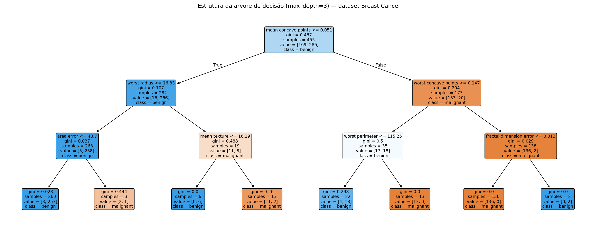
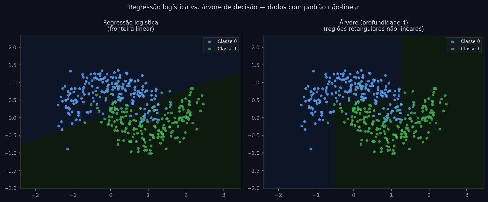
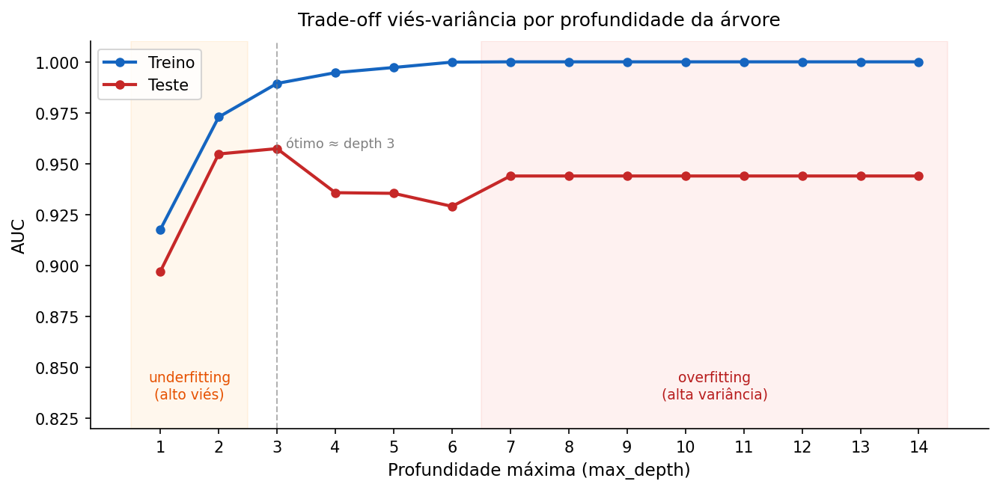

# Árvores de decisão

Regularização resolveu o problema de overfitting em modelos lineares: penalizar coeficientes grandes força o modelo a generalizar. Mas Ridge, Lasso e Elastic Net só mudam a magnitude dos coeficientes — a forma da relação entre variáveis e resposta continua sendo uma soma ponderada. Quando o efeito de uma variável muda de direção dependendo do valor de outra, ou quando a fronteira entre classes forma curvas e ângulos que nenhuma combinação linear consegue representar sem engenharia intensiva de features, a família inteira falha por construção.

Árvores de decisão resolvem isso particionando o espaço de variáveis em regiões retangulares, cada uma com sua própria previsão — sem hipótese alguma sobre a forma da relação. Sozinha, uma árvore raramente é o modelo final em produção: sua importância está em ser o bloco de construção dos ensembles (Random Forest, Gradient Boosting) que dominam pipelines de dados tabulares em crédito e risco. Entender como uma única árvore decide suas perguntas é o que permite entender por que combinar centenas delas funciona tão bem.

---

## Intuição

O processo de uma árvore de decisão é uma série de perguntas binárias. Imagine um analista de crédito avaliando se deve aprovar um empréstimo: "A renda é maior que R\$5.000?" → se sim: "O emprego tem mais de dois anos?" → se sim: "O valor solicitado é inferior a 30% da renda?" Cada pergunta divide o grupo em dois subgrupos mais homogêneos. Quando os subgrupos estão suficientemente puros — ou quando você decide parar — atribui-se uma previsão.

Uma árvore de decisão formaliza exatamente esse processo. Cada nó interno é uma pergunta da forma *variável j > limiar t*; cada ramo é a resposta; cada folha é a previsão para as observações que chegaram até ali. O resultado geométrico é uma partição do espaço de variáveis em regiões retangulares, eixo-alinhadas — sem nenhuma necessidade de padronização ou transformação.


*Cada nó interno mostra a variável e o limiar escolhidos (ex.: "worst radius ≤ 16.8"), a impureza de Gini atual, o número de amostras que chegou até ali e a distribuição entre classes. As folhas (nós sem filhos) contêm a previsão final — classe majoritária e proporção de amostras de cada classe. A cor mais intensa indica nós mais puros.*


*O padrão em meia-lua não pode ser separado por uma linha reta. A regressão logística (esquerda) erra sistematicamente na região de sobreposição. A árvore de profundidade 4 (direita) aproxima a fronteira com regiões retangulares, capturando o padrão não-linear sem transformação das variáveis.*

A questão imediata é: como a árvore decide qual pergunta fazer em cada nó?

## Definição formal

O critério de divisão mede a **impureza** de um nó — quão misturadas estão as classes ali. Para um nó com $n$ observações distribuídas em $K$ classes, a impureza de Gini é:

$$G = 1 - \sum_{k=1}^{K} p_k^2$$

onde $p_k$ é a proporção de observações da classe $k$ no nó. Gini vale zero quando o nó é puro (um único rótulo) e é máxima quando as classes estão igualmente distribuídas.

```python
def gini(p):
    return round(1 - sum(pi**2 for pi in p), 4)

print(gini([1.0, 0.0]))  # puro: uma só classe
print(gini([0.5, 0.5]))  # máximo: classes igualmente distribuídas
print(gini([0.8, 0.2]))  # intermediário
```
```text
0.0
0.5
0.32
```
*Nó com proporção 80/20: Gini de 0.32 indica impureza relevante — ainda há 20% da classe minoritária misturada. O único nó verdadeiramente puro tem Gini zero.*

Uma alternativa é a **entropia** (ganho de informação):

$$H = -\sum_{k=1}^{K} p_k \log_2 p_k$$

Entropia e Gini produzem árvores quase idênticas na prática. Para **regressão**, a impureza é substituída pelo MSE dentro do nó:

$$\text{Impureza}(t) = \frac{1}{n_t} \sum_{i \in t} (y_i - \bar{y}_t)^2$$

onde $n_t$ é o número de observações no nó $t$ e $\bar{y}_t$ é a média de $y$ naquele nó.

Com a impureza definida, a árvore pode buscar a pergunta que mais purifica os grupos. Para cada par (variável $j$, limiar $t$), a **redução de impureza** da divisão é:

$$\Delta G = G(t) - \frac{n_L}{n_t} \cdot G(t_L) - \frac{n_R}{n_t} \cdot G(t_R)$$

onde $G(t)$ é a impureza do nó pai, $G(t_L)$ e $G(t_R)$ são as impurezas dos filhos esquerdo e direito, e $n_L/n_t$, $n_R/n_t$ são as proporções de observações que vão para cada ramo. A divisão escolhida é a que maximiza $\Delta G$ — é isso que o algoritmo CART faz.

## Como a árvore é construída

O algoritmo CART (Classification and Regression Trees) constrói a árvore de cima para baixo, de forma gulosa:

1. Para cada variável $j$ e cada limiar candidato $t$, calcule a redução de impureza da divisão
2. Escolha o par $(j^{\ast}, t^{\ast})$ que maximiza essa redução
3. Crie dois nós filhos e repita o processo em cada um
4. Pare quando um critério for atingido: profundidade máxima (`max_depth`), mínimo de observações para tentar uma divisão em um nó (`min_samples_split`), mínimo de observações em cada folha resultante (`min_samples_leaf`), ou ganho mínimo exigido

O processo é **guloso**: a melhor divisão local em cada nó não garante a melhor árvore global. Na prática isso funciona bem, mas há uma consequência importante: pequenas mudanças nos dados de treino podem resultar em estruturas completamente diferentes. Essa instabilidade é a principal fraqueza das árvores individuais — e, como a nota de Ensembles mostra, também é o que as torna valiosas em conjunto.

A profundidade controla diretamente o trade-off viés-variância. Uma árvore muito rasa faz poucas perguntas e produz previsões grosseiras que não conseguem capturar os padrões reais dos dados — é **underfitting** (alto viés, baixa variância): o modelo erra sistematicamente porque simplifica demais. Uma árvore sem limite cresce até memorizar cada grupo específico do treino, incluindo o ruído — é **overfitting** (baixo viés, alta variância): o modelo acerta no treino e erra na generalização. Os parâmetros de parada definem onde a árvore cai nesse espectro:

```python
from sklearn.datasets import load_breast_cancer
from sklearn.tree import DecisionTreeClassifier
from sklearn.model_selection import train_test_split
from sklearn.metrics import roc_auc_score

data = load_breast_cancer()
X, y = data.data, data.target
X_tr, X_te, y_tr, y_te = train_test_split(X, y, test_size=0.2, random_state=42)

for depth in [2, 4, None]:
    tree = DecisionTreeClassifier(max_depth=depth, random_state=42)
    tree.fit(X_tr, y_tr)
    auc = roc_auc_score(y_te, tree.predict_proba(X_te)[:, 1])
    nos = tree.tree_.node_count
    print(f"max_depth={str(depth):<6}  AUC={auc:.3f}  nós={nos}")
```
```text
max_depth=2       AUC=0.955  nós=7
max_depth=4       AUC=0.936  nós=23
max_depth=None    AUC=0.944  nós=31
```
*A árvore de profundidade 4 tem mais nós que a de profundidade 2, mas AUC menor — ela começou a memorizar padrões específicos do treino. A árvore sem limite cresce até profundidade 7 (31 nós) e recupera parte do desempenho, mas nenhuma das três chega perto do que um ensemble de árvores alcança.*


*À esquerda (laranja), árvores rasas erram em treino e teste — underfitting. À direita (vermelho), o AUC de treino sobe para 1.0 enquanto o de teste cai — overfitting: a árvore memorizou o conjunto de treino. O ponto ótimo neste dataset está em profundidade 3 (AUC de teste 0.957); a partir daí, crescer a árvore só acrescenta ruído.*

Para controlar esse trade-off existem duas estratégias com lógicas opostas: **pré-poda** e **pós-poda**.

**Pré-poda** (pre-pruning) interrompe o crescimento durante a construção, antes mesmo de criar os nós que seriam problemáticos. Os critérios de parada do passo 4 são exatamente isso: `max_depth` limita o número de níveis; `min_samples_split` exige um mínimo de observações antes de qualquer divisão ser tentada em um nó — se o nó já tem poucas amostras, não há sentido em subdividi-lo; `min_samples_leaf` exige um mínimo em cada folha resultante da divisão. A árvore simplesmente para quando qualquer condição é violada.

**Pós-poda** (post-pruning) constrói a árvore completa primeiro e depois a simplifica. O método disponível no scikit-learn é o *cost-complexity pruning*: cada subárvore recebe um custo proporcional ao número de folhas que ela gera, controlado pelo hiperparâmetro `ccp_alpha`. Para `ccp_alpha=0` a árvore original é mantida intacta; conforme o valor cresce, ramos com pouco ganho de impureza relativo ao custo são podados progressivamente — a árvore encolhe de fora para dentro. O valor ótimo de `ccp_alpha` é escolhido por validação cruzada sobre uma grade de valores candidatos gerada por `cost_complexity_pruning_path`.

Na prática, pré-poda é mais rápida e suficiente na maioria dos casos. Pós-poda é útil quando não há intuição prévia sobre a profundidade adequada: constrói-se a árvore completa, varre-se a grade de `ccp_alpha`, e escolhe-se o valor que minimiza o erro de validação.

## Interpretação

Cada folha acumula observações com o mesmo caminho de perguntas. Há duas formas de extrair a previsão: `predict()` retorna a **classe majoritária** — o rótulo com mais observações naquela folha; `predict_proba()` retorna a **proporção de cada classe** — a fração de amostras de treino de cada rótulo que chegou até ali. É essa proporção que alimenta o AUC: uma folha com 90 amostras da classe 1 e 10 da classe 0 retorna `[0.1, 0.9]`, não simplesmente `1`. Para regressão, `predict()` retorna a média de $y$ nas observações da folha.

A **importância de variável** (MDI — Mean Decrease in Impurity) é a contribuição acumulada de cada variável para a redução de impureza ao longo de todas as divisões:

$$\text{Importância}(j) = \sum_{\text{nós com variável }j} \frac{n_t}{n} \cdot \Delta G_t$$

onde $\Delta G_t$ é a redução de Gini no nó $t$, ponderada pela proporção de dados que passa por ele. Variáveis que dividem regiões grandes e impuras recebem importância alta; variáveis irrelevantes ficam próximas de zero.

Em uma única árvore, a importância é instável pelo mesmo motivo que a estrutura: uma variável fortemente correlacionada com outra pode dominar em uma árvore e ser ignorada em outra. É essa instabilidade — tanto da estrutura quanto da importância — que a próxima nota explora: se cada árvore erra de um jeito diferente, o que acontece quando se combinam centenas delas?

## Avaliação

As métricas de avaliação (AUC, F1, RMSE) são as mesmas dos capítulos anteriores. Em dados temporais, a validação out-of-time continua sendo a mais realista — nenhuma característica da árvore elimina a necessidade de respeitar a ordem cronológica.

## Premissas e limitações

Árvores de decisão não têm premissas distributivas: sem suposição de normalidade, homocedasticidade ou linearidade. As restrições práticas são:

**Estacionariedade**: a relação entre variáveis e resposta precisa ser estável ao longo do tempo. Em dados de crédito durante crises, os padrões aprendidos no treino podem deixar de ser representativos — e o modelo continua prevendo com base em folhas desatualizadas.

**Dados por folha**: folhas com poucas observações produzem previsões instáveis. Controla-se com `min_samples_leaf` (mínimo de amostras em cada folha resultante — aumentar para 5–20 em datasets ruidosos) e `min_samples_split` (mínimo de amostras para que um nó seja candidato a divisão — impede que a árvore tente subdividir regiões já pequenas demais para ser estatisticamente significativas).

**Sem extrapolação**: uma árvore prevê a média da folha mais próxima para valores fora do intervalo de treino — a previsão é constante além dos extremos vistos. Modelos lineares extrapolam (para o bem e para o mal); árvores não.

**Variáveis categóricas**: o sklearn não aceita variáveis categóricas nativas — cada feature precisa ser numérica antes do treino. Para variáveis ordinais (grau de instrução, rating de crédito), encoding ordinal preserva a ordem e permite que a árvore use limiares naturais. Para variáveis nominais sem ordem (UF, tipo de produto, segmento de cliente), one-hot encoding é o caminho padrão; quando há muitas categorias, target encoding — substituir cada categoria pela média de $y$ nela, estimada no treino — produz representações mais compactas e evita explosão de dimensionalidade. A afirmação de que árvores "não exigem transformação das variáveis" vale para escala e distribuição — não para tipo de dado.

**Valores ausentes**: o sklearn não suporta `NaN` — qualquer missing causa erro no treino e na predição. A solução mais comum é imputação prévia: mediana para variáveis contínuas (robusta a outliers), moda para categóricas. Em dados de crédito, porém, o padrão de ausência frequentemente carrega informação preditiva — um cliente que não informa renda tem perfil sistematicamente diferente de quem informa. Descartar essa informação via imputação simples custa sinal. A solução é adicionar uma feature indicadora `variavel_missing` (0/1) antes de imputar: a árvore pode aprender a usar ambas.

## Na prática

```python
from sklearn.tree import DecisionTreeClassifier
from sklearn.model_selection import cross_val_score

tree = DecisionTreeClassifier(
    max_depth=4,             # limita profundidade; ajuste por validação cruzada
    min_samples_leaf=10,     # evita folhas com poucas observações
    class_weight="balanced", # corrige impacto de classes desbalanceadas na impureza
    random_state=42
)
scores = cross_val_score(tree, X_tr, y_tr, cv=5, scoring="roc_auc")
print(f"AUC CV: {scores.mean():.3f} ± {scores.std():.3f}")
```
```text
AUC CV: 0.939 ± 0.024
```
*Uma única árvore, mesmo bem ajustada, tem desvio padrão relevante entre os folds — reflexo direto da sua instabilidade estrutural. É esse desvio que a combinação de várias árvores reduz.*

Em problemas de crédito com classe minoritária rara — inadimplência de 5%, fraude de 1% — o parâmetro `class_weight="balanced"` corrige o viés da árvore em direção à classe majoritária: o sklearn calcula automaticamente um peso inversamente proporcional à frequência de cada classe, fazendo com que erros na classe minoritária pesem mais na função de impureza. Avalie sempre com F1-score, curva precision-recall ou KS statistic além do AUC — essas métricas são mais sensíveis ao desempenho na classe minoritária do que a acurácia isolada.

Uma árvore individual raramente vai para produção sozinha. O próximo passo natural é explorar o que acontece ao combinar centenas delas.

---

## Leitura recomendada

**SCIKIT-LEARN DEVELOPERS.** *Decision Trees — User Guide*. [→ Link direto](https://scikit-learn.org/stable/modules/tree.html)
Documentação oficial do algoritmo CART implementado no sklearn: critérios de impureza para classificação e regressão, e a formulação completa do cost-complexity pruning (`ccp_alpha`) com referência ao trabalho original de Breiman et al. (1984).
