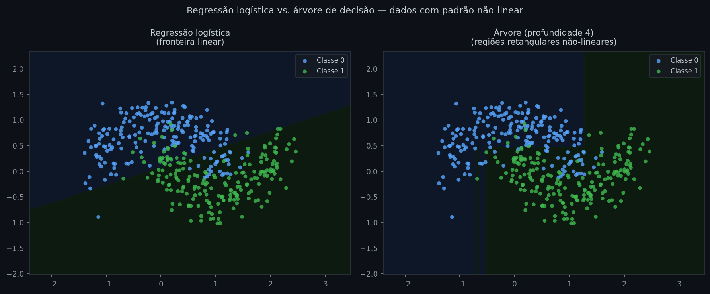
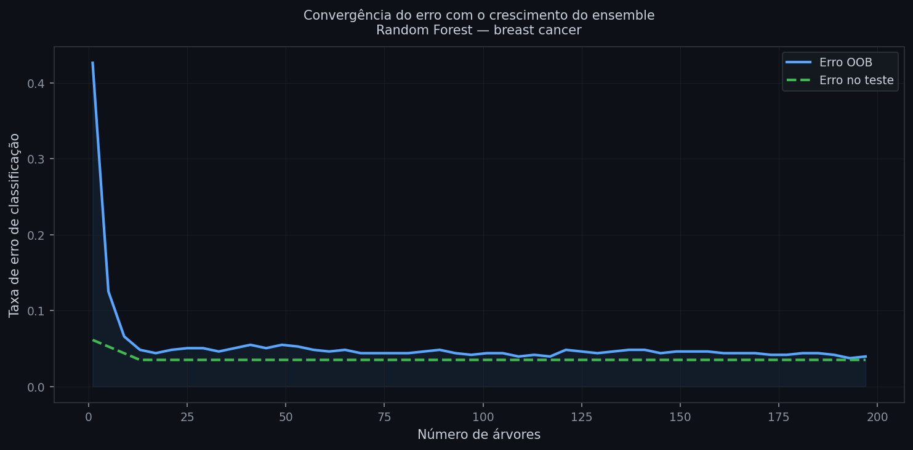
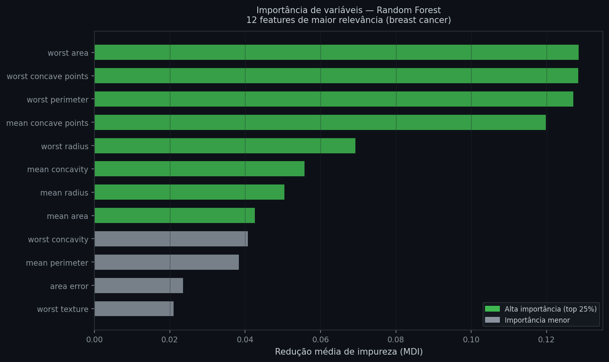

# Árvores de decisão e Random Forest

Regularização resolveu o problema de overfitting em modelos lineares: penalizar coeficientes grandes força o modelo a generalizar. Mas Ridge, Lasso e Elastic Net só mudam a magnitude dos coeficientes — a forma da relação entre variáveis e resposta continua sendo uma soma ponderada. Quando o efeito de uma variável muda de direção dependendo do valor de outra, ou quando a fronteira entre classes forma curvas e ângulos que nenhuma combinação linear consegue representar sem engenharia intensiva de features, a família inteira falha por construção.

Árvores de decisão resolvem isso particionando o espaço de variáveis em regiões retangulares, cada uma com sua própria previsão — sem hipótese alguma sobre a forma da relação. Isso explica por que Random Forests, que combinam centenas dessas árvores, são o primeiro modelo testado em quase todo pipeline de dados tabulares: não exigem padronização das variáveis, capturam interações sem engenharia explícita, e produzem importância de variável como subproduto do treino. Em sistemas de crédito e risco, essa medida de importância é usada para selecionar variáveis para o scorebook e justificar decisões para reguladores — o que torna esses modelos tanto poderosos quanto interpretáveis.

---

## Intuição

O processo de uma árvore de decisão é uma série de perguntas binárias. Imagine um analista de crédito avaliando se deve aprovar um empréstimo: "A renda é maior que R$5.000?" → se sim: "O emprego tem mais de dois anos?" → se sim: "O valor solicitado é inferior a 30% da renda?" Cada pergunta divide o grupo em dois subgrupos mais homogêneos. Quando os subgrupos estão suficientemente puros — ou quando você decide parar — atribui-se uma previsão.

Uma árvore de decisão formaliza exatamente esse processo. Cada nó interno é uma pergunta da forma *variável j > limiar t*; cada ramo é a resposta; cada folha é a previsão para as observações que chegaram até ali. O resultado geométrico é uma partição do espaço de variáveis em regiões retangulares, eixo-alinhadas — sem nenhuma necessidade de padronização ou transformação.


*O padrão em meia-lua não pode ser separado por uma linha reta. A regressão logística (esquerda) erra sistematicamente na região de sobreposição. A árvore de profundidade 4 (direita) aproxima a fronteira com regiões retangulares, capturando o padrão não-linear sem transformação das variáveis.*

A questão imediata é: como a árvore decide qual pergunta fazer em cada nó?

## Definição formal

O critério de divisão mede a **impureza** de um nó — quão misturadas estão as classes ali. Para um nó com $n$ observações distribuídas em $K$ classes, a impureza de Gini é:

$$G = 1 - \sum_{k=1}^{K} p_k^2$$

onde $p_k$ é a proporção de observações da classe $k$ no nó. Gini vale zero quando o nó é puro (um único rótulo) e é máxima quando as classes estão igualmente distribuídas.

```python
def gini(p):
    return round(1 - sum(pi**2 for pi in p), 4)

print(gini([1.0, 0.0]))  # puro: uma só classe
print(gini([0.5, 0.5]))  # máximo: classes igualmente distribuídas
print(gini([0.8, 0.2]))  # intermediário
```
```text
0.0
0.5
0.32
```
*Nó com proporção 80/20: Gini de 0.32 indica impureza relevante — ainda há 20% da classe minoritária misturada. O único nó verdadeiramente puro tem Gini zero.*

Uma alternativa é a **entropia** (ganho de informação):

$$H = -\sum_{k=1}^{K} p_k \log_2 p_k$$

Entropia e Gini produzem árvores quase idênticas na prática. Para **regressão**, a impureza é substituída pelo MSE dentro do nó:

$$\text{Impureza}(t) = \frac{1}{n_t} \sum_{i \in t} (y_i - \bar{y}_t)^2$$

onde $n_t$ é o número de observações no nó $t$ e $\bar{y}_t$ é a média de $y$ naquele nó.

Com a impureza definida, a árvore pode buscar sistematicamente a pergunta que mais purifica os grupos — é isso que o algoritmo CART faz.

## Como a árvore é construída

O algoritmo CART (Classification and Regression Trees) constrói a árvore de cima para baixo, de forma gulosa:

1. Para cada variável $j$ e cada limiar candidato $t$, calcule a redução de impureza da divisão
2. Escolha o par $(j^{\ast}, t^{\ast})$ que maximiza essa redução
3. Crie dois nós filhos e repita o processo em cada um
4. Pare quando um critério for atingido: profundidade máxima (`max_depth`), mínimo de observações para tentar uma divisão em um nó (`min_samples_split`), mínimo de observações em cada folha resultante (`min_samples_leaf`), ou ganho mínimo exigido

O processo é **guloso**: a melhor divisão local em cada nó não garante a melhor árvore global. Na prática isso funciona bem, mas há uma consequência importante: pequenas mudanças nos dados de treino podem resultar em estruturas completamente diferentes. Essa instabilidade é a principal fraqueza das árvores individuais.

A profundidade controla diretamente o trade-off viés-variância. Uma árvore muito rasa faz poucas perguntas e produz previsões grosseiras que não conseguem capturar os padrões reais dos dados — é **underfitting** (alto viés, baixa variância): o modelo erra sistematicamente porque simplifica demais. Uma árvore sem limite cresce até memorizar cada grupo específico do treino, incluindo o ruído — é **overfitting** (baixo viés, alta variância): o modelo acerta no treino e erra na generalização. Os parâmetros de parada definem onde a árvore cai nesse espectro:

```python
from sklearn.datasets import load_breast_cancer
from sklearn.tree import DecisionTreeClassifier
from sklearn.model_selection import train_test_split
from sklearn.metrics import roc_auc_score

data = load_breast_cancer()
X, y = data.data, data.target
X_tr, X_te, y_tr, y_te = train_test_split(X, y, test_size=0.2, random_state=42)

for depth in [2, 4, None]:
    tree = DecisionTreeClassifier(max_depth=depth, random_state=42)
    tree.fit(X_tr, y_tr)
    auc = roc_auc_score(y_te, tree.predict_proba(X_te)[:, 1])
    nos = tree.tree_.node_count
    print(f"max_depth={str(depth):<6}  AUC={auc:.3f}  nós={nos}")
```
```text
max_depth=2       AUC=0.955  nós=7
max_depth=4       AUC=0.936  nós=23
max_depth=None    AUC=0.944  nós=31
```
*A árvore de profundidade 4 tem mais nós que a de profundidade 2, mas AUC menor — ela começou a memorizar padrões específicos do treino. A árvore sem limite cresce até profundidade 7 (31 nós) e recupera parte do desempenho, mas nenhuma das três supera o ensemble que veremos a seguir.*

Para controlar esse trade-off existem duas estratégias com lógicas opostas: **pré-poda** e **pós-poda**.

**Pré-poda** (pre-pruning) interrompe o crescimento durante a construção, antes mesmo de criar os nós que seriam problemáticos. Os critérios de parada do passo 4 são exatamente isso: `max_depth` limita o número de níveis; `min_samples_split` exige um mínimo de observações antes de qualquer divisão ser tentada em um nó — se o nó já tem poucas amostras, não há sentido em subdividi-lo; `min_samples_leaf` exige um mínimo em cada folha resultante da divisão. A árvore simplesmente para quando qualquer condição é violada.

**Pós-poda** (post-pruning) constrói a árvore completa primeiro e depois a simplifica. O método disponível no scikit-learn é o *cost-complexity pruning*: cada subárvore recebe um custo proporcional ao número de folhas que ela gera, controlado pelo hiperparâmetro `ccp_alpha`. Para `ccp_alpha=0` a árvore original é mantida intacta; conforme o valor cresce, ramos com pouco ganho de impureza relativo ao custo são podados progressivamente — a árvore encolhe de fora para dentro. O valor ótimo de `ccp_alpha` é escolhido por validação cruzada sobre uma grade de valores candidatos gerada por `cost_complexity_pruning_path`.

Na prática, pré-poda é mais rápida e suficiente na maioria dos casos. Pós-poda é útil quando não há intuição prévia sobre a profundidade adequada: constrói-se a árvore completa, varre-se a grade de `ccp_alpha`, e escolhe-se o valor que minimiza o erro de validação.

A instabilidade e o overfitting das árvores individuais levam diretamente à solução mais poderosa do capítulo.

## Interpretação da árvore

Cada folha acumula observações com o mesmo caminho de perguntas. A previsão é a classe majoritária (classificação) ou a média de $y$ (regressão). A **importância de variável** (MDI — Mean Decrease in Impurity) é a contribuição acumulada de cada variável para a redução de impureza ao longo de todas as divisões:

$$\text{Importância}(j) = \sum_{\text{nós com variável }j} \frac{n_t}{n} \cdot \Delta G_t$$

onde $\Delta G_t$ é a redução de Gini no nó $t$, ponderada pela proporção de dados que passa por ele. Variáveis que dividem regiões grandes e impuras recebem importância alta; variáveis irrelevantes ficam próximas de zero.

Em uma única árvore, a importância é instável pelo mesmo motivo que a estrutura: uma variável fortemente correlacionada com outra pode dominar em uma árvore e ser ignorada em outra. Em um ensemble de centenas de árvores, essa instabilidade se cancela — e a importância média se torna uma das métricas de interpretabilidade mais confiáveis para dados tabulares.

## De árvores instáveis a ensembles

A instabilidade das árvores é, paradoxalmente, o que as torna valiosas em conjunto. Se cada árvore comete erros diferentes — e se esses erros não são correlacionados — a média das previsões cancela o ruído idiossincrático.

**Bagging** (Bootstrap Aggregating) implementa essa ideia:

1. Para $b = 1, \ldots, B$: sorteie $n$ observações com reposição do conjunto de treino (amostra bootstrap $\mathcal{B}_b$)
2. Treine uma árvore profunda em $\mathcal{B}_b$
3. Previsão final: média das previsões das $B$ árvores (regressão) ou voto majoritário (classificação)

A variância de um ensemble de $B$ previsores com variância individual $\sigma^2$ e correlação média $\rho$ entre eles é:

$$\text{Var}(\bar{f}) = \rho \sigma^2 + \frac{1 - \rho}{B} \sigma^2$$

Quando $B \to \infty$, o segundo termo vai a zero. O limite é $\rho \sigma^2$ — a variância não pode cair abaixo da correlação entre as árvores. **Random Forest** ataca esse limite: em cada divisão, considera apenas um subconjunto aleatório de $m$ variáveis (padrão: $m = \lfloor\sqrt{p}\rfloor$ para classificação). Mesmo que exista uma variável muito dominante, ela não aparecerá em toda divisão de toda árvore — o que decorrela o ensemble e reduz $\rho$.

Uma vantagem prática: as observações fora de cada amostra bootstrap (**out-of-bag**, OOB) — em média ~37% do total — servem como conjunto de validação natural, sem custo adicional de treino.


*Com poucas árvores o erro oscila; a partir de ~80 árvores já estabiliza. A curva OOB (azul) acompanha de perto o erro no teste (verde), validando seu uso como estimativa de generalização sem separar dados de validação.*

## Avaliação

```python
from sklearn.ensemble import RandomForestClassifier

rf = RandomForestClassifier(n_estimators=200, max_features="sqrt",
                             random_state=42, oob_score=True)
rf.fit(X_tr, y_tr)

print(f"AUC Random Forest (n=200): {roc_auc_score(y_te, rf.predict_proba(X_te)[:,1]):.3f}")
print(f"Erro OOB:                  {1 - rf.oob_score_:.3f}")
print(f"Acurácia teste:            {rf.score(X_te, y_te):.3f}")
```
```text
AUC Random Forest (n=200): 0.996
Erro OOB:                  0.040
Acurácia teste:            0.965
```
*AUC de 0.996 ante 0.955 da melhor árvore individual — combinar 200 árvores quase elimina o erro de classificação. O erro OOB de 4.0% é próximo ao erro real no teste (3.5%), confirmando que é um estimador confiável.*


*"Worst area", "worst concave points" e "worst perimeter" — medidas do tumor em sua região mais anormal — concentram a maior parte da importância. As cinco variáveis principais acumulam mais de 50% do poder preditivo total. Variáveis próximas de zero podem ser removidas sem perda relevante de desempenho.*

As métricas de avaliação (AUC, F1, RMSE) são as mesmas dos capítulos anteriores. A novidade é o erro OOB como substituto eficiente da validação cruzada. Em dados temporais, a validação out-of-time continua sendo a mais realista — a estrutura do ensemble não elimina a necessidade de respeitar a ordem cronológica.

## Premissas e limitações

Árvores e Random Forest não têm premissas distributivas: sem suposição de normalidade, homocedasticidade ou linearidade. As restrições práticas são:

**Estacionariedade**: a relação entre variáveis e resposta precisa ser estável ao longo do tempo. Em dados de crédito durante crises, os padrões aprendidos no treino podem deixar de ser representativos — e o modelo continua prevendo com base em folhas desatualizadas.

**Dados por folha**: folhas com poucas observações produzem previsões instáveis. Controla-se com `min_samples_leaf` (mínimo de amostras em cada folha resultante — aumentar para 5–20 em datasets ruidosos) e `min_samples_split` (mínimo de amostras para que um nó seja candidato a divisão — impede que a árvore tente subdividir regiões já pequenas demais para ser estatisticamente significativas).

**Sem extrapolação**: uma árvore prevê a média da folha mais próxima para valores fora do intervalo de treino — a previsão é constante além dos extremos vistos. Modelos lineares extrapolam (para o bem e para o mal); árvores não.

**Viés de importância por tipo de variável**: variáveis contínuas com muitos valores únicos têm mais limiares candidatos, o que infla artificialmente sua importância MDI. Para comparações entre variáveis de naturezas diferentes, use importância por permutação (`sklearn.inspection.permutation_importance`).

## Na prática

```python
from sklearn.ensemble import RandomForestClassifier

rf = RandomForestClassifier(
    n_estimators=300,      # mais árvores = mais estável; 200–500 é suficiente
    max_features="sqrt",   # padrão para classificação; "log2" ou 0.3 são alternativas
    max_depth=None,        # deixa as árvores crescerem; controle via min_samples_leaf
    min_samples_leaf=5,    # evita folhas com <5 obs — reduz overfitting em dados ruidosos
    oob_score=True,        # estimativa de generalização sem custo extra
    n_jobs=-1,             # paraleliza por CPU
    random_state=42
)
rf.fit(X_tr, y_tr)
```

Os hiperparâmetros mais impactantes, em ordem de prioridade:

| Parâmetro | Efeito | Valor inicial |
|---|---|---|
| `n_estimators` | Mais árvores reduz variância; rendimento decresce após ~200 | 200–500 |
| `max_features` | Menos features por divisão decorrela árvores, reduz $\rho$ | `"sqrt"` |
| `min_samples_leaf` | Maior = menos overfitting, mais viés | 1–20 |
| `min_samples_split` | Mínimo de obs. para tentar dividir um nó; complementa `min_samples_leaf` | 2–20 |
| `max_depth` | Limitar pode ajudar em datasets muito ruidosos | `None` por padrão |

Random Forest não exige normalização. Variáveis em escalas muito diferentes — renda em reais e idade em anos, por exemplo — não afetam o resultado porque as divisões são comparações de limiar, não distâncias. Isso é fundamentalmente diferente de todos os modelos das notas anteriores.

---

## Leitura recomendada

**BREIMAN, L.** *Random Forests*. Machine Learning, v. 45, n. 1, p. 5–32, 2001. [→ PDF aberto](https://www.stat.berkeley.edu/~breiman/randomforest2001.pdf)
Artigo original que introduz o algoritmo. Cobre a demonstração de convergência do erro OOB, a derivação da fórmula de variância do ensemble com correlação $\rho$, e experimentos em dezenas de datasets. Referência direta para entender o que o sklearn implementa em `RandomForestClassifier`.
