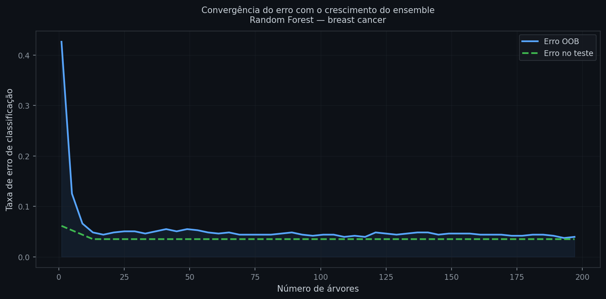
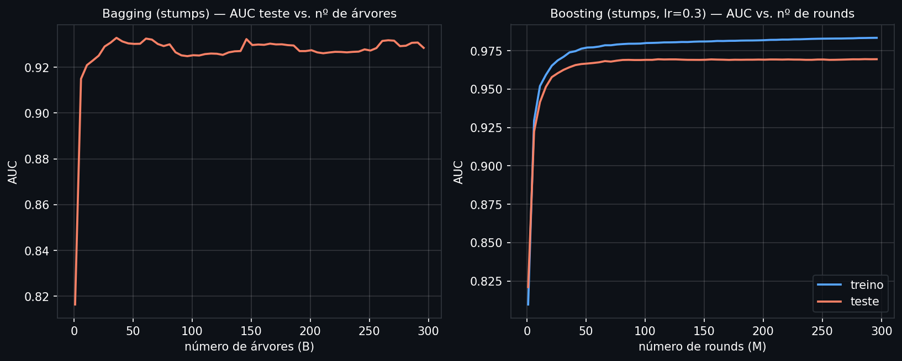
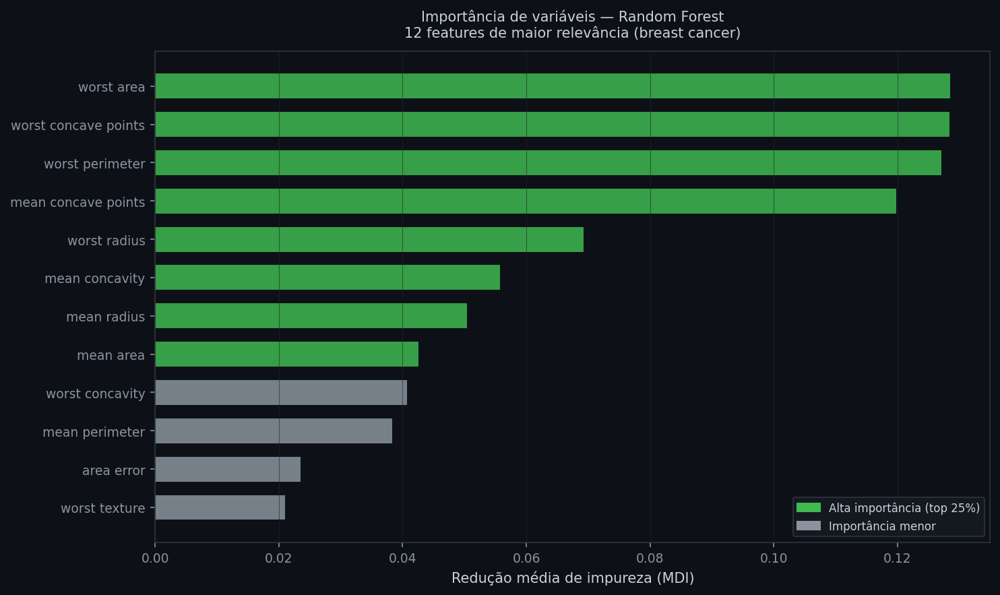
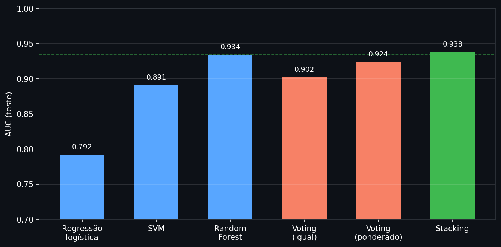

# Ensemble learning: bagging, boosting e stacking

A nota anterior mostrou que uma árvore de decisão é gulosa: a melhor divisão local em cada nó não garante a melhor árvore global, e pequenas mudanças nos dados de treino podem produzir estruturas completamente diferentes. Essa instabilidade parece um defeito, mas é exatamente o ingrediente que os ensembles exploram — se cada árvore erra de um jeito diferente, e os erros não são correlacionados, combinar muitas árvores cancela o ruído idiossincrático de cada uma.

Ensembles de árvores são o modelo mais usado em dados tabulares em produção — crédito, fraude, precificação de seguros. Random Forest e Gradient Boosting aparecem como primeira tentativa em praticamente todo pipeline desse tipo, porque herdam a vantagem das árvores (sem padronização, capturam interações sem engenharia explícita) e resolvem a fraqueza principal delas (instabilidade, variância alta). A diferença entre os dois está em *como* combinam as árvores: em paralelo, reduzindo variância, ou em sequência, reduzindo viés — mas, como esta nota mostra mais adiante, nada obriga um ensemble a ser feito só de árvores.

---

## Intuição

Peça a opinião de um único analista de crédito sobre se aprovar um empréstimo, e a resposta carrega os vieses e pontos cegos daquele analista específico. Peça a opinião de cem analistas independentes e agregue por voto majoritário, e os erros individuais — que apontam em direções diferentes — tendem a se cancelar; só sobra o padrão que a maioria concorda. Essa é a lógica do **bagging** (Bootstrap Aggregating): treinar muitas árvores em versões ligeiramente diferentes dos dados e combinar as previsões.

Existe uma segunda estratégia, com lógica oposta. Em vez de cem analistas trabalhando em paralelo e de forma independente, imagine uma cadeia de revisores: o primeiro dá um parecer inicial, o segundo revisa especificamente os casos em que o primeiro errou, o terceiro corrige os casos em que os dois primeiros ainda erram, e assim por diante. Cada revisor é especializado nos erros dos anteriores. Essa é a lógica do **boosting**: árvores treinadas em sequência, cada uma focada em corrigir o que as anteriores erraram.

A pergunta que guia o resto desta nota é: por que agregar em paralelo reduz variância, por que corrigir em sequência reduz viés, e quando cada estratégia é preferível.

## Definição formal

**Bagging** segue três passos:

1. Para $b = 1, \ldots, B$: sorteie $n$ observações com reposição do conjunto de treino (amostra bootstrap $\mathcal{B}_b$)
2. Treine uma árvore profunda em $\mathcal{B}_b$
3. Previsão final: média das previsões das $B$ árvores (regressão) ou voto majoritário (classificação)

**Bootstrap sampling** é a técnica estatística por trás do passo 1: sortear $n$ observações com reposição de um conjunto de $n$ observações originais para simular novas amostras da mesma população, sem precisar coletar dados novos. Como o sorteio é com reposição, cada amostra bootstrap deixa de fora, em média, cerca de um terço das observações originais — algumas aparecem repetidas, outras não aparecem. A probabilidade de uma observação específica **não** ser sorteada em nenhum dos $n$ sorteios de uma amostra é:

$$P(\text{fora da amostra}) = \left(1 - \frac{1}{n}\right)^n$$

Quando $n \to \infty$, essa probabilidade converge para $e^{-1} \approx 0{,}368$.

```python
import numpy as np

n = 100_000
rng = np.random.default_rng(42)
idx = rng.integers(0, n, size=n)  # amostra bootstrap: n sorteios com reposição de {0, ..., n-1}

frac_fora = 1 - len(np.unique(idx)) / n
print(f"Fração observada fora da amostra bootstrap: {frac_fora:.4f}")
print(f"Previsão teórica (1 - 1/n)^n quando n->infinito = 1/e: {np.exp(-1):.4f}")
```
```text
Fração observada fora da amostra bootstrap: 0.3673
Previsão teórica (1 - 1/n)^n quando n->infinito = 1/e: 0.3679
```
*Com 100 mil sorteios, a fração observada (36,73%) já converge para o limite teórico $1/e \approx 36,79\%$. A definição de Random Forest, logo abaixo, usa exatamente essas observações deixadas de fora — o "out-of-bag".*

A variância de um ensemble de $B$ previsores com variância individual $\sigma^2$ e correlação média $\rho$ entre eles é:

$$\text{Var}(\bar{f}) = \rho \sigma^2 + \frac{1 - \rho}{B} \sigma^2$$

onde $\rho$ mede o quanto os erros das árvores se movem juntos. Quando $B \to \infty$, o segundo termo vai a zero — o limite é $\rho \sigma^2$: a variância do ensemble não pode cair abaixo da correlação entre as árvores, não importa quantas sejam adicionadas.

> **Lembrete:** essa fórmula é a variância de uma soma de variáveis dependentes — ela só faz sentido com [esperança e variância](../../../00_fundamentos/probabilidade_estatistica/notas/04_probabilidade_bayes.md#esperança-e-variância) e [covariância e correlação](../../../00_fundamentos/probabilidade_estatistica/notas/03_correlacao.md#covariância) já revisados. $\rho$ aqui é exatamente a correlação de Pearson entre os erros das árvores.

**Random Forest** ataca diretamente esse limite, reaproveitando os passos 1 e 3 do bagging sem alteração — mesmo sorteio bootstrap, mesma agregação final por média ou voto — e modificando apenas o passo 2, a forma como cada árvore é construída: em vez de escolher a melhor divisão entre todas as $p$ variáveis disponíveis, **a cada divisão** — não uma vez por árvore, a cada nó individualmente — sorteia-se um subconjunto aleatório de $m$ variáveis (padrão $m = \lfloor\sqrt{p}\rfloor$ para classificação, $m = p/3$ para regressão), e a melhor divisão é escolhida apenas entre essas $m$, ignorando as demais $p - m$. A árvore continua crescendo profunda e sem poda, como no bagging — é o próprio ensemble que controla a variância, não a árvore individual.

Essa única mudança é o que diferencia Random Forest de um bagging comum de árvores: mesmo que exista uma variável muito dominante, ela não aparecerá em toda divisão de toda árvore — sortear um subconjunto novo a cada nó (e não apenas uma vez por árvore) garante que a decorrelação aconteça em profundidade, não só entre árvores. Isso reduz $\rho$ na fórmula acima. Uma vantagem prática decorrente do bootstrap: as observações fora de cada amostra (**out-of-bag**, OOB) — em média ~37% do total, como a derivação acima mostrou — servem como conjunto de validação natural, sem custo adicional de treino: a previsão OOB de cada observação é a média (ou voto) apenas das árvores que não a viram no treino.

### Estimação: Random Forest e bagging além de árvores, em código

```python
from sklearn.datasets import load_breast_cancer
from sklearn.model_selection import train_test_split
from sklearn.ensemble import RandomForestClassifier
from sklearn.tree import DecisionTreeClassifier
from sklearn.metrics import roc_auc_score

data = load_breast_cancer()
X, y = data.data, data.target
X_tr, X_te, y_tr, y_te = train_test_split(X, y, test_size=0.2, random_state=42)

tree = DecisionTreeClassifier(max_depth=4, random_state=42)
tree.fit(X_tr, y_tr)

rf = RandomForestClassifier(n_estimators=200, max_features="sqrt",
                             random_state=42, oob_score=True)
rf.fit(X_tr, y_tr)

print(f"AUC árvore única:          {roc_auc_score(y_te, tree.predict_proba(X_te)[:,1]):.3f}")
print(f"AUC Random Forest (n=200): {roc_auc_score(y_te, rf.predict_proba(X_te)[:,1]):.3f}")
print(f"Erro OOB:                  {1 - rf.oob_score_:.3f}")
```
```text
AUC árvore única:          0.936
AUC Random Forest (n=200): 0.996
Erro OOB:                  0.040
```
*A diferença entre 0.936 e 0.996 é inteiramente atribuível à agregação — mesmas árvores CART, combinadas em paralelo sobre amostras bootstrap decorrelacionadas. O erro OOB (4.0%) é próximo do erro real no conjunto de teste, confirmando que é um estimador confiável de generalização sem custo adicional de validação.*


*Com poucas árvores o erro oscila; a partir de ~80 árvores já estabiliza — consistente com o termo $(1-\rho)\sigma^2/B$ da fórmula de variância, que decresce rapidamente e depois achata. A curva OOB (azul) acompanha de perto o erro no teste (verde), validando seu uso como estimativa de generalização.*

Random Forest é bagging de árvores com uma regra extra de decorrelação — mas o bagging em si não exige árvore nenhuma. O sklearn expõe essa generalidade diretamente: `BaggingClassifier` e `BaggingRegressor` recebem qualquer modelo-base (parâmetro `estimator=`) e aplicam exatamente os passos 1-3 de bagging a ele, sem a subamostragem de variáveis que é exclusiva do Random Forest.

```python
from sklearn.ensemble import BaggingClassifier
from sklearn.neighbors import KNeighborsClassifier

for k in [1, 5]:
    single = KNeighborsClassifier(n_neighbors=k)
    single.fit(X_tr, y_tr)

    bag_knn = BaggingClassifier(estimator=KNeighborsClassifier(n_neighbors=k),
                                 n_estimators=50, random_state=42, n_jobs=-1)
    bag_knn.fit(X_tr, y_tr)

    auc_single = roc_auc_score(y_te, single.predict_proba(X_te)[:, 1])
    auc_bag = roc_auc_score(y_te, bag_knn.predict_proba(X_te)[:, 1])
    print(f"k={k}  KNN único: AUC={auc_single:.3f}  Bagging de KNN (B=50): AUC={auc_bag:.3f}")
```
```text
k=1  KNN único: AUC=0.916  Bagging de KNN (B=50): AUC=0.990
k=5  KNN único: AUC=0.996  Bagging de KNN (B=50): AUC=0.996
```
*Com $k=1$, o KNN é um previsor de altíssima variância — cada previsão depende de um único vizinho, então trocar um ponto de treino muda a fronteira inteira. Bagging reduz drasticamente essa variância (AUC salta de 0.916 para 0.990), exatamente como fez com árvores profundas. Com $k=5$, o KNN já é razoavelmente estável por si só — a agregação não tem o que reduzir, e o AUC não muda. A lição geral: bagging só ajuda quando o modelo-base tem variância alta para começar; usá-lo sobre um modelo já estável é desperdício de computação.*

Para regressão, `BaggingRegressor` segue a mesma lógica — a agregação final é a média das previsões numéricas em vez de voto:

```python
from sklearn.datasets import fetch_california_housing
from sklearn.ensemble import BaggingRegressor
from sklearn.tree import DecisionTreeRegressor
from sklearn.metrics import mean_squared_error

housing = fetch_california_housing()
Xh, yh = housing.data, housing.target
Xh_tr, Xh_te, yh_tr, yh_te = train_test_split(Xh, yh, test_size=0.2, random_state=42)

tree_reg = DecisionTreeRegressor(max_depth=8, random_state=42)
tree_reg.fit(Xh_tr, yh_tr)

bag_reg = BaggingRegressor(estimator=DecisionTreeRegressor(max_depth=8, random_state=42),
                            n_estimators=100, random_state=42, n_jobs=-1)
bag_reg.fit(Xh_tr, yh_tr)

print(f"RMSE árvore única:    {mean_squared_error(yh_te, tree_reg.predict(Xh_te))**0.5:.3f}")
print(f"RMSE Bagging (B=100): {mean_squared_error(yh_te, bag_reg.predict(Xh_te))**0.5:.3f}")
```
```text
RMSE árvore única:    0.650
RMSE Bagging (B=100): 0.585
```
*A mesma redução de variância aparece em regressão: o RMSE cai de 0.650 para 0.585 ao agregar 100 árvores de regressão bootstrap. `RandomForestRegressor` faz a mesma coisa que `BaggingRegressor` de árvores, apenas acrescentando a subamostragem de variáveis a cada divisão.*

O bagging reduz variância combinando modelos independentes que, individualmente, já têm viés baixo — árvores profundas, KNN com $k$ pequeno. Isso levanta a pergunta inversa: o que fazer quando o problema não é variância alta, mas viés — um modelo individual sistematicamente fraco?

> **Lembrete:** todo o argumento acima pressupõe o [trade-off viés-variância](../01_regressao_linear.md#trade-off-viés-variância), introduzido na nota de regressão linear. A definição formal de viés e variância de um estimador — $\text{Viés}(\hat\theta) = E[\hat\theta] - \theta$, $\text{MSE}(\hat\theta) = \text{Viés}(\hat\theta)^2 + \text{Var}(\hat\theta)$ — está em [MLE e MAP](../../../00_fundamentos/probabilidade_estatistica/notas/05_mle_map.md#definição-formal), em fundamentos.

### Boosting: correção sequencial do viés

**Gradient Boosting** constrói o ensemble de forma aditiva: a previsão final é a soma de $K$ árvores, cada uma treinada não sobre os dados originais, mas sobre o erro que o ensemble acumulado até então ainda comete. O índice $k$ usado aqui para rodada de boosting é o mesmo do artigo do XGBoost citado ao final desta nota — sem conflito com o $m$ de variáveis sorteadas por divisão no Random Forest, definido mais acima.

$$F_K(x) = \sum_{k=1}^{K} \nu \cdot h_k(x)$$

onde $h_k$ é a $k$-ésima árvore (tipicamente rasa — profundidade 3 a 8) e $\nu$ é a **taxa de aprendizado** (learning rate ou shrinkage), um fator entre 0 e 1 que reduz a contribuição de cada árvore individual. O algoritmo constrói essa soma um termo de cada vez:

1. Inicialize $F_0(x)$ com uma previsão constante (a média de $y$, para regressão)
2. Para $k = 1, \ldots, K$: calcule o **pseudo-resíduo** de cada observação — o gradiente negativo da função de perda em relação à previsão atual:

   $$r_i = -\frac{\partial L(y_i, F_{k-1}(x_i))}{\partial F_{k-1}(x_i)}$$

   Para perda quadrática, isso se reduz ao resíduo comum: $r_i = y_i - F_{k-1}(x_i)$
3. Treine uma árvore $h_k$ para prever esses pseudo-resíduos
4. Atualize $F_k(x) = F_{k-1}(x) + \nu \cdot h_k(x)$

Cada árvore nova mira exatamente o que o ensemble acumulado ainda erra — diferente do bagging, em que toda árvore é treinada de forma independente sobre uma amostra da mesma distribuição. É essa dependência sequencial que corrige o viés: mesmo que $h_1$ seja fraca (um stump, por exemplo), $h_2$ é treinada especificamente para corrigir os erros de $h_1$, e assim sucessivamente — o ensemble como um todo consegue representar uma função muito mais complexa do que qualquer árvore individual.

```python
from sklearn.datasets import make_moons
from sklearn.model_selection import train_test_split
from sklearn.ensemble import GradientBoostingClassifier, RandomForestClassifier
from sklearn.metrics import roc_auc_score

Xm, ym = make_moons(n_samples=2000, noise=0.3, random_state=42)
Xm_tr, Xm_te, ym_tr, ym_te = train_test_split(Xm, ym, test_size=0.3, random_state=42)

rf_stump = RandomForestClassifier(n_estimators=200, max_features="sqrt", max_depth=1, random_state=42)
rf_stump.fit(Xm_tr, ym_tr)

gb_stump = GradientBoostingClassifier(n_estimators=200, learning_rate=0.3, max_depth=1, random_state=42)
gb_stump.fit(Xm_tr, ym_tr)

print(f"AUC bagging de stumps (Random Forest):  {roc_auc_score(ym_te, rf_stump.predict_proba(Xm_te)[:,1]):.3f}")
print(f"AUC boosting de stumps (Gradient Boost): {roc_auc_score(ym_te, gb_stump.predict_proba(Xm_te)[:,1]):.3f}")
```
```text
AUC bagging de stumps (Random Forest):  0.927
AUC boosting de stumps (Gradient Boost): 0.969
```
*Mesmo aprendiz fraco (stump, uma única divisão) nos dois casos. Combinar centenas deles em paralelo (bagging) não corrige o viés estrutural do stump — ele erra sistematicamente na mesma região independente de quantos forem somados. Combinar em sequência (boosting), cada árvore corrigindo o erro da anterior, reduz o viés progressivamente.*


*À esquerda, o AUC de teste do bagging de stumps satura em torno de 0.92-0.93 assim que o número de árvores cresce — variância já foi eliminada, mas o viés do stump permanece intocado. À direita, o boosting de stumps segue subindo por dezenas de rounds antes de estabilizar perto de 0.97 — cada round reduz o viés residual. A partir de ~100 rounds, treino e teste convergem: o modelo já capturou o padrão e passa a ganhar pouco.*

**XGBoost** e **LightGBM** implementam essa mesma ideia com três diferenças que explicam por que dominam competições e pipelines de produção com dados tabulares:

- **Boosting de segunda ordem (Newton boosting)**: em vez de ajustar apenas o gradiente da perda, usam também a segunda derivada (Hessiana), o que produz passos mais precisos a cada round — análogo à diferença entre gradiente descendente comum e o método de Newton na otimização.
- **Regularização explícita na função objetivo**: o artigo do XGBoost (citado ao final desta nota) define, para cada árvore $f$ com $T$ folhas, cada uma com peso $w_j$ (para $j = 1, \ldots, T$):

  $$\Omega(f) = \gamma T + \frac{1}{2}\lambda \sum_{j=1}^{T} w_j^2$$

  onde $\gamma$ (parâmetro `gamma`) penaliza o **número de folhas** — quanto maior, mais uma nova divisão precisa reduzir o erro para valer a pena, controlando o crescimento da árvore diretamente na função objetivo, não só por profundidade máxima — e $\lambda$ (parâmetro `reg_lambda`) penaliza a **magnitude dos pesos** de cada folha, o mesmo princípio do Ridge (penalidade L2) aplicado à estrutura da árvore, não aos coeficientes de um modelo linear. Na implementação, soma-se ainda um termo L1 sobre os pesos, controlado por `reg_alpha` — o análogo do Lasso.
- **Subamostragem de linhas e colunas** (`subsample`, `colsample_bytree`): cada árvore vê apenas uma fração aleatória das observações e variáveis, emprestando do bagging uma forma adicional de reduzir variância dentro do boosting.

> **Lembrete:** a analogia com Ridge (L2) e Lasso (L1) pressupõe a nota de [Regularização](../02_regularizacao.md), onde essas penalidades são definidas para coeficientes de um modelo linear — aqui o mesmo princípio (penalizar magnitude para reduzir variância) é aplicado aos pesos das folhas de uma árvore, não a coeficientes.

A diferença prática entre XGBoost e LightGBM está em como cada árvore é construída: XGBoost cresce nível por nível (todas as folhas de uma profundidade antes de avançar); LightGBM cresce folha por folha, sempre expandindo a folha com maior ganho — o que produz árvores mais profundas e assimétricas, geralmente mais rápidas de treinar em datasets grandes, mas mais propensas a overfitting se `num_leaves` não for controlado.

## Interpretação

A **importância de variável** (MDI — Mean Decrease in Impurity), instável numa única árvore, se torna confiável quando calculada sobre um ensemble: a média das importâncias ao longo de centenas de árvores treinadas em amostras e subconjuntos de variáveis diferentes cancela a instabilidade que uma única árvore apresenta.


*"Worst area", "worst concave points" e "worst perimeter" — medidas do tumor em sua região mais anormal — concentram a maior parte da importância. As cinco variáveis principais acumulam mais de 50% do poder preditivo total. Variáveis próximas de zero podem ser removidas sem perda relevante de desempenho.*

Em crédito e risco, essa medida é usada para selecionar variáveis para o scorebook e justificar decisões para reguladores — o que torna Random Forest tanto poderoso quanto interpretável, ao contrário do que se costuma assumir sobre modelos de ensemble. No boosting, a importância análoga é o **gain** — o ganho médio de todas as divisões em que a variável aparece — e tende a ser mais concentrada em poucas variáveis do que a MDI do Random Forest, porque cada árvore nova é enviesada a explorar exatamente o que restou de sinal não capturado.

## Generalização

Tudo até aqui combinou árvores com árvores — bagging e boosting são estratégias de *como* treinar e agregar múltiplas árvores. Mas o princípio por trás de um ensemble é mais amplo do que isso: nada exige que os previsores combinados venham da mesma família de modelo. Uma regressão logística, uma SVM e uma árvore erram de formas diferentes — cada uma tem seu próprio viés estrutural — e essa diferença é exatamente o tipo de diversidade que faz um ensemble funcionar, na mesma lógica da correlação $\rho$ que limitava a variância do bagging.

A literatura de ensembles (Zhou, *Ensemble Methods: Foundations and Algorithms*, 2012) organiza a combinação de modelos heterogêneos em dois grupos: combinação por **regra fixa** — voting e averaging, que são o mesmo princípio aplicado a tipos de saída diferentes — e combinação por **regra aprendida**, o stacking.

**Voting e averaging** treinam cada modelo de forma independente nos mesmos dados e combinam as previsões sem aprender nenhum peso novo. Para saída categórica (classificação), a combinação se chama **voting**: **hard voting** usa o voto majoritário das classes previstas; **soft voting** faz a média das probabilidades previstas por cada modelo, dando mais peso a previsões mais confiantes que a um voto binário — soft voting já é, na prática, um caso de averaging aplicado a probabilidades. Para saída numérica (regressão, onde não há classes para votar), a mesma combinação se chama **averaging**: a previsão final é a média (ou média ponderada) das previsões numéricas de cada modelo — o mesmo princípio usado pelo bagging para agregar árvores, agora aplicado a modelos de naturezas diferentes.

Em ambas as variantes, por padrão, todo modelo entra com peso igual — o que é um problema quando um dos modelos é claramente mais fraco que os outros. O **weighted voting** (ou *weighted averaging*, no caso de regressão) corrige isso atribuindo manualmente um peso maior aos modelos de melhor desempenho: no `VotingClassifier` do sklearn, o parâmetro `weights` multiplica a contribuição de cada modelo antes da agregação, então um modelo com peso 4 pesa o dobro de um com peso 2 na média final. Os pesos costumam ser escolhidos a partir do desempenho de cada modelo numa validação separada — quanto maior o AUC de validação, maior o peso atribuído. É a versão direta da intuição de "vários analistas votando", agora aplicada a modelos de naturezas diferentes em vez de várias árvores, com a opção de dar mais voz a quem historicamente acerta mais.

O averaging direto tem um ponto cego que o voting de classes não tem: ele soma valores que precisam estar na mesma escala para fazer sentido. Um `predict_proba` está sempre entre 0 e 1, mas a `decision_function` de uma SVM não é uma probabilidade calibrada — pode variar livremente em qualquer intervalo, dependendo dos dados e da regularização. Somar esses dois scores diretamente deixa o modelo de escala maior dominar a média, mesmo que o outro modelo tenha uma capacidade de ordenação melhor. O **rank averaging** resolve isso: em vez de combinar os scores brutos, converte-se a previsão de cada modelo em seu **rank** — a posição relativa daquela observação entre todas as outras, segundo aquele modelo — e faz-se a média dos ranks. Como o rank não depende da escala original, um modelo com scores entre -300 e 400 e outro com probabilidades entre 0 e 1 contribuem em pé de igualdade.

```python
import numpy as np
from scipy.stats import rankdata
from sklearn.metrics import roc_auc_score

y = np.array([0, 0, 0, 0, 1, 1, 1, 1])

# Modelo A: bem calibrado, ordena as classes perfeitamente, mas com baixa confiança (probas ~0.5)
model_a = np.array([0.46, 0.47, 0.48, 0.49, 0.51, 0.52, 0.53, 0.54])

# Modelo B: escala bruta grande (ex.: decision_function não calibrada), com um pequeno erro de ranking
model_b = np.array([-300, -100, -200, 300, -50, 150, 250, 400])

print(f"AUC modelo A (sozinho):     {roc_auc_score(y, model_a):.4f}")
print(f"AUC modelo B (sozinho):     {roc_auc_score(y, model_b):.4f}")
print(f"AUC averaging direto (A+B): {roc_auc_score(y, (model_a + model_b) / 2):.4f}")

rank_avg = (rankdata(model_a) + rankdata(model_b)) / 2
print(f"AUC rank averaging (A+B):   {roc_auc_score(y, rank_avg):.4f}")
```
```text
AUC modelo A (sozinho):     1.0000
AUC modelo B (sozinho):     0.8125
AUC averaging direto (A+B): 0.8125
AUC rank averaging (A+B):   0.9062
```
*O modelo A ordena as oito observações perfeitamente (AUC=1.0), mas com scores numericamente pequenos (0.46 a 0.54). O modelo B tem uma escala centenas de vezes maior e um pequeno erro de ranking (AUC=0.8125). No averaging direto, a soma é dominada pela magnitude de B — o resultado final (AUC=0.8125) é idêntico ao de B sozinho, como se A não tivesse contribuído nada. No rank averaging, ambos os modelos entram com o mesmo peso relativo (ranks de 1 a 8), e o resultado (AUC=0.9062) fica entre os dois — a informação de A deixou de ser descartada.*

O **stacking** (empilhamento) vai além: em vez de uma regra fixa de combinação, um **meta-modelo** — geralmente uma regressão logística simples — é treinado para aprender como ponderar as previsões dos modelos-base. As previsões usadas para treinar o meta-modelo vêm de validação cruzada (`cv`), não do próprio conjunto de treino dos modelos-base — usar previsões vazadas do treino inflaria artificialmente a confiança do meta-modelo nos modelos que mais overfitam. O **blending** é uma variante mais simples: em vez de validação cruzada completa, separa-se uma fração fixa do treino só para gerar as previsões que alimentam o meta-modelo.

```python
from sklearn.datasets import make_classification
from sklearn.linear_model import LogisticRegression
from sklearn.svm import SVC
from sklearn.ensemble import VotingClassifier, StackingClassifier
from sklearn.preprocessing import StandardScaler
from sklearn.pipeline import make_pipeline

X, y = make_classification(n_samples=3000, n_features=20, n_informative=6,
                            n_redundant=6, n_clusters_per_class=3,
                            flip_y=0.06, class_sep=0.7, random_state=42)
X_tr, X_te, y_tr, y_te = train_test_split(X, y, test_size=0.3, random_state=42)

log_reg = make_pipeline(StandardScaler(), LogisticRegression(max_iter=1000, random_state=42))
svc = make_pipeline(StandardScaler(), SVC(probability=True, random_state=42))
rf = RandomForestClassifier(n_estimators=200, max_features="sqrt", random_state=42)

voting = VotingClassifier(estimators=[("lr", log_reg), ("svc", svc), ("rf", rf)], voting="soft")
voting.fit(X_tr, y_tr)

# pesos manuais: favorece o modelo com melhor AUC de validação (Random Forest)
voting_weighted = VotingClassifier(estimators=[("lr", log_reg), ("svc", svc), ("rf", rf)],
                                    voting="soft", weights=[1, 1, 4])
voting_weighted.fit(X_tr, y_tr)

stacking = StackingClassifier(estimators=[("lr", log_reg), ("svc", svc), ("rf", rf)],
                               final_estimator=LogisticRegression(), cv=5)
stacking.fit(X_tr, y_tr)
```
```text
Regressão logística      AUC=0.792
SVM                       AUC=0.891
Random Forest             AUC=0.934
Voting (soft, igual)      AUC=0.902
Voting (soft, ponderado)  AUC=0.924
Stacking                  AUC=0.938
```
*Neste dataset sintético não-linear com ruído de rótulo, os três modelos individuais têm desempenhos bem diferentes — a regressão logística sofre porque a fronteira real não é linear. O voting com peso igual (0.902) fica **abaixo** do melhor modelo individual (Random Forest, 0.934): a média dá peso igual à regressão logística fraca, que arrasta o resultado para baixo. Atribuir peso 4 à Random Forest e peso 1 aos demais (`weights=[1, 1, 4]`) recupera boa parte da perda (0.924), mas ainda fica abaixo do melhor modelo isolado — os pesos foram escolhidos manualmente, não otimizados. O stacking (0.938) é o único a superar todos os modelos individuais: o meta-modelo aprende automaticamente a ponderação ótima em vez de depender de uma escolha manual.*


*A linha tracejada verde marca o AUC do melhor modelo individual (Random Forest). Os dois votings (laranja) ficam abaixo dela: o de peso igual porque a regressão logística fraca arrasta a média; o ponderado melhora ao dar mais peso à Random Forest, mas ainda depende de uma escolha manual de quanto peso dar a cada modelo. Stacking (verde) fica acima de todos — o meta-modelo aprendeu a combinação ótima em vez de depender de pesos fixados a priori.*

O voting com peso igual é o mais simples e mais barato, mas assume implicitamente que todos os modelos-base merecem a mesma confiança — uma suposição que só compensa quando os modelos têm qualidade parecida. O weighted voting corrige parcialmente esse ponto cego, mas exige escolher os pesos manualmente, a partir de um critério fixo como o AUC de validação. O stacking resolve o problema por completo ao aprender os pesos como parte do treino, ao custo de mais uma camada de modelo e do cuidado adicional em evitar vazamento de dados entre o treino dos modelos-base e o treino do meta-modelo — exatamente o tipo de cuidado que a próxima seção, sobre avaliação, formaliza.

## Avaliação

As métricas de avaliação (AUC, F1, RMSE) são as mesmas dos capítulos anteriores. Para bagging e Random Forest, o erro OOB é um substituto eficiente da validação cruzada. Para boosting, o equivalente é a **curva de validação por round**: acompanhar o desempenho num conjunto de validação a cada árvore adicionada e escolher o ponto de melhor desempenho — é exatamente essa curva que a figura da seção anterior mostra. Em dados temporais, a validação out-of-time continua sendo a mais realista — nenhuma estrutura de ensemble elimina a necessidade de respeitar a ordem cronológica.

Para **voting e stacking** (seção Generalização), a avaliação honesta exige o mesmo cuidado descrito na CV aninhada da nota de Validação Cruzada: o `cv` interno do `StackingClassifier` só gera as previsões que treinam o meta-modelo, sem vazamento entre modelos-base e meta-modelo — mas reportar o desempenho final do stacking ainda exige um conjunto de teste (ou um loop externo de CV) que não participou de nenhuma etapa do ajuste, pela mesma razão que reportar o score da própria busca de hiperparâmetro infla o resultado.

> **Lembrete:** a comparação acima só faz sentido se a mecânica da validação cruzada $k$-fold já estiver clara — introduzida em [Regularização](../02_regularizacao.md#como-escolher-λ) e formalizada com viés/variância do próprio estimador de erro em [Validação Cruzada](../../../00_fundamentos/probabilidade_estatistica/notas/06_validacao_cruzada.md), em fundamentos. É o método que o OOB substitui, e o mesmo que o `cv` do `StackingClassifier` usa internamente (seção Generalização) para não vazar dados do treino dos modelos-base para o meta-modelo.

## Premissas e limitações

Random Forest e Gradient Boosting não têm premissas distributivas — herdam essa característica das árvores individuais. As restrições práticas, específicas de cada estratégia, são:

**Custo computacional e de memória**: treinar e armazenar centenas de árvores profundas custa mais tempo e memória do que uma única árvore. Para a maioria dos problemas tabulares isso é irrelevante, mas em cenários de baixa latência (scoring em tempo real de alto volume) o custo de previsão — percorrer todas as árvores do ensemble — pode ser um fator limitante.

**Boosting overfita se não for controlado**: como cada round persegue agressivamente o erro residual, rounds demais ou `learning_rate` alto memorizam ruído do treino — ao contrário do bagging, que não overfita ao aumentar `n_estimators`. Isso exige monitorar a curva de validação e usar **early stopping**: interromper o treino quando o desempenho de validação para de melhorar por um número fixo de rounds (`early_stopping_rounds`).

```python
import xgboost as xgb

X_tr2, X_val, y_tr2, y_val = train_test_split(X_tr, y_tr, test_size=0.2, random_state=42)

xgb_es = xgb.XGBClassifier(n_estimators=1000, learning_rate=0.1, max_depth=3,
                            eval_metric="logloss", early_stopping_rounds=20, random_state=42)
xgb_es.fit(X_tr2, y_tr2, eval_set=[(X_val, y_val)], verbose=False)

print(f"Melhor iteração: {xgb_es.best_iteration} (de 1000 configuradas)")
print(f"AUC teste:        {roc_auc_score(y_te, xgb_es.predict_proba(X_te)[:,1]):.3f}")
```
```text
Melhor iteração: 43 (de 1000 configuradas)
AUC teste:        0.994
```
*O treino foi configurado para até 1000 rounds, mas o desempenho de validação parou de melhorar na iteração 43 — os 957 rounds restantes seriam puro overfitting. `best_iteration` é o número de árvores efetivamente usado na previsão final.*

**Sensibilidade a outliers e ruído de rótulo**: como cada round persegue o erro residual, uma observação com rótulo incorreto ou valor extremo recebe atenção crescente a cada round — o boosting pode passar a "decorar" essa observação específica. Random Forest, por tratar cada árvore de forma independente, é mais robusto a esse tipo de ruído.

**Viés de importância por tipo de variável**: variáveis contínuas com muitos valores únicos têm mais limiares candidatos, o que infla artificialmente sua importância MDI (Random Forest) ou gain (boosting). Para comparações entre variáveis de naturezas diferentes, use importância por permutação: embaralha-se cada variável uma por vez no conjunto de teste e mede-se a queda no desempenho.

```python
from sklearn.inspection import permutation_importance

result = permutation_importance(rf, X_te, y_te, n_repeats=10,
                                scoring="roc_auc", random_state=42)
for i in result.importances_mean.argsort()[::-1][:3]:
    print(f"{data.feature_names[i]:<30} {result.importances_mean[i]:.3f} ± {result.importances_std[i]:.3f}")
```
```text
worst area                     0.012 ± 0.007
worst perimeter                0.007 ± 0.006
worst concave points            0.006 ± 0.007
```
*A ordem das variáveis é consistente com o MDI, mas as magnitudes são menores — a permutação mede impacto real no AUC de teste, não contribuição acumulada no treino. O desvio padrão indica estabilidade: variáveis com desvio alto têm importância dependente da amostra.*

**Desbalanceamento de classes**: em datasets onde a classe positiva é rara — inadimplência de 5%, fraude de 1% — `class_weight="balanced"` (Random Forest) ou `scale_pos_weight` (XGBoost) corrigem o viés do ensemble em direção à classe majoritária. Avalie com F1-score, curva precision-recall ou KS statistic além do AUC.

**Voting e stacking herdam as premissas de cada modelo-base.** Combinar modelos heterogêneos não elimina as exigências individuais de cada um: uma regressão logística no ensemble ainda pressupõe log-odds lineares nas variáveis (nota de [Regressão logística](03_regressao_logistica.md)), e uma SVM ainda exige padronização das variáveis antes do treino. Um ensemble heterogêneo mal ajustado — por exemplo, sem padronizar os dados de entrada da SVM — carrega esse problema para dentro da combinação, mesmo que os outros modelos-base não precisem de padronização.

## Na prática

```python
from sklearn.ensemble import RandomForestClassifier

rf = RandomForestClassifier(
    n_estimators=300,      # mais árvores = mais estável; 200–500 é suficiente
    max_features="sqrt",   # padrão para classificação; "log2" ou 0.3 são alternativas
    max_depth=None,        # deixa as árvores crescerem; controle via min_samples_leaf
    min_samples_leaf=5,    # evita folhas com <5 obs — reduz overfitting em dados ruidosos
    oob_score=True,        # estimativa de generalização sem custo extra
    n_jobs=-1,             # paraleliza por CPU
    random_state=42
)
rf.fit(X_tr, y_tr)
```

| Parâmetro (Random Forest) | Efeito | Valor inicial |
|---|---|---|
| `n_estimators` | Mais árvores reduz variância; rendimento decresce após ~200 | 200–500 |
| `max_features` | Menos features por divisão decorrela árvores, reduz $\rho$; padrão `"sqrt"` para classificação e `1.0` (todas) para regressão — prefira `"sqrt"` ou `0.33` também em regressão | `"sqrt"` |
| `min_samples_leaf` | Maior = menos overfitting, mais viés | 1–20 |
| `max_depth` | Limitar pode ajudar em datasets muito ruidosos | `None` por padrão |

```python
import xgboost as xgb

xgb_model = xgb.XGBClassifier(
    n_estimators=1000,          # alto, mas controlado por early stopping
    learning_rate=0.05,         # menor lr exige mais rounds, mas generaliza melhor
    max_depth=4,                # árvores rasas; 3-8 é o intervalo usual
    subsample=0.8,              # amostra 80% das linhas por árvore
    colsample_bytree=0.8,       # amostra 80% das variáveis por árvore
    reg_lambda=1.0,             # regularização L2 nos pesos das folhas
    early_stopping_rounds=30,
    eval_metric="auc",
    random_state=42
)
xgb_model.fit(X_tr, y_tr, eval_set=[(X_val, y_val)], verbose=False)
```

| Parâmetro (XGBoost/LightGBM) | Efeito | Valor inicial |
|---|---|---|
| `learning_rate` | Menor = mais robusto, exige mais `n_estimators`; controla o trade-off velocidade × generalização | 0.01–0.1 |
| `n_estimators` + `early_stopping_rounds` | Define o teto de rounds e para automaticamente no ponto ótimo | 500–2000 + 20–50 |
| `max_depth` | Árvores mais rasas que em Random Forest — o ensemble sequencial não precisa de árvores individuais fortes | 3–8 |
| `subsample`, `colsample_bytree` | Reduzem variância adicional dentro do boosting, como no bagging | 0.6–0.9 |
| `gamma` | Penaliza o número de folhas ($\gamma T$ na função objetivo) — ganho mínimo para uma divisão ser aceita | 0–5 |
| `reg_lambda`, `reg_alpha` | Regularização L2/L1 nos pesos das folhas ($\lambda$, análogo Ridge; $\alpha$, análogo Lasso); sobe conforme o risco de overfitting aumenta | 0–5 |
| `num_leaves` (LightGBM) | Equivalente a `max_depth` no crescimento folha-a-folha do LightGBM — limita diretamente o tamanho da árvore, já que a profundidade sozinha não controla o crescimento assimétrico | 20–50 |

Random Forest é o ponto de partida natural: robusto, paraleliza treino inteiro, poucos hiperparâmetros críticos, tolera ruído. Gradient Boosting (XGBoost, LightGBM) normalmente supera Random Forest em AUC final, mas exige mais cuidado — sem early stopping e sem controle de `learning_rate`/`max_depth`, o modelo overfita. Em produção, a prática comum é começar com Random Forest como baseline e evoluir para XGBoost/LightGBM com tuning via validação cruzada quando o ganho de desempenho justificar a complexidade adicional de manutenção.

Os hiperparâmetros de `BaggingClassifier`/`BaggingRegressor` (seção Estimação) e de `VotingClassifier`/`StackingClassifier` (seção Generalização) seguem a mesma lógica, com um número menor de parâmetros críticos:

| Parâmetro | Efeito | Valor inicial |
|---|---|---|
| `estimator` (Bagging) | O modelo-base a ser agregado; só compensa quando tem variância alta (nota da seção Estimação) — árvore profunda, KNN com $k$ pequeno | árvore profunda ou similar |
| `n_estimators` (Bagging) | Mesmo efeito do Random Forest: mais réplicas reduzem variância, com rendimento decrescente | 50–200 |
| `weights` (Voting) | Pesos manuais por modelo-base; sem ele, todos entram com peso igual | proporcional ao AUC de validação de cada modelo |
| `voting="soft"` vs. `"hard"` | Soft usa probabilidades (`predict_proba`); exige que todo modelo-base implemente esse método | `"soft"` quando disponível |
| `final_estimator` (Stacking) | O meta-modelo; geralmente um modelo simples (regressão logística) para evitar que o meta-modelo também precise de regularização forte | `LogisticRegression()` |
| `cv` (Stacking) | Número de folds para gerar as previsões out-of-fold que treinam o meta-modelo, evitando vazamento (nota de Validação Cruzada) | 5 |

---

## Leitura recomendada

**BREIMAN, L.** *Random Forests*. Machine Learning, v. 45, n. 1, p. 5–32, 2001. [→ PDF aberto](https://www.stat.berkeley.edu/~breiman/randomforest2001.pdf)
Artigo original que introduz o algoritmo. Cobre a demonstração de convergência do erro OOB, a derivação da fórmula de variância do ensemble com correlação $\rho$, e experimentos em dezenas de datasets. Referência direta para entender o que o sklearn implementa em `RandomForestClassifier`.

**CHEN, T.; GUESTRIN, C.** *XGBoost: A Scalable Tree Boosting System*. arXiv:1603.02754, 2016. [→ PDF aberto](https://arxiv.org/abs/1603.02754)
Artigo que descreve o sistema por trás do XGBoost: a derivação de segunda ordem (gradiente + Hessiana) da função objetivo, a regularização explícita sobre a estrutura da árvore, e as otimizações de engenharia (sparsity-aware split finding, weighted quantile sketch) que tornam o boosting viável em datasets de produção com milhões de linhas.
