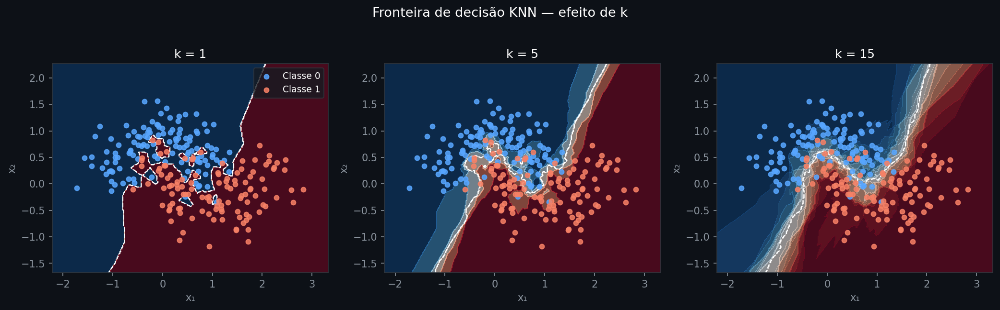
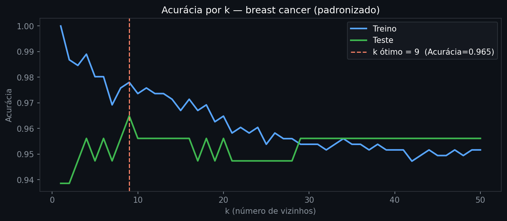

# K-Nearest Neighbors

Árvores, Random Forest e Gradient Boosting constroem uma estrutura durante o treino: dividem o espaço de variáveis em regiões e associam uma previsão a cada região, refinando o resultado com centenas de árvores combinadas. Uma vez treinado, o modelo pode descartar os dados originais — tudo que importa ficou nas divisões aprendidas. Essa abordagem funciona bem, mas pressupõe que se consiga capturar o padrão com uma partição global do espaço. Quando a informação útil está na semelhança local entre exemplos individuais, essa suposição não se sustenta.

K-Nearest Neighbors (KNN) inverte a lógica: não aprende nenhuma estrutura durante o treino e carrega todos os dados até o momento da previsão. Em sistemas de recomendação, a pergunta "quais filmes sugerir a este usuário?" se traduz diretamente em "quais usuários são mais parecidos com ele e o que eles assistiram?" — sem treino, sem coeficientes, sem partições. Em buscas semânticas, quando um assistente de IA precisa localizar os trechos mais relevantes de uma base de conhecimento, o mecanismo central é identificar quais representações textuais estão mais próximas da representação da pergunta no espaço vetorial — exatamente um problema de vizinhos mais próximos executado sobre embeddings.

---

## Intuição

Imagine que você precisa decidir se um novo cliente vai honrar um empréstimo. Você não tem uma fórmula treinada — só o histórico de clientes anteriores. Uma estratégia natural: encontre os cinco clientes com renda, histórico de crédito e valor solicitado mais parecidos com esse novo caso, e veja o que aconteceu com eles. Se quatro dos cinco foram adimplentes, a previsão é adimplência.

KNN faz exatamente isso de forma sistemática. Durante o treino, nenhum cálculo é realizado: o modelo apenas armazena todos os exemplos. Na previsão, para cada ponto novo, o algoritmo mede a distância até cada ponto do conjunto de treino, seleciona os $k$ mais próximos e agrega suas respostas — voto majoritário para classificação, média para regressão.

A pergunta imediata é: o que significa "próximo" em espaços com muitas variáveis? E como a escolha de $k$ muda a qualidade da previsão?

## Definição formal

Dado um conjunto de treino $\{(x_i, y_i)\}_{i=1}^{n}$ com $x_i \in \mathbb{R}^p$, a previsão para um novo ponto $x$ ocorre em dois passos.

**Passo 1 — Identificar os $k$ vizinhos mais próximos.** A métrica padrão é a distância euclidiana:

$$d(x, x_i) = \sqrt{\sum_{j=1}^{p}(x_j - x_{ij})^2}$$

onde $x_j$ e $x_{ij}$ são as $j$-ésimas coordenadas de $x$ e $x_i$. O conjunto dos $k$ vizinhos mais próximos é o subconjunto de índices $\mathcal{N}_k(x) \subset \{1, \ldots, n\}$ com as $k$ menores distâncias a $x$.

**Passo 2 — Agregar os rótulos.** Para **classificação**, a previsão é a classe com mais representantes entre os $k$ vizinhos:

$$\hat{y}(x) = \arg\max_{c}\sum_{i \in \mathcal{N}_k(x)} \mathbf{1}[y_i = c]$$

Para **regressão**, é a média dos valores:

$$\hat{y}(x) = \frac{1}{k} \sum_{i \in \mathcal{N}_k(x)} y_i$$

Além da euclidiana, outras métricas são utilizadas conforme o tipo de dado. A **distância de Manhattan** — soma das diferenças absolutas coordenada a coordenada — é mais robusta a outliers em variáveis individuais:

$$d_{\text{Manhattan}}(x, x_i) = \sum_{j=1}^{p}|x_j - x_{ij}|$$

Para variáveis binárias, a **distância de Hamming** conta o número de posições em que dois vetores diferem. Para dados mistos — numéricos e categóricos combinados — combinações ponderadas das métricas por tipo de variável são necessárias.

O KNN não tem parâmetros treináveis: a "memória" do modelo é o conjunto de treino inteiro. Isso tem consequências diretas sobre custo e escalabilidade — que a seção de Premissas vai detalhar — mas o efeito mais imediato é o papel de $k$ na fronteira de decisão.

## Como o KNN faz previsões

```python
from sklearn.neighbors import KNeighborsClassifier
from sklearn.datasets import load_breast_cancer
from sklearn.model_selection import train_test_split
from sklearn.preprocessing import StandardScaler
from sklearn.metrics import roc_auc_score

data = load_breast_cancer()
X, y = data.data, data.target
X_tr, X_te, y_tr, y_te = train_test_split(X, y, test_size=0.2, random_state=42)

scaler = StandardScaler()
X_tr_sc = scaler.fit_transform(X_tr)
X_te_sc = scaler.transform(X_te)

for k in [1, 5, 15, 50]:
    knn = KNeighborsClassifier(n_neighbors=k)
    knn.fit(X_tr_sc, y_tr)
    auc = roc_auc_score(y_te, knn.predict_proba(X_te_sc)[:, 1])
    print(f"k={k:>3}  AUC={auc:.3f}")
```
```text
k=  1  AUC=0.932
k=  5  AUC=0.982
k= 15  AUC=0.992
k= 50  AUC=0.995
```
*O AUC cresce com $k$ porque com $k=1$ o `predict_proba` retorna apenas 0 ou 1 — probabilidades binárias que prejudicam o ranking. Com $k$ maior, as probabilidades tomam valores intermediários (0.2, 0.4...), melhorando a ordenação. Para acurácia, a curva tem formato de U: existe um $k$ ótimo e o desempenho cai além dele — o gráfico da seção Avaliação mostra esse comportamento.*

## Interpretação

A fronteira de decisão do KNN é formada pelos pontos equidistantes a exemplos de classes opostas. Com $k=1$, cada ponto de treino cria uma "ilha" ao redor de si: qualquer novo ponto vai para a classe do único vizinho mais próximo, gerando uma fronteira irregular que memoriza o ruído. Com $k=15$, a previsão resulta de um consenso — pequenos grupos ruidosos são sobrevotados pelos vizinhos corretos, e a fronteira se suaviza.


*Em k=1 (esquerda), a fronteira segue cada ponto de treino de perto — ilhas de uma classe aparecem dentro de regiões da outra. Em k=5 (centro), as ilhas menores desaparecem. Em k=15 (direita), a fronteira captura apenas o padrão estrutural do dataset, ignorando variações locais. A linha tracejada branca marca a fronteira de decisão em 0,5 de probabilidade.*

O parâmetro $k$ controla o **trade-off viés-variância**: $k$ pequeno tem baixo viés (a fronteira pode assumir qualquer forma) mas alta variância (sensível a exemplos individuais); $k$ grande tem baixa variância mas introduz viés ao suavizar diferenças reais. Não existe solução analítica para encontrar o $k$ ótimo — é necessário validar em dados não vistos.

A escolha de $k$ não é o único fator que define o que o algoritmo considera "próximo". A forma como as variáveis são medidas tem impacto ainda mais imediato.

## Generalização

A versão padrão do KNN trata todos os $k$ vizinhos como igualmente relevantes. Uma extensão natural é o **KNN ponderado**: cada vizinho contribui com peso inversamente proporcional à sua distância — $w_i = 1/d(x, x_i)$. Vizinhos muito próximos dominam a previsão; vizinhos no limite da vizinhança têm influência reduzida. No scikit-learn, `weights="distance"` ativa esse comportamento.

Para datasets grandes — milhões de exemplos — calcular a distância até cada ponto de treino em cada previsão é proibitivo. **Approximate Nearest Neighbor** (ANN) resolve isso com estruturas de indexação — árvores KD, grafos HNSW, quantização de produto vetorial — que localizam os $k$ vizinhos *aproximados* em tempo sublinear. Sistemas como FAISS (Meta) e HNSW buscam entre bilhões de vetores em milissegundos. Quando um modelo de linguagem recupera documentos relevantes para uma pergunta, é essa camada de busca vetorial aproximada que executa o KNN em escala.

Uma alternativa ao $k$ fixo é o **Radius Neighbors**: fixa-se um raio $r$ e inclui-se todos os pontos dentro dele, sem limitar a quantidade. Em regiões densas do treino, mais vizinhos contribuem; em regiões esparsas, menos — o que reflete naturalmente a incerteza local.

## Avaliação


*Com k=1, a acurácia de treino é 1,0 — cada ponto é seu próprio vizinho, erro zero no treino. Conforme k cresce, a acurácia de treino cai gradualmente. A acurácia de teste sobe rápido para k pequeno (o consenso elimina ruído) e depois declina quando k é grande demais (viés domina). O k ótimo neste dataset é 9.*

As métricas adequadas para KNN são as mesmas dos capítulos anteriores: AUC e F1 para classificação, RMSE e MAE para regressão. A diferença operacional é que o custo de treino é zero — todo o custo computacional está na previsão.

## Premissas e limitações

**Escala das variáveis é obrigatória.** A distância euclidiana soma os quadrados das diferenças em cada dimensão. Uma variável em reais (renda: 3.000–30.000) domina completamente uma em anos (idade: 20–80), não porque renda seja mais informativa, mas apenas pela unidade de medida. O efeito é dramático:

```python
from sklearn.datasets import load_wine
from sklearn.neighbors import KNeighborsClassifier
from sklearn.model_selection import train_test_split
from sklearn.preprocessing import StandardScaler

data_wine = load_wine()
X_w, y_w = data_wine.data, data_wine.target
X_w_tr, X_w_te, y_w_tr, y_w_te = train_test_split(X_w, y_w, test_size=0.2, random_state=42)

scaler_w = StandardScaler()
X_w_tr_sc = scaler_w.fit_transform(X_w_tr)
X_w_te_sc = scaler_w.transform(X_w_te)

knn = KNeighborsClassifier(n_neighbors=5)

knn.fit(X_w_tr, y_w_tr)
print(f"Sem padronização  Acurácia={knn.score(X_w_te, y_w_te):.3f}")

knn.fit(X_w_tr_sc, y_w_tr)
print(f"Com padronização  Acurácia={knn.score(X_w_te_sc, y_w_te):.3f}")
```
```text
Sem padronização  Acurácia=0.722
Com padronização  Acurácia=0.944
```
*No dataset wine, uma variável como prolina varia de 278 a 1.680 mg/L enquanto o teor alcoólico varia de 11,0 a 14,8. Sem padronização, a prolina determina praticamente todas as distâncias — os "vizinhos" são escolhidos quase exclusivamente por ela. Com padronização, cada variável contribui proporcionalmente. Os 22 pontos percentuais de diferença na acurácia são inteiramente explicados por essa distorção de escala.*

**Maldição da dimensionalidade.** Em espaços de alta dimensão, as distâncias entre pontos convergem: o vizinho mais próximo e o mais distante ficam com distâncias quase iguais. Em 1.000 dimensões, qualquer ponto tem tantas coordenadas onde difere de qualquer outro que as diferenças individuais se diluem — a noção de "vizinhança" perde sentido conforme $p$ cresce. KNN com dados brutos de alta dimensão (imagens, textos em bag-of-words) funciona mal por esse motivo. O que funciona é KNN sobre **representações compactas** (embeddings), onde a dimensionalidade foi reduzida preservando a estrutura semântica.

**Custo de previsão.** Treinar um KNN é armazenar os dados: custo $O(1)$. Prever exige comparar o ponto novo com todos os $n$ exemplos de treino em $p$ dimensões: custo $O(np)$ por consulta. Com $n = 10^6$ e $p = 100$, cada previsão envolve $10^8$ operações — inviável em produção sem indexação aproximada.

**Sem interpretabilidade global.** KNN não produz coeficientes nem importância de variável. A previsão para um ponto específico pode ser rastreada até os $k$ vizinhos mais próximos — o que gera justificativa individual — mas não produz uma política global explicável da forma que coeficientes de regressão ou importâncias de árvore produzem.

## Na prática

```python
from sklearn.model_selection import cross_val_score

# X_tr_sc e y_tr definidos no primeiro bloco de código
for k in [3, 5, 7, 11, 15, 21]:
    knn = KNeighborsClassifier(n_neighbors=k)
    scores = cross_val_score(knn, X_tr_sc, y_tr, cv=5, scoring="roc_auc")
    print(f"k={k:>3}  AUC CV={scores.mean():.3f} ± {scores.std():.3f}")
```
```text
k=  3  AUC CV=0.975 ± 0.018
k=  5  AUC CV=0.983 ± 0.009
k=  7  AUC CV=0.986 ± 0.011
k= 11  AUC CV=0.988 ± 0.008
k= 15  AUC CV=0.988 ± 0.008
k= 21  AUC CV=0.990 ± 0.007
```
*A variância (±) cai conforme k cresce — previsões com k pequeno são mais instáveis entre os folds. A diferença de desempenho médio entre k=7 e k=21 é pequena (0,004 AUC), mas a estabilidade melhora. Em dados de crédito onde a reprodutibilidade das previsões é auditada, prefira k ≥ 5 com `weights="distance"` para combinar estabilidade com sensibilidade local.*

Decisões práticas:

| Situação | Recomendação |
|---|---|
| Primeira baseline | `KNeighborsClassifier(n_neighbors=5)` dentro de um `Pipeline` com `StandardScaler` |
| Muitos exemplos (>100k) | `algorithm="ball_tree"` ou `"kd_tree"`; para >1M, prefira FAISS ou Annoy |
| Classes desbalanceadas | `weights="distance"` atenua o domínio da classe majoritária nas bordas |
| Alta dimensionalidade | Reduza para 10–50 dimensões com PCA antes do KNN |
| Variáveis categóricas | Encode antes; KNN não processa categorias nativas |

---

## Leitura recomendada

**SCIKIT-LEARN DEVELOPERS.** *Nearest Neighbors — User Guide*. [→ Link direto](https://scikit-learn.org/stable/modules/neighbors.html)
Documentação oficial com formulação matemática, comparação de algoritmos (brute force, KD-Tree, Ball Tree, HNSW) e exemplos de uso. Cobre KNN para classificação e regressão, Radius Neighbors e a análise de complexidade computacional de cada estrutura de indexação.
