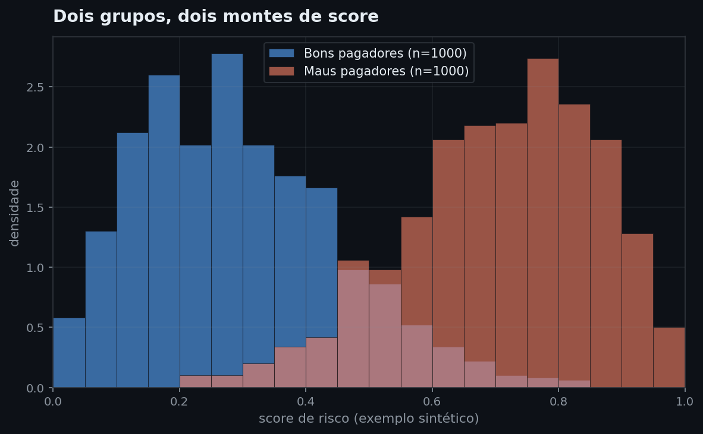
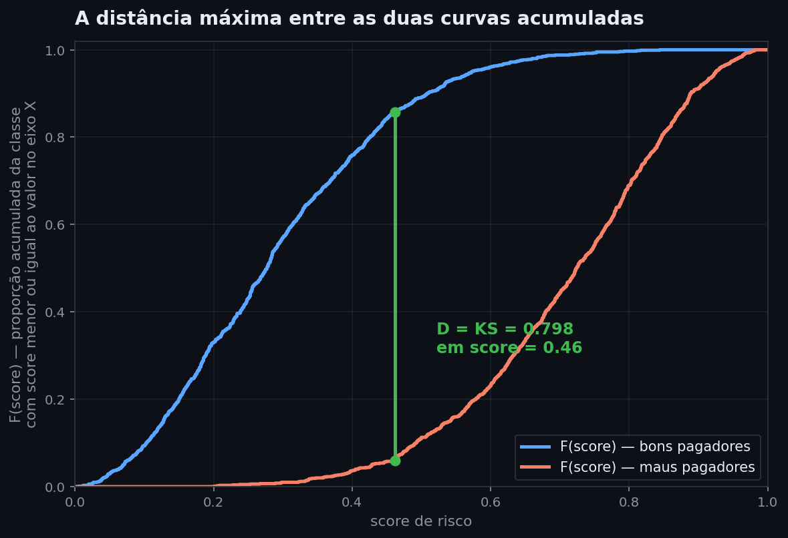
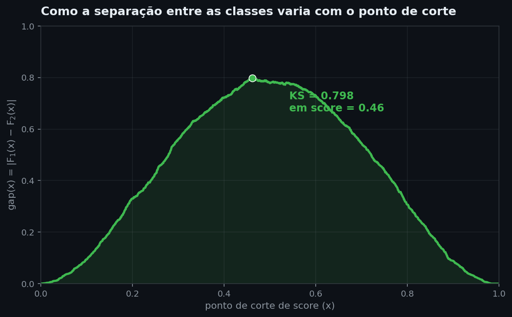
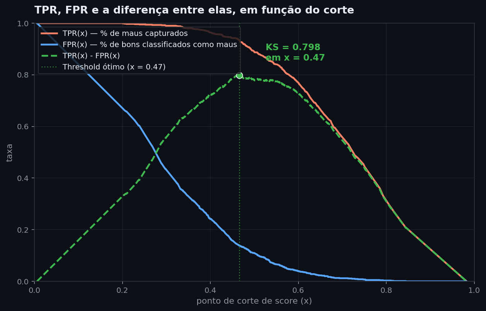
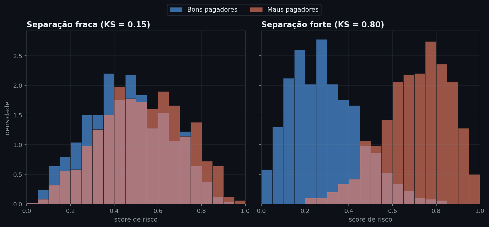

# KS Score (Kolmogorov-Smirnov)

As seis notas anteriores ensinaram a treinar modelos de classificação — regressão logística, árvores, ensembles, KNN — sempre chegando ao ponto em que o modelo produz uma probabilidade prevista para cada observação. Nenhuma delas parou para perguntar: depois de treinado, como saber se essa probabilidade realmente carrega informação sobre a classe verdadeira, e não é só ruído com aparência de número? Acurácia responde mal a essa pergunta quando as classes são desbalanceadas — um modelo que sempre prevê "bom pagador" acerta 70% das vezes num dataset com 70% de bons pagadores, sem ter aprendido nada. Esta nota apresenta uma métrica desenhada especificamente para medir separação entre duas classes: o **KS score**.

Em avaliação de modelos de crédito, fraude e seguros, o KS é item padrão de relatório de validação, ao lado do AUC. Sempre que um modelo produz uma probabilidade e existe um rótulo verdadeiro (pagou ou não pagou, era fraude ou não era) para comparar, o KS testa se essa probabilidade de fato separa os dois grupos. Ignorá-lo e reportar só acurácia pode esconder um modelo que "acerta" apenas por causa do desbalanceamento das classes — exatamente o problema que abre esta nota.

> **Análise:** [06 — Complexidade versus tempo/custo — trade-off medido pelo KS score](../analises/06_complexidade_vs_custo_ks.md)

---

## Intuição

Imagine dois montes de fichas sobre uma mesa: um com os clientes que pagaram o empréstimo (bons pagadores), outro com os que não pagaram (maus pagadores). Cada ficha tem escrito o score de risco que um modelo deu àquele cliente — um número entre 0 e 1. Alguém embaralha as fichas dos dois montes e pergunta: "só olhando o número escrito em cada ficha, dá pra saber de qual monte ela veio?"

A resposta depende de como os números estão distribuídos em cada monte. Se os scores dos bons pagadores e os dos maus pagadores estiverem espalhados da mesma forma — mesma faixa de valores, mesma concentração —, é impossível diferenciar as fichas só pelo número: o modelo não aprendeu nada útil. Se os scores dos bons se concentrarem numa faixa e os dos maus em outra, a separação fica visível.



*Histograma de um exemplo sintético com 1.000 clientes de cada classe. Bons pagadores (azul) concentram-se em scores baixos; maus pagadores (laranja) concentram-se em scores altos. Há sobreposição na faixa central — nenhum modelo real separa duas classes perfeitamente —, mas o deslocamento entre os dois montes já é visível a olho nu, antes de qualquer cálculo.*

O que falta é transformar essa impressão visual num número. A pergunta que guia o resto desta nota: como resumir "o quanto esses dois montes se afastam" numa única estatística?

## Definição formal

Uma forma de comparar os dois montes é perguntar, para cada valor possível de corte: "que fração de cada grupo tem score menor ou igual a esse valor?" Essa fração acumulada tem nome — é a **função de distribuição acumulada (CDF)**. Sejam:

$$F_1(x) = P(\text{score} \leq x \mid \text{bom pagador})$$

$$F_2(x) = P(\text{score} \leq x \mid \text{mau pagador})$$

Em cada ponto $x$, $F_1(x)$ e $F_2(x)$ podem estar próximas (os dois grupos têm proporções acumuladas parecidas até ali — pouca separação) ou distantes (boa separação). O **KS score** é a maior distância entre essas duas curvas, tomada sobre todos os valores possíveis de $x$:

$$KS = \sup_x |F_1(x) - F_2(x)|$$

`sup` é abreviação de **supremo**: o `_x` logo abaixo do `sup` na fórmula diz "varie $x$ sobre todos os cortes possíveis, e pegue o maior valor de $|F_1(x)-F_2(x)|$ que aparecer". Em dados reais — sempre um conjunto finito de scores observados, nunca uma reta contínua infinita — esse maior valor sempre é atingido em algum ponto específico dos dados, então `sup` aqui equivale exatamente a `max`: é por isso que o código desta nota simplesmente usa `np.argmax`, sem distinguir os dois.

Essa é literalmente a estatística **D** do teste de Kolmogorov-Smirnov de duas amostras — daí o nome. $KS$ é sempre um número entre 0 e 1: **0** significa que as duas curvas acumuladas são idênticas em todo ponto (as distribuições de score são indistinguíveis, o modelo não discrimina nada); **1** significa separação perfeita (existe um ponto de corte em que 100% de uma classe está de um lado e 100% da outra está do outro).

## Estimação: calculando o KS a partir de dados

Na prática, $F_1$ e $F_2$ não são conhecidas — são estimadas a partir de uma amostra finita. A **CDF empírica** de um grupo, num ponto $x$, é simplesmente a proporção de observações daquele grupo com score menor ou igual a $x$. Antes de automatizar isso em código, vale calcular à mão um exemplo mínimo — 5 bons pagadores e 5 maus pagadores:

| Grupo | Scores |
|---|---|
| Bons pagadores | 0,10 · 0,15 · 0,30 · 0,35 · 0,60 |
| Maus pagadores | 0,40 · 0,55 · 0,70 · 0,85 · 0,95 |

Só é preciso testar os valores de $x$ que aparecem nos dados — entre dois scores observados, nenhuma das duas frações muda, porque nenhuma observação nova entra na contagem; o maior gap sempre acontece exatamente num ponto com dado, nunca no vazio entre dois pontos. Para cada valor de corte $x$ que aparece em algum dos dois grupos, $F_1(x)$ é a fração de bons pagadores com score $\leq x$, e $F_2(x)$ é a fração equivalente de maus pagadores:

| x | bons ≤ x | F₁(x) | maus ≤ x | F₂(x) | \|F₁−F₂\| |
|---|---|---|---|---|---|
| 0,10 | 1 de 5 | 0,2 | 0 de 5 | 0,0 | 0,2 |
| 0,15 | 2 de 5 | 0,4 | 0 de 5 | 0,0 | 0,4 |
| 0,30 | 3 de 5 | 0,6 | 0 de 5 | 0,0 | 0,6 |
| **0,35** | **4 de 5** | **0,8** | **0 de 5** | **0,0** | **0,8** |
| 0,40 | 4 de 5 | 0,8 | 1 de 5 | 0,2 | 0,6 |
| 0,55 | 4 de 5 | 0,8 | 2 de 5 | 0,4 | 0,4 |
| 0,60 | 5 de 5 | 1,0 | 2 de 5 | 0,4 | 0,6 |
| 0,70 | 5 de 5 | 1,0 | 3 de 5 | 0,6 | 0,4 |
| 0,85 | 5 de 5 | 1,0 | 4 de 5 | 0,8 | 0,2 |
| 0,95 | 5 de 5 | 1,0 | 5 de 5 | 1,0 | 0,0 |

A maior distância (0,8) acontece em $x = 0{,}35$: nesse ponto, 80% dos bons pagadores já têm score menor ou igual a 0,35, mas nenhum mau pagador chegou lá ainda — a linha em negrito na tabela. Esse é o $KS$ para este grupo de 10 clientes: comparar as duas frações acumuladas em cada ponto de corte, e guardar a maior distância entre elas.

O mesmo procedimento, aplicado a 1.000 clientes de cada classe em vez de 5, é o que gera os gráficos desta nota:

```python
import numpy as np

rng = np.random.default_rng(42)
bons = rng.beta(2, 5, 1000)  # scores simulados, concentrados em valores baixos
maus = rng.beta(5, 2, 1000)  # scores simulados, concentrados em valores altos
```

A função abaixo generaliza o que a tabela fez à mão. `np.searchsorted(scores_ordenados, x, side="right")` conta quantos valores de `scores_ordenados` são menores ou iguais a `x` — dividido pelo tamanho do grupo, é exatamente a definição de $F(x)$ que abriu esta seção. O resto do código é o mesmo raciocínio da tabela: calcular $F_1$ e $F_2$ em cada ponto de corte possível e guardar a maior distância.

```python
def ks_estatistica(scores_grupo1, scores_grupo2):
    grade = np.sort(np.unique(np.concatenate([scores_grupo1, scores_grupo2])))
    F1 = np.searchsorted(np.sort(scores_grupo1), grade, side="right") / len(scores_grupo1)
    F2 = np.searchsorted(np.sort(scores_grupo2), grade, side="right") / len(scores_grupo2)
    gap = np.abs(F1 - F2)
    i_max = np.argmax(gap)
    return gap[i_max], grade[i_max], F1[i_max], F2[i_max]

ks, corte, f1_corte, f2_corte = ks_estatistica(bons, maus)
print(f"KS = {ks:.3f}  no corte de score = {corte:.2f}  "
      f"(F1={f1_corte:.2f}, F2={f2_corte:.2f} nesse ponto)")
```
```text
KS = 0.798  no corte de score = 0.46  (F1=0.86, F2=0.06 nesse ponto)
```
*No corte de score 0,46, 86% dos bons pagadores já foram capturados (score ≤ 0,46), contra apenas 6% dos maus pagadores — a mesma leitura da tabela manual acima, agora em 1.000 observações por classe em vez de 5. Nenhum outro ponto de corte separa os dois grupos tão bem.*



*As mesmas duas classes do histograma anterior, agora acumuladas. A curva azul (bons pagadores) sobe rápido porque a maioria concentra-se em scores baixos; a laranja (maus pagadores) sobe devagar, concentrando-se em scores altos. A linha verde marca o ponto de maior distância vertical entre as duas curvas — score = 0,46 — e o tamanho dessa linha é o próprio KS.*

O gráfico acima exige inferir visualmente a distância entre as duas curvas em cada ponto. Plotar essa distância diretamente — $\text{gap}(x)$ contra $x$, em vez de $F_1(x)$ e $F_2(x)$ separadas — mostra o mesmo comportamento de forma mais direta: como a separação entre as classes cresce, atinge um pico, e depois cai, conforme o ponto de corte varre o intervalo de score.



*A mesma coluna de gap da tabela manual acima, agora contínua ao longo de 1.000 clientes por classe. Cortes muito baixos (perto de 0) ou muito altos (perto de 1) separam pouco — quase toda a população cai do mesmo lado, dos dois grupos. O gap sobe conforme o corte se aproxima da região onde as duas distribuições realmente se cruzam, atinge 0,798 em score = 0,46, e cai de novo depois. O KS é o valor desse pico — não um ponto qualquer da curva.*

Essa mesma distância pode ser lida direto da curva ROC de um classificador, sem recalcular nada do zero. Em cada threshold, a **TPR** (taxa de verdadeiros positivos: dos maus pagadores reais, quantos o modelo captura corretamente até aquele corte) e a **FPR** (taxa de falsos positivos: dos bons pagadores reais, quantos são classificados incorretamente como maus) são os complementos de $F_2$ e $F_1$, respectivamente. A diferença `TPR − FPR`, maximizada sobre todos os thresholds, é a mesma estatística D escrita na linguagem de classificação binária:

```python
from sklearn.metrics import roc_curve

def ks_via_roc(y_true, y_prob):
    fpr, tpr, _ = roc_curve(y_true, y_prob)
    return (tpr - fpr).max()
```

`KS = max(TPR − FPR)` é a forma mais rápida de calcular a métrica — reaproveita a curva ROC que a maioria dos pipelines já calcula para o AUC — e produz exatamente o mesmo valor que a definição via CDFs, porque descreve a mesma distância sob outro nome.



*TPR(x) (laranja) e FPR(x) (azul) — os complementos de $F_2$ e $F_1$ mencionados acima — cruzam-se na região onde a diferença entre elas (linha verde tracejada) atinge o pico. A linha vertical pontilhada marca o **threshold ótimo** — o ponto de corte específico em que essa diferença é máxima, x = 0,47. Compare a curva tracejada com a do gráfico anterior: são a mesma curva, calculada por dois caminhos diferentes — uma vem de acumular contagens por classe, a outra vem de TPR menos FPR — e culminam no mesmo KS = 0,798.*

O corte ótimo aparece como 0,46 no gráfico anterior e 0,47 aqui — não é inconsistência entre os dois métodos, é um sintoma de que o pico da curva é um **platô**, não um ponto isolado: o gap fica em 0,798 numa faixa inteira de cortes próximos (entre aproximadamente 0,459 e 0,466 neste exemplo), porque poucas observações caem exatamente nessa vizinhança. `searchsorted` e `roc_curve` agrupam empates de forma ligeiramente diferente internamente, então cada um escolhe um ponto distinto dentro do mesmo platô — o KS (0,798) é idêntico nos dois; só o corte relatado varia na segunda casa decimal.

Uma propriedade útil do KS, válida para qualquer uma das formas de cálculo acima: ele depende apenas da **ordem** dos scores, não da escala. Se um modelo produz scores entre 0 e 1 e outro produz um "número de pontos" entre 300 e 850 (como um score de crédito tradicional), mas os dois ordenam os clientes exatamente da mesma forma, o KS dos dois é idêntico — qualquer transformação que preserve a ordem (recalibrar, multiplicar por uma constante positiva, aplicar uma função crescente) não muda o valor de $KS$, porque $F_1$ e $F_2$ dependem só de quantas observações ficam abaixo de cada corte, não do valor numérico do corte em si.

## Interpretação

Um KS de 0 não separa nada; um KS de 1 separa perfeitamente. Entre esses extremos, quanto maior o número, mais nítida é a fronteira entre as duas classes — o que muda visivelmente é o quanto os dois histogramas de score se sobrepõem.



*Dois exemplos sintéticos lado a lado, cada um com seu próprio par de distribuições Beta. À esquerda, KS = 0,15 (distribuições geradas bem mais próximas uma da outra): as duas cores quase se sobrepõem por completo — um classificador com esse KS mal consegue diferenciar as classes. À direita, KS = 0,80 — as mesmas distribuições dos gráficos das seções anteriores —, com uma faixa de sobreposição pequena nas bordas. A diferença visual entre os dois painéis é exatamente o que o número resume: quanto mais as duas cores se misturam, menor o KS.*

Na prática de credit scoring, valores de KS abaixo de 20% costumam ser tratados como discriminação fraca, entre 20% e 40% como aceitável a boa, entre 40% e 60% como muito boa, e acima de 60% como excelente — regra de bolso comum entre praticantes de risco de crédito, não um limiar derivado de teoria estatística. KS muito alto (acima de 75-80%) em dados de produção costuma, inclusive, acender um alerta de vazamento de informação (uma variável que na prática entrega a resposta, como um campo preenchido só depois do desfecho já ser conhecido), não de um modelo genuinamente melhor. Os valores dos exemplos sintéticos desta nota (0,15 e 0,80) foram escolhidos propositalmente nos extremos dessa escala, para tornar a diferença visual óbvia — dados reais de crédito raramente chegam a 0,80 (a análise 06, com dados reais do German Credit Data, obteve KS entre 0,29 e 0,54 para cinco modelos diferentes).

Isso levanta uma pergunta prática: se o KS é calculado numa amostra finita de teste, o valor obtido é confiável, ou poderia ser só sorte da divisão treino-teste?

## Generalização

Como o KS é a estatística D de um teste estatístico formal, essa pergunta tem resposta exata. O teste de Kolmogorov-Smirnov de duas amostras testa a hipótese nula "as duas distribuições são iguais" contra a alternativa "são diferentes", e `scipy.stats.ks_2samp` devolve tanto o D quanto o p-value dessa hipótese:

```python
from scipy.stats import ks_2samp

resultado = ks_2samp(maus, bons)
print(f"D = {resultado.statistic:.3f}  p-value = {resultado.pvalue:.2e}")
```
```text
D = 0.798  p-value = 5.35e-318
```
*O p-value extremamente pequeno confirma que essa separação não é obra do acaso — rejeita-se com folga a hipótese de que os scores de bons e maus pagadores vêm da mesma distribuição.*

Também existe uma fórmula fechada para o valor crítico do teste, sem depender do cálculo assintótico do `scipy`: com $n_1$ observações no grupo 1 e $n_2$ no grupo 2, o valor crítico ao nível de significância $\alpha$ é

$$D_{\text{crítico}} = c(\alpha) \cdot \sqrt{\frac{n_1 + n_2}{n_1 \cdot n_2}}$$

onde $c(0{,}05) \approx 1{,}36$ e $c(0{,}01) \approx 1{,}63$. Qualquer D observado acima desse limiar é estatisticamente significativo àquele nível — útil especialmente quando o conjunto de teste é pequeno (poucas centenas de observações), caso em que essa verificação evita comparar modelos com base numa diferença de KS que poderia ser só ruído do split.

Vale notar que o KS, embora nascido como teste de hipótese formal, é reaproveitado em ML como **métrica de ranqueamento entre modelos** — usa-se o valor de D para comparar classificadores, não (na maioria dos casos práticos) para reportar formalmente um p-value de cada modelo isoladamente.

## Avaliação

O KS não é a única forma de medir discriminação — o **AUC-ROC** é a alternativa mais comum, e as duas métricas respondem perguntas diferentes. O AUC resume a curva ROC inteira: é, informalmente, a probabilidade de que o modelo dê um score mais alto a um mau pagador escolhido ao acaso do que a um bom pagador escolhido ao acaso, calculada como uma média sobre todos os pontos de corte possíveis. O KS, em vez de resumir a curva inteira, aponta o **único ponto de corte** em que a separação é máxima. Dois modelos podem ter AUC praticamente idêntico e KS bem diferente, porque um concentra sua capacidade de discriminação num ponto específico da distribuição de score e o outro a distribui de forma mais uniforme ao longo da curva — a análise 06 mostra exatamente esse caso: a Random Forest superou a Regressão Logística em AUC de validação cruzada, mas perdeu para ela em KS.

Isso também explica por que o KS é a métrica preferida em credit scoring especificamente: a decisão de negócio — aprovar ou negar um crédito — é tomada num ponto de corte único, não numa média sobre todos os cortes possíveis. O KS responde diretamente "qual o melhor corte possível", que é a pergunta que a política de crédito precisa responder; o AUC responde "quão boa é a curva em média", uma pergunta mais abstrata.

## Premissas

**Scores com resolução suficiente.** O cálculo do KS pressupõe poder ordenar as observações com granularidade fina. Modelos que produzem poucos valores distintos de score — uma árvore de decisão rasa, por exemplo, atribui o mesmo score a todas as observações que caem na mesma folha — geram muitos empates, o que "achata" a curva acumulada e tende a reduzir o KS estimado, mesmo quando o modelo tem alguma capacidade discriminativa real.

**Tamanho de amostra em ambas as classes.** A fórmula do valor crítico ($D_{\text{crítico}}$, seção anterior) mostra que a incerteza da estimativa cresce quando $n_1$ ou $n_2$ são pequenos — um conjunto de teste com poucas dezenas de casos da classe minoritária (fraude, default) produz um KS instável, sensível a qual split específico foi usado.

**Independência entre observações.** Como qualquer estatística baseada em amostras, o cálculo assume que as observações de cada grupo são independentes entre si. Múltiplas linhas do mesmo cliente ao longo do tempo, ou observações de uma série temporal com autocorrelação, violam essa premissa e podem inflar artificialmente a separação aparente.

## Na prática

O roteiro abaixo resume, em ordem de execução, tudo que esta nota já calculou — da entrada (duas colunas de dados) à saída (um número entre 0 e 1 e um veredito de confiabilidade).

**Passo 1 — Separar os scores em dois grupos pela classe real.**
Entrada: uma coluna de score previsto (a probabilidade que o modelo deu a cada cliente) e uma coluna de classe verdadeira. Separe o score em dois grupos por essa classe — chame o primeiro de **grupo 1** (bons pagadores) e o segundo de **grupo 2** (maus pagadores). $n_1$ e $n_2$ são simplesmente o número de observações em cada grupo — quantos bons, quantos maus.
Resultado esperado: dois conjuntos de números entre 0 e 1 — no exemplo desta nota, $n_1 = 1.000$ scores de bons pagadores e $n_2 = 1.000$ de maus pagadores (seção Estimação).

**Passo 2 — Construir as duas curvas acumuladas.**
Fórmula:

$$F_1(x) = \frac{\text{nº de scores do grupo 1} \leq x}{n_1}$$

$x$ aqui é um **ponto de corte de score** — qualquer valor entre 0 e 1 em que se poderia decidir "abaixo daqui é uma coisa, acima é outra" (por exemplo, $x = 0{,}46$). $F_1(x)$ é a fração do grupo 1 (bons pagadores, tamanho $n_1$) com score menor ou igual a esse corte. $F_2(x)$ é definido do mesmo jeito para o grupo 2 (maus pagadores, tamanho $n_2$).
Resultado esperado: a tabela da seção Estimação é esse cálculo feito à mão, ponto a ponto, para 10 clientes — $F_1$ sobe de 0,2 a 1,0, $F_2$ sobe de 0,0 a 1,0, cada um no seu próprio ritmo.
Gráfico: o [histograma da seção Intuição](../analises/assets/ks_01_distribuicoes.png) mostra os dados brutos que alimentam essas duas contagens — antes de acumular, só a distribuição de cada grupo.

**Passo 3 — Medir a distância entre as duas curvas em cada ponto de corte.**
Fórmula: $\text{gap}(x) = |F_1(x) - F_2(x)|$ — a diferença, em valor absoluto, entre as duas frações do Passo 2, calculada no mesmo ponto de corte $x$.
Resultado esperado: na tabela manual, o gap varia de 0,2 a 0,8 conforme o corte — não é constante, por isso o próximo passo importa.

**Passo 4 — Tomar o maior gap entre todos os cortes possíveis: esse número é o KS.**
Fórmula: $KS = \sup_x |F_1(x) - F_2(x)|$ — o maior valor que o $\text{gap}(x)$ do Passo 3 atinge, variando $x$ sobre todos os cortes possíveis (o que `sup` significa está explicado na Definição formal).
Resultado esperado: 0,8 no exemplo de 10 clientes (corte em $x=0{,}35$); 0,798 no exemplo de 1.000 clientes (corte em $x=0{,}46$); 0,5352 no exemplo real da análise 06 (Regressão Logística, German Credit Data).
Gráfico: a [curva acumulada da seção Estimação](../analises/assets/ks_02_cdf_gap.png) — a linha verde é exatamente esse gap máximo, marcado no ponto onde ele ocorre.

**Passo 5 — Verificar se esse número é confiável, não ruído do split.**
Fórmula: $D_{\text{crítico}} = c(\alpha) \cdot \sqrt{(n_1+n_2)/(n_1 \cdot n_2)}$ (seção Generalização), onde $\alpha$ é o **nível de significância** escolhido (a chance de erro que se aceita — 0,01 = 1%, 0,05 = 5%), $c(\alpha)$ é uma constante que só depende de $\alpha$ ($c(0{,}05) \approx 1{,}36$, $c(0{,}01) \approx 1{,}63$), e $n_1$, $n_2$ são os mesmos tamanhos de grupo do Passo 1. Se $KS$ (Passo 4) for maior que $D_{\text{crítico}}$, a separação é estatisticamente significativa àquele nível de $\alpha$.
Resultado esperado: no exemplo de 1.000 clientes por grupo, com $\alpha=0{,}01$: $D_{\text{crítico}} = 1{,}63 \cdot \sqrt{2000/1000000} \approx 0{,}073$. Como $KS = 0{,}798$ é muito maior que $0{,}073$, a separação passa no teste com folga.

**Passo 6 — Interpretar a magnitude do resultado.**
Referência: abaixo de 0,20 é discriminação fraca; entre 0,20 e 0,60, de aceitável a muito boa; acima de 0,60, excelente (seção Interpretação — regra de bolso da indústria, não um limiar estatístico).
Gráfico: a [comparação fraca vs. forte da seção Interpretação](../analises/assets/ks_03_comparacao_separacao.png) mostra visualmente o que 0,15 e 0,80 significam lado a lado.

Um guia rápido de quando usar cada abordagem de cálculo:

| Situação | Abordagem |
|---|---|
| Comparar vários modelos por poder discriminante, dentro de um pipeline já calculando ROC/AUC | `KS = max(TPR - FPR)` via `roc_curve` |
| Verificar se a separação de um modelo é estatisticamente significativa, ou definir um ponto de corte operacional | `scipy.stats.ks_2samp`, com o p-value ou o `D_crítico` |
| Modelo com muitos empates de score (árvore rasa, poucos buckets) | Interpretar o KS com cautela — considerar também AUC e a estrutura da árvore |
| Conjunto de teste pequeno (poucas centenas de casos da classe minoritária) | Reportar o KS junto com o `D_crítico` correspondente, não isoladamente |

Para ver essa lógica aplicada a dados reais de crédito — cinco modelos comparados, com KS, AUC, tempo de treino e verificação de significância estatística lado a lado — veja a [análise 06](../analises/06_complexidade_vs_custo_ks.md).

---

## Leitura recomendada

**ŘEZÁČ, M.; ŘEZÁČ, F.** *How to Measure the Quality of Credit Scoring Models*. Czech Journal of Economics and Finance, 2011. [→ PDF aberto (University of Edinburgh, Credit Research Centre)](https://crc.business-school.ed.ac.uk/sites/crc/files/2023-10/Measuring-the-quality-of-credit-scoring-models.pdf)
Revisão comparando KS, Gini, Lift e outras métricas de qualidade de modelos de credit scoring, com exemplos de aplicação prática.
