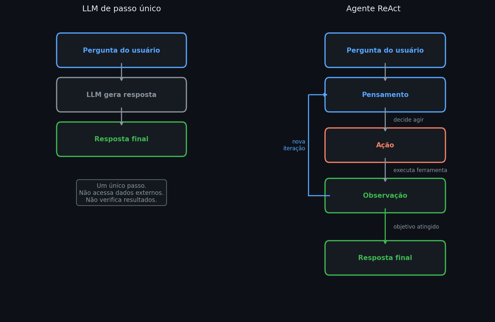

# ReAct — Raciocínio e Ação em Agentes

Um LLM em sua forma mais simples recebe uma pergunta e devolve uma resposta em um único passo. Esse modelo funciona bem para tarefas que cabem inteiramente no contexto — resumir um texto, responder uma pergunta factual, gerar um trecho de código. Mas problemas reais raramente são assim: eles exigem consultar dados externos, executar operações, verificar resultados e tomar decisões baseadas no que foi encontrado. A questão que abre este submódulo é: como transformar um LLM de um sistema que responde em um sistema que age?

Sistemas agênticos são hoje o principal modo de aplicar LLMs em problemas complexos de negócio. Em tesouraria bancária, um agente pode ser instruído a "analisar o portfólio de crédito do dia e identificar concentrações de risco acima do limite regulatório" — sem que o desenvolvedor precise codificar cada etapa da análise. O ReAct é o padrão arquitetural mais simples e mais amplamente adotado para isso: o modelo raciocina sobre o problema, age chamando ferramentas externas, observa os resultados, e repete até ter o que precisa para responder. É o pré-requisito para qualquer arquitetura agêntica mais sofisticada — de memória persistente a orquestração multi-agente.

---

## Intuição

Imagine que você pediu a um analista para verificar se a carteira de crédito tem concentração excessiva num único setor. Um analista de passo único responderia do topo da cabeça, sem consultar os dados. Um analista competente faria diferente: primeiro consultaria o sistema, depois interpretaria o que encontrou, e só então responderia — ou faria uma nova consulta se o resultado levantasse dúvidas.

Um LLM sem ferramentas é o primeiro analista. Um agente ReAct é o segundo.

O ciclo acontece assim: o modelo raciocina sobre o que precisa fazer, decide chamar uma ferramenta, observa o resultado, e raciocina de novo com essa nova informação. Se o CSV tiver uma coluna de data mal formatada que quebra a análise, o agente não trava — ele observa o erro, raciocina sobre como corrigir, e tenta novamente.

```python
# estrutura conceitual de um loop ReAct
historico = [{"role": "user", "content": objetivo}]

for _ in range(max_iteracoes):
    resposta = llm.gerar(historico)

    if resposta.tipo == "pensamento":
        historico.append(resposta)          # raciocínio interno — não executa nada

    elif resposta.tipo == "acao":
        resultado = ferramentas[resposta.nome](**resposta.args)
        historico.append({"role": "observacao", "content": resultado})

    elif resposta.tipo == "resposta_final":
        break                               # objetivo atingido
```

```text
iteração 1 — Pensamento: preciso ler o arquivo de carteira
iteração 1 — Ação: ler_csv("carteira_credito.csv")
iteração 1 — Observação: 3.200 linhas carregadas, colunas: setor, valor, rating
iteração 2 — Pensamento: calcular concentração por setor
iteração 2 — Ação: executar_codigo("df.groupby('setor')['valor'].sum() / total")
iteração 2 — Observação: Agro 41%, Varejo 22%, Indústria 18%, ...
iteração 3 — Resposta final: setor Agro excede limite de 40% — concentração de 41%
```

*Cada iteração acrescenta contexto real ao histórico. O modelo nunca precisou que o desenvolvedor especificasse "primeiro leia o arquivo, depois calcule por setor" — inferiu os passos a partir do objetivo.*


*À esquerda, o LLM de passo único transforma a pergunta diretamente em resposta sem acesso ao mundo externo. À direita, o ciclo ReAct: Pensamento (raciocínio interno), Ação (chamada a ferramenta externa) e Observação (resultado que retorna ao contexto) repetem até o objetivo ser atingido.*

---

## Definição formal

**ReAct** (Reasoning + Acting) é um padrão de prompting e controle de fluxo proposto por Yao et al. (2023) no qual um LLM intercala geração de raciocínio e execução de ações de forma iterativa. O modelo opera como "cérebro central" de um sistema composto por três componentes:

**Planejamento** — o modelo decompõe o objetivo em passos menores usando raciocínio encadeado. A base é o *Chain of Thought* (CoT, Wei et al. 2022): instrução explícita para o modelo "pensar passo a passo" antes de responder.

**Ferramentas** — funções externas que o modelo pode invocar para interagir com o mundo: ler arquivos, executar código, consultar APIs, fazer buscas. O acesso a ferramentas é o que separa um agente de um LLM convencional.

**Ciclo de controle** — software externo que intercepta a saída do modelo, executa a ferramenta solicitada e injeta o resultado de volta no contexto antes da próxima geração.

O ciclo formal é:

$$\text{Pensamento}_t \rightarrow \text{Ação}_t \rightarrow \text{Observação}_t \rightarrow \text{Pensamento}_{t+1} \rightarrow \cdots \rightarrow \text{Resposta}$$

onde $t$ indexa as iterações e a sequência termina quando o modelo gera uma resposta final ou quando um limite máximo de iterações é atingido.

---

## Mecanismo — como o ciclo funciona

**Pensamento** é geração interna de tokens — o modelo "pensa em voz alta" sobre o que fazer. Não executa nada, não consulta nada. É puramente texto gerado pelo modelo como parte do prompt de saída.

**Ação** é uma chamada a ferramenta externa. O sistema precisa detectar quando o modelo quer agir. Existem duas abordagens:

*Formato estruturado em texto* — abordagem do ReAct original. O modelo é instruído via prompt a seguir um padrão como `Ação: nome_da_ferramenta(argumento)`. O sistema monitora o stream de tokens e, ao detectar esse padrão, interrompe a geração e executa.

*Function calling nativo* — abordagem moderna (OpenAI, Anthropic). O modelo é treinado para gerar um objeto JSON estruturado ao querer invocar uma ferramenta. O sistema detecta essa estrutura de forma confiável, sem depender de string matching. Mais robusto e hoje o padrão industrial.

**Observação** é o resultado da execução — um número, uma tabela, uma mensagem de erro — que o sistema injeta de volta no contexto como nova entrada. O modelo lê a observação e começa o próximo ciclo de raciocínio.

A arquitetura **MRKL** (Modular Reasoning, Knowledge and Language, Karpas et al. 2022) formaliza essa separação: o LLM atua como roteador, não como executor. Para "qual a raiz quadrada da idade do presidente", o LLM não tenta calcular — identifica que precisa de dois módulos especialistas (busca factual + calculadora) e os invoca na ordem certa.

---

## Interpretação

| | LLM de passo único | Agente ReAct |
|---|---|---|
| Acesso a dados externos | Não | Sim, via ferramentas |
| Reage a resultados intermediários | Não | Sim — cada observação alimenta o próximo passo |
| Detecta e corrige erros | Não | Sim — observa o erro e tenta nova abordagem |
| Número de chamadas ao modelo | 1 | $n$ (uma por iteração) |
| Custo por tarefa | Fixo | Proporcional ao número de iterações |
| Risco de loop infinito | Não | Sim — requer limite de iterações |

O agente ReAct é mais capaz mas mais custoso: cada iteração adiciona tokens ao contexto e faz uma nova chamada ao modelo. Tarefas simples não justificam a arquitetura agêntica.

---

## Generalização

ReAct é o padrão mais simples — raciocina, age, observa. Uma limitação evidente: quando erra, não aprende com o erro dentro da mesma sessão. O próximo passo natural é o **Reflexion** (Shinn et al. 2023): quando o agente falha, o sistema salva uma "lição aprendida" em memória externa e a injeta no contexto da próxima tentativa. O agente passa a se auto-corrigir entre execuções.

Uma extensão diferente é o **Tree of Thoughts** (Yao et al. 2023): em vez de um único caminho linear de raciocínio, o modelo explora múltiplos ramos em paralelo e escolhe o mais promissor via busca em árvore (BFS ou DFS). Cobre casos onde a primeira linha de raciocínio é um beco sem saída.

Ambas as extensões — Reflexion e Tree of Thoughts — serão vistas na nota 08 (Planejamento de longo horizonte).

---

## Avaliação

Avaliar agentes ReAct é mais complexo do que avaliar classificadores. O **API-Bank Benchmark** (Li et al. 2023) propõe três níveis de complexidade crescente:

| Nível | Pergunta de avaliação | Exemplo |
|---|---|---|
| Level-1 (Call) | O agente consegue chamar a ferramenta correta com os argumentos certos? | Chamar `buscar_preco("ITUB4")` com o ticker correto |
| Level-2 (Retrieve) | O agente consegue selecionar a ferramenta certa num catálogo de dezenas? | Escolher entre `busca_web`, `consulta_bd` e `executa_codigo` |
| Level-3 (Plan) | O agente consegue encadear múltiplas chamadas para resolver um objetivo vago? | "Analise o risco de concentração da carteira" sem especificar passos |

Na prática bancária, métricas adicionais importantes são: taxa de loop infinito (iterações que atingem o limite máximo sem resposta), taxa de alucinação de ferramenta (modelo invoca ferramenta inexistente ou com argumentos inválidos) e latência por tarefa (número médio de iterações até resposta).

---

## Premissas

**Janela de contexto suficiente.** Cada iteração acrescenta Pensamento + Ação + Observação ao histórico. Em tarefas longas, o contexto pode encher antes do objetivo ser atingido — o modelo começa a "perder o fio" do objetivo original, fenômeno documentado como *lost in the middle*. Estratégias de compressão de contexto ou memória externa (nota 03) atenuam isso.

**Confiabilidade das ferramentas.** Se uma ferramenta retorna resultados inconsistentes, o agente pode raciocinar corretamente sobre informação errada. A qualidade da resposta final é limitada pela qualidade das ferramentas disponíveis.

**Limite de iterações obrigatório.** Sem um teto de iterações, um agente pode entrar em loop indefinido consumindo recursos sem entregar resultado. Todo sistema ReAct em produção precisa desse controle.

---

## Na prática

O valor do ReAct aparece em tarefas onde a próxima ação depende do resultado anterior e não pode ser codificada como script fixo. Calcular a média de uma lista não justifica um agente — qualquer linha de Python resolve. Identificar qual setor de uma carteira de crédito excede o limite regulatório envolve leitura de dados, cálculo e raciocínio sobre o resultado: aí o padrão se justifica.

O exemplo abaixo tem ferramentas que executam código real. O LLM é simulado para mostrar as decisões que um modelo real tomaria — em produção, substituir o bloco `PLANO` por chamadas ao SDK da Anthropic com function calling.

```python
import pandas as pd
import io

# carteira sintética com distribuição realista
CARTEIRA = """setor,valor_mm,rating
Agronegócio,850,BB
Varejo,420,BBB
Indústria,380,A
Energia,210,BBB
Serviços,140,BB"""

# ── ferramentas reais — executam código Python ────────────────────────────────

def ler_carteira() -> str:
    df = pd.read_csv(io.StringIO(CARTEIRA))
    total = df["valor_mm"].sum()
    return f"{len(df)} setores · total R$ {total}M\n" + df.to_string(index=False)

def calcular_concentracao() -> str:
    df = pd.read_csv(io.StringIO(CARTEIRA))
    total = df["valor_mm"].sum()
    df["concentracao_%"] = (df["valor_mm"] / total * 100).round(1)
    return df[["setor", "concentracao_%"]].sort_values(
        "concentracao_%", ascending=False
    ).to_string(index=False)

FERRAMENTAS = {
    "ler_carteira": lambda **_: ler_carteira(),
    "calcular_concentracao": lambda **_: calcular_concentracao(),
}

# ── loop ReAct — LLM simulado ─────────────────────────────────────────────────
# Cada etapa representa uma decisão que o LLM tomaria. As ferramentas executam
# e retornam dados reais; o raciocínio final é gerado pelo modelo em produção.

PLANO = [
    ("pensamento", "Preciso entender a composição da carteira antes de calcular concentração."),
    ("acao",       "ler_carteira", {}),
    ("pensamento", "Tenho os dados. Agora calculo a concentração por setor."),
    ("acao",       "calcular_concentracao", {}),
    ("pensamento", "Agronegócio com 42.5% excede o limite regulatório de 40%. Tenho o que preciso."),
    ("resposta",   None),
]

for etapa in PLANO:
    tipo = etapa[0]
    if tipo == "pensamento":
        print(f"\nPensamento: {etapa[1]}")
    elif tipo == "acao":
        ferramenta, args = etapa[1], etapa[2]
        resultado = FERRAMENTAS[ferramenta](**args)
        print(f"\nAção: {ferramenta}()")
        print(f"Observação:\n{resultado}")
    elif tipo == "resposta":
        print("\nResposta final: setor Agronegócio apresenta concentração de 42.5%,")
        print("acima do limite regulatório de 40%. Rating BB indica risco elevado.")
        print("Recomendação: revisar limites de exposição ao setor.")
        break
```

```text
Pensamento: Preciso entender a composição da carteira antes de calcular concentração.

Ação: ler_carteira()
Observação:
5 setores · total R$ 2000M
      setor  valor_mm rating
Agronegócio       850     BB
     Varejo       420    BBB
  Indústria       380      A
    Energia       210    BBB
   Serviços       140     BB

Pensamento: Tenho os dados. Agora calculo a concentração por setor.

Ação: calcular_concentracao()
Observação:
      setor  concentracao_%
Agronegócio            42.5
     Varejo            21.0
  Indústria            19.0
    Energia            10.5
   Serviços             7.0

Pensamento: Agronegócio com 42.5% excede o limite regulatório de 40%. Tenho o que preciso.

Resposta final: setor Agronegócio apresenta concentração de 42.5%,
acima do limite regulatório de 40%. Rating BB indica risco elevado.
Recomendação: revisar limites de exposição ao setor.
```

*As ferramentas produziram dados reais — os números acima são calculados, não inventados. O raciocínio sobre qual setor é preocupante (concentração alta + rating BB) é onde o LLM agrega valor: um script fixo não saberia qual combinação de variáveis sinaliza risco sem regras explícitas codificadas.*

---

## Leitura recomendada

**SANTOSCRUZ, K.** *Agentes Autônomos com LLMs: Funcionamento e Arquitetura*. Medium, 2024. [→ Artigo](https://medium.com/@kaue.santoscruz04/agentes-aut%C3%B4nomos-com-llms-funcionamento-e-arquitetura-b92c4bd4b299)  
Cobre ReAct, Reflexion, MRKL e memória vetorial com citações acadêmicas sólidas (Yao, Wei, Shinn et al.). Base técnica desta nota, em português e acesso gratuito.

**YAO, S. et al.** *ReAct: Synergizing Reasoning and Acting in Language Models*. ICLR, 2023. [→ arXiv](https://arxiv.org/abs/2210.03629)  
Artigo seminal que introduz o padrão ReAct. Demonstra empiricamente que intercalar raciocínio e ação supera Chain-of-Thought puro e ação sem raciocínio em benchmarks de QA e tomada de decisão.
