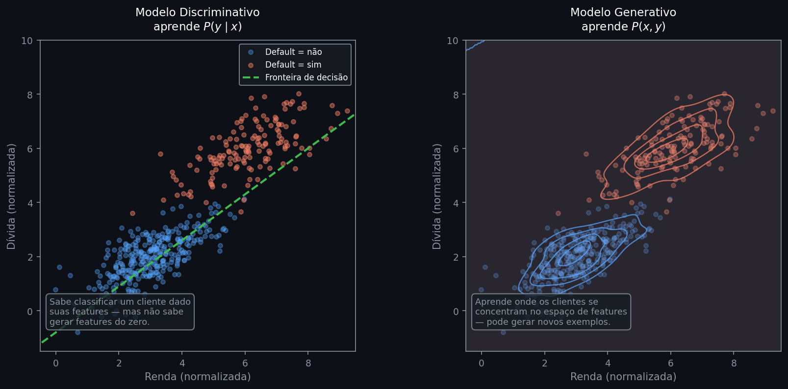

# Modelos Generativos e Discriminativos

No módulo de aprendizado supervisionado, treinamos modelos para classificar e prever — dado um conjunto de características de um cliente, o modelo estima a probabilidade de inadimplência. Esse é um modelo que aprendeu a responder perguntas sobre exemplos que já existem. A pergunta que abre este módulo é diferente: é possível criar exemplos que nunca existiram, mas que parecem reais? Para isso, é preciso aprender algo que os modelos supervisionados nunca aprenderam.

IA generativa é o ramo que trata exatamente dessa capacidade. Modelos como GPT, DALL-E e Stable Diffusion geram texto, imagens e código que não existiam antes do treinamento — não por recuperação de exemplos memorizados, mas por amostragem de distribuições aprendidas. Em tesouraria bancária, essa capacidade tem uso direto: gerar cenários sintéticos de stress para carteiras de crédito, aumentar datasets históricos escassos, ou criar populações de clientes fictícios que preservam as correlações estatísticas dos dados reais. O fundamento matemático que torna tudo isso possível é o tema desta nota.

---

## Intuição

Imagine um modelo treinado para prever se um cliente vai dar default dado renda, dívida e histórico de pagamentos. Após o treinamento, esse modelo sabe calcular:

$$P(\text{default} \mid \text{renda, dívida, histórico})$$

Ele aprendeu onde está a fronteira entre "vai dar default" e "não vai" — nada mais. Se você pedir a ele para criar um cliente do zero, ele não consegue: precisa que alguém forneça os valores de renda, dívida e histórico para então opinar sobre o rótulo. Não sabe nada sobre como esses valores se distribuem no mundo.

Agora suponha que você queira gerar um portfólio sintético de 10 mil clientes para um teste de stress. Você poderia sortear renda, dívida e histórico de forma independente — mas aí nada impediria de gerar um cliente com renda de R$ 2 mil e dívida de R$ 2 milhões. Esse cliente não "parece real": combinações assim são raríssimas nos dados históricos. O modelo discriminativo não detecta isso porque nunca aprendeu como renda, dívida e histórico se relacionam entre si.

Para gerar clientes realistas, o modelo precisa aprender quais combinações de features são plausíveis. Isso significa aprender a distribuição das próprias features — não a probabilidade do rótulo dado as features, mas a probabilidade das features em conjunto.

```python
import numpy as np
import matplotlib.pyplot as plt
from scipy.stats import gaussian_kde

rng = np.random.default_rng(42)
# dois grupos de clientes no espaço (renda, dívida)
grupo_adimplente = rng.multivariate_normal([3, 2], [[1.0, 0.6], [0.6, 0.8]], 300)
grupo_default    = rng.multivariate_normal([6, 6], [[1.2, 0.7], [0.7, 1.0]], 150)
```


*À esquerda, o modelo discriminativo aprende apenas a fronteira entre as classes — sem representação de onde os clientes se concentram. À direita, o modelo generativo aprende as curvas de densidade de cada grupo: regiões densas (contornos fechados) concentram exemplos plausíveis; regiões vazias são combinações improváveis. É essa densidade que permite gerar novos clientes realistas por amostragem.*

---

## Definição formal

O contraste entre os dois tipos de modelo tem representação direta em termos de probabilidade.

**Modelo discriminativo** estima a probabilidade condicional do rótulo $y$ dado as features $x$:

$$P(y \mid x)$$

Durante o treinamento, aprende a fronteira de decisão que minimiza o erro de classificação. A distribuição de $x$ — como os exemplos se distribuem no espaço de features — não é modelada.

**Modelo generativo** estima uma distribuição que envolve $x$. Existem dois casos:

*Com rótulo* — aprende a distribuição conjunta de features e rótulo:

$$P(x, y)$$

que captura a probabilidade de um exemplo ter simultaneamente aquele conjunto de features *e* aquele rótulo.

*Sem rótulo* — aprende apenas a distribuição marginal das features:

$$P(x)$$

A relação entre as três distribuições é dada pela regra do produto:

$$P(x, y) = P(y \mid x) \cdot P(x)$$

Isso mostra por que o modelo discriminativo é insuficiente para geração: ele aprende $P(y \mid x)$, mas não aprende $P(x)$. Sem conhecer a distribuição das features, não há como amostrar features realistas.

---

## Mecanismo — amostragem

Conhecer uma distribuição permite *amostrar* dela — sortear exemplos com a frequência que a distribuição prescreve.

A analogia é um dado. Sabendo que cada face tem probabilidade 1/6, você pode simular milhares de lançamentos. Cada resultado é novo — não é cópia de nenhum lançamento anterior — mas segue a mesma lei de probabilidade.

Com $P(x)$ ou $P(x, y)$, a mesma lógica se aplica: o modelo aprendeu a "lei" dos dados e pode sortear novos exemplos que seguem essa lei. Um cliente gerado por amostragem de $P(x, y)$ tem renda, dívida, histórico e rótulo de default com frequências e correlações compatíveis com os dados reais — sem ser cópia de nenhum cliente específico.

```python
kde = gaussian_kde(grupo_adimplente.T, bw_method=0.35)

# amostra 5 novos clientes sintéticos da distribuição estimada
novos_clientes = kde.resample(5, seed=7).T
print(novos_clientes.round(2))
```

```text
[[ 2.61  1.83]
 [ 3.44  2.97]
 [ 2.18  1.41]
 [ 4.12  3.38]
 [ 3.07  2.52]]
```

*Cada linha é um cliente sintético (renda, dívida) gerado por amostragem da distribuição estimada. Os valores respeitam a correlação observada nos dados reais: renda e dívida crescem juntas. Nenhum desses clientes existe no dataset original.*

A questão prática — como estimar $P(x)$ quando $x$ tem centenas de dimensões — é o problema central das arquiteturas que veremos nas notas seguintes.

---

## Interpretação

| | Discriminativo | Generativo |
|---|---|---|
| Aprende | $P(y \mid x)$ | $P(x)$ ou $P(x, y)$ |
| Pergunta central | Qual a classe deste exemplo? | Como são os exemplos possíveis? |
| Precisa de rótulos? | Sim | Não necessariamente |
| Pode gerar dados? | Não | Sim |
| Exemplos de modelos | Regressão logística, SVM, Random Forest | VAEs, GANs, Transformers |

Um modelo generativo que aprendeu $P(x, y)$ também consegue classificar: basta calcular $P(y \mid x) = P(x, y) / P(x)$ pela regra do produto. O inverso não é verdadeiro — um modelo discriminativo não consegue gerar porque nunca estimou $P(x)$.

---

## Generalização

Quando o modelo aprende $P(x, y)$, o rótulo $y$ serve de sinal de treinamento — é aprendizado supervisionado com capacidade generativa.

Quando o modelo aprende apenas $P(x)$, não há rótulo. Sem sinal externo dizendo "você errou" ou "você acertou", o modelo precisa descobrir estrutura nos dados sozinho. Isso é aprendizado não supervisionado — fundamentalmente mais difícil, porque o critério de sucesso não é óbvio.

Essa dificuldade tem uma consequência direta: como avaliar se o modelo aprendeu bem?

---

## Avaliação

Em modelos discriminativos, avaliar é direto: AUC, acurácia, KS. Há rótulos verdadeiros para comparar com as previsões.

Em modelos generativos, não há rótulo de referência por exemplo gerado. A pergunta passa a ser: *os dados gerados se parecem com os dados reais?* Três abordagens comuns:

**Estatísticas descritivas por feature** — comparar médias, desvios e correlações entre dados reais e sintéticos. Simples, mas não captura dependências complexas entre features.

**Métricas de distância entre distribuições** — quantificar a diferença entre $P_{\text{real}}$ e $P_{\text{gerada}}$ com medidas como divergência KL ou distância de Wasserstein. Matematicamente precisas, mas de interpretação não intuitiva.

**Discriminador treinado** — misturar dados reais e sintéticos e treinar um classificador para distingui-los. Se o classificador não consegue, o gerador é bom. Essa ideia é o princípio das GANs, vistas na nota 04.

Não existe um único número equivalente ao AUC para modelos generativos. A escolha da métrica depende do uso dos dados gerados.

---

## Premissas

**Representatividade dos dados de treino.** O modelo aprende $P(x)$ a partir de amostras. Se os dados históricos não cobrem bem certas regiões do espaço de features — clientes de alta renda, eventos de crise, cenários de stress — o modelo vai subestimar a probabilidade dessas regiões e gerará poucos exemplos delas.

**Volume suficiente.** Estimar uma distribuição conjunta de muitas variáveis requer muito mais dados do que estimar uma condicional. Com poucas observações e muitas features, a distribuição estimada tende a ser ruidosa — problema que as arquiteturas seguintes resolvem com diferentes estratégias de compressão do espaço.

---

## Na prática

Em risco bancário, modelos generativos têm três usos principais:

**Stress testing sintético.** Gerar cenários de crise estatisticamente consistentes com os padrões históricos, mas mais extremos do que qualquer evento observado. Útil para carteiras onde crises são raras demais para análise direta.

**Aumento de dataset.** Em crédito, default é evento raro — classes desbalanceadas. Gerar exemplos sintéticos da classe minoritária com a distribuição correta de features melhora o treinamento de classificadores downstream.

**Anonimização com preservação estatística.** Substituir dados reais de clientes por dados sintéticos que mantêm as mesmas correlações — permite compartilhar datasets para análise sem expor informações individuais.

Esses três casos têm em comum o mesmo requisito: fidelidade de $P(x)$. Como aprender essa distribuição em alta dimensão é o problema que cada arquitetura seguinte resolve com uma estratégia diferente.

---

## Leitura recomendada

**DEEP LEARNING BOOK.** *Modelos Generativos — O Diferencial das GANs*. [→ Capítulo 56](https://www.deeplearningbook.com.br/modelos-generativos-o-diferencial-das-gans-generative-adversarial-networks/)  
Introduz o contraste entre modelagem direta (aprender $P(x)$ explicitamente) e indireta (GANs), com formalização probabilística em português e gratuito.

**ICHI.PRO.** *Classificadores Generativos vs Discriminativos em Aprendizado de Máquina*. [→ Artigo](https://ichi.pro/pt/classificadores-generativos-vs-discriminativos-em-aprendizado-de-maquina-174695206782366)  
Cobre a distinção entre $P(x, y)$ e $P(y \mid x)$ com exemplos concretos, vantagens e limitações de cada abordagem — bom ponto de entrada antes de estudar as arquiteturas.
